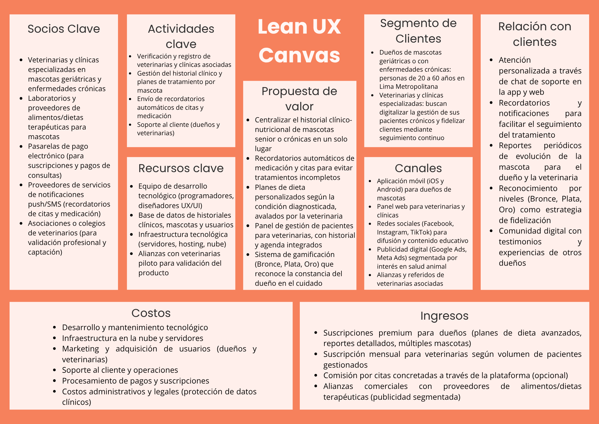

## **Capítulo I: Presentación**

- **1.1. Startup Profile**
  Esta sección incluye la descripción de la Startup y los perfiles de los integrantes del equipo.

    - **1.1.1. Descripción de la Startup**  
      En **"PawVital Tech"** hemos desarrollado una plataforma digital que conecta a dueños de mascotas geriátricas o con enfermedades crónicas con veterinarias y clínicas especializadas, permitiendo un seguimiento clínico-nutricional continuo, personalizado y accesible desde cualquier lugar. 

      A través de una aplicación móvil y un panel web, los dueños pueden gestionar el historial clínico de su mascota, recibir recordatorios de medicación y citas, y seguir planes de alimentación adaptados a su condición. Las veterinarias, por su parte, cuentan con un panel de gestión de pacientes, agenda de citas y registro de historiales, fortaleciendo la continuidad del tratamiento incluso si el dueño cambia de clínica. Un sistema de gamificación (niveles Bronce, Plata y Oro) premia la constancia del dueño en el cuidado de su mascota, incentivando la adherencia a los tratamientos y controles. 

    
<strong>Misión:</strong> Facilitar el cuidado clínico y nutricional de mascotas senior o con enfermedades crónicas, conectando a sus dueños con veterinarias especializadas mediante una plataforma confiable, accesible y que motive la constancia en el tratamiento.

    
<strong>Visión:</strong> Convertirnos en la plataforma de referencia en Lima para el seguimiento de salud animal geriátrica y crónica, reconocida por mejorar la calidad de vida de las mascotas y fortalecer la relación entre dueños y veterinarias mediante tecnología accesible.

    - **1.1.2. Perfiles de integrantes del equipo**
       A continuación, se detallan los perfiles de los integrantes del equipo que llevarán a cabo este proyecto, resaltando sus roles clave y sus respectivas áreas de experiencia.  

|                       Photo                       | Description                                                                                                                                                                                                                                                                                                                                                                                                                                                 |
|:-------------------------------------------------:|:------------------------------------------------------------------------------------------------------------------------------------------------------------------------------------------------------------------------------------------------------------------------------------------------------------------------------------------------------------------------------------------------------------------------------------------------------------|
|           | **Nombre y Apellido:** Rafael Alexander Dominguez Vargas    **Carrera:** Ingeniería de Software (8vo ciclo)   **Acerca de:** Soy una persona responsable y ordenada. Poseo conocimientos en lenguajes de programación como C++, Java y Python, lo que me permite desarrollar soluciones diversas dentro de mi formación en Ingeniería de Software.                                                                                                    |
|     *(foto pendiente)*      | **Nombre y Apellido:** *(completar)*    **Carrera:** *(completar)*   **Acerca de:** *(completar)*                                                                                                    |
|     *(foto pendiente)*      | **Nombre y Apellido:** *(completar)*    **Carrera:** *(completar)*   **Acerca de:** *(completar)*                                                                                                    |
|     *(foto pendiente)*      | **Nombre y Apellido:** *(completar)*    **Carrera:** *(completar)*   **Acerca de:** *(completar)*                                                                                                    |
|            | **Nombre y Apellido:** Adrian Valerio Garcia    **Carrera:** Ingenieria de Software   **Acerca de:**  Me interesa el aprendizaje continuo y suelo enfocarme en resolver problemas de manera rápida y eficiente. Disfruto los videojuegos y aprender nuevas tecnologías, además de trabajar en equipo para lograr objetivos en conjunto. Tengo conocimientos en lenguajes de programación y procuro mejorar constantemente mis métodos de estudio para ampliar mis habilidades.                                                                                                   |

- **1.2. Solution Profile**
   En esta sección se describe de manera general la solución propuesta, detallando nuestros objetivos principales, funcionalidades clave y el valor que aportamos tanto a los dueños de mascotas como a las veterinarias.  

    - **1.2.1 Antecedentes y problemática**
       Esta sección detalla el contexto del proyecto VetPax, utilizando el marco de las 5W2H para definir su alcance, justificar la necesidad de una plataforma de seguimiento clínico para mascotas geriátricas o crónicas, y exponer la oportunidad de mercado en el sector de salud animal en Lima.  
        - What (¿Qué?) VetPax es una aplicación digital diseñada para el seguimiento clínico-nutricional de mascotas de edad avanzada o con enfermedades crónicas (diabetes, insuficiencia renal, artritis, hipotiroidismo, entre otras). Permite a los dueños llevar un historial clínico centralizado, recibir recordatorios de citas y medicación, y seguir planes de alimentación personalizados. Incorpora un sistema de gamificación por niveles (Bronce, Plata y Oro) que premia la constancia del dueño en los controles y tratamientos de su mascota.
        - Who (¿Quién?) 
          El servicio está dirigido a dos públicos principales: dueños de mascotas senior o con condiciones crónicas que residen en Lima Metropolitana, y veterinarias/clínicas que buscan digitalizar la gestión de sus pacientes y fidelizar a sus clientes mediante seguimiento continuo. Según cifras del sector veterinario en Lima, la tenencia de mascotas ha crecido sostenidamente en la última década, y con ello la demanda de servicios de salud animal más especializados y de mayor frecuencia para mascotas de edad avanzada.
        - Where (¿Dónde?) 
          La implementación del servicio comenzará en distritos de Lima Metropolitana con alta concentración de clínicas veterinarias y tenencia de mascotas (por ejemplo, zonas del área urbana con mayor poder adquisitivo y acceso a internet). La alta penetración de internet móvil en Lima favorece la adopción de una solución digital de este tipo.
        - When (¿Cuándo?) 
          El desarrollo y validación de la plataforma está planificado en el corto plazo, con una versión beta disponible durante los próximos meses, en articulación con veterinarias piloto que permitan validar el flujo de historiales y agenda antes del lanzamiento oficial.
        - Why (¿Por qué?) 
          Las mascotas geriátricas o con enfermedades crónicas requieren un seguimiento médico y nutricional mucho más riguroso que una mascota sana, pero hoy este seguimiento depende casi enteramente de la memoria del dueño y de historiales dispersos en papel o entre distintas veterinarias. Esto genera controles olvidados, tratamientos mal seguidos y pérdida de continuidad clínica cuando el dueño cambia de veterinaria. La adopción de aplicaciones de salud y bienestar (tanto humano como animal) ha crecido sostenidamente en Lima, impulsada por la búsqueda de mayor control y tranquilidad por parte de los dueños de mascotas.
        - How (¿Cómo?) 
          A través de una aplicación móvil (para dueños) y un panel web (para veterinarias), los usuarios podrán registrar y consultar el historial clínico de su mascota, recibir recordatorios de medicación y citas, y seguir planes de dieta personalizados según la condición diagnosticada. Las veterinarias podrán gestionar la agenda de citas, actualizar el historial clínico y prescribir planes de cuidado. El sistema de gamificación (Bronce, Plata, Oro) reconocerá la constancia del dueño en cumplir controles y tratamientos, fortaleciendo la adherencia al cuidado de la mascota.
        - How much (¿Cuánto?) 
          El modelo de negocio de VetPax seguirá un enfoque **freemium**: el registro, historial básico y recordatorios estarán disponibles de forma gratuita para dueños, mientras que funcionalidades premium (planes de dieta personalizados avanzados, reportes de evolución detallados, múltiples mascotas, soporte prioritario) estarán disponibles mediante una suscripción. Para las veterinarias, el panel de gestión de pacientes y agenda tendrá un modelo de suscripción mensual según el volumen de pacientes gestionados.

    - **1.2.2 Lean UX Process**
       En esta sección presentaremos el Lean UX Process, describiendo cómo se aplican iteraciones rápidas de diseño y validación con usuarios para mejorar la experiencia del producto mediante ciclos cortos de prueba y ajuste.  

        - **1.2.2.1. Lean UX Problem Statements**
         Nuestro producto fue diseñado para conectar a dueños de mascotas geriátricas o con enfermedades crónicas con veterinarias especializadas, mediante una plataforma que centraliza el seguimiento clínico y nutricional. Hemos observado que muchos dueños enfrentan dificultades para mantener un seguimiento constante del tratamiento de su mascota, lo cual genera controles olvidados, tratamientos incompletos y pérdida de información clínica relevante.
        - **1.2.2.2. Lean UX Assumptions** 

          ### **Features**

          ---
          **Historial clínico centralizado y accesible:**
          Los dueños valoran tener toda la información de salud de su mascota en un solo lugar, sin depender de papeles o memoria.

          **Recordatorios de medicación y citas:**
          Los dueños necesitan alertas para no olvidar tratamientos o controles periódicos.

          **Planes de dieta personalizados según condición:**
          Los dueños valoran recibir indicaciones nutricionales específicas para la condición de su mascota, avaladas por la veterinaria.

          **Sistema de gamificación por niveles (Bronce, Plata, Oro):**
          Los dueños se sienten motivados a mantener la constancia en el cuidado cuando reciben reconocimiento por su compromiso.

          **Panel de gestión para veterinarias:**
          Las veterinarias valoran centralizar la agenda y el historial de sus pacientes crónicos/geriátricos para dar un seguimiento más efectivo.  
          ### **Business Outcomes**

          ---
          Aumentar la cantidad de citas de control concretadas a través de la plataforma.
          Mejorar la retención y frecuencia de uso de los dueños de mascotas.
          Generar ingresos sostenibles mediante suscripciones premium (dueños) y suscripciones de gestión (veterinarias).
          Posicionar a **VetPax** como la solución de referencia en seguimiento de salud animal geriátrica y crónica en Lima.  
          ### **Users**

          ---
          Dueños de mascotas senior o con enfermedades crónicas en Lima Metropolitana.
          Veterinarias y clínicas que atienden pacientes geriátricos o crónicos.  

          ### **User Outcomes & Benefit**

          ---
          Mantener un seguimiento clínico y nutricional continuo de su mascota desde una sola plataforma.
          Reducir el olvido de citas y medicación mediante recordatorios automáticos.
          Tener mayor tranquilidad y control sobre la evolución de salud de su mascota.
          Recibir reconocimiento (niveles Bronce, Plata, Oro) por la constancia en el cuidado.

          ### **User Assumptions**

          ---
          Los dueños desean un historial clínico simple de consultar y actualizar.
          Confían más en planes de cuidado avalados directamente por su veterinaria.
          Prefieren recibir recordatorios automáticos antes que depender de su memoria.
          Están dispuestos a pagar un plan premium si perciben beneficios concretos para la salud de su mascota.

          ### **Business Assumptions**

          ---
          La demanda de seguimiento especializado para mascotas geriátricas/crónicas seguirá creciendo en Lima.
          Los dueños adoptarán la plataforma si perciben mejoras reales en el cuidado de su mascota.
          Las veterinarias verán valor en digitalizar la gestión de sus pacientes crónicos para fidelizarlos.
          Un modelo freemium con suscripción premium será sostenible a largo plazo.
             
      - **1.2.2.3. Lean UX Hypothesis Statements**
        A continuación, detallamos las Declaraciones de Hipótesis Lean UX que guiarán el desarrollo de nuestro producto, identificando los resultados esperados y las métricas clave para validar nuestras suposiciones más críticas.  
      **Hipótesis 1:**
      Creemos que al ofrecer un historial clínico centralizado y accesible desde el móvil, para dueños de mascotas senior/crónicas que necesitan mantener el seguimiento del tratamiento, obtendremos una mejora en la continuidad de los controles veterinarios.
      **Sabremos que esta hipótesis es cierta**
      Cuando veamos que al menos el 60% de los dueños registrados actualiza el historial clínico de su mascota al menos una vez al mes. 

        **Hipótesis 2:**
      Creemos que al enviar recordatorios automáticos de medicación y citas, para dueños que suelen olvidar los tratamientos de su mascota, obtendremos una reducción en las citas de control perdidas.
      **Sabremos que esta hipótesis es cierta**
      Cuando veamos que la tasa de asistencia a citas programadas aumenta al menos un 40% frente al seguimiento manual. 

        **Hipótesis 3:**
      Creemos que al implementar un sistema de gamificación por niveles (Bronce, Plata, Oro), para dueños que buscan reconocimiento por su compromiso con el cuidado de su mascota, obtendremos un aumento en la frecuencia de uso de la aplicación.
      **Sabremos que esta hipótesis es cierta**
      Cuando veamos que al menos el 50% de los usuarios activos alcanza el nivel Plata dentro de los primeros tres meses. 

        **Hipótesis 4:**
      Creemos que al ofrecer a las veterinarias un panel de gestión de pacientes con historial y agenda integrados, para clínicas que atienden mascotas crónicas/geriátricas, obtendremos una mejora en la continuidad del tratamiento entre visitas.
      **Sabremos que esta hipótesis es cierta**
      Cuando veamos que más del 70% de las veterinarias registradas actualiza el historial clínico después de cada consulta.
      - **1.2.2.4. Lean UX Canvas**
       A continuación, se presenta nuestro Lean UX Canvas, la herramienta que utilizamos para alinear nuestros objetivos de negocio con las necesidades del usuario, definiendo las hipótesis clave y el plan para su validación iterativa.  

      

        Link: [*https://canva.link/g44lfftx768imrj*](https://canva.link/g44lfftx768imrj)

- **1.3. Segmentos objetivo**
   A continuación, se describen los dos segmentos objetivo principales que abordará la plataforma, detallando sus características, necesidades específicas y motivaciones de uso.  

  <b>Segmento 1: Dueños de mascotas geriátricas o con enfermedades crónicas</b> 
  Este segmento está formado por personas de entre 25 y 60 años, residentes en Lima Metropolitana, dueñas de mascotas (principalmente perros y gatos) de edad avanzada o diagnosticadas con condiciones crónicas como diabetes, insuficiencia renal, artritis o hipotiroidismo. Suelen tener vínculos afectivos muy fuertes con su mascota y priorizan su bienestar, pero enfrentan dificultades para mantener un seguimiento constante del tratamiento debido a la falta de organización, recordatorios o continuidad entre visitas veterinarias. Valoran contar con una herramienta que les permita centralizar el historial clínico, recibir alertas de medicación y citas, y sentir que están cumpliendo adecuadamente con el cuidado de su mascota. Son receptivos a funciones de reconocimiento (como niveles Bronce, Plata, Oro) que refuercen su compromiso.

  <b>Segmento 2: Veterinarias y clínicas especializadas</b> 
  Este grupo incluye veterinarias y clínicas de Lima Metropolitana que atienden pacientes geriátricos o con enfermedades crónicas de forma recurrente. Buscan mejorar la gestión de su agenda de citas, mantener historiales clínicos actualizados y fidelizar a sus clientes mediante un seguimiento más cercano entre consultas. Muchas de estas clínicas aún dependen de historiales en papel o sistemas dispersos, lo que dificulta dar continuidad al tratamiento cuando el dueño no recuerda información previa. Valoran una plataforma que les permita centralizar la información de sus pacientes crónicos, comunicarse con los dueños de forma más efectiva y proyectar una imagen de mayor especialización en el cuidado de mascotas senior.
