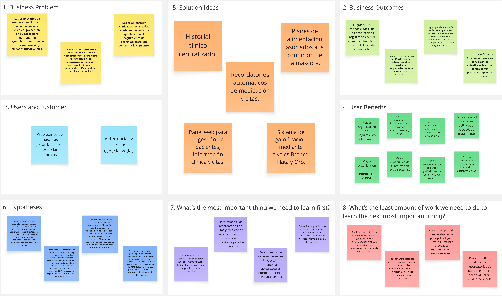

# **Capítulo I: Presentación**

## **1.1. Startup Profile**

Esta sección incluye la descripción de la Startup y los perfiles de los integrantes del equipo.

### **1.1.1. Descripción de la Startup**  
**"PawVital Tech"** es una startup tecnológica orientada al desarrollo de soluciones digitales para apoyar el seguimiento continuo de la salud y el bienestar de mascotas geriátricas o con enfermedades crónicas. Su propuesta se enfoca en facilitar la interacción entre los propietarios de mascotas y los profesionales veterinarios, promoviendo una gestión más organizada de la información clínica y una mayor continuidad en los cuidados indicados.

La startup surge ante la necesidad de mejorar el seguimiento de mascotas que requieren controles veterinarios frecuentes, administración periódica de medicamentos y cuidados nutricionales específicos. En este contexto, PawVital Tech busca aprovechar tecnologías digitales para facilitar el acceso y la gestión de información relevante durante el proceso de cuidado de la mascota.

Como producto principal, PawVital Tech propone VetPax, una plataforma digital orientada al seguimiento clínico y nutricional de mascotas geriátricas o con enfermedades crónicas. La solución contempla productos digitales dirigidos tanto a propietarios de mascotas como a veterinarias y clínicas especializadas, con el propósito de favorecer la continuidad del tratamiento y la coordinación entre ambos segmentos.

<strong>Misión:</strong> Desarrollar soluciones tecnológicas que faciliten el seguimiento clínico y nutricional de mascotas geriátricas o con enfermedades crónicas, contribuyendo a una mayor continuidad del cuidado y a una mejor interacción entre sus propietarios y los profesionales veterinarios.

<strong>Visión:</strong> Convertirnos en la plataforma de referencia en Lima para el seguimiento de salud animal geriátrica y crónica, reconocida por mejorar la calidad de vida de las mascotas y fortalecer la relación entre propietarios y veterinarias mediante tecnología accesible.

### **1.1.2. Perfiles de integrantes del equipo**
A continuación, se detallan los perfiles de los integrantes del equipo que llevarán a cabo este proyecto, resaltando sus roles clave y sus respectivas áreas de experiencia.  

|                       Photo                       | Description                                                                                                                                                                                                                                                                                                                                                                                                                                                 |
|:-------------------------------------------------:|:------------------------------------------------------------------------------------------------------------------------------------------------------------------------------------------------------------------------------------------------------------------------------------------------------------------------------------------------------------------------------------------------------------------------------------------------------------|
|           | **Nombre y Apellido:** Rafael Alexander Dominguez Vargas    **Carrera:** Ingeniería de Software (8vo ciclo)   **Acerca de:** Soy una persona responsable y ordenada. Poseo conocimientos en lenguajes de programación como C++, Java y Python, lo que me permite desarrollar soluciones diversas dentro de mi formación en Ingeniería de Software.                                                                                                    |
|           | **Nombre y Apellido:** Esteban Valentino Alvarez Falen    **Carrera:** Ingeneria de Software   **Acerca de:** Soy Esteban Alvarez Falen. Soy un estudiante de la carrera de Ingeniería de Software, estoy en la universidad UPC. No cuento con experiencia laboral en programas, sin embargo a lo largo de mi carrera estoy realizando proyectos para mejorar en código, trabajo en equipo y organización de proyectos. Soy una persona que le gusta pensar en soluciones y encontrar motivaciones para innovar e implementar.                                                                                                    |
|            | **Nombre y Apellido:** Henry Kevin Diaz Gutierrez (U201819674)    **Carrera:** Ingeniería de Software   **Acerca de:** Soy estudiante de Ingeniería de Software en la UPC. Me caracterizo por ser creativo , cumplir con lo que se me brinda y ayudar a resolver problemas si se presenta. Desde siempre me intereso el tema de los videojuegos y de el tipo de diseño que se empleaba, eso hizo que me guste el desarrollo de software.                                                                                                    |
|            | **Nombre y Apellido:** Adrian Valerio Garcia    **Carrera:** Ingenieria de Software   **Acerca de:**  Me interesa el aprendizaje continuo y suelo enfocarme en resolver problemas de manera rápida y eficiente. Disfruto los videojuegos y aprender nuevas tecnologías, además de trabajar en equipo para lograr objetivos en conjunto. Tengo conocimientos en lenguajes de programación y procuro mejorar constantemente mis métodos de estudio para ampliar mis habilidades.                                                                                                   |

## **1.2. Solution Profile**
En esta sección se presenta el perfil de la solución VetPax, abordando la problemática que motiva su desarrollo y la aplicación del Lean UX Process para identificar las necesidades de los segmentos objetivo, las principales suposiciones del producto y las hipótesis que orientarán su validación.

### **1.2.1 Antecedentes y problemática**
Esta sección analiza los antecedentes y la problemática relacionada con el seguimiento clínico y nutricional de mascotas geriátricas o con enfermedades crónicas. Para estructurar el análisis se emplea la técnica de las 5W2H, considerando qué problema ocurre, a quién afecta, dónde y cuándo se presenta, por qué resulta relevante, cómo se aborda actualmente y cuál es su impacto.

- **What (¿Qué?)**  Los propietarios de mascotas geriátricas o con enfermedades crónicas enfrentan dificultades para mantener un seguimiento continuo de su estado clínico, medicación, controles veterinarios y cuidados nutricionales. La información relacionada con el tratamiento puede encontrarse distribuida entre documentos físicos, registros de distintas veterinarias y anotaciones personales, dificultando su consulta y continuidad entre controles.

- **Who (¿Quién?)**  La problemática afecta principalmente a los propietarios de mascotas geriátricas o con enfermedades crónicas que requieren controles periódicos y tratamientos prolongados. Asimismo, afecta a veterinarias y clínicas especializadas que necesitan mantener información clínica actualizada y dar continuidad al seguimiento de estos pacientes entre consultas.

- **Where (¿Dónde?)**  La problemática se analiza inicialmente en Lima Metropolitana, donde se encuentran los segmentos objetivo definidos para el proyecto. El seguimiento de las mascotas se desarrolla tanto dentro de las clínicas veterinarias, durante las consultas y controles, como fuera de ellas, cuando los propietarios deben continuar con medicamentos, alimentación y otras indicaciones de cuidado.

- **When (¿Cuándo?)**  La problemática se presenta principalmente durante los periodos comprendidos entre una consulta veterinaria y la siguiente, especialmente cuando la mascota requiere medicamentos periódicos, controles recurrentes o cuidados nutricionales específicos. También puede manifestarse cuando el propietario cambia de veterinaria y necesita recuperar o comunicar información clínica previa.

- **Why (¿Por qué?)**   Las mascotas geriátricas o con enfermedades crónicas pueden requerir controles frecuentes y tratamientos prolongados, por lo que la continuidad del seguimiento resulta especialmente relevante. Cuando la información clínica se encuentra fragmentada o el propietario no dispone de mecanismos adecuados para organizar medicamentos, citas e indicaciones de cuidado, aumenta la posibilidad de perder información necesaria para continuar el tratamiento entre consultas.

- **How (¿Cómo?)**  VetPax propone abordar la problemática mediante una plataforma digital compuesta por una aplicación orientada a propietarios de mascotas y un entorno web dirigido a veterinarias. La solución busca centralizar información clínica relevante, facilitar el seguimiento de citas, medicación y cuidados nutricionales, y mantener una interacción continua entre ambos segmentos durante el tratamiento de la mascota.

- **How much (¿Cuánto?)**   La problemática puede generar costos asociados a controles adicionales, pérdida de continuidad en tratamientos y mayor tiempo dedicado por propietarios y veterinarias a recuperar o reconstruir información clínica. En esta etapa del proyecto no se dispone todavía de evidencia cuantitativa suficiente para estimar con precisión el impacto económico, por lo que este aspecto deberá complementarse mediante información estadística y los resultados obtenidos durante la investigación con los segmentos objetivo.

### **1.2.2. Lean UX Process**

En esta sección se aplica el Lean UX Process con el propósito de establecer las principales suposiciones relacionadas con el negocio, los usuarios y la solución propuesta. Asimismo, se formulan hipótesis que permitan validar progresivamente dichas suposiciones mediante evidencia obtenida de los segmentos objetivo.

#### **1.2.2.1. Lean UX Problem Statements**

**Domain:**  
El proyecto se desarrolla dentro del dominio del seguimiento de la salud y el cuidado continuo de mascotas geriátricas o con enfermedades crónicas.

**Customer Segments:**  
Los segmentos considerados son los propietarios de mascotas geriátricas o con enfermedades crónicas y las veterinarias o clínicas especializadas que atienden este tipo de pacientes.

**Pain Points:**  
Los propietarios pueden presentar dificultades para organizar citas, medicamentos e indicaciones de cuidado. Por otro lado, las veterinarias y clínicas requieren mantener información clínica actualizada y disponible para dar continuidad al tratamiento de sus pacientes entre consultas.

**Gap:**  
Las herramientas y procedimientos utilizados por ambos segmentos no siempre permiten mantener de manera integrada la información clínica y las actividades de seguimiento que ocurren entre una consulta veterinaria y la siguiente.

**Vision / Strategy:**  
VetPax busca facilitar la continuidad del seguimiento clínico y nutricional mediante una plataforma digital que permita consultar y mantener organizada la información relevante durante el proceso de cuidado de la mascota.

**Initial Segment:**  
El proyecto tendrá como segmento inicial a propietarios de mascotas geriátricas o con enfermedades crónicas y a veterinarias y clínicas especializadas ubicadas en Lima Metropolitana.

#### **1.2.2.2. Lean UX Assumptions**

 **Features**

- **Historial clínico centralizado y accesible:** Se asume que los propietarios valorarán disponer de la información clínica de su mascota de manera centralizada y accesible, reduciendo la dependencia de documentos físicos, anotaciones personales o información dispersa.

- **Recordatorios de medicación y citas:** Se asume que los propietarios valorarán recibir recordatorios automáticos que faciliten el cumplimiento de medicamentos, controles y citas veterinarias.

- **Planes de alimentación personalizados:** Se asume que los propietarios valorarán disponer de indicaciones nutricionales asociadas a la condición de su mascota y avaladas por profesionales veterinarios.

- **Sistema de gamificación por niveles (Bronce, Plata y Oro):** Se asume que un mecanismo de reconocimiento asociado al cumplimiento de actividades de cuidado contribuirá a incentivar la constancia de los propietarios.

- **Panel de gestión para veterinarias:** Se asume que las veterinarias y clínicas especializadas valorarán disponer de un entorno centralizado para gestionar la agenda y consultar o actualizar la información clínica de pacientes geriátricos o con enfermedades crónicas.

 **Business Outcomes**

- Lograr que al menos el **60 % de los propietarios registrados** actualice el historial clínico de su mascota al menos una vez al mes durante el periodo de validación.

- Incrementar en al menos un **40 % la tasa de asistencia a citas veterinarias programadas** mediante el uso de recordatorios automáticos, en comparación con el seguimiento realizado sin estos recordatorios.

- Lograr que al menos el **50 % de los propietarios activos alcance el nivel Plata** dentro de los primeros tres meses de participación en el sistema de gamificación.

- Lograr que más del **70 % de las veterinarias participantes actualice el historial clínico** de sus pacientes después de cada consulta durante el periodo de validación.

**Users**

- Propietarios de mascotas geriátricas o con enfermedades crónicas en Lima Metropolitana.
- Veterinarias y clínicas especializadas que atienden pacientes geriátricos o con enfermedades crónicas.

**User Outcomes & Benefits**

Para los propietarios de mascotas se esperan los siguientes beneficios:

- Mantener un seguimiento clínico y nutricional más organizado.
- Reducir la dependencia de la memoria para recordar citas, medicamentos y otras indicaciones de cuidado.
- Consultar de manera centralizada información relacionada con la salud de la mascota.
- Tener mayor control sobre las actividades asociadas al tratamiento.
- Recibir reconocimiento por la constancia en las actividades de cuidado mediante el sistema de gamificación.

Para las veterinarias y clínicas especializadas se esperan los siguientes beneficios:

- Mantener organizada la información clínica de pacientes geriátricos o con enfermedades crónicas.
- Facilitar la continuidad de la información entre consultas.
- Dar seguimiento a las indicaciones proporcionadas al propietario.
- Gestionar de manera centralizada información relacionada con pacientes y citas.

**User Assumptions**

- Se asume que los propietarios valorarán disponer de un historial clínico que pueda consultarse de manera sencilla.

- Se asume que los propietarios valorarán que los planes de cuidado y alimentación cuenten con respaldo de profesionales veterinarios.

- Se asume que los propietarios preferirán recibir recordatorios automáticos antes que depender únicamente de su memoria para recordar medicamentos y citas.

- Se asume que los propietarios estarán dispuestos a considerar un plan premium si perciben beneficios relevantes para el seguimiento de la salud de su mascota.

- Se asume que los propietarios estarán dispuestos a registrar determinadas actividades de cuidado para visualizar su progreso dentro del sistema de gamificación.

**Business Assumptions**

- Se asume que existe una necesidad de herramientas digitales orientadas al seguimiento continuo de mascotas geriátricas o con enfermedades crónicas.

- Se asume que los propietarios adoptarán VetPax si perciben que facilita la organización y continuidad del cuidado de su mascota.

- Se asume que las veterinarias y clínicas especializadas encontrarán valor en digitalizar y centralizar parte del seguimiento de sus pacientes geriátricos o con enfermedades crónicas.

- Se asume que un modelo freemium para propietarios, complementado con planes de suscripción para veterinarias, puede constituir un modelo de negocio sostenible.

- Se asume que la participación conjunta de propietarios y veterinarias incrementará el valor proporcionado por la plataforma al facilitar la continuidad de la información clínica.

#### **1.2.2.3. Lean UX Hypothesis Statements**

A continuación, se presentan las declaraciones de hipótesis Lean UX que orientarán el desarrollo y la validación de VetPax. Cada hipótesis relaciona una propuesta de solución con un resultado esperado y establece un criterio cuantificable que permita determinar posteriormente si la suposición planteada puede considerarse validada.

##### **Hipótesis 1: Historial clínico centralizado**

Creemos que al ofrecer un historial clínico centralizado y accesible para propietarios de mascotas geriátricas o con enfermedades crónicas que necesitan mantener la continuidad del seguimiento, obtendremos una mayor constancia en la gestión de la información clínica de sus mascotas.

**Sabremos que esta hipótesis se valida** cuando al menos el **60 % de los propietarios registrados actualice el historial clínico de su mascota al menos una vez al mes** durante el periodo de validación.

##### **Hipótesis 2: Recordatorios de medicación y citas**

Creemos que al proporcionar recordatorios automáticos de medicación y citas a propietarios responsables del seguimiento de mascotas geriátricas o con enfermedades crónicas, obtendremos una reducción en los olvidos asociados a controles veterinarios programados.

**Sabremos que esta hipótesis se valida** cuando la tasa de asistencia a citas veterinarias programadas aumente al menos un **40 % en comparación con el seguimiento realizado sin recordatorios automáticos**.

##### **Hipótesis 3: Sistema de gamificación**

Creemos que al implementar un sistema de gamificación mediante los niveles Bronce, Plata y Oro para propietarios de mascotas geriátricas o con enfermedades crónicas, obtendremos una mayor constancia en el cumplimiento y registro de las actividades relacionadas con el cuidado de sus mascotas.

**Sabremos que esta hipótesis se valida** cuando al menos el **50 % de los propietarios activos alcance el nivel Plata dentro de los primeros tres meses** de participación en el sistema de gamificación.

##### **Hipótesis 4: Panel de gestión para veterinarias**

Creemos que al proporcionar a veterinarias y clínicas especializadas un panel que integre información clínica y gestión de citas para pacientes geriátricos o con enfermedades crónicas, obtendremos una mayor continuidad de la información registrada entre consultas.

**Sabremos que esta hipótesis se valida** cuando más del **70 % de las veterinarias participantes actualice el historial clínico de sus pacientes después de cada consulta** durante el periodo de validación.

#### **1.2.2.4. Lean UX Canvas**

A continuación, se presenta el Lean UX Canvas elaborado para VetPax, en el cual se sintetizan los principales elementos del modelo de negocio, los segmentos objetivo, sus necesidades, las suposiciones formuladas y los resultados esperados. Este artefacto permite relacionar las necesidades identificadas con las hipótesis que serán sometidas a validación durante el desarrollo del producto.

Link: [*https://canva.link/g44lfftx768imrj*](https://canva.link/g44lfftx768imrj)

## **1.3. Segmentos objetivo**

VetPax está orientado a dos segmentos principales en Lima Metropolitana: propietarios de mascotas geriátricas o con enfermedades crónicas, y veterinarias o clínicas especializadas que atienden este tipo de pacientes. Ambos segmentos requieren mantener continuidad en el cuidado y seguimiento de la mascota, aunque presentan necesidades diferentes según su participación en el tratamiento.

### **1. Propietarios de mascotas geriátricas o con enfermedades crónicas**

Este segmento está conformado por personas mayores de edad responsables del cuidado de perros o gatos geriátricos o diagnosticados con enfermedades crónicas. Debido a que estas mascotas pueden requerir controles frecuentes, medicamentos y cuidados nutricionales prolongados, sus propietarios necesitan mantener organizada la información relacionada con el tratamiento, recordar citas y medicación, y acceder a las indicaciones proporcionadas por los profesionales veterinarios.

Los propietarios valoran herramientas que faciliten el seguimiento cotidiano de la salud de sus mascotas y reduzcan la dependencia de documentos físicos, anotaciones personales o la memoria para mantener la continuidad del cuidado.

### **2. Veterinarias y clínicas especializadas**

Este segmento está conformado por veterinarias y clínicas de Lima Metropolitana que atienden mascotas geriátricas o con enfermedades crónicas que requieren controles periódicos y tratamientos prolongados. Sus necesidades se relacionan principalmente con mantener información clínica actualizada, gestionar citas y conservar la continuidad del historial de sus pacientes entre consultas.

Estas organizaciones requieren mecanismos que faciliten el registro y consulta de información clínica, así como el seguimiento de las indicaciones proporcionadas a los propietarios durante el tratamiento de sus mascotas.

---

## **Datos Cuantitativos de la Problemática**

### **Propietarios de mascotas geriátricas o con enfermedades crónicas**

Los estudios realizados en el contexto peruano muestran dificultades relacionadas con el acceso y seguimiento de la atención veterinaria.

- **Atención veterinaria:** En un estudio realizado en Lomas de Carabayllo, Lima, únicamente el **25 %** de los encuestados manifestó acudir a un médico veterinario para el cuidado de sus animales de compañía, mientras que el **15 %** indicó administrar medicamentos sin prescripción médica (Esparza et al., 2020).

- **Medicación sin prescripción:** En otro estudio realizado en Lima, el **34.8 %** de los propietarios encuestados señaló haber administrado medicamentos a sus animales de compañía sin acudir previamente a un médico veterinario (2021).

### **Veterinarias y clínicas especializadas**

El seguimiento veterinario adquiere especial relevancia en mascotas geriátricas o que requieren atención periódica.

- **Atención veterinaria previa:** Un estudio realizado en Abancay reportó que el **52.1 % de los perros** y el **18.5 % de los gatos** evaluados habían recibido atención veterinaria alguna vez (2020).

- **Enfermedades asociadas a la edad:** Un estudio realizado con caninos atendidos en Lima encontró una frecuencia de cardiopatías de **6.3 % en perros de 9 a 12 años**, aumentando hasta **15.5 % en perros mayores de 12 años**. Estos resultados muestran la importancia del seguimiento veterinario conforme aumenta la edad del animal.

---

## **Segmentación del Público Objetivo**

### **Variables Geográficas**

- **País:** Perú.
- **Ubicación inicial:** Lima Metropolitana.

### **Variables Demográficas**

- **Edad:** Mayores de 18 años.
- **Género:** Masculino y femenino.
- **Propietarios:** Personas responsables de perros o gatos geriátricos o con enfermedades crónicas.
- **Organizaciones:** Veterinarias y clínicas que atienden este tipo de pacientes.

### **Variables Psicográficas y Conductuales**

- **Propietarios:** Personas interesadas en mantener el bienestar de sus mascotas y cumplir adecuadamente con citas, medicamentos y cuidados indicados.
- **Veterinarias y clínicas:** Organizaciones interesadas en mantener información clínica organizada y proporcionar continuidad en el seguimiento de sus pacientes.
- **Uso de tecnología:** Usuarios con disposición para utilizar herramientas digitales que faciliten la organización y seguimiento de la salud de las mascotas.