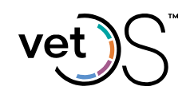
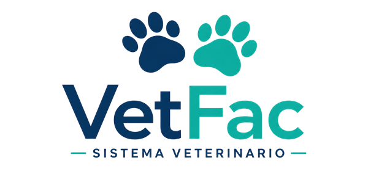

## **Capítulo II: Requirements Elicitation & Analysis**

## 2.1. Competidores 
 
En el mercado peruano existen diferentes soluciones digitales orientadas a la gestión de clínicas veterinarias y al cuidado de mascotas. Sin embargo, la mayoría de estas plataformas se concentra principalmente en la administración de las veterinarias, como la gestión de citas, historias clínicas, inventarios, ventas y facturación. 
 
En este contexto, VetPax busca diferenciarse al enfocarse específicamente en el **seguimiento clínico y nutricional continuo de mascotas geriátricas o con enfermedades crónicas**, conectando las necesidades de los dueños con las de las veterinarias. 
 
### 2.1.1. Análisis competitivo 
 
Los principales competidores identificados son **VetOS, PetSuite, GVET, VetFac y SmartVet360**, debido a que ofrecen funcionalidades relacionadas con la digitalización de procesos veterinarios, como historias clínicas, agenda de citas, gestión de clientes y seguimiento de pacientes. 
 
**VetOS**

VetOS es un software veterinario orientado al mercado peruano que ofrece funcionalidades como historia clínica digital, agenda, farmacia, inventario y gestión de clientes. Además, incorpora un portal para los dueños de mascotas. Su principal fortaleza es ofrecer una solución integral para la administración de clínicas veterinarias, mientras que su enfoque se encuentra principalmente en la gestión operativa de la clínica. :contentReference[oaicite:0]{index=0} 
 
**PetSuite**

PetSuite permite administrar agendas, historias clínicas, inventario, ventas y facturación electrónica. También incorpora recordatorios de citas y vacunas, además de acceso desde diferentes dispositivos. Su propuesta está orientada a que las veterinarias puedan centralizar sus procesos administrativos y clínicos en una sola plataforma. :contentReference[oaicite:1]{index=1} 
 
**GVET**

GVET ofrece un sistema de gestión integral para clínicas y hospitales veterinarios, incluyendo funcionalidades relacionadas con la administración de clientes y pacientes, información médica y acceso desde diferentes dispositivos. Su fortaleza se encuentra en centralizar la información necesaria para la operación de una veterinaria. :contentReference[oaicite:2]{index=2} 
 
**VetFac**

VetFac se enfoca en la digitalización de la historia clínica veterinaria, permitiendo registrar consultas, diagnósticos, tratamientos, vacunas y otros datos de las mascotas. También incorpora agenda de citas, recordatorios y funcionalidades de facturación electrónica. :contentReference[oaicite:3]{index=3} 
 
**SmartVet360**

SmartVet360 ofrece una plataforma en la nube con módulos de historia clínica, agenda, inventario, farmacia, punto de venta, facturación electrónica y gestión de múltiples sedes. Su propuesta está orientada principalmente a la administración integral de clínicas veterinarias de diferentes tamaños. :contentReference[oaicite:4]{index=4} 
 
A partir de este análisis, se observa que los competidores cuentan con funcionalidades importantes para la gestión veterinaria, pero existe una oportunidad de diferenciación en el acompañamiento del dueño fuera de la consulta. VetPax busca cubrir este espacio mediante una experiencia centrada en mascotas geriátricas y con enfermedades crónicas, integrando historial clínico, recordatorios, planes de alimentación personalizados y gamificación. 
 
| Competidor | Enfoque principal | Historial clínico | Agenda | Recordatorios | Enfoque en mascotas crónicas | Gamificación | Modelo de VetPax | 
|---|---|---|---|---|---|---|---| 
| VetOS | Gestión integral de clínicas | Sí | Sí | Sí | General | No identificado | Especializado | 
| PetSuite | Gestión administrativa y clínica | Sí | Sí | Sí | General | No identificado | Especializado | 
| GVET | Gestión de clínicas y pacientes | Sí | Sí | Sí | General | No identificado | Especializado | 
| VetFac | Historia clínica y gestión veterinaria | Sí | Sí | Sí | General | No identificado | Especializado | 
| SmartVet360 | Gestión integral de clínicas | Sí | Sí | Sí | General | No identificado | Especializado | 
| **VetPax** | Seguimiento clínico-nutricional | **Sí** | **Sí** | **Sí** | **Sí** | **Sí** | **Sí** | 
 
En consecuencia, la principal oportunidad competitiva de VetPax no consiste únicamente en digitalizar la información veterinaria, sino en **mantener la continuidad del cuidado entre una consulta y otra**. Mientras las soluciones analizadas se orientan principalmente a la gestión de la clínica, VetPax busca involucrar activamente al dueño en el tratamiento y cuidado diario de su mascota.

Asimismo, conforme la plataforma incremente su cantidad de usuarios y veterinarias, será importante considerar atributos de calidad como la **escalabilidad, disponibilidad, seguridad, mantenibilidad e interoperabilidad**. De esta manera, las decisiones arquitectónicas podrán acompañar el crecimiento de la solución y no limitarse únicamente a las funcionalidades iniciales.

### 2.1.2. Estrategias y tácticas frente a competidores 
 
Frente a los competidores identificados, VetPax adoptará una estrategia de **diferenciación por especialización**, enfocándose en un segmento específico: dueños de mascotas geriátricas o con enfermedades crónicas y veterinarias que atienden este tipo de pacientes. 
 
La estrategia estará basada en los siguientes aspectos: 
 
#### 1. Especialización en mascotas geriátricas y crónicas 
 
VetPax no buscará competir únicamente como un sistema general de gestión veterinaria. Su propuesta estará orientada a las necesidades particulares de mascotas que requieren controles frecuentes, tratamientos prolongados y seguimiento nutricional. 
 
**Táctica:** 
 
- Diseñar funcionalidades específicas para tratamientos prolongados. 
- Registrar información relevante sobre la evolución de la mascota. 
- Permitir planes de alimentación asociados a la condición de la mascota. 
- Priorizar recordatorios de medicación, citas y controles. 
- Generar reportes de evolución que puedan ser consultados por el dueño y la veterinaria. 
 
#### 2. Continuidad del tratamiento fuera de la consulta 
 
Una de las principales diferencias de VetPax será el acompañamiento del dueño durante el periodo entre consultas. Esto permitirá que la plataforma no se limite al momento de atención en la veterinaria. 
 
**Táctica:** 
 
- Enviar recordatorios automáticos de medicamentos y citas. 
- Mostrar próximas actividades relacionadas con el tratamiento. 
- Registrar el cumplimiento de determinadas actividades de cuidado. 
- Facilitar la consulta del historial clínico desde la aplicación móvil. 
- Generar alertas cuando existan actividades pendientes. 
 
#### 3. Integración entre veterinarias y dueños 
 
VetPax buscará crear una conexión continua entre ambos segmentos objetivo. La veterinaria podrá actualizar información clínica y el dueño podrá consultar las indicaciones y realizar el seguimiento desde su aplicación. 
 
**Táctica:** 
 
- Implementar un panel web para veterinarias. 
- Implementar una aplicación móvil para dueños. 
- Sincronizar el historial clínico entre ambos perfiles. 
- Facilitar la comunicación mediante un canal de soporte. 
- Mantener la información organizada para facilitar la continuidad del tratamiento. 
 
Desde el punto de vista arquitectónico, esta integración requiere establecer mecanismos de comunicación entre los diferentes componentes de la plataforma. El uso de **APIs** permitirá que la aplicación móvil y el panel web accedan a los servicios necesarios sin depender directamente de la implementación interna del backend. Esto favorece la separación de responsabilidades y facilita la evolución independiente de los diferentes componentes.

#### 4. Gamificación como elemento diferenciador 
 
La incorporación de un sistema de niveles **Bronce, Plata y Oro** permitirá diferenciar a VetPax de las plataformas tradicionales de gestión veterinaria. 
 
**Táctica:** 
 
- Asignar puntos por cumplimiento de actividades de cuidado. 
- Reconocer la constancia del dueño mediante niveles. 
- Mostrar el progreso de cada usuario. 
- Utilizar reconocimientos como mecanismo de motivación. 
- Incentivar la asistencia a controles y el cumplimiento de tratamientos. 
 
A nivel de arquitectura, esta funcionalidad podrá mantenerse separada de los componentes relacionados con el historial clínico y la gestión de citas. Esto permitirá modificar las reglas de puntuación o agregar nuevos mecanismos de reconocimiento sin generar un acoplamiento innecesario con otras funcionalidades.

#### 5. Modelo freemium para adquisición de usuarios 
 
VetPax utilizará un modelo freemium para reducir la barrera de entrada de los dueños de mascotas. Las funcionalidades básicas estarán disponibles gratuitamente, mientras que las funcionalidades avanzadas estarán disponibles mediante una suscripción premium. 
 
**Táctica:** 
 
- Ofrecer gratuitamente el registro de mascotas. 
- Permitir acceso al historial clínico básico. 
- Incluir recordatorios básicos de citas y medicación. 
- Ofrecer planes premium con reportes avanzados y planes nutricionales personalizados. 
- Permitir el registro de múltiples mascotas dentro de los planes premium. 
 
La existencia de diferentes niveles de suscripción requiere que la plataforma gestione adecuadamente los permisos y funcionalidades disponibles para cada usuario. Por ello, la arquitectura deberá permitir controlar el acceso a los servicios según el tipo de cuenta o suscripción.

#### 6. Alianzas con veterinarias especializadas 
 
En lugar de competir directamente con las veterinarias, VetPax buscará convertirlas en parte del ecosistema de la plataforma. 
 
**Táctica:** 
 
- Implementar programas piloto con veterinarias de Lima Metropolitana. 
- Ofrecer periodos de prueba para clínicas interesadas. 
- Recoger retroalimentación de veterinarios y dueños. 
- Utilizar las alianzas para validar nuevas funcionalidades. 
- Generar beneficios para las clínicas mediante herramientas de seguimiento y fidelización. 
 
Estas alianzas permitirán validar progresivamente tanto las funcionalidades del producto como las decisiones técnicas de la solución. La retroalimentación obtenida durante los pilotos podrá utilizarse para identificar necesidades de escalabilidad, integración o modificación de componentes antes de ampliar el alcance de la plataforma.

#### 7. Posicionamiento mediante contenido educativo 
 
VetPax utilizará contenido relacionado con el cuidado de mascotas geriátricas y crónicas para construir confianza con los usuarios. 
 
**Táctica:** 
 
- Publicar contenido educativo sobre enfermedades frecuentes en mascotas senior. 
- Compartir recomendaciones generales de cuidado y nutrición. 
- Difundir testimonios y experiencias de usuarios. 
- Utilizar redes sociales como Facebook, Instagram y TikTok. 
- Realizar campañas digitales dirigidas a dueños de mascotas y veterinarias. 
 
En síntesis, la estrategia competitiva de VetPax estará centrada en **especializarse en un problema concreto en lugar de competir únicamente por cantidad de funcionalidades**. La combinación de seguimiento clínico, recordatorios, planes nutricionales, conexión con veterinarias y gamificación permitirá construir una propuesta diferenciada frente a los sistemas veterinarios de gestión general.

- 2.2. Entrevistas
    - 2.2.1. Diseño de entrevistas
    - 2.2.2. Registro de entrevistas
    - 2.2.3. Análisis de entrevistas

- 2.3. Needfinding
    - 2.3.1. User Personas
    - 2.3.2. User Task Matrix
    - 2.3.3. Empathy Mapping
    - 2.3.4. As-is Scenario Mapping

- 2.4. Ubiquitous Language
