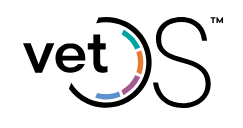
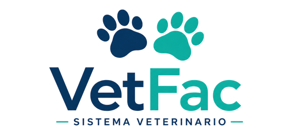
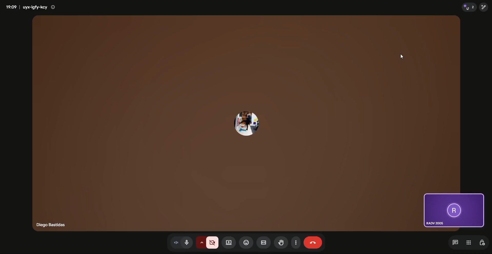
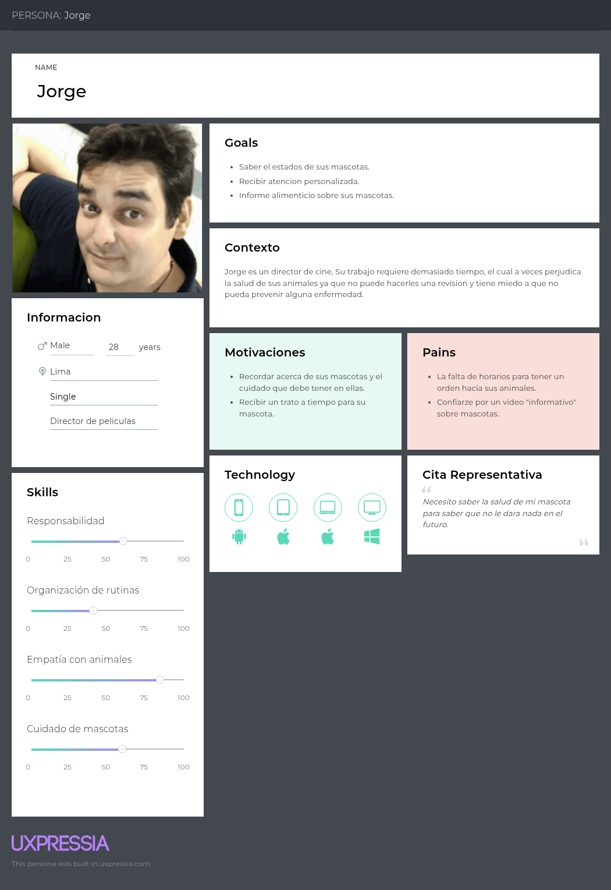
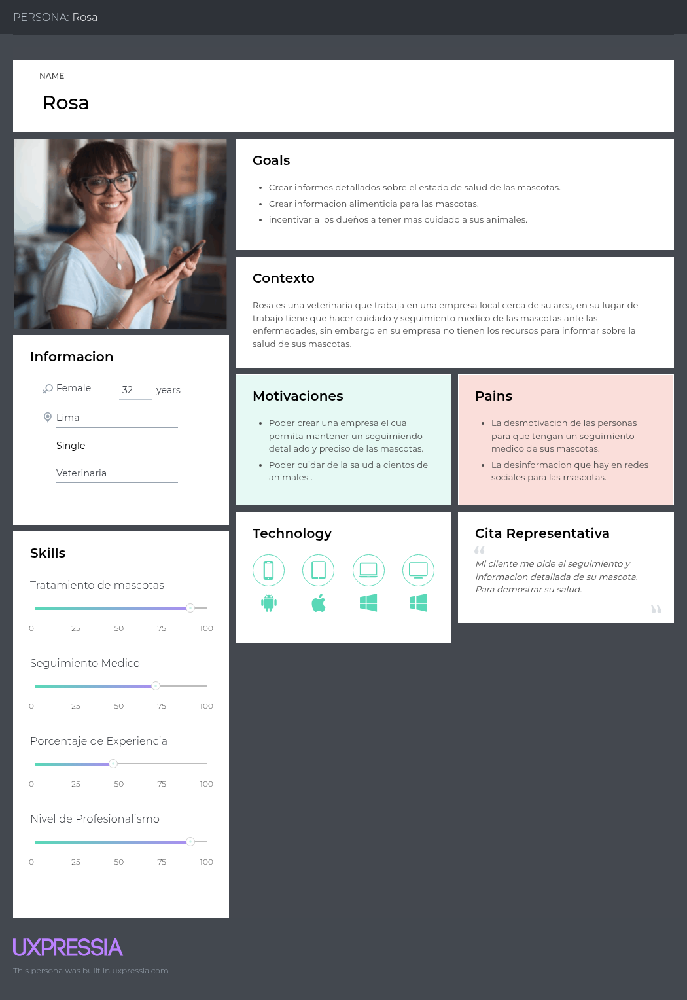
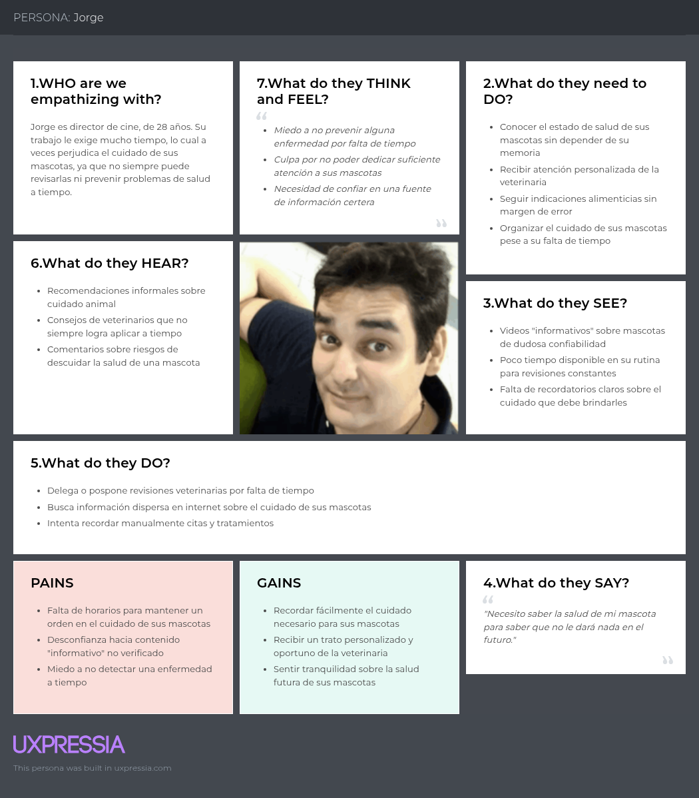
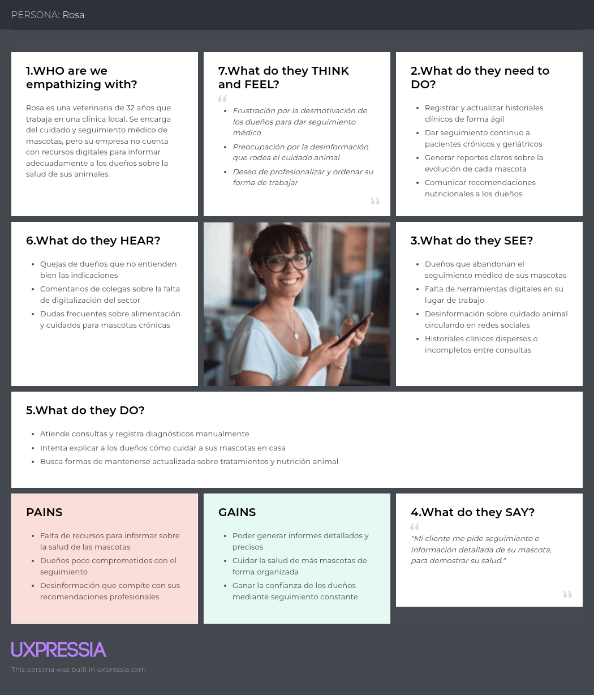
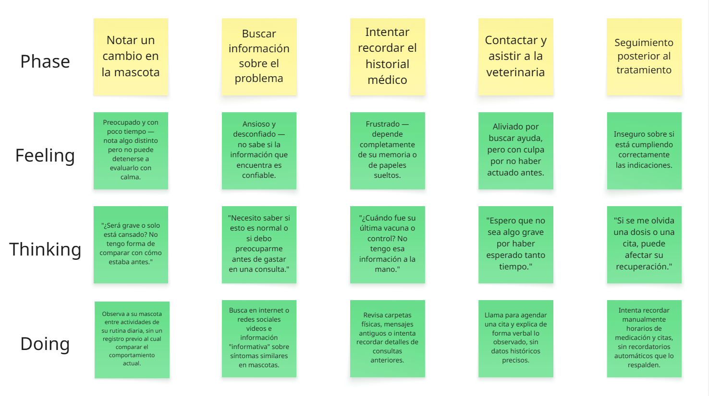
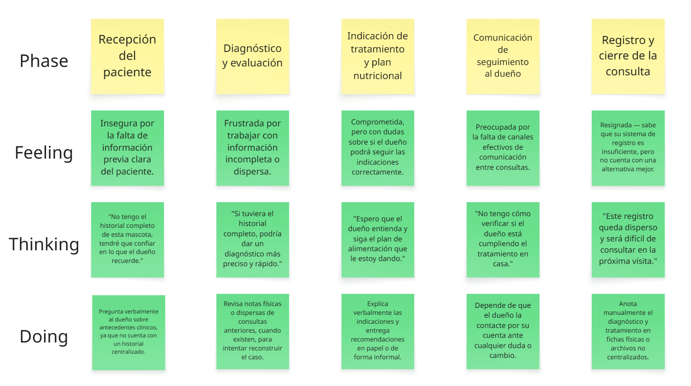

## **Capítulo II: Requirements Elicitation & Analysis**

## **2.1. Competidores**

En el mercado existen diversas soluciones digitales orientadas a la gestión de clínicas veterinarias y al cuidado de mascotas. Estas plataformas ofrecen funcionalidades relacionadas con la administración de citas, historias clínicas, clientes, inventarios, ventas y otros procesos asociados a la operación de una veterinaria.

En este contexto, VetPax plantea una propuesta enfocada específicamente en el **seguimiento clínico y nutricional continuo de mascotas geriátricas o con enfermedades crónicas**, buscando facilitar la continuidad del cuidado entre los propietarios y los profesionales veterinarios.

A partir del análisis realizado, se identificaron cinco soluciones relacionadas con el dominio de VetPax:

| Competidor | Descripción general |
|---|---|
|  **VetOS** | Software veterinario que integra historia clínica digital, agenda, farmacia, inventario y gestión de clientes. También incorpora un portal dirigido a propietarios de mascotas. |
|  **PetSuite** | Plataforma para la administración de agendas, historias clínicas, inventario, ventas y facturación electrónica, además de recordatorios de citas y vacunas. |
|  **GVET** | Sistema de gestión para clínicas y hospitales veterinarios orientado a centralizar la administración de clientes, pacientes e información médica. |
|  **VetFac** | Solución enfocada en la digitalización de historias clínicas, permitiendo registrar consultas, diagnósticos, tratamientos y vacunas, además de gestionar citas y facturación. |
|  **SmartVet360** | Plataforma en la nube que integra historia clínica, agenda, inventario, farmacia, punto de venta, facturación electrónica y gestión de múltiples sedes. |

Para el análisis competitivo se seleccionaron **VetOS, PetSuite y SmartVet360** por representar soluciones que concentran varias de las funcionalidades relacionadas con la gestión clínica y administrativa que también forman parte del contexto de VetPax.

### **2.1.1. Análisis competitivo**

El análisis competitivo tiene como propósito comparar la propuesta de VetPax con las principales soluciones digitales identificadas en el sector veterinario. Para ello, se consideran aspectos relacionados con el perfil de cada solución, el mercado objetivo, la propuesta de valor, los productos y servicios, los canales de distribución y su situación competitiva.

<table border="1" cellspacing="0" cellpadding="6" style="border-collapse: collapse; width: 100%;">
  <thead>
    <tr>
      <th></th>
      <th></th>
      <th>VetPax</th>
      <th>
         
        <strong>VetOS</strong>
      </th>
      <th>
         
        <strong>PetSuite</strong>
      </th>
      <th>
         
        <strong>SmartVet360</strong>
      </th>
    </tr>
  </thead>

  <tbody>
    <!-- PERFIL -->
    <tr>
      <td rowspan="2"><strong>Perfil</strong></td>
      <td><strong>Overview</strong></td>
      <td>
        Plataforma orientada al seguimiento clínico y nutricional continuo de mascotas geriátricas o con enfermedades crónicas, conectando a propietarios y veterinarias durante el proceso de cuidado.
      </td>
      <td>
        Software veterinario que integra historia clínica digital, agenda, farmacia, inventario, gestión de clientes y un portal para propietarios.
      </td>
      <td>
        Plataforma que centraliza agenda, historias clínicas, inventario, ventas, facturación y recordatorios relacionados con citas y vacunas.
      </td>
      <td>
        Plataforma en la nube orientada a la gestión integral de clínicas veterinarias, incorporando historia clínica, agenda, inventario, farmacia, punto de venta, facturación y gestión de múltiples sedes.
      </td>
    </tr>
    <tr>
      <td><strong>Ventaja competitiva / ¿Qué valor ofrece al cliente?</strong></td>
      <td>
        Especialización en mascotas geriátricas o con enfermedades crónicas y continuidad del seguimiento entre consultas mediante historial clínico, recordatorios, alimentación y gamificación.
      </td>
      <td>
        Integra diferentes procesos clínicos y administrativos dentro de una misma solución e incorpora un portal para propietarios.
      </td>
      <td>
        Centraliza procesos administrativos y clínicos y facilita el acceso a la información desde diferentes dispositivos.
      </td>
      <td>
        Integra múltiples procesos operativos y permite gestionar clínicas con diferentes sedes desde una plataforma en la nube.
      </td>
    </tr>
    <!-- PERFIL DE MARKETING -->
    <tr>
      <td rowspan="2"><strong>Perfil de marketing</strong></td>
      <td><strong>Mercado objetivo</strong></td>
      <td>
        Propietarios de mascotas geriátricas o con enfermedades crónicas y veterinarias o clínicas especializadas, inicialmente en Lima Metropolitana.
      </td>
      <td>
        Clínicas y profesionales veterinarios que requieren digitalizar sus procesos de gestión.
      </td>
      <td>
        Clínicas veterinarias que requieren centralizar procesos administrativos y clínicos.
      </td>
      <td>
        Clínicas veterinarias de diferentes tamaños, incluyendo organizaciones con múltiples sedes.
      </td>
    </tr>
    <tr>
      <td><strong>Estrategias de marketing</strong></td>
      <td>
        Contenido educativo sobre el cuidado de mascotas geriátricas o con enfermedades crónicas, difusión mediante redes sociales y alianzas con veterinarias para programas piloto.
      </td>
      <td>
        No identificado en la información recopilada en la primera entrega.
      </td>
      <td>
        No identificado en la información recopilada en la primera entrega.
      </td>
      <td>
        No identificado en la información recopilada en la primera entrega.
      </td>
    </tr>
    <!-- PERFIL DE PRODUCTO -->
    <tr>
      <td rowspan="3"><strong>Perfil de producto</strong></td>
      <td><strong>Productos y servicios</strong></td>
      <td>
        Historial clínico centralizado, gestión de citas, recordatorios de medicación, seguimiento nutricional, panel para veterinarias y sistema de gamificación mediante niveles Bronce, Plata y Oro.
      </td>
      <td>
        Historia clínica digital, agenda, farmacia, inventario, gestión de clientes y portal para propietarios.
      </td>
      <td>
        Agenda, historias clínicas, inventario, ventas, facturación electrónica y recordatorios de citas y vacunas.
      </td>
      <td>
        Historia clínica, agenda, inventario, farmacia, punto de venta, facturación electrónica y gestión de múltiples sedes.
      </td>
    </tr>
    <tr>
      <td><strong>Precios y costos</strong></td>
      <td>
        Modelo freemium para propietarios, con funcionalidades avanzadas mediante suscripción premium y planes de suscripción dirigidos a veterinarias. Los precios específicos aún no han sido establecidos.
      </td>
      <td>
        No identificado en la información recopilada en la primera entrega.
      </td>
      <td>
        No identificado en la información recopilada en la primera entrega.
      </td>
      <td>
        No identificado en la información recopilada en la primera entrega.
      </td>
    </tr>
    <tr>
      <td><strong>Canales de distribución</strong></td>
      <td>
        Aplicación móvil dirigida a propietarios y aplicación web dirigida a veterinarias y clínicas especializadas.
      </td>
      <td>
        Software de gestión veterinaria y portal para propietarios.
      </td>
      <td>
        Acceso a la plataforma desde diferentes dispositivos.
      </td>
      <td>
        Plataforma basada en la nube.
      </td>
    </tr>
    <!-- ANÁLISIS SWOT -->
    <tr>
      <td rowspan="4"><strong>Análisis SWOT</strong></td>
      <td><strong>Fortalezas</strong></td>
      <td>
        Especialización en seguimiento de pacientes geriátricos o con enfermedades crónicas; integración entre propietarios y veterinarias; seguimiento entre consultas y gamificación.
      </td>
      <td>
        Amplia cobertura de procesos clínicos y administrativos e incorporación de un portal para propietarios.
      </td>
      <td>
        Centralización de procesos clínicos y administrativos e incorporación de recordatorios.
      </td>
      <td>
        Amplia cobertura funcional, operación en la nube y capacidad para gestionar múltiples sedes.
      </td>
    </tr>
    <tr>
      <td><strong>Debilidades</strong></td>
      <td>
        Producto en proceso de desarrollo y validación, con menor madurez operativa frente a soluciones veterinarias ya existentes.
      </td>
      <td>
        Su propuesta se concentra principalmente en la gestión integral de la clínica y no presenta un enfoque específico en pacientes geriátricos o con enfermedades crónicas.
      </td>
      <td>
        Presenta un enfoque general de gestión veterinaria y no se identificó una especialización en seguimiento prolongado de pacientes geriátricos o con enfermedades crónicas.
      </td>
      <td>
        Su propuesta se orienta principalmente a la administración integral de clínicas y no se identificó un enfoque específico en el acompañamiento continuo del propietario.
      </td>
    </tr>
    <tr>
      <td><strong>Oportunidades</strong></td>
      <td>
        Atender un segmento específico que requiere controles frecuentes y tratamientos prolongados, además de establecer alianzas con veterinarias especializadas.
      </td>
      <td>
        Incorporar funcionalidades especializadas para el seguimiento continuo de pacientes que requieren tratamientos prolongados.
      </td>
      <td>
        Ampliar sus funcionalidades de recordatorios hacia un seguimiento continuo de pacientes geriátricos o con enfermedades crónicas.
      </td>
      <td>
        Extender su infraestructura de gestión hacia funcionalidades orientadas al seguimiento del propietario fuera de la consulta.
      </td>
    </tr>
    <tr>
      <td><strong>Amenazas</strong></td>
      <td>
        Las plataformas veterinarias existentes podrían incorporar funcionalidades similares de seguimiento clínico continuo y atención especializada.
      </td>
      <td>
        Aparición de soluciones especializadas que atiendan necesidades particulares que una plataforma generalista no cubra.
      </td>
      <td>
        Competencia de soluciones con mayor especialización en determinados segmentos de pacientes y propietarios.
      </td>
      <td>
        Competencia de plataformas especializadas que complementen la gestión clínica con una experiencia orientada al propietario.
      </td>
    </tr>

  </tbody>
</table>

A partir del análisis se identifica que las soluciones comparadas ofrecen una cobertura importante de los procesos administrativos y clínicos de una veterinaria. Sin embargo, su enfoque se orienta principalmente a la gestión general de la clínica y del paciente. En este contexto, VetPax plantea como oportunidad de diferenciación la **continuidad del cuidado entre una consulta y la siguiente**, con especial atención a mascotas geriátricas o con enfermedades crónicas.

La propuesta de VetPax busca involucrar a ambos segmentos durante este proceso: las veterinarias mantienen y actualizan la información clínica, mientras que los propietarios pueden consultar indicaciones, recibir recordatorios y realizar el seguimiento cotidiano del cuidado de sus mascotas. La gamificación se incorpora como un elemento complementario orientado a incentivar la constancia de los propietarios.

Asimismo, el análisis competitivo permite reconocer que VetPax deberá considerar atributos de calidad como **seguridad, disponibilidad, escalabilidad e interoperabilidad**, especialmente conforme aumente la cantidad de propietarios, veterinarias e información clínica gestionada por la plataforma.

La comparación se realiza a partir de las características identificadas en la información disponible sobre cada plataforma. Por ello, la ausencia de una funcionalidad específica en el análisis no implica necesariamente que el competidor no la ofrezca, sino que dicha capacidad no fue identificada o documentada con suficiente detalle durante la investigación. La diferenciación de VetPax se plantea principalmente en la integración del seguimiento clínico, nutricional y de tratamientos entre consultas para mascotas geriátricas o con enfermedades crónicas.

### **2.1.2. Estrategias y tácticas frente a competidores**

A partir del análisis competitivo realizado, PawVital Tech plantea un conjunto de estrategias orientadas a diferenciar VetPax de las soluciones veterinarias de gestión general. Estas estrategias buscan aprovechar las oportunidades identificadas en el seguimiento continuo de mascotas geriátricas o con enfermedades crónicas y responder a las fortalezas de plataformas que cuentan con una mayor cobertura de procesos administrativos y clínicos.

#### **1. Especialización en mascotas geriátricas o con enfermedades crónicas**

Frente a competidores que ofrecen soluciones orientadas principalmente a la gestión general de clínicas veterinarias, VetPax plantea una estrategia de especialización en mascotas que requieren controles frecuentes, tratamientos prolongados y seguimiento nutricional.

**Tácticas:**

- Priorizar funcionalidades relacionadas con tratamientos prolongados.
- Mantener información relevante sobre la evolución clínica de la mascota.
- Incorporar planes de alimentación asociados a su condición.
- Facilitar recordatorios de medicación, citas y controles.
- Proporcionar información que permita consultar la evolución de la mascota.

#### **2. Continuidad del tratamiento entre consultas**

Una de las principales oportunidades identificadas en el análisis competitivo es ampliar el seguimiento más allá del momento de atención en la clínica. Por ello, VetPax busca mantener la continuidad del cuidado durante los periodos comprendidos entre una consulta veterinaria y la siguiente.

**Tácticas:**

- Enviar recordatorios automáticos de medicamentos y citas.
- Mostrar las próximas actividades relacionadas con el tratamiento.
- Facilitar el registro de determinadas actividades de cuidado.
- Permitir la consulta del historial clínico desde la aplicación móvil.
- Notificar al propietario sobre actividades de seguimiento pendientes.

#### **3. Integración entre veterinarias y propietarios**

VetPax plantea una estrategia orientada a fortalecer la interacción entre los dos segmentos objetivo. Mientras las veterinarias mantienen y actualizan la información clínica, los propietarios pueden consultar las indicaciones y realizar el seguimiento cotidiano desde la aplicación.

**Tácticas:**

- Proporcionar un panel web dirigido a veterinarias y clínicas especializadas.
- Proporcionar una aplicación móvil dirigida a propietarios de mascotas.
- Mantener sincronizada la información clínica relevante entre ambos perfiles.
- Facilitar la consulta de indicaciones proporcionadas por los profesionales veterinarios.
- Mantener organizada la información necesaria para continuar el tratamiento entre consultas.

#### **4. Gamificación como elemento complementario de diferenciación**

Debido a que en los competidores analizados no se identificó un enfoque basado en gamificación para incentivar la constancia en el cuidado, VetPax incorpora un sistema de niveles como elemento complementario de su propuesta.

**Tácticas:**

- Asignar progreso por el cumplimiento de actividades de cuidado definidas en la plataforma.
- Reconocer la constancia del propietario mediante los niveles Bronce, Plata y Oro.
- Mostrar el progreso alcanzado dentro del sistema de gamificación.
- Incentivar el cumplimiento de determinadas actividades relacionadas con el tratamiento.
- Evaluar mediante validaciones si este mecanismo representa un incentivo relevante para los propietarios.

#### **5. Modelo freemium para facilitar la adopción**

VetPax plantea un modelo freemium orientado a reducir la barrera inicial de adopción por parte de los propietarios. Las funcionalidades esenciales estarán disponibles sin costo, mientras que determinadas funcionalidades avanzadas estarán asociadas a planes de suscripción.

**Tácticas:**

- Permitir gratuitamente el registro de mascotas.
- Ofrecer acceso a funcionalidades básicas de seguimiento.
- Incorporar recordatorios básicos de citas y medicación.
- Ofrecer funcionalidades avanzadas mediante planes premium.
- Evaluar la disposición de pago de los propietarios antes de establecer los planes definitivos.

#### **6. Alianzas con veterinarias y clínicas especializadas**

En lugar de considerar a las veterinarias únicamente como clientes, PawVital Tech busca incorporarlas como participantes relevantes dentro del ecosistema de VetPax. Estas alianzas permitirán validar la solución en contextos reales y mejorar progresivamente las funcionalidades propuestas.

**Tácticas:**

- Desarrollar programas piloto con veterinarias de Lima Metropolitana.
- Ofrecer periodos de prueba a las clínicas participantes.
- Recoger retroalimentación de profesionales veterinarios durante las etapas de validación.
- Identificar necesidades adicionales relacionadas con el seguimiento de pacientes geriátricos o con enfermedades crónicas.
- Utilizar los resultados de los pilotos para realizar ajustes antes de ampliar el alcance de la solución.

#### **7. Posicionamiento mediante contenido educativo**

VetPax plantea complementar su propuesta mediante contenido informativo relacionado con el cuidado de mascotas geriátricas o con enfermedades crónicas. Esta estrategia busca generar conocimiento sobre la problemática y fortalecer la presencia de PawVital Tech frente a sus segmentos objetivo.

**Tácticas:**

- Publicar contenido relacionado con el cuidado de mascotas geriátricas.
- Difundir información general sobre enfermedades crónicas frecuentes en perros y gatos.
- Compartir contenidos relacionados con el seguimiento de tratamientos y controles veterinarios.
- Utilizar redes sociales como Instagram, Facebook y TikTok como canales de difusión.
- Colaborar con profesionales veterinarios para generar contenido relacionado con el cuidado responsable de las mascotas.

En síntesis, las estrategias competitivas de VetPax se orientan a diferenciar la propuesta mediante la especialización en mascotas geriátricas o con enfermedades crónicas, la continuidad del seguimiento entre consultas y la participación conjunta de propietarios y veterinarias. El modelo freemium, las alianzas con clínicas, la gamificación y el contenido educativo funcionan como mecanismos complementarios para facilitar la adopción y validación progresiva de la solución.

## 2.2. Entrevistas
### 2.2.1. Diseño de entrevistas

#### Criterios de selección de participantes

Las entrevistas de VetPax se orientan a dos segmentos objetivo: propietarios de mascotas geriátricas o con enfermedades crónicas y profesionales o clínicas veterinarias que atienden este tipo de pacientes.

Para el primer segmento, se busca entrevistar a propietarios responsables del cuidado de perros o gatos que se encuentren en una etapa geriátrica o que presenten una enfermedad crónica diagnosticada. Se considera relevante identificar la edad de la mascota, su condición de salud, los controles que requiere y las actividades de cuidado realizadas entre consultas.

Para el segundo segmento, se busca entrevistar a profesionales veterinarios o representantes de clínicas con experiencia en la atención y seguimiento de pacientes geriátricos o con enfermedades crónicas. Se considera necesario distinguir el rol de cada participante, especialmente si posee responsabilidad directa sobre el diagnóstico, el registro de atenciones clínicas o la definición de tratamientos.

Las entrevistas realizadas a personas que no cumplan o cuyo cumplimiento de estos criterios no pueda verificarse se utilizarán como información exploratoria complementaria, sin considerarlas evidencia suficiente para validar las necesidades específicas del segmento objetivo.

#### Entrevista – Propietarios de mascotas geriátricas o con enfermedades crónicas

##### 1. Contexto

1. ¿Cuántas mascotas tiene actualmente y qué edades o condiciones de salud presentan?
2. ¿Hace cuánto tiempo su mascota fue diagnosticada con una enfermedad crónica o entró en etapa geriátrica?
3. ¿Con qué frecuencia lleva a su mascota a controles veterinarios?

##### 2. Problema actual

4. ¿Cómo lleva actualmente el historial clínico de su mascota (papeles, carpetas, memoria, apps)?
5. ¿Qué herramientas utiliza para recordar citas o administrar medicamentos?
6. ¿Qué dificultades ha tenido para mantener el tratamiento al día?
7. ¿Ha olvidado alguna vez una cita o una dosis de medicación? ¿Qué consecuencias tuvo?
8. ¿Ha cambiado alguna vez de veterinaria? ¿Qué pasó con el historial clínico de su mascota?

##### 3. Necesidades

9. ¿Qué información le gustaría tener siempre disponible sobre la salud de su mascota?
10. ¿Qué tipo de recordatorios le resultarían realmente útiles (medicación, citas, dieta)?
11. ¿Le interesaría recibir planes de alimentación personalizados según la condición de su mascota?
12. ¿Qué tan importante es para usted poder consultar el historial desde el celular?

##### 4. Motivación y constancia

13. ¿Qué lo motiva a mantenerse constante en el cuidado de su mascota?
14. ¿Le parecería atractivo un sistema de niveles o reconocimientos (Bronce, Plata, Oro) por su constancia?
15. ¿Qué lo desmotivaría a seguir usando una aplicación de este tipo?

##### 5. Validación de la solución

16. ¿Qué función sería imprescindible en una aplicación de seguimiento clínico para su mascota?
17. ¿Qué le generaría confianza para usar esta plataforma?
18. ¿Estaría dispuesto a pagar por funciones adicionales (reportes avanzados, múltiples mascotas, soporte prioritario)? ¿Por qué?
19. ¿Qué haría que dejara de usar la aplicación?

---

#### Entrevista – Veterinarias y clínicas especializadas

##### 1. Contexto

1. ¿Qué tipo de pacientes atiende con mayor frecuencia (geriátricos, crónicos, generales)?
2. ¿Cuántos pacientes crónicos o geriátricos maneja aproximadamente al mes?
3. ¿Qué herramientas utiliza actualmente para gestionar historiales clínicos y agenda de citas?

##### 2. Problema actual

4. ¿Qué dificultades enfrenta al dar seguimiento a un paciente crónico entre una consulta y otra?
5. ¿Qué ocurre cuando un dueño no recuerda el historial médico previo de su mascota?
6. ¿Ha perdido continuidad en algún tratamiento por falta de información centralizada?
7. ¿Cómo se comunica actualmente con los Propietarios fuera de la consulta?

##### 3. Necesidades

8. ¿Qué información necesitaría ver de forma inmediata al recibir a un paciente crónico o geriátrico?
9. ¿Qué tan útil sería contar con un panel para gestionar citas e historiales de forma centralizada?
10. ¿Qué tipo de reportes o indicadores le gustaría recibir sobre la evolución de sus pacientes?
11. ¿Le interesaría que los Propietarios reciban recordatorios automáticos de citas y medicación?

##### 4. Adopción y fidelización

12. ¿Qué le haría confiar en una plataforma digital para gestionar información clínica sensible?
13. ¿Qué beneficios esperaría obtener al digitalizar la gestión de sus pacientes crónicos?
14. ¿Estaría dispuesto a pagar una suscripción mensual según el volumen de pacientes gestionados? ¿Por qué?

##### 5. Validación de la solución

15. ¿Qué función sería imprescindible en un panel de gestión de pacientes crónicos/geriátricos?
16. ¿Qué le preocuparía respecto a la seguridad o privacidad de los datos clínicos?
17. ¿Participaría en un programa piloto para probar la plataforma antes de su lanzamiento oficial?
18. ¿Qué haría que dejara de usar esta herramienta?

19. ¿Quién es responsable de registrar y validar la atención clínica después de una consulta veterinaria?
20. ¿Cómo se confirma actualmente que una cita fue atendida y qué relación tiene esa confirmación con la actualización del historial clínico?
21. ¿Qué ocurre cuando un sistema digital no está disponible y necesita consultar o registrar información de un paciente?

### 2.2.2. Registro de entrevistas

#### Segmento 1: Propietarios de mascotas geriátricas o con enfermedades crónicas

Para este segmento se entrevistó a tres propietarios de mascotas que forman parte del público objetivo de VetPax, considerando la presencia de enfermedades crónicas en sus animales de compañía. Las entrevistas permitieron conocer las dificultades que experimentan al organizar sus responsabilidades cotidianas y mantener la continuidad de los cuidados veterinarios.

Los resúmenes se enfocan en las necesidades de organización, disponibilidad de tiempo y seguimiento de controles. Estas experiencias resultan relevantes para la propuesta de VetPax, ya que el cuidado de mascotas con enfermedades crónicas requiere mantener atención sobre las indicaciones y controles establecidos por los profesionales veterinarios.

<table>
  <tr><td><b>Nombres y Apellidos</b></td><td>Felix Zegarra</td></tr>
  <tr><td><b>Edad</b></td><td>21</td></tr>
  <tr><td><b>Distrito</b></td><td>Villa el salvador</td></tr>
  <tr><td><b>Motivación</b></td><td>Mantener saludable a su perro</td></tr>
  <tr><td><b>Frustración</b></td><td>No tener mucho tiempo para el cuidado medico de su mascota</td></tr>
  <tr><td><b>Evidencia</b></td><td></td></tr>
  <tr><td><b>Link</b></td><td><a href="https://upcedupe-my.sharepoint.com/:v:/g/personal/u202312318_upc_edu_pe/IQDtK3qsU4bdR7dBQlJ9PcFtAWoVd9_egjrSC54FS-W7Kyk?e=Zh15yT&nav=eyJyZWZlcnJhbEluZm8iOnsicmVmZXJyYWxBcHAiOiJTdHJlYW1XZWJBcHAiLCJyZWZlcnJhbFZpZXciOiJTaGFyZURpYWxvZy1MaW5rIiwicmVmZXJyYWxBcHBQbGF0Zm9ybSI6IldlYiIsInJlZmVycmFsTW9kZSI6InZpZXcifX0%3D">Video Entrevista</a></td></tr>
  <tr><td><b>Duración</b></td><td>0:00 - 9:16</td></tr>
  <tr>
  <td><b>Condición de la mascota</b></td>
  <td>Enfermedad crónica: Osteoartritis canina</td>
  </tr>
  <tr><td><b>Resumen</b></td><td>Félix Zegarra es un estudiante universitario de 21 años responsable del cuidado de un perro Golden Retriever. Manifiesta interés por mantener saludable a su mascota y prestar atención a su alimentación. Sin embargo, sus responsabilidades académicas reducen el tiempo disponible para acudir con frecuencia a controles veterinarios.  Esta situación representa una dificultad para mantener un seguimiento constante de la salud de su mascota. El entrevistado muestra interés por contar con apoyo digital que le permita organizar y realizar un seguimiento más accesible de las actividades relacionadas con su cuidado.</td></tr>
</table>
 
<table>
  <tr><td><b>Nombres y Apellidos</b></td><td>Daniel Monago Garcia</td></tr>
  <tr><td><b>Edad</b></td><td>21</td></tr>
  <tr><td><b>Distrito</b></td><td>Villa el salvador</td></tr>
  <tr><td><b>Motivación</b></td><td>Poder cuidar a su mascota dia a dia</td></tr>
  <tr><td><b>Frustración</b></td><td>No poder acordarse las fechas medicas para su mascota</td></tr>
  <tr><td><b>Evidencia</b></td><td></td></tr>
  <tr><td><b>Link</b></td><td><a href="https://upcedupe-my.sharepoint.com/:v:/g/personal/u202312318_upc_edu_pe/IQDtK3qsU4bdR7dBQlJ9PcFtAWoVd9_egjrSC54FS-W7Kyk?e=Zh15yT&nav=eyJyZWZlcnJhbEluZm8iOnsicmVmZXJyYWxBcHAiOiJTdHJlYW1XZWJBcHAiLCJyZWZlcnJhbFZpZXciOiJTaGFyZURpYWxvZy1MaW5rIiwicmVmZXJyYWxBcHBQbGF0Zm9ybSI6IldlYiIsInJlZmVycmFsTW9kZSI6InZpZXcifX0%3D">Video Entrevista</a></td></tr>
  <tr><td><b>Duración</b></td><td>9:17 - 14:45 </td></tr>
  <td><b>Condición de la mascota</b></td>
  <td>Enfermedad crónica: Diabetes mellitus</td>
  </tr>
  <tr><td><b>Resumen</b></td><td>Daniel Monago García es un estudiante universitario de 21 años que manifiesta un fuerte interés por el bienestar y cuidado cotidiano de sus mascotas. Procura encontrar tiempo dentro de sus actividades para atenderlas y cumplir con los controles veterinarios correspondientes.  Una de sus principales dificultades se relaciona con recordar las fechas vinculadas al cuidado médico de sus mascotas. Esta situación evidencia la utilidad que podrían tener mecanismos de organización y recordatorios que faciliten la continuidad de los controles veterinarios.</td></tr>
</table>

 

<table>
  <tr><td><b>Nombres y Apellidos</b></td><td>Diego Vilca</td></tr>
  <tr><td><b>Edad</b></td><td>21</td></tr>
  <tr><td><b>Distrito</b></td><td>La Victoria</td></tr>
  <tr><td><b>Motivación</b></td><td>Lograr que sus perros vivan mas tiempo</td></tr>
  <tr><td><b>Frustración</b></td><td>No tener mucho tiempo para llevarlo seguidamente al veterinario</td></tr>
  <tr><td><b>Evidencia</b></td><td></td></tr>
  <tr><td><b>Link</b></td><td><a href="https://upcedupe-my.sharepoint.com/:v:/g/personal/u202312318_upc_edu_pe/IQDtK3qsU4bdR7dBQlJ9PcFtAWoVd9_egjrSC54FS-W7Kyk?e=Zh15yT&nav=eyJyZWZlcnJhbEluZm8iOnsicmVmZXJyYWxBcHAiOiJTdHJlYW1XZWJBcHAiLCJyZWZlcnJhbFZpZXciOiJTaGFyZURpYWxvZy1MaW5rIiwicmVmZXJyYWxBcHBQbGF0Zm9ybSI6IldlYiIsInJlZmVycmFsTW9kZSI6InZpZXcifX0%3D">Video Entrevista</a></td></tr>
  <tr><td><b>Duración</b></td><td>14:46 - 19:00</td></tr>
  <td><b>Condición de la mascota</b></td>
  <td>Enfermedad crónica: Enfermedad renal crónica</td>
  </tr>
  <tr><td><b>Resumen</b></td><td>Diego Vilca es un estudiante universitario de 21 años responsable del cuidado de dos perros. Su principal motivación consiste en proporcionarles los cuidados necesarios para contribuir a que mantengan una buena calidad de vida durante el mayor tiempo posible.
   Debido a sus responsabilidades universitarias, presenta dificultades para disponer de tiempo suficiente para llevar a sus mascotas a controles veterinarios periódicos. Por ello, su experiencia evidencia la importancia de facilitar la organización y seguimiento de las actividades relacionadas con el cuidado veterinario.</td></tr>
</table>

### Segmento 2: Veterinarias y clínicas especializadas

<table>
  <tr><td><b>Nombres y Apellidos</b></td><td>Diego Bastidas</td></tr>
  <tr><td><b>Edad</b></td><td>24</td></tr>
  <tr><td><b>Distrito</b></td><td>Miraflores</td></tr>
  <tr><td><b>Motivación</b></td><td>Desarrollarse laboralmente</td></tr>
  <tr><td><b>Frustración</b></td><td>Incomodidad en los servicios actuales de su veterinaria</td></tr>
  <tr><td><b>Evidencia</b></td><td></td></tr>
  <tr><td><b>Link</b></td><td><a href="https://upcedupe-my.sharepoint.com/:v:/g/personal/u202312318_upc_edu_pe/IQDtK3qsU4bdR7dBQlJ9PcFtAWoVd9_egjrSC54FS-W7Kyk?e=Zh15yT&nav=eyJyZWZlcnJhbEluZm8iOnsicmVmZXJyYWxBcHAiOiJTdHJlYW1XZWJBcHAiLCJyZWZlcnJhbFZpZXciOiJTaGFyZURpYWxvZy1MaW5rIiwicmVmZXJyYWxBcHBQbGF0Zm9ybSI6IldlYiIsInJlZmVycmFsTW9kZSI6InZpZXcifX0%3D">Video Entrevista</a></td></tr>
  <tr><td><b>Duración</b></td><td>19:01 - 23:40</td></tr>
  <tr><td><b>Resumen</b></td><td>Diego Bastidas es un profesional de 24 años vinculado al sector veterinario. Durante sus actividades laborales debe gestionar una cantidad considerable de clientes y pacientes utilizando las herramientas proporcionadas por la veterinaria en la que trabaja. El entrevistado manifiesta dificultades con los mecanismos actuales de gestión, situación que incrementa la carga operativa y genera estrés durante sus actividades. Su experiencia refleja la necesidad de contar con herramientas que permitan organizar de forma más eficiente la información relacionada con clientes y pacientes.</td></tr>
</table>

 

<table>
  <tr><td><b>Nombres y Apellidos</b></td><td>Carlos Ramirez</td></tr>
  <tr><td><b>Edad</b></td><td>25</td></tr>
  <tr><td><b>Distrito</b></td><td>Cedros de Villa, Chorrillos</td></tr>
  <tr><td><b>Motivación</b></td><td>Realizar su trabajo comodamente</td></tr>
  <tr><td><b>Frustración</b></td><td>Incomodidad en los servicios actuales de su veterinaria</td></tr>
  <tr><td><b>Evidencia</b></td><td></td></tr>
  <tr><td><b>Link</b></td><td><a href="https://upcedupe-my.sharepoint.com/:v:/g/personal/u202312318_upc_edu_pe/IQDtK3qsU4bdR7dBQlJ9PcFtAWoVd9_egjrSC54FS-W7Kyk?e=Zh15yT&nav=eyJyZWZlcnJhbEluZm8iOnsicmVmZXJyYWxBcHAiOiJTdHJlYW1XZWJBcHAiLCJyZWZlcnJhbFZpZXciOiJTaGFyZURpYWxvZy1MaW5rIiwicmVmZXJyYWxBcHBQbGF0Zm9ybSI6IldlYiIsInJlZmVycmFsTW9kZSI6InZpZXcifX0%3D">Video Entrevista</a></td></tr>
  <tr><td><b>Duración</b></td><td>23:40 - 27:25</td></tr>
  <tr><td><b>Resumen</b></td><td>Carlos Ramírez es un trabajador de 25 años vinculado a una veterinaria. Durante su experiencia laboral ha identificado dificultades cuando los propietarios no recuerdan información relacionada con el historial médico de sus mascotas o las fechas correspondientes a sus controles.  Esta situación puede dificultar la continuidad de la atención y obliga al personal veterinario a recuperar información durante la consulta. El entrevistado considera que una plataforma que facilite la organización y disponibilidad de esta información podría contribuir positivamente al proceso de seguimiento de los pacientes.ayuda</td></tr>
</table>

 

<table>
  <tr><td><b>Nombres y Apellidos</b></td><td>Vivian Chipiama</td></tr>
  <tr><td><b>Edad</b></td><td>21</td></tr>
  <tr><td><b>Distrito</b></td><td>San Isidro</td></tr>
  <tr><td><b>Motivación</b></td><td>La buena salud de su mascota</td></tr>
  <tr><td><b>Frustración</b></td><td>La falta economica para el cuidado de las mascotas</td></tr>
  <tr><td><b>Evidencia</b></td><td></td></tr>
  <tr><td><b>Link</b></td><td><a href="https://upcedupe-my.sharepoint.com/:v:/g/personal/u202312318_upc_edu_pe/IQDtK3qsU4bdR7dBQlJ9PcFtAWoVd9_egjrSC54FS-W7Kyk?e=Zh15yT&nav=eyJyZWZlcnJhbEluZm8iOnsicmVmZXJyYWxBcHAiOiJTdHJlYW1XZWJBcHAiLCJyZWZlcnJhbFZpZXciOiJTaGFyZURpYWxvZy1MaW5rIiwicmVmZXJyYWxBcHBQbGF0Zm9ybSI6IldlYiIsInJlZmVycmFsTW9kZSI6InZpZXcifX0%3D">Video Entrevista</a></td></tr>
  <tr><td><b>Duración</b></td><td>27:25 - 32:34</td></tr>
  <tr><td><b>Resumen</b></td><td>Vivian Chipiama es una estudiante de veterinaria de 21 años vinculada al contexto de atención y cuidado de mascotas. Manifiesta interés por el bienestar animal y ha identificado dificultades relacionadas con las herramientas digitales utilizadas dentro del entorno veterinario con el que mantiene contacto.   Su experiencia permite identificar oportunidades de mejora relacionadas con la facilidad de uso y organización de la información mediante plataformas digitales destinadas al contexto veterinario.</td></tr>
</table>

### 2.2.3. Análisis de entrevistas

Las entrevistas realizadas permitieron identificar las principales motivaciones, dificultades y necesidades de los dos segmentos objetivo definidos para VetPax. Se contó con la participación de seis entrevistados: tres propietarios de mascotas con enfermedades crónicas y tres personas vinculadas al sector veterinario.

Los resultados obtenidos permitieron reconocer necesidades relacionadas con la disponibilidad de tiempo para el cuidado de las mascotas, la organización de controles veterinarios, el acceso a información clínica y las dificultades que presentan las herramientas utilizadas actualmente en los establecimientos veterinarios.

Estos hallazgos proporcionan información relevante para orientar las funcionalidades de VetPax hacia la continuidad del seguimiento clínico y nutricional, considerando la participación tanto del propietario como del personal veterinario.

---

#### **Segmento: Propietarios de mascotas geriátricas o con enfermedades crónicas**

**Total entrevistados:** 3  
**Edades:** 21, 21 y 21 años  
**Distritos:** Villa El Salvador y La Victoria  
**Perfil predominante:** Estudiantes universitarios  

##### **Características objetivas**

- Los entrevistados son estudiantes universitarios: **3/3 (100%)**.
- Los entrevistados son responsables del cuidado de una o más mascotas: **3/3 (100%)**.
- Presentan responsabilidades académicas que deben compatibilizar con el cuidado de sus mascotas: **3/3 (100%)**.
- Dos entrevistados mencionan explícitamente dificultades de tiempo para realizar actividades relacionadas con el cuidado o los controles veterinarios: **2/3 (66.7%)**.
- Un entrevistado identifica específicamente dificultades para recordar fechas relacionadas con la atención médica de su mascota: **1/3 (33.3%)**.

##### **Características subjetivas**

- Manifiestan preocupación e interés por mantener la salud y bienestar de sus mascotas: **3/3 (100%)**.
- Consideran importante mantener los controles y cuidados de sus mascotas a pesar de sus demás responsabilidades: **3/3 (100%)**.
- Presentan dificultades relacionadas con la organización del seguimiento veterinario: **3/3 (100%)**.
- La falta de tiempo constituye una de las principales frustraciones identificadas: **2/3 (66.7%)**.
- La dificultad para recordar fechas médicas representa una necesidad de organización adicional: **1/3 (33.3%)**.

##### **Hallazgos principales**

Las entrevistas permitieron identificar que los propietarios consideran prioritario mantener el bienestar y la salud de sus mascotas, aunque enfrentan dificultades para organizar los cuidados veterinarios junto con sus responsabilidades académicas y personales.

Entre las principales necesidades identificadas se encuentran la disponibilidad de tiempo para acudir a controles y la organización de fechas relacionadas con la atención médica. Estas dificultades adquieren especial relevancia en el segmento de propietarios de mascotas con enfermedades crónicas, debido a la importancia de mantener la continuidad del seguimiento y las indicaciones veterinarias.

En este contexto, los hallazgos respaldan la pertinencia de las funcionalidades propuestas por VetPax, especialmente la gestión de citas, los recordatorios de controles y medicación, la consulta del historial clínico y la organización de las actividades de cuidado entre consultas.

La solución busca facilitar que los propietarios mantengan información relevante disponible y puedan realizar un seguimiento más organizado, sin sustituir la atención ni las decisiones de los profesionales veterinarios.

---

#### **Segmento: Veterinarias y clínicas especializadas**

**Total entrevistados:** 3  
**Edades:** 21, 24 y 25 años  
**Distritos:** Miraflores, Chorrillos y San Isidro  
**Perfil:** Dos entrevistados vinculados laboralmente a veterinarias y una estudiante de veterinaria  

##### **Características objetivas**

- Los participantes se encuentran vinculados con el sector veterinario: **3/3 (100%)**.
- Dos participantes cuentan con experiencia laboral directa dentro de establecimientos veterinarios: **2/3 (66.7%)**.
- Una participante se encuentra en formación profesional en veterinaria: **1/3 (33.3%)**.
- Dos entrevistados mencionan dificultades asociadas a las herramientas o plataformas utilizadas actualmente: **2/3 (66.7%)**.
- Un entrevistado identifica problemas derivados de que los propietarios no recuerden el historial médico o las citas de sus mascotas: **1/3 (33.3%)**.

##### **Características subjetivas**

- Dos entrevistados manifiestan motivaciones relacionadas con mejorar su experiencia o desarrollo laboral: **2/3 (66.7%)**.
- Dos entrevistados expresan incomodidad con los servicios o mecanismos actualmente utilizados en su entorno veterinario: **2/3 (66.7%)**.
- Se identifica interés por disponer de mecanismos que faciliten la organización de información relacionada con pacientes: **2/3 (66.7%)**.
- La continuidad de la información clínica entre el propietario y la veterinaria aparece como una dificultad relevante dentro de la atención: **1/3 (33.3%)**.

##### **Hallazgos principales**

Los resultados permiten identificar dificultades asociadas con la gestión de información y el uso de herramientas disponibles dentro del contexto veterinario. También se evidencia que la falta de información proporcionada por los propietarios puede dificultar la continuidad del seguimiento de determinados pacientes.

Estos hallazgos respaldan inicialmente la propuesta de disponer de mecanismos que faciliten la **centralización de información clínica, gestión de pacientes y continuidad del seguimiento entre propietarios y profesionales veterinarios**.

---

#### **Conclusión general**

#### Conclusión general

El análisis de las seis entrevistas permitió reconocer necesidades que respaldan la propuesta de valor de VetPax y su enfoque en la continuidad del cuidado veterinario.

En el segmento de propietarios de mascotas con enfermedades crónicas, se identificaron dificultades relacionadas con la disponibilidad de tiempo, la organización de controles y el seguimiento de las actividades de cuidado. Estos hallazgos resaltan la pertinencia de contar con una herramienta digital que permita mantener organizadas las citas, consultar información clínica y acceder a recordatorios relacionados con los tratamientos indicados.

Por parte del segmento veterinario, se identificaron dificultades relacionadas con la organización de información de pacientes, las herramientas utilizadas dentro de los establecimientos y la disponibilidad de antecedentes clínicos durante la atención. Estas necesidades respaldan la propuesta de disponer de un panel web que facilite la consulta y el registro de información clínica por parte de los profesionales autorizados.

En conjunto, las entrevistas proporcionan un sustento inicial favorable para VetPax, al identificar necesidades complementarias entre propietarios y establecimientos veterinarios. La plataforma propone integrar ambas perspectivas mediante herramientas de seguimiento clínico, gestión de citas, recordatorios de medicación y planes nutricionales.

Los hallazgos obtenidos servirán como base para la elaboración de los User Personas, User Task Matrix, Empathy Maps y As-is Scenario Maps, orientando el diseño de una solución enfocada en mejorar la organización y continuidad del cuidado de mascotas geriátricas o con enfermedades crónicas.

## 2.3. Needfinding
### 2.3.1. User Personas
      
#### Ficha de User Persona 1 — Segmento 1: Propietarios de mascotas geriátricas o con enfermedades crónicas

#### Ficha de User Persona 2 — Segmento 2: Veterinarias y clínicas especializadas

### **2.3.2. User Task Matrix**

El User Task Matrix reúne las principales tareas realizadas por los User Persona correspondientes a los dos segmentos objetivo identificados para VetPax. Las tareas consideradas representan actividades propias del dominio y pueden realizarse independientemente de la existencia de la solución propuesta.

Los User Persona considerados son:

- **Jorge:** representa al segmento de propietarios de mascotas geriátricas o con enfermedades crónicas.
- **Rosa:** representa al segmento de veterinarias y clínicas especializadas.

**Escala de frecuencia:** Diaria (D) / Semanal (S) / Mensual (M) / Ocasional (O)  
**Escala de importancia:** Alta / Media / Baja

| **Tarea** | **Jorge – Propietario** |  | **Rosa – Veterinaria** |  |
|---|---|---|---|---|
| | **Frecuencia** | **Importancia** | **Frecuencia** | **Importancia** |
| Supervisar el estado general de salud de la mascota | Diaria | Alta | Diaria | Alta |
| Administrar o supervisar la medicación indicada | Diaria | Alta | — | — |
| Organizar y recordar controles veterinarios | Semanal | Alta | — | — |
| Mantener disponible la información clínica de la mascota | Semanal | Alta | — | — |
| Cumplir las indicaciones de alimentación establecidas | Diaria | Alta | — | — |
| Realizar las actividades de cuidado indicadas durante el tratamiento | Diaria | Alta | — | — |
| Consultar al profesional veterinario ante dudas relacionadas con el tratamiento | Ocasional | Media | — | — |
| Llevar a la mascota a controles veterinarios periódicos | Mensual | Alta | — | — |
| Registrar información clínica después de una consulta | — | — | Diaria | Alta |
| Consultar antecedentes clínicos de un paciente | — | — | Diaria | Alta |
| Gestionar citas y controles de los pacientes | — | — | Diaria | Alta |
| Evaluar el estado clínico del paciente durante una consulta | — | — | Diaria | Alta |
| Establecer o actualizar indicaciones de tratamiento | — | — | Diaria | Alta |
| Definir indicaciones nutricionales según la condición del paciente | — | — | Semanal | Alta |
| Comunicar indicaciones de cuidado al propietario | — | — | Diaria | Alta |
| Evaluar la evolución clínica de pacientes en tratamiento | — | — | Semanal | Alta |
| Realizar seguimiento de pacientes que requieren controles periódicos | — | — | Semanal | Alta |
| Comunicarse con el propietario para resolver dudas relacionadas con el tratamiento | — | — | Semanal | Media |

A partir de la matriz se observa que las tareas de Jorge se concentran principalmente en el cumplimiento cotidiano del tratamiento, la organización de controles y el seguimiento de la salud de la mascota. En el caso de Rosa, las actividades principales se relacionan con la evaluación del paciente, el mantenimiento de la información clínica, la gestión de controles y la comunicación de indicaciones.

Ambos perfiles coinciden en la necesidad de mantener continuidad en la información y en las actividades asociadas al tratamiento. Esta relación evidencia la interacción existente entre los dos segmentos dentro del dominio abordado por VetPax.

### 2.3.3. Empathy Mapping

A partir de la información obtenida durante las entrevistas y del análisis de los User Persona, se elaboraron los Empathy Maps correspondientes a los dos segmentos objetivo. Estos artefactos permiten representar las principales percepciones, comportamientos, necesidades, frustraciones y expectativas de cada perfil.

### 2.3.4. As-is Scenario Mapping

Los As-is Scenario Maps representan las actividades realizadas actualmente por los segmentos objetivo antes de incorporar VetPax. Su propósito es identificar las etapas del proceso actual, los principales puntos de dificultad y las oportunidades de mejora que posteriormente serán consideradas en el diseño de la solución.

#### Segmento 1: Propietarios de mascotas geriátricas o con enfermedades crónicas

#### Segmento 2: Veterinarias y clínicas especializadas

### **2.4. Ubiquitous Language**

En esta sección se establece un conjunto de términos utilizados dentro del dominio del seguimiento clínico y cuidado de mascotas geriátricas o con enfermedades crónicas. El propósito del Ubiquitous Language es mantener una terminología común y sin ambigüedades entre los miembros del equipo y los stakeholders involucrados en el proyecto.

Los términos se presentan en inglés, incluyendo entre paréntesis su equivalente en español cuando corresponde.

<table border="1" cellspacing="0" cellpadding="6" style="border-collapse: collapse; width: 100%;">
  <thead>
    <tr>
      <th>Term</th>
      <th>Description</th>
    </tr>
  </thead>
  <tbody>
    <tr>
      <td><strong>Pet Owner (Propietario de mascota)</strong></td>
      <td>Persona responsable del cuidado cotidiano de una mascota y del cumplimiento de las indicaciones proporcionadas por los profesionales veterinarios.</td>
    </tr>
    <tr>
      <td><strong>Geriatric Pet (Mascota geriátrica)</strong></td>
      <td>Mascota que se encuentra en una etapa avanzada de vida y que puede requerir controles veterinarios y cuidados más frecuentes.</td>
    </tr>
    <tr>
      <td><strong>Chronic Condition (Enfermedad crónica)</strong></td>
      <td>Condición de salud de larga duración que requiere seguimiento periódico y, en determinados casos, tratamiento continuo.</td>
    </tr>
    <tr>
      <td><strong>Veterinary Patient (Paciente veterinario)</strong></td>
      <td>Animal que recibe atención, evaluación, diagnóstico o tratamiento por parte de un profesional veterinario.</td>
    </tr>
    <tr>
      <td><strong>Veterinarian (Veterinario)</strong></td>
      <td>Profesional responsable de evaluar el estado de salud de los animales, realizar diagnósticos y establecer tratamientos o indicaciones de cuidado.</td>
    </tr>
    <tr>
      <td><strong>Veterinary Clinic (Clínica veterinaria)</strong></td>
      <td>Establecimiento en el que se proporcionan servicios de atención, diagnóstico, tratamiento y seguimiento de salud animal.</td>
    </tr>
    <tr>
      <td><strong>Clinical Record (Historial clínico)</strong></td>
      <td>Conjunto organizado de información relacionada con las consultas, diagnósticos, tratamientos y evolución clínica de una mascota.</td>
    </tr>
    <tr>
      <td><strong>Veterinary Consultation (Consulta veterinaria)</strong></td>
      <td>Atención realizada por un profesional veterinario para evaluar el estado de salud de una mascota.</td>
    </tr>
    <tr>
      <td><strong>Diagnosis (Diagnóstico)</strong></td>
      <td>Determinación realizada por un profesional veterinario respecto de una enfermedad o condición de salud que afecta al paciente.</td>
    </tr>
    <tr>
      <td><strong>Treatment (Tratamiento)</strong></td>
      <td>Conjunto de medidas indicadas para controlar, mejorar o mantener una determinada condición de salud del paciente.</td>
    </tr>
    <tr>
      <td><strong>Treatment Plan (Plan de tratamiento)</strong></td>
      <td>Conjunto organizado de indicaciones, medicamentos, controles y cuidados establecidos para tratar una condición determinada.</td>
    </tr>
    <tr>
      <td><strong>Medication (Medicamento)</strong></td>
      <td>Sustancia indicada por un profesional veterinario como parte del tratamiento de una mascota.</td>
    </tr>
    <tr>
      <td><strong>Prescription (Prescripción)</strong></td>
      <td>Indicación profesional que establece medicamentos, dosis, frecuencia u otras instrucciones necesarias para un tratamiento.</td>
    </tr>
    <tr>
      <td><strong>Medication Schedule (Horario de medicación)</strong></td>
      <td>Organización de las dosis y horarios en los que debe administrarse un medicamento durante un tratamiento.</td>
    </tr>
    <tr>
      <td><strong>Veterinary Appointment (Cita veterinaria)</strong></td>
      <td>Fecha y hora programadas para realizar una consulta, evaluación o control veterinario.</td>
    </tr>
    <tr>
      <td><strong>Follow-up Appointment (Consulta de seguimiento)</strong></td>
      <td>Consulta posterior destinada a revisar la evolución del paciente y determinar la continuidad o modificación de su tratamiento.</td>
    </tr>
    <tr>
      <td><strong>Veterinary Follow-up (Seguimiento veterinario)</strong></td>
      <td>Proceso mediante el cual se evalúa periódicamente la evolución de la salud de un paciente después de una consulta o tratamiento.</td>
    </tr>
    <tr>
      <td><strong>Clinical Evolution (Evolución clínica)</strong></td>
      <td>Cambios observados en el estado de salud de un paciente durante el desarrollo de una enfermedad o tratamiento.</td>
    </tr>
    <tr>
      <td><strong>Nutrition Plan (Plan de alimentación)</strong></td>
      <td>Conjunto de indicaciones alimentarias establecidas de acuerdo con las características y condición de salud de la mascota.</td>
    </tr>
    <tr>
      <td><strong>Care Instructions (Indicaciones de cuidado)</strong></td>
      <td>Recomendaciones proporcionadas por el profesional veterinario que deben ser cumplidas por el propietario fuera de la consulta.</td>
    </tr>
    <tr>
      <td><strong>Treatment Adherence (Adherencia al tratamiento)</strong></td>
      <td>Grado en el que se cumplen correctamente las indicaciones establecidas como parte de un tratamiento.</td>
    </tr>
    <tr>
      <td><strong>Treatment Continuity (Continuidad del tratamiento)</strong></td>
      <td>Mantenimiento del seguimiento y cumplimiento de las indicaciones durante todo el periodo requerido por el tratamiento.</td>
    </tr>
    <tr>
      <td><strong>Periodic Control (Control periódico)</strong></td>
      <td>Evaluación veterinaria programada regularmente para supervisar el estado de salud o evolución de un paciente.</td>
    </tr>
  </tbody>
</table>
