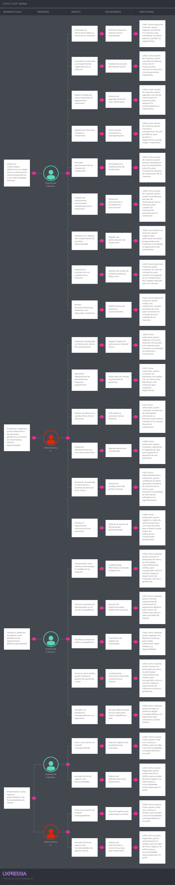

## **Capítulo III: Requirements Specification**

- 3.1. To-Be Scenario Mapping
#### Segmento objetivo 1 : Dueño de mascotas geriátricas o con enfermedad cronica

#### Segmento objetivo 2 : Veterinaria y clinicas especializadas

- 3.2. User Stories 

En esta sección se especifican los Epic Stories, User Stories y Technical Stories de **VetPax**, derivados de las necesidades identificadas para los segmentos objetivo: **dueños de mascotas geriátricas o con enfermedades crónicas** y **veterinarias o clínicas especializadas**. Las historias se redactan siguiendo el formato *Como [rol], quiero [necesidad], para [beneficio]*. Los criterios de aceptación se expresan mediante escenarios verificables en estructura Gherkin (*Dado–Cuando–Entonces*).

| Epic / User Story ID | Título | Descripción | Criterios de Aceptación | Relacionado con (Epic ID) |
|---|---|---|---|---|
| **EP01** | **Gestión del Historial Clínico** | Como veterinario, quiero registrar y consultar el historial clínico de cada mascota crónica o geriátrica, para dar continuidad al tratamiento entre consultas. | — | — |
| **US01** | Registrar mascota | **Como** dueño de mascota, **quiero** registrar el perfil de mi mascota, **para** centralizar sus datos básicos y facilitar su seguimiento. | **E01: Registro válido.** Dado que el dueño se encuentra autenticado y proporciona los datos obligatorios de la mascota, cuando registra la mascota, entonces el sistema crea el perfil y lo asocia con su cuenta.  **E02: Datos incompletos.** Dado que faltan datos obligatorios de la mascota, cuando el dueño intenta registrarla, entonces el sistema rechaza el registro e informa qué datos deben completarse.  **E03: Datos inválidos.** Dado que uno o más datos no cumplen las reglas de validación, cuando el dueño intenta registrar la mascota, entonces el sistema no crea el perfil y comunica el motivo del rechazo. | EP01 |
| **US02** | Consultar historial clínico | **Como** dueño de mascota, **quiero** consultar el historial clínico de mi mascota, **para** conocer su evolución y los tratamientos registrados. | **E01: Historial disponible.** Dado que la mascota posee atenciones clínicas registradas, cuando el dueño consulta su historial, entonces el sistema presenta los registros ordenados cronológicamente con fecha, diagnóstico, tratamiento y veterinario responsable.  **E02: Historial vacío.** Dado que la mascota no posee atenciones clínicas registradas, cuando el dueño consulta su historial, entonces el sistema informa que todavía no existen registros clínicos disponibles.  **E03: Acceso no autorizado.** Dado que un usuario intenta consultar el historial de una mascota que no está asociada a su cuenta, cuando realiza la consulta, entonces el sistema deniega el acceso. | EP01 |
| **US03** | Registrar atención clínica | **Como** veterinario, **quiero** registrar una nueva atención clínica para una mascota, **para** mantener actualizada su evolución y tratamiento. | **E01: Registro de atención.** Dado que el veterinario se encuentra autorizado para atender a la mascota y proporciona los datos clínicos obligatorios, cuando registra la atención, entonces el sistema incorpora el registro al historial clínico.  **E02: Información incompleta.** Dado que faltan datos clínicos obligatorios, cuando el veterinario intenta registrar la atención, entonces el sistema rechaza la operación e informa los datos pendientes.  **E03: Mascota inexistente.** Dado que la mascota indicada no existe, cuando el veterinario intenta registrar una atención, entonces el sistema no crea el registro e informa que el paciente no fue encontrado. | EP01 |
| **TS01** | API para registrar y consultar mascotas | **Como** desarrollador, **quiero** implementar servicios RESTful para registrar y consultar mascotas, **para** que las aplicaciones cliente puedan gestionar la información básica de los pacientes. | **E01: Registro correcto.** Dado que el endpoint `POST /api/v1/pets` está disponible y la solicitud contiene datos válidos, cuando se envía la solicitud, entonces el servicio registra la mascota y responde con `201 Created` y el recurso creado.  **E02: Solicitud inválida.** Dado que la solicitud contiene datos incompletos o inválidos, cuando se invoca el endpoint, entonces el servicio responde con `400 Bad Request` sin crear el recurso.  **E03: Consulta correcta.** Dado que existe una mascota asociada al identificador solicitado, cuando se invoca `GET /api/v1/pets/{petId}`, entonces el servicio responde con `200 OK` y los datos de la mascota. | EP01 |
| **TS02** | API para gestionar historial clínico | **Como** desarrollador, **quiero** implementar servicios RESTful para registrar y consultar atenciones clínicas, **para** que la aplicación mantenga trazabilidad del historial de cada mascota. | **E01: Creación de registro clínico.** Dado que existe la mascota y la solicitud contiene datos clínicos válidos, cuando se invoca `POST /api/v1/pets/{petId}/clinical-records`, entonces el servicio registra la atención y responde con `201 Created`.  **E02: Consulta del historial.** Dado que existen registros clínicos para la mascota, cuando se invoca `GET /api/v1/pets/{petId}/clinical-records`, entonces el servicio responde con `200 OK` y la colección ordenada cronológicamente.  **E03: Mascota inexistente.** Dado que el identificador de la mascota no existe, cuando se realiza una operación sobre su historial, entonces el servicio responde con `404 Not Found`. | EP01 |
| **EP02** | **Gestión de Citas y Agenda Veterinaria** | Como dueño de mascota, quiero agendar y dar seguimiento a las citas de control de mi mascota, para asegurar la continuidad del tratamiento sin depender de mi memoria. | — | — |
| **US04** | Agendar cita veterinaria | **Como** dueño de mascota, **quiero** agendar una cita de control para mi mascota, **para** asegurar la continuidad de su tratamiento. | **E01: Reserva disponible.** Dado que la veterinaria posee un horario disponible, cuando el dueño solicita una cita indicando mascota, fecha, hora y motivo, entonces el sistema registra la cita y la vincula con la agenda correspondiente.  **E02: Horario ocupado.** Dado que el horario solicitado ya se encuentra reservado, cuando el dueño intenta confirmar la cita, entonces el sistema rechaza la reserva e informa que el horario no está disponible.  **E03: Datos incompletos.** Dado que faltan datos obligatorios para la reserva, cuando el dueño intenta agendar la cita, entonces el sistema no registra la cita e informa los datos faltantes. | EP02 |
| **US05** | Cancelar o reprogramar cita | **Como** dueño de mascota, **quiero** cancelar o reprogramar una cita pendiente, **para** ajustar el seguimiento cuando surgen imprevistos. | **E01: Cancelación válida.** Dado que la cita se encuentra pendiente, cuando el dueño solicita su cancelación, entonces el sistema cambia su estado a cancelada y libera el horario.  **E02: Reprogramación válida.** Dado que existe un nuevo horario disponible, cuando el dueño solicita reprogramar una cita pendiente, entonces el sistema actualiza la fecha y hora sin duplicar el registro.  **E03: Cita no modificable.** Dado que la cita ya fue atendida o cancelada, cuando el dueño intenta modificarla, entonces el sistema rechaza la operación. | EP02 |
| **US06** | Gestionar agenda de citas | **Como** veterinario, **quiero** consultar y gestionar mi agenda de citas, **para** organizar la atención de mis pacientes. | **E01: Consulta de agenda.** Dado que el veterinario posee citas programadas, cuando consulta su agenda, entonces el sistema presenta las citas ordenadas por fecha y hora con la información necesaria del paciente.  **E02: Agenda sin citas.** Dado que el veterinario no posee citas programadas para el periodo consultado, cuando consulta su agenda, entonces el sistema informa que no existen citas programadas.  **E03: Actualización de estado.** Dado que existe una cita pendiente, cuando el veterinario registra que fue atendida, entonces el sistema actualiza el estado de la cita. | EP02 |
| **TS03** | API para gestionar citas veterinarias | **Como** desarrollador, **quiero** implementar servicios RESTful para crear, consultar, cancelar y reprogramar citas, **para** soportar la gestión de agenda desde las aplicaciones cliente. | **E01: Crear cita.** Dado que el horario está disponible y la solicitud es válida, cuando se invoca `POST /api/v1/appointments`, entonces el servicio crea la cita y responde con `201 Created`.  **E02: Conflicto de horario.** Dado que el horario ya está ocupado, cuando se intenta crear o reprogramar una cita, entonces el servicio responde con `409 Conflict`.  **E03: Actualizar cita.** Dado que existe una cita modificable, cuando se invoca `PATCH /api/v1/appointments/{appointmentId}`, entonces el servicio actualiza la cita y responde con `200 OK`. | EP02 |
| **TS04** | Integración de citas con servicio de calendario | **Como** desarrollador, **quiero** integrar las citas confirmadas con un servicio externo de calendario, **para** mantener sincronizada la agenda del veterinario. | **E01: Sincronización exitosa.** Dado que una cita ha sido confirmada y el servicio externo se encuentra disponible, cuando se solicita la sincronización, entonces el sistema crea o actualiza el evento externo y registra su identificador.  **E02: Falla del proveedor externo.** Dado que el servicio externo no está disponible, cuando se intenta sincronizar una cita, entonces el sistema conserva la cita interna y registra el fallo de integración sin perder información.  **E03: Reprogramación sincronizada.** Dado que una cita previamente sincronizada cambia de horario, cuando se procesa la actualización, entonces el sistema modifica el evento externo asociado. | EP02 |
| **EP03** | **Recordatorios de Medicación, Dieta y Notificaciones** | Como dueño de mascota, quiero recibir recordatorios de medicación y dieta según lo indicado por el veterinario, para mantener la continuidad del tratamiento. | — | — |
| **US07** | Configurar recordatorios de medicación | **Como** dueño de mascota, **quiero** activar recordatorios para un tratamiento prescrito, **para** recordar los horarios de medicación de mi mascota. | **E01: Activación válida.** Dado que existe un tratamiento activo con horarios definidos, cuando el dueño activa los recordatorios, entonces el sistema programa las notificaciones correspondientes.  **E02: Tratamiento sin horario.** Dado que el tratamiento no tiene horarios definidos, cuando el dueño intenta activar recordatorios, entonces el sistema informa que no es posible programarlos.  **E03: Desactivación.** Dado que existen recordatorios activos, cuando el dueño los desactiva, entonces el sistema deja de programar nuevas notificaciones para ese tratamiento. | EP03 |
| **US08** | Prescribir plan de dieta | **Como** veterinario, **quiero** registrar un plan de alimentación para una mascota, **para** que el dueño pueda seguir las indicaciones nutricionales establecidas. | **E01: Prescripción válida.** Dado que el veterinario atiende a una mascota y define alimento, cantidad y frecuencia, cuando registra el plan de alimentación, entonces el sistema lo asocia con la mascota.  **E02: Información incompleta.** Dado que faltan datos obligatorios del plan, cuando el veterinario intenta registrarlo, entonces el sistema rechaza la operación e informa los datos faltantes.  **E03: Actualización del plan.** Dado que existe un plan activo, cuando el veterinario registra una modificación válida, entonces el sistema actualiza el plan vigente conservando la trazabilidad del cambio. | EP03 |
| **US09** | Recibir recordatorios de alimentación | **Como** dueño de mascota, **quiero** recibir recordatorios del plan de alimentación de mi mascota, **para** cumplir las indicaciones prescritas por el veterinario. | **E01: Recordatorio programado.** Dado que existe un plan de alimentación activo con horario definido, cuando se alcanza el horario programado, entonces el sistema genera una notificación con la indicación correspondiente.  **E02: Plan inactivo.** Dado que el plan de alimentación se encuentra inactivo, cuando se alcanza un horario previamente configurado, entonces el sistema no genera una nueva notificación. | EP03 |
| **US18** | Registrar administración de medicación | **Como** dueño de mascota, **quiero** registrar que administré una dosis programada, **para** mantener actualizado el seguimiento del tratamiento. | **E01: Dosis administrada.** Dado que existe una dosis pendiente correspondiente a un tratamiento activo, cuando el dueño registra su administración, entonces el sistema almacena la fecha y hora de cumplimiento.  **E02: Registro duplicado.** Dado que una dosis ya fue registrada como administrada, cuando el dueño intenta marcarla nuevamente, entonces el sistema evita duplicar el cumplimiento.  **E03: Dosis no válida.** Dado que la dosis no pertenece a un tratamiento activo de la mascota, cuando se intenta registrar su cumplimiento, entonces el sistema rechaza la operación. | EP03 |
| **TS05** | API para gestionar tratamientos de medicación | **Como** desarrollador, **quiero** implementar servicios RESTful para consultar tratamientos y registrar el cumplimiento de dosis, **para** soportar el seguimiento de la medicación. | **E01: Consulta de tratamientos.** Dado que la mascota posee tratamientos activos, cuando se invoca `GET /api/v1/pets/{petId}/medication-plans`, entonces el servicio responde con `200 OK` y los tratamientos asociados.  **E02: Registrar dosis administrada.** Dado que existe una dosis pendiente, cuando se invoca `POST /api/v1/medication-doses/{doseId}/administrations`, entonces el servicio registra el cumplimiento y responde con `201 Created`.  **E03: Cumplimiento duplicado.** Dado que la dosis ya fue registrada, cuando se intenta registrarla nuevamente, entonces el servicio responde con `409 Conflict`. | EP03 |
| **TS06** | Integración de Firebase Cloud Messaging para notificaciones móviles | **Como** desarrollador, **quiero** integrar Firebase Cloud Messaging como servicio de notificaciones push, **para** enviar recordatorios de medicación, alimentación, citas y eventos relevantes del seguimiento clínico-nutricional. | **E01: Envío exitoso.** Dado que existe una notificación pendiente y el dispositivo posee un token válido, cuando el servicio procesa el envío mediante Firebase Cloud Messaging, entonces la notificación es enviada y se registra el estado de entrega.  **E02: Token inválido.** Dado que el token del dispositivo es inválido o expiró, cuando se intenta enviar la notificación, entonces el sistema registra el fallo y evita marcarla como entregada.  **E03: Servicio no disponible.** Dado que Firebase Cloud Messaging presenta una indisponibilidad temporal, cuando se intenta enviar una notificación, entonces el sistema registra el fallo para su posterior procesamiento. | EP03 |
| **TS07** | API para gestionar planes de alimentación | **Como** desarrollador, **quiero** implementar servicios RESTful para crear, consultar y actualizar planes de alimentación, **para** que la información nutricional pueda ser utilizada por las aplicaciones y el servicio de recordatorios. | **E01: Crear plan.** Dado que la solicitud contiene datos válidos y la mascota existe, cuando se invoca `POST /api/v1/pets/{petId}/nutrition-plans`, entonces el servicio crea el plan y responde con `201 Created`.  **E02: Consultar plan.** Dado que existe un plan activo, cuando se invoca `GET /api/v1/pets/{petId}/nutrition-plans/active`, entonces el servicio responde con `200 OK` y el plan vigente.  **E03: Datos inválidos.** Dado que la solicitud contiene una cantidad o frecuencia inválida, cuando se intenta registrar el plan, entonces el servicio responde con `400 Bad Request`. | EP03 |
| **EP04** | **Panel de Gestión de Pacientes para Veterinarias** | Como veterinario, quiero gestionar los pacientes crónicos o geriátricos de mi clínica desde una aplicación web, para mejorar el seguimiento clínico y la organización de la atención. | — | — |
| **US10** | Visualizar listado de pacientes | **Como** veterinario, **quiero** consultar los pacientes vinculados con mi clínica, **para** identificar a las mascotas que requieren seguimiento. | **E01: Pacientes disponibles.** Dado que existen pacientes vinculados a la clínica, cuando el veterinario consulta el listado, entonces el sistema presenta la información resumida de cada paciente.  **E02: Sin pacientes.** Dado que no existen pacientes vinculados a la clínica, cuando el veterinario consulta el listado, entonces el sistema informa que no hay pacientes disponibles.  **E03: Acceso restringido.** Dado que un veterinario intenta consultar pacientes de otra clínica sin autorización, cuando realiza la solicitud, entonces el sistema deniega el acceso. | EP04 |
| **US11** | Consultar evolución de un paciente | **Como** veterinario, **quiero** consultar la evolución de indicadores clínicos de un paciente, **para** evaluar cambios en su estado durante el tratamiento. | **E01: Datos históricos disponibles.** Dado que la mascota posee registros clínicos con indicadores comparables, cuando el veterinario consulta su evolución, entonces el sistema presenta la variación cronológica de los indicadores disponibles.  **E02: Datos insuficientes.** Dado que la mascota no posee información histórica suficiente, cuando el veterinario consulta su evolución, entonces el sistema informa que todavía no existen datos suficientes para mostrar una tendencia. | EP04 |
| **US12** | Gestionar perfil de la clínica | **Como** administrador de la veterinaria, **quiero** configurar los datos generales y horarios de atención de la clínica, **para** mantener actualizada la información utilizada en el agendamiento. | **E01: Actualización válida.** Dado que el administrador posee permisos y proporciona información válida, cuando actualiza el perfil de la clínica, entonces el sistema guarda los cambios.  **E02: Horario inválido.** Dado que los horarios registrados presentan inconsistencias, cuando el administrador intenta guardar los cambios, entonces el sistema rechaza la actualización e informa el motivo.  **E03: Usuario sin permisos.** Dado que un usuario sin rol administrativo intenta modificar el perfil de la clínica, cuando realiza la operación, entonces el sistema deniega la modificación. | EP04 |
| **TS08** | API para consultar pacientes y evolución clínica | **Como** desarrollador, **quiero** implementar servicios RESTful para consultar pacientes y sus indicadores históricos, **para** abastecer el panel web de seguimiento clínico. | **E01: Listado de pacientes.** Dado que el veterinario se encuentra autorizado, cuando se invoca `GET /api/v1/clinics/{clinicId}/patients`, entonces el servicio responde con `200 OK` y los pacientes vinculados.  **E02: Evolución clínica.** Dado que existen indicadores históricos del paciente, cuando se invoca `GET /api/v1/pets/{petId}/evolution`, entonces el servicio responde con `200 OK` y las series de datos disponibles.  **E03: Acceso no autorizado.** Dado que el solicitante no tiene acceso al paciente, cuando invoca cualquiera de los endpoints, entonces el servicio responde con `403 Forbidden`. | EP04 |
| **TS09** | API para gestionar información de la clínica | **Como** desarrollador, **quiero** implementar servicios RESTful para consultar y actualizar la información de una clínica, **para** soportar la configuración de horarios y datos institucionales. | **E01: Consulta correcta.** Dado que la clínica existe, cuando se invoca `GET /api/v1/clinics/{clinicId}`, entonces el servicio responde con `200 OK` y sus datos.  **E02: Actualización válida.** Dado que el solicitante posee permisos administrativos y los datos son válidos, cuando se invoca `PUT /api/v1/clinics/{clinicId}`, entonces el servicio actualiza la información y responde con `200 OK`.  **E03: Sin permisos.** Dado que el solicitante no posee permisos administrativos, cuando intenta actualizar la clínica, entonces el servicio responde con `403 Forbidden`. | EP04 |
| **EP05** | **Gamificación y Adherencia al Tratamiento** | Como dueño de mascota, quiero recibir reconocimiento por mantener constancia en el cuidado de mi mascota, para sentirme motivado a continuar el tratamiento. | — | — |
| **US13** | Visualizar nivel de constancia | **Como** dueño de mascota, **quiero** consultar mi nivel de constancia, **para** conocer mi progreso en el cumplimiento del cuidado indicado para mi mascota. | **E01: Nivel calculado.** Dado que existen registros de cumplimiento de citas y tratamientos en el periodo evaluado, cuando el dueño consulta su nivel, entonces el sistema presenta el nivel asignado según las reglas de adherencia vigentes y el progreso acumulado.  **E02: Información insuficiente.** Dado que todavía no existen registros suficientes para evaluar la constancia, cuando el dueño consulta su progreso, entonces el sistema informa que aún no es posible determinar un nivel definitivo. | EP05 |
| **US14** | Recibir reconocimiento por ascenso de nivel | **Como** dueño de mascota, **quiero** recibir una notificación cuando ascienda de nivel, **para** reconocer mi constancia en el cuidado de mi mascota. | **E01: Ascenso de nivel.** Dado que el indicador de adherencia alcanza el umbral definido para un nivel superior, cuando el sistema recalcula el progreso, entonces actualiza el nivel y genera una notificación de reconocimiento.  **E02: Sin cambio de nivel.** Dado que el indicador de adherencia permanece dentro del rango actual, cuando el sistema recalcula el progreso, entonces conserva el nivel y no genera una notificación de ascenso. | EP05 |
| **TS10** | Servicio de cálculo de adherencia | **Como** desarrollador, **quiero** implementar un servicio que calcule la adherencia del dueño a partir del cumplimiento registrado, **para** determinar de manera consistente su progreso y nivel de constancia. | **E01: Cálculo con información disponible.** Dado que existen citas y dosis evaluables en el periodo, cuando se ejecuta el cálculo de adherencia, entonces el servicio obtiene el porcentaje de cumplimiento y asigna el nivel conforme a las reglas vigentes.  **E02: Cambio de nivel.** Dado que el nuevo porcentaje supera el umbral del nivel actual, cuando se recalcula la adherencia, entonces el servicio registra el nuevo nivel y genera el evento correspondiente.  **E03: Sin datos evaluables.** Dado que no existen registros suficientes en el periodo, cuando se solicita el cálculo, entonces el servicio devuelve un resultado sin nivel definitivo y no genera un ascenso. | EP05 |
| **EP06** | **Presencia Digital y Captación de Usuarios** | Como visitante, quiero conocer la propuesta de valor de VetPax y acceder al producto adecuado para mi segmento, para decidir si deseo utilizar la solución. | — | — |
| **US15** | Landing Page informativa | **Como** visitante, **quiero** conocer la propuesta de valor y las principales características de VetPax, **para** comprender cómo la solución apoya el seguimiento de mascotas crónicas o geriátricas. | **E01: Información para dueños.** Dado que un visitante pertenece al segmento de dueños de mascotas, cuando consulta la información del producto, entonces puede conocer los beneficios relacionados con seguimiento, recordatorios, citas y continuidad del tratamiento.  **E02: Información para veterinarias.** Dado que un visitante pertenece al segmento de veterinarias, cuando consulta la información del producto, entonces puede conocer los beneficios relacionados con gestión de pacientes, agenda y seguimiento clínico.  **E03: Consistencia del contenido.** Dado que el visitante consulta la propuesta de VetPax, cuando revisa las distintas secciones informativas, entonces encuentra una descripción coherente con las funcionalidades de los productos digitales. | EP06 |
| **US16** | Registrar interés | **Como** visitante, **quiero** registrar mis datos de contacto, **para** recibir información sobre VetPax y su disponibilidad. | **E01: Registro válido.** Dado que el visitante proporciona los datos obligatorios en un formato válido, cuando registra su interés, entonces el sistema almacena el lead y confirma la operación.  **E02: Correo inválido.** Dado que el correo proporcionado no posee un formato válido, cuando el visitante intenta registrar su interés, entonces el sistema rechaza la operación.  **E03: Registro duplicado.** Dado que el correo ya se encuentra registrado, cuando el visitante vuelve a registrar su interés, entonces el sistema evita crear un duplicado e informa la situación. | EP06 |
| **US17** | Consultar testimonios | **Como** visitante, **quiero** conocer experiencias de usuarios de los segmentos objetivo, **para** contar con referencias sobre el valor percibido de VetPax. | **E01: Testimonios disponibles.** Dado que existen testimonios publicados, cuando el visitante consulta esta información, entonces el sistema presenta testimonios diferenciados por segmento.  **E02: Testimonio sin autorización de publicación.** Dado que un testimonio no cuenta con autorización para ser publicado, cuando se prepara el contenido visible de la Landing Page, entonces dicho testimonio no se incluye. | EP06 |
| **US19** | Acceder al producto desde la Landing Page | **Como** visitante, **quiero** acceder al producto digital correspondiente a mi segmento, **para** comenzar a utilizar VetPax. | **E01: Acceso para dueño.** Dado que el visitante pertenece al segmento de dueños de mascotas, cuando decide comenzar a utilizar VetPax, entonces el sistema lo dirige al punto de acceso o descarga correspondiente a la aplicación móvil.  **E02: Acceso para veterinaria.** Dado que el visitante pertenece al segmento de veterinarias, cuando decide comenzar a utilizar VetPax, entonces el sistema lo dirige al punto de acceso correspondiente a la aplicación web. | EP06 |
| **US20** | Registrarse en VetPax mediante autenticación segura | **Como** usuario nuevo, **quiero** crear una cuenta en VetPax mediante un proceso de autenticación segura, **para** acceder a las funcionalidades correspondientes a mi perfil dentro de la plataforma. | **E01: Registro válido.** Dado que el usuario proporciona los datos obligatorios y un correo no registrado, cuando solicita crear su cuenta, entonces el sistema registra la identidad del usuario mediante Keycloak y asigna el perfil correspondiente.  **E02: Correo existente.** Dado que el correo ya pertenece a una cuenta registrada, cuando el usuario intenta crear una nueva cuenta, entonces el sistema rechaza el registro e informa que el usuario ya existe.  **E03: Datos inválidos.** Dado que los datos proporcionados no cumplen las reglas de validación, cuando el usuario intenta registrarse, entonces el sistema rechaza la operación e informa los campos requeridos. | EP06 |
| **US21** | Iniciar sesión mediante autenticación segura | **Como** usuario registrado, **quiero** autenticarme en VetPax mediante un mecanismo seguro, **para** acceder a la información clínica y funcionalidades autorizadas según mi perfil. | **E01: Credenciales válidas.** Dado que el usuario posee credenciales correctas registradas en Keycloak, cuando solicita iniciar sesión, entonces el sistema valida la identidad y permite el acceso correspondiente.  **E02: Credenciales incorrectas.** Dado que el usuario proporciona credenciales inválidas, cuando intenta autenticarse, entonces el sistema rechaza el acceso sin exponer información sensible.  **E03: Sesión expirada.** Dado que la sesión del usuario ha superado el tiempo de validez establecido, cuando intenta acceder a un recurso protegido, entonces el sistema solicita una nueva autenticación. | EP06 |
| **US22** | Gestionar acceso según rol de usuario | **Como** usuario autenticado, **quiero** acceder únicamente a las funcionalidades correspondientes a mi rol, **para** proteger la información clínica y mantener un control adecuado de permisos dentro de VetPax. | **E01: Acceso permitido.** Dado que el usuario posee permisos asociados a su rol, cuando solicita una funcionalidad autorizada, entonces el sistema permite el acceso al recurso correspondiente.  **E02: Acceso restringido.** Dado que el usuario intenta acceder a una funcionalidad no disponible para su rol, cuando realiza la solicitud, entonces el sistema deniega el acceso.  **E03: Roles actualizados.** Dado que un administrador modifica los permisos de un usuario, cuando este inicia una nueva sesión, entonces el sistema aplica los permisos actualizados. | EP06 |
| **TS11** | API para registrar leads | **Como** desarrollador, **quiero** implementar un servicio RESTful para registrar interesados provenientes de la Landing Page, **para** almacenar los contactos potenciales de VetPax. | **E01: Lead válido.** Dado que el endpoint `POST /api/v1/leads` está disponible y la solicitud contiene un correo válido, cuando se envía la solicitud, entonces el servicio registra el lead y responde con `201 Created`.  **E02: Datos inválidos.** Dado que el correo no cumple el formato requerido, cuando se envía la solicitud, entonces el servicio responde con `400 Bad Request`.  **E03: Lead duplicado.** Dado que el correo ya se encuentra registrado, cuando se envía una nueva solicitud con el mismo correo, entonces el servicio evita duplicar el registro y responde con el resultado definido por la regla de negocio. | EP06 |
| **TS12** | Implementación de autenticación y autorización mediante Keycloak | **Como** desarrollador, **quiero** integrar Keycloak como proveedor de identidad y control de acceso, **para** gestionar autenticación segura, roles y permisos de dueños, veterinarios y administradores. | **E01: Autenticación correcta.** Dado que el usuario posee credenciales válidas registradas en Keycloak, cuando inicia sesión mediante la plataforma, entonces el sistema valida su identidad y genera el mecanismo de acceso correspondiente.  **E02: Control de roles.** Dado que el usuario posee un rol asignado, cuando intenta acceder a un recurso protegido, entonces el sistema permite o restringe la operación según sus permisos.  **E03: Recurso no autorizado.** Dado que un usuario autenticado no posee permisos suficientes, cuando intenta acceder a una funcionalidad restringida, entonces el sistema rechaza la solicitud con autorización denegada. | EP06 |
| **TS13** | Implementación de comunicación en tiempo real mediante WebSockets | **Como** desarrollador, **quiero** implementar comunicación bidireccional mediante WebSockets, **para** sincronizar actualizaciones clínicas, cambios de tratamiento y eventos relevantes entre la aplicación móvil del dueño y el panel web veterinario. | **E01: Conexión establecida.** Dado que un usuario autenticado accede a la plataforma, cuando establece conexión WebSocket, entonces el sistema mantiene un canal activo de comunicación en tiempo real.  **E02: Actualización clínica inmediata.** Dado que un veterinario registra o modifica información clínica, cuando se confirma el cambio, entonces el sistema envía la actualización a los usuarios autorizados conectados.  **E03: Reconexión controlada.** Dado que un cliente pierde conexión, cuando intenta reconectarse, entonces el sistema restablece la comunicación sin pérdida de información pendiente. | EP01 / EP03 / EP04 |

- 3.3. Impact Mapping

- 3.4. Product Backlog

El Product Backlog de VetPax organiza y prioriza las historias de acuerdo con el **valor aportado al negocio y a los segmentos objetivo**. La priorización considera desde el primer sprint las historias asociadas con la Landing Page, conforme a las disposiciones del enunciado del curso. Las historias relacionadas con autenticación y seguridad se incluyen en el backlog, pero no se ubican automáticamente en las primeras posiciones, ya que el orden responde principalmente al valor de negocio.

| # Orden | User Story Id | Título | Descripción | Story Points |
|:---:|:---:|---|---|:---:|
| 1 | US15 | Landing Page informativa | Como visitante, quiero conocer la propuesta de valor y las principales características de VetPax, para comprender cómo la solución apoya el seguimiento de mascotas crónicas o geriátricas. | 3 |
| 2 | US19 | Acceder al producto desde la Landing Page | Como visitante, quiero acceder al producto digital correspondiente a mi segmento, para comenzar a utilizar VetPax. | 2 |
| 3 | TS14 | Implementación de arquitectura hexagonal del backend | Como desarrollador, quiero estructurar el backend bajo arquitectura hexagonal, para separar la lógica de negocio de las tecnologías externas y facilitar la mantenibilidad del sistema. | 5 |
| 4 | TS12 | Implementación de autenticación y autorización mediante Keycloak | Como desarrollador, quiero integrar Keycloak como proveedor de identidad, para gestionar autenticación segura, roles y permisos de acceso para dueños de mascotas, veterinarios y administradores. | 5 |
| 5 | US20 | Registrarse en VetPax mediante autenticación segura | Como usuario nuevo, quiero crear una cuenta en VetPax mediante un proceso seguro, para acceder a las funcionalidades correspondientes a mi perfil. | 3 |
| 6 | US21 | Iniciar sesión mediante autenticación segura | Como usuario registrado, quiero autenticarme en VetPax mediante un mecanismo seguro, para acceder a la información y funcionalidades autorizadas según mi perfil. | 3 |
| 7 | US22 | Gestionar acceso según rol de usuario | Como usuario autenticado, quiero acceder únicamente a las funcionalidades correspondientes a mi rol, para proteger la información clínica y controlar los permisos dentro de VetPax. | 3 |
| 8 | US01 | Registrar mascota | Como dueño de mascota, quiero registrar el perfil de mi mascota, para centralizar sus datos básicos y facilitar su seguimiento. | 5 |
| 9 | TS01 | API para registrar y consultar mascotas | Como desarrollador, quiero implementar servicios RESTful para registrar y consultar mascotas, para que las aplicaciones cliente puedan gestionar la información básica de los pacientes. | 5 |
| 10 | US03 | Registrar atención clínica | Como veterinario, quiero registrar una nueva atención clínica para una mascota, para mantener actualizada su evolución y tratamiento. | 5 |
| 11 | TS02 | API para gestionar historial clínico | Como desarrollador, quiero implementar servicios RESTful para registrar y consultar atenciones clínicas, para que la aplicación mantenga trazabilidad del historial de cada mascota. | 5 |
| 12 | US02 | Consultar historial clínico | Como dueño de mascota, quiero consultar el historial clínico de mi mascota, para conocer su evolución y los tratamientos registrados. | 3 |
| 13 | TS13 | Implementación de comunicación en tiempo real mediante WebSockets | Como desarrollador, quiero implementar un canal de comunicación bidireccional mediante WebSockets, para sincronizar actualizaciones clínicas, cambios en tratamientos y eventos relevantes entre la aplicación móvil del dueño y el panel web veterinario. | 5 |
| 14 | US04 | Agendar cita veterinaria | Como dueño de mascota, quiero agendar una cita de control para mi mascota, para asegurar la continuidad de su tratamiento. | 5 |
| 15 | TS03 | API para gestionar citas veterinarias | Como desarrollador, quiero implementar servicios RESTful para crear, consultar, cancelar y reprogramar citas, para soportar la gestión de agenda desde las aplicaciones cliente. | 5 |
| 16 | US07 | Configurar recordatorios de medicación | Como dueño de mascota, quiero activar recordatorios para un tratamiento prescrito, para recordar los horarios de medicación de mi mascota. | 5 |
| 17 | US18 | Registrar administración de medicación | Como dueño de mascota, quiero registrar que administré una dosis programada, para mantener actualizado el seguimiento del tratamiento. | 3 |
| 18 | TS05 | API para gestionar tratamientos de medicación | Como desarrollador, quiero implementar servicios RESTful para consultar tratamientos y registrar el cumplimiento de dosis, para soportar el seguimiento de la medicación. | 5 |
| 19 | TS06 | Integración de Firebase Cloud Messaging para notificaciones móviles | Como desarrollador, quiero integrar Firebase Cloud Messaging como servicio de notificaciones push, para enviar recordatorios de medicación, alimentación, citas y eventos relevantes del seguimiento clínico-nutricional. | 5 |
| 20 | US08 | Prescribir plan de dieta | Como veterinario, quiero registrar un plan de alimentación para una mascota, para que el dueño pueda seguir las indicaciones nutricionales establecidas. | 3 |
| 21 | TS07 | API para gestionar planes de alimentación | Como desarrollador, quiero implementar servicios RESTful para crear, consultar y actualizar planes de alimentación, para que la información nutricional pueda ser utilizada por las aplicaciones y el servicio de recordatorios. | 5 |
| 22 | US09 | Recibir recordatorios de alimentación | Como dueño de mascota, quiero recibir recordatorios del plan de alimentación de mi mascota, para cumplir las indicaciones prescritas por el veterinario. | 3 |
| 23 | US10 | Visualizar listado de pacientes | Como veterinario, quiero consultar los pacientes vinculados con mi clínica, para identificar a las mascotas que requieren seguimiento. | 5 |
| 24 | TS08 | API para consultar pacientes y evolución clínica | Como desarrollador, quiero implementar servicios RESTful para consultar pacientes y sus indicadores históricos, para abastecer el panel web de seguimiento clínico. | 5 |
| 25 | US11 | Consultar evolución de un paciente | Como veterinario, quiero consultar la evolución de indicadores clínicos de un paciente, para evaluar cambios en su estado durante el tratamiento. | 5 |
| 26 | US06 | Gestionar agenda de citas | Como veterinario, quiero consultar y gestionar mi agenda de citas, para organizar la atención de mis pacientes. | 3 |
| 27 | TS04 | Integración de citas con servicio de calendario | Como desarrollador, quiero integrar las citas confirmadas con un servicio externo de calendario, para mantener sincronizada la agenda del veterinario. | 5 |
| 28 | US05 | Cancelar o reprogramar cita | Como dueño de mascota, quiero cancelar o reprogramar una cita pendiente, para ajustar el seguimiento cuando surgen imprevistos. | 3 |
| 29 | US12 | Gestionar perfil de la clínica | Como administrador de la veterinaria, quiero configurar los datos generales y horarios de atención de la clínica, para mantener actualizada la información utilizada en el agendamiento. | 3 |
| 30 | TS09 | API para gestionar información de la clínica | Como desarrollador, quiero implementar servicios RESTful para consultar y actualizar la información de una clínica, para soportar la configuración de horarios y datos institucionales. | 3 |
| 31 | US13 | Visualizar nivel de constancia | Como dueño de mascota, quiero consultar mi nivel de constancia, para conocer mi progreso en el cumplimiento del cuidado indicado para mi mascota. | 3 |
| 32 | TS10 | Servicio de cálculo de adherencia | Como desarrollador, quiero implementar un servicio que calcule la adherencia del dueño a partir del cumplimiento registrado, para determinar de manera consistente su progreso y nivel de constancia. | 5 |
| 33 | US14 | Recibir reconocimiento por ascenso de nivel | Como dueño de mascota, quiero recibir una notificación cuando ascienda de nivel, para reconocer mi constancia en el cuidado de mi mascota. | 2 |
| 34 | US16 | Registrar interés | Como visitante, quiero registrar mis datos de contacto, para recibir información sobre VetPax y su disponibilidad. | 2 |
| 35 | TS11 | API para registrar leads | Como desarrollador, quiero implementar un servicio RESTful para registrar interesados provenientes de la Landing Page, para almacenar los contactos potenciales de VetPax. | 3 |
| 36 | US17 | Consultar testimonios | Como visitante, quiero conocer experiencias de usuarios de los segmentos objetivo, para contar con referencias sobre el valor percibido de VetPax. | 1 |
