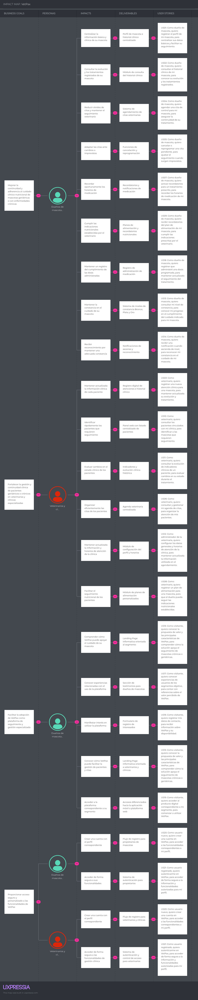

# **Capítulo III: Requirements Specification**

## 3.1. To-Be Scenario Mapping
#### Segmento objetivo 1 : Dueño de mascotas geriátricas o con enfermedad cronica

#### Segmento objetivo 2 : Veterinaria y clinicas especializadas

## 3.2. User Stories

En esta sección se especifican los requisitos funcionales y no funcionales de VetPax, así como los Epic Stories, User Stories y Technical Stories derivados del proceso de Requirements Elicitation & Analysis.

Los requisitos funcionales establecen las capacidades que debe proporcionar la solución para soportar el seguimiento clínico y nutricional de mascotas geriátricas o con enfermedades crónicas, así como la interacción entre propietarios y profesionales veterinarios.

Por otro lado, los requisitos no funcionales establecen las condiciones de calidad bajo las cuales debe operar la plataforma, considerando principalmente seguridad, disponibilidad, rendimiento, escalabilidad, mantenibilidad e interoperabilidad.

Las User Stories se redactan siguiendo el formato **Como [rol], quiero [necesidad], para [beneficio]**, mientras que sus criterios de aceptación se expresan mediante escenarios verificables utilizando la estructura **Dado – Cuando – Entonces**.

### 3.2.1. Requisitos Funcionales

Los requisitos funcionales establecen las capacidades que VetPax debe proporcionar para soportar el seguimiento clínico y nutricional de mascotas geriátricas o con enfermedades crónicas, así como la interacción entre propietarios y profesionales veterinarios.

Para cada requisito se establece una métrica o criterio de cumplimiento verificable que permita comprobar que la funcionalidad esperada ha sido implementada correctamente.

| **ID** | **Título** | **Descripción** | **Métrica / Criterio de cumplimiento** | **Relacionado con** |
|---|---|---|---|---|
| **RF-01** | Registro de usuario | El sistema debe permitir que propietarios y profesionales veterinarios creen una cuenta utilizando información válida. | Una solicitud con todos los datos obligatorios válidos y un correo no registrado debe generar una cuenta asociada al usuario. Una solicitud inválida no debe crear la cuenta. | US20 |
| **RF-02** | Autenticación de usuario | El sistema debe permitir que los usuarios registrados inicien sesión mediante credenciales válidas. | Las credenciales válidas deben permitir el acceso a la cuenta correspondiente, mientras que las credenciales inválidas deben ser rechazadas sin exponer información sensible. | US21 |
| **RF-03** | Recuperación de acceso | El sistema debe permitir que un usuario registrado recupere el acceso a su cuenta mediante un mecanismo de restablecimiento de contraseña. | Una solicitud válida asociada a una cuenta registrada debe iniciar el flujo de recuperación. Los enlaces o mecanismos expirados no deben permitir modificar la contraseña. | US22 |
| **RF-04** | Control de acceso por roles | El sistema debe restringir las funcionalidades e información disponibles de acuerdo con el rol asignado al usuario. | Antes de acceder a un recurso protegido, el sistema debe verificar el rol y permisos del usuario y rechazar la operación cuando no posea autorización. | TS12 |
| **RF-05** | Registro de mascota | El sistema debe permitir que un propietario registre una mascota asociada a su cuenta. | Una solicitud con los datos obligatorios válidos debe crear la mascota y asociarla al propietario autenticado. Una solicitud incompleta o inválida no debe crear el registro. | US01 |
| **RF-06** | Consulta de historial clínico | El sistema debe permitir que los usuarios autorizados consulten el historial clínico de una mascota. | La consulta debe retornar todos los registros clínicos asociados a la mascota a los que el usuario tenga autorización, ordenados cronológicamente. | US02 |
| **RF-07** | Registro de atención clínica | El sistema debe permitir que un profesional veterinario registre consultas, diagnósticos, tratamientos e indicaciones asociados a una mascota. | Una atención válida debe quedar asociada a la mascota e incluir como mínimo la fecha, el profesional responsable y la información clínica requerida. | US03 |
| **RF-08** | Agendamiento de cita veterinaria | El sistema debe permitir que un propietario programe una cita veterinaria para su mascota. | Una solicitud válida sobre un horario disponible debe crear una cita. El sistema no debe permitir dos reservas incompatibles para el mismo horario. | US04 |
| **RF-09** | Cancelación y reprogramación de citas | El sistema debe permitir modificar o cancelar una cita pendiente según la disponibilidad existente. | Al cancelar una cita pendiente, su horario debe quedar disponible nuevamente. Una reprogramación debe actualizar la cita existente sin crear registros duplicados. | US05 |
| **RF-10** | Gestión de agenda veterinaria | El sistema debe permitir que los profesionales veterinarios consulten y gestionen las citas programadas. | La agenda debe mostrar las citas asociadas al profesional dentro del periodo consultado y reflejar el estado actualizado de cada cita. | US06 |
| **RF-11** | Recordatorios de citas | El sistema debe notificar al propietario sobre próximas citas veterinarias programadas. | Una cita activa con recordatorio configurado debe generar el evento de notificación antes de la fecha programada. Una cita cancelada no debe generar nuevos recordatorios. | US23 |
| **RF-12** | Registro de tratamiento de medicación | El sistema debe permitir que un profesional veterinario registre medicamentos, dosis, frecuencia y duración de un tratamiento. | Un tratamiento válido debe quedar asociado a la mascota e incluir como mínimo medicamento, dosis, frecuencia y periodo de administración. | US17 |
| **RF-13** | Recordatorios de medicación | El sistema debe generar recordatorios asociados con los horarios definidos en un tratamiento activo. | Un tratamiento activo con horarios definidos y recordatorios habilitados debe generar los eventos correspondientes en los horarios establecidos. | US07 |
| **RF-14** | Registro de administración de medicación | El sistema debe permitir que el propietario registre el cumplimiento de una dosis programada. | El registro debe almacenar la fecha y hora de administración de la dosis y no debe permitir duplicar el cumplimiento de una misma dosis programada. | US18 |
| **RF-15** | Registro de plan de alimentación | El sistema debe permitir que el profesional veterinario registre y actualice un plan de alimentación asociado a una mascota. | Un plan válido debe quedar asociado a la mascota e incluir como mínimo alimento, cantidad y frecuencia. Las modificaciones deben conservar la información necesaria para identificar el plan vigente. | US08 |
| **RF-16** | Consulta de plan de alimentación | El sistema debe permitir que el propietario consulte las indicaciones del plan de alimentación vigente de su mascota. | Cuando exista un plan activo, la consulta debe mostrar las indicaciones registradas, incluyendo alimento, cantidad, frecuencia y recomendaciones disponibles. | US24 |
| **RF-17** | Recordatorios de alimentación | El sistema debe generar recordatorios de acuerdo con los horarios establecidos en un plan de alimentación activo. | Un plan activo con horarios y recordatorios habilitados debe generar los eventos correspondientes. Un plan inactivo no debe generar nuevos recordatorios. | US09 |
| **RF-18** | Consulta de pacientes | El sistema debe permitir que los profesionales veterinarios visualicen los pacientes asociados a su clínica. | El profesional debe visualizar únicamente los pacientes vinculados con su clínica y para los cuales posea autorización. | US10 |
| **RF-19** | Consulta de evolución clínica | El sistema debe permitir visualizar la evolución clínica de una mascota utilizando la información registrada durante su tratamiento. | Cuando existan registros históricos comparables, la consulta debe presentar la evolución cronológica del paciente utilizando los datos disponibles. | US11 |
| **RF-20** | Gestión de información de la clínica | El sistema debe permitir que un administrador autorizado actualice los datos generales y horarios de atención de una clínica. | Los cambios válidos realizados por un administrador autorizado deben quedar almacenados y ser utilizados posteriormente por las funcionalidades relacionadas con la clínica. | US12 |
| **RF-21** | Cálculo de constancia | El sistema debe calcular el nivel de constancia del propietario utilizando las actividades de cuidado registradas. | El cálculo debe utilizar las reglas vigentes y los registros de actividades evaluables correspondientes al periodo analizado. | US13 |
| **RF-22** | Reconocimiento por nivel | El sistema debe informar al propietario cuando alcance un nuevo nivel dentro del mecanismo de gamificación. | Cuando el cálculo de constancia supere el umbral establecido para un nuevo nivel, el sistema debe actualizar el nivel del propietario y generar el evento de reconocimiento correspondiente. | US14 |
| **RF-23** | Visualización de información de VetPax | La Landing Page debe presentar la propuesta de valor y principales características de VetPax para ambos segmentos objetivo. | La Landing Page debe contener información diferenciada para propietarios y para el segmento veterinario, incluyendo propuesta de valor, funcionalidades principales y mecanismos de acceso al producto. | US15 |
| **RF-24** | Registro de interesados | La Landing Page debe permitir que un visitante registre sus datos de contacto para recibir información sobre VetPax. | Un formulario con datos válidos debe registrar al interesado y confirmar la operación. El sistema no debe crear registros duplicados para el mismo correo cuando la regla de negocio así lo determine. | US16 |
| **RF-25** | Acceso al producto desde la Landing Page | La Landing Page debe proporcionar mecanismos para dirigir al visitante hacia el producto digital correspondiente a su segmento. | El acceso destinado a propietarios debe dirigir al producto móvil y el acceso destinado al segmento veterinario debe dirigir a la aplicación web correspondiente. | US19 |
| **RF-26** | Sincronización de información | El sistema debe reflejar las actualizaciones clínicas relevantes entre la aplicación móvil y la aplicación web para los usuarios autorizados. | Una actualización confirmada debe quedar persistida y posteriormente ser consultable desde ambos productos digitales por los usuarios que posean autorización. | TS13 |

### 3.2.2. Requisitos No Funcionales

Los requisitos no funcionales establecen las condiciones de calidad bajo las cuales debe operar VetPax. Se consideran aspectos relacionados con seguridad, disponibilidad, rendimiento, escalabilidad, mantenibilidad, interoperabilidad, integridad, trazabilidad, usabilidad y compatibilidad.

Cada requisito incluye una métrica cuantificable o un criterio objetivo de verificación que permita evaluar su cumplimiento.

| **ID** | **Título** | **Descripción** | **Métrica / Criterio de cumplimiento** |
|---|---|---|---|
| **RNF-01** | Seguridad de autenticación y autorización | El sistema debe validar la identidad y los permisos del usuario antes de permitir el acceso a recursos protegidos. | El **100% de las solicitudes dirigidas a recursos protegidos** debe pasar por validación de autenticación y autorización. Los accesos no autenticados o no autorizados deben ser rechazados mediante respuestas **401 o 403**, según corresponda. |
| **RNF-02** | Protección de datos en tránsito | La comunicación entre los clientes, backend y servicios externos debe utilizar mecanismos de comunicación cifrada. | El **100% del tráfico externo que transporte información de VetPax** debe utilizar **HTTPS con TLS 1.2 o superior**, o un mecanismo equivalente de comunicación cifrada. |
| **RNF-03** | Disponibilidad | Los servicios principales de VetPax deben permanecer disponibles durante la operación habitual de propietarios y profesionales veterinarios. | El sistema debe mantener una disponibilidad mensual mínima de **99%**, excluyendo periodos de mantenimiento planificado. |
| **RNF-04** | Rendimiento de operaciones frecuentes | Las operaciones habituales de consulta y registro deben responder sin generar retrasos significativos para el usuario. | Al menos el **95% de las solicitudes de consulta y registro** debe completarse en un tiempo menor o igual a **2 segundos** bajo condiciones normales de operación. |
| **RNF-05** | Sincronización en tiempo real | Las actualizaciones clínicas relevantes deben comunicarse oportunamente a los clientes autorizados que se encuentren conectados. | Al menos el **95% de las actualizaciones enviadas en tiempo real** debe reflejarse en los clientes conectados en un tiempo menor o igual a **3 segundos** después de confirmarse el cambio. |
| **RNF-06** | Escalabilidad | El sistema debe permitir incrementar la cantidad de usuarios y solicitudes concurrentes sin modificar la lógica principal del dominio. | En una prueba de carga con al menos **500 usuarios concurrentes**, el **95% de las solicitudes** debe mantener un tiempo de respuesta menor o igual a **3 segundos**. |
| **RNF-07** | Mantenibilidad | La lógica del dominio debe permanecer desacoplada de frameworks, mecanismos de persistencia y proveedores externos. | La sustitución de un proveedor externo que implemente el mismo contrato debe requerir **0 modificaciones en las reglas de negocio del dominio**, limitando los cambios a adaptadores y configuración de infraestructura. |
| **RNF-08** | Interoperabilidad | Los productos digitales de VetPax deben comunicarse con el backend y servicios externos mediante interfaces estandarizadas. | El **100% de los servicios HTTP expuestos para los clientes de VetPax** debe utilizar interfaces RESTful y **JSON** como formato principal de intercambio de información. |
| **RNF-09** | Integridad de información clínica | Las operaciones relacionadas con historial clínico, tratamientos y planes de alimentación deben preservar la consistencia de los datos. | El **100% de las operaciones transaccionales** debe completarse íntegramente o revertirse ante un error, sin dejar información clínica en un estado parcial. |
| **RNF-10** | Trazabilidad de información clínica | Las modificaciones relevantes realizadas sobre la información clínica deben poder asociarse con el usuario y momento en que fueron ejecutadas. | El **100% de los registros y modificaciones clínicas** debe almacenar como mínimo el identificador del usuario responsable y la **fecha y hora** de la operación. |
| **RNF-11** | Usabilidad | Las funcionalidades de uso frecuente deben poder alcanzarse sin una secuencia extensa de navegación. | Las funcionalidades principales de historial clínico, tratamiento, citas y pacientes deben ser accesibles en un máximo de **3 interacciones** desde la pantalla principal posterior a la autenticación. |
| **RNF-12** | Compatibilidad multiplataforma | VetPax debe funcionar mediante una aplicación móvil dirigida a propietarios y una aplicación web dirigida al segmento veterinario. | La aplicación móvil debe funcionar en las versiones de **Android definidas como soportadas por el proyecto**, mientras que la aplicación web debe funcionar correctamente en las **2 versiones estables más recientes de Chrome, Edge y Firefox**. |
| **RNF-13** | Manejo de fallos de servicios externos | La indisponibilidad temporal de un proveedor externo no debe provocar pérdida de información ni comprometer otros módulos de VetPax. | Ante una falla controlada de una integración externa, el sistema debe registrar el incidente, conservar los datos persistidos y evitar que la falla se propague hacia funcionalidades que no dependan del servicio afectado. |
| **RNF-14** | Privacidad de información clínica | La información clínica de una mascota únicamente debe estar disponible para usuarios autorizados sobre el paciente correspondiente. | El **100% de los intentos detectados como no autorizados** para consultar información clínica protegida debe ser rechazado. |

### 3.2.3. Especificación de Epic Stories, User Stories y Technical Stories

| **Epic / User / Technical Story ID** | **Título** | **Descripción** | **Criterios de Aceptación** | **Relacionado con (Epic ID)** |
|---|---|---|---|---|
| **EP01** | **Gestión del Historial Clínico** | Como profesional veterinario, quiero registrar y consultar información clínica de las mascotas, para mantener la continuidad del seguimiento entre consultas. | — | — |
| **US01** | Registrar mascota | Como propietario de mascota, quiero registrar a mi mascota, para mantener organizada su información básica y facilitar su seguimiento. | **E01: Registro válido.** Dado que el propietario se encuentra autenticado y proporciona los datos obligatorios, cuando registra la mascota, entonces el sistema crea el perfil y lo asocia con su cuenta.  **E02: Datos incompletos.** Dado que faltan datos obligatorios, cuando intenta registrar la mascota, entonces el sistema rechaza la operación e informa los campos pendientes. | EP01 |
| **US02** | Consultar historial clínico | Como propietario de mascota, quiero consultar el historial clínico de mi mascota, para conocer su evolución y los tratamientos registrados. | **E01: Historial disponible.** Dado que existen registros clínicos de la mascota, cuando el propietario consulta el historial, entonces el sistema muestra las atenciones ordenadas cronológicamente.  **E02: Historial vacío.** Dado que no existen registros clínicos, cuando realiza la consulta, entonces el sistema informa que todavía no existe información disponible.  **E03: Acceso no autorizado.** Dado que el usuario no posee autorización sobre la mascota, cuando solicita el historial, entonces el sistema deniega el acceso. | EP01 |
| **US03** | Registrar atención clínica | Como profesional veterinario, quiero registrar una atención clínica de una mascota, para mantener actualizada su evolución y tratamiento. | **E01: Registro válido.** Dado que el profesional se encuentra autorizado y proporciona los datos clínicos requeridos, cuando registra la atención, entonces el sistema la incorpora al historial clínico.  **E02: Información incompleta.** Dado que faltan datos obligatorios, cuando intenta registrar la atención, entonces el sistema rechaza la operación e informa los datos pendientes. | EP01 |
| **TS01** | API para gestión de mascotas | Como desarrollador, quiero implementar servicios RESTful para registrar y consultar mascotas, para soportar la gestión de información básica de los pacientes. | **E01: Registro correcto.** Dado que la solicitud contiene datos válidos, cuando se invoca `POST /api/v1/pets`, entonces el servicio registra la mascota y responde `201 Created`.  **E02: Consulta correcta.** Dado que la mascota existe, cuando se invoca `GET /api/v1/pets/{petId}`, entonces el servicio responde `200 OK` con sus datos.  **E03: Mascota inexistente.** Dado que el identificador no existe, cuando se realiza la consulta, entonces responde `404 Not Found`. | EP01 |
| **TS02** | API para historial clínico | Como desarrollador, quiero implementar servicios RESTful para registrar y consultar atenciones clínicas, para conservar la trazabilidad del historial de cada mascota. | **E01: Registro clínico.** Dado que la mascota existe y los datos son válidos, cuando se invoca el servicio de registro, entonces almacena la atención y responde `201 Created`.  **E02: Consulta del historial.** Dado que existen registros clínicos, cuando se consulta el historial, entonces responde `200 OK` con los registros ordenados cronológicamente.  **E03: Acceso restringido.** Dado que el usuario no posee permisos sobre el paciente, cuando solicita el recurso, entonces responde `403 Forbidden`. | EP01 |
| **EP02** | **Gestión de Citas y Agenda Veterinaria** | Como usuario de VetPax, quiero organizar las citas veterinarias y controles programados, para mantener la continuidad de la atención de las mascotas. | — | — |
| **US04** | Agendar cita veterinaria | Como propietario de mascota, quiero agendar una cita veterinaria para mi mascota, para asegurar la continuidad de sus controles. | **E01: Reserva disponible.** Dado que existe un horario disponible, cuando el propietario selecciona mascota, fecha, hora y motivo, entonces el sistema registra la cita.  **E02: Horario ocupado.** Dado que el horario solicitado ya se encuentra reservado, cuando intenta confirmar la cita, entonces el sistema informa que no está disponible.  **E03: Datos incompletos.** Dado que faltan datos obligatorios, cuando intenta realizar la reserva, entonces el sistema rechaza la operación. | EP02 |
| **US05** | Cancelar o reprogramar cita | Como propietario de mascota, quiero cancelar o reprogramar una cita pendiente, para adaptar el seguimiento cuando surjan imprevistos. | **E01: Cancelación válida.** Dado que la cita se encuentra pendiente, cuando el propietario solicita cancelarla, entonces el sistema actualiza su estado y libera el horario.  **E02: Reprogramación válida.** Dado que existe un nuevo horario disponible, cuando solicita la reprogramación, entonces el sistema actualiza la fecha y hora.  **E03: Cita no modificable.** Dado que la cita ya fue atendida o cancelada, cuando intenta modificarla, entonces el sistema rechaza la operación. | EP02 |
| **US06** | Gestionar agenda de citas | Como profesional veterinario, quiero consultar y gestionar mi agenda de citas, para organizar la atención de los pacientes. | **E01: Consulta de agenda.** Dado que existen citas programadas, cuando el profesional consulta su agenda, entonces el sistema muestra las citas ordenadas por fecha y hora.  **E02: Agenda vacía.** Dado que no existen citas para el periodo seleccionado, cuando realiza la consulta, entonces el sistema informa que no existen citas programadas.  **E03: Actualización de estado.** Dado que una cita fue atendida, cuando actualiza su estado, entonces el sistema registra el cambio. | EP02 |
| **US23** | Recibir recordatorio de cita | Como propietario de mascota, quiero recibir un recordatorio antes de una cita programada, para reducir el riesgo de olvidar el control veterinario. | **E01: Recordatorio programado.** Dado que existe una cita pendiente, cuando se aproxima la fecha configurada, entonces el sistema genera una notificación para el propietario.  **E02: Cita cancelada.** Dado que la cita fue cancelada, cuando llega el momento previamente programado, entonces el sistema no genera el recordatorio. | EP02 |
| **TS03** | API para gestión de citas | Como desarrollador, quiero implementar servicios RESTful para crear, consultar, cancelar y reprogramar citas, para soportar la gestión de agenda. | **E01: Crear cita.** Dado que el horario se encuentra disponible, cuando se invoca `POST /api/v1/appointments`, entonces el servicio registra la cita y responde `201 Created`.  **E02: Conflicto de horario.** Dado que el horario está ocupado, cuando se intenta registrar la cita, entonces responde `409 Conflict`.  **E03: Modificar cita.** Dado que la cita puede modificarse, cuando se actualiza, entonces responde `200 OK`. | EP02 |
| **TS04** | Servicio de programación de recordatorios | Como desarrollador, quiero implementar un mecanismo de programación de recordatorios, para ejecutar notificaciones de citas, medicación y alimentación en los horarios correspondientes. | **E01: Programación correcta.** Dado que existe una actividad con fecha y hora válidas, cuando se registra el recordatorio, entonces el sistema programa su ejecución.  **E02: Cancelación.** Dado que una cita, tratamiento o plan deja de estar activo, cuando se procesa su actualización, entonces los recordatorios pendientes son cancelados. | EP02 / EP03 |
| **EP03** | **Gestión de Tratamientos y Alimentación** | Como propietario y profesional veterinario, quiero mantener organizados los tratamientos de medicación y planes de alimentación de las mascotas, para facilitar su cumplimiento y seguimiento entre consultas. | — | — |
| **US17** | Registrar tratamiento de medicación | Como profesional veterinario, quiero registrar un tratamiento de medicación, para que el propietario disponga de indicaciones claras sobre medicamentos, dosis y horarios. | **E01: Tratamiento válido.** Dado que el profesional se encuentra autorizado y proporciona medicamento, dosis, frecuencia y duración, cuando registra el tratamiento, entonces el sistema lo asocia con la mascota.  **E02: Datos incompletos.** Dado que faltan datos obligatorios, cuando intenta registrar el tratamiento, entonces el sistema rechaza la operación e informa los campos requeridos. | EP03 |
| **US07** | Configurar recordatorios de medicación | Como propietario de mascota, quiero activar recordatorios asociados al tratamiento prescrito, para recordar los horarios de medicación de mi mascota. | **E01: Activación válida.** Dado que existe un tratamiento activo con horarios definidos, cuando activa los recordatorios, entonces el sistema programa las notificaciones.  **E02: Tratamiento sin horario.** Dado que no existen horarios definidos, cuando intenta activar los recordatorios, entonces el sistema informa que no pueden ser programados.  **E03: Desactivación.** Dado que existen recordatorios activos, cuando los desactiva, entonces el sistema deja de programar nuevas notificaciones. | EP03 |
| **US18** | Registrar administración de medicación | Como propietario de mascota, quiero registrar que administré una dosis programada, para mantener actualizado el seguimiento del tratamiento. | **E01: Dosis administrada.** Dado que existe una dosis pendiente, cuando el propietario registra su administración, entonces el sistema almacena la fecha y hora del cumplimiento.  **E02: Registro duplicado.** Dado que la dosis ya fue registrada, cuando intenta marcarla nuevamente, entonces el sistema evita crear un duplicado. | EP03 |
| **US08** | Registrar plan de alimentación | Como profesional veterinario, quiero registrar un plan de alimentación para una mascota, para establecer indicaciones nutricionales acordes con su condición. | **E01: Registro válido.** Dado que el profesional establece alimento, cantidad y frecuencia, cuando registra el plan, entonces el sistema lo asocia con la mascota.  **E02: Información incompleta.** Dado que faltan datos obligatorios, cuando intenta guardar el plan, entonces el sistema rechaza la operación.  **E03: Actualización.** Dado que existe un plan vigente, cuando registra una modificación, entonces el sistema actualiza el plan conservando la trazabilidad del cambio. | EP03 |
| **US24** | Consultar plan de alimentación | Como propietario de mascota, quiero consultar el plan de alimentación vigente, para seguir correctamente las indicaciones establecidas por el profesional veterinario. | **E01: Plan disponible.** Dado que existe un plan activo, cuando el propietario realiza la consulta, entonces el sistema muestra alimento, cantidad, frecuencia e indicaciones.  **E02: Plan inexistente.** Dado que no existe un plan activo, cuando realiza la consulta, entonces el sistema informa que no existen indicaciones registradas. | EP03 |
| **US09** | Recibir recordatorios de alimentación | Como propietario de mascota, quiero recibir recordatorios relacionados con el plan de alimentación, para cumplir las indicaciones establecidas. | **E01: Recordatorio programado.** Dado que existe un plan activo con horario definido, cuando se alcanza el horario establecido, entonces el sistema genera una notificación.  **E02: Plan inactivo.** Dado que el plan dejó de estar activo, cuando se alcanza un horario anterior, entonces el sistema no genera la notificación. | EP03 |
| **TS05** | API para tratamientos de medicación | Como desarrollador, quiero implementar servicios RESTful para gestionar tratamientos y administraciones de dosis, para soportar el seguimiento de la medicación. | **E01: Gestión de tratamiento.** Dado que la solicitud es válida, cuando se registra un tratamiento, entonces el servicio almacena sus indicaciones.  **E02: Administración de dosis.** Dado que existe una dosis pendiente, cuando se registra su cumplimiento, entonces el servicio almacena la administración.  **E03: Duplicado.** Dado que la dosis ya fue registrada, cuando vuelve a enviarse la operación, entonces responde `409 Conflict`. | EP03 |
| **TS07** | API para planes de alimentación | Como desarrollador, quiero implementar servicios RESTful para crear, consultar y actualizar planes de alimentación, para disponibilizar las indicaciones nutricionales en las aplicaciones. | **E01: Crear plan.** Dado que los datos son válidos, cuando se registra un plan, entonces responde `201 Created`.  **E02: Consultar plan.** Dado que existe un plan activo, cuando se realiza la consulta, entonces responde `200 OK` con sus datos.  **E03: Actualización.** Dado que existe un plan vigente, cuando se modifica, entonces conserva la trazabilidad de la información. | EP03 |
| **TS06** | Integración con Firebase Cloud Messaging | Como desarrollador, quiero integrar Firebase Cloud Messaging, para enviar notificaciones push relacionadas con citas, medicamentos, alimentación y eventos relevantes. | **E01: Envío exitoso.** Dado que existe una notificación pendiente y un token válido, cuando se procesa el envío, entonces la notificación es enviada.  **E02: Token inválido.** Dado que el token no es válido, cuando se intenta el envío, entonces el sistema registra el fallo.  **E03: Servicio no disponible.** Dado que Firebase presenta una indisponibilidad temporal, cuando se intenta enviar la notificación, entonces el sistema conserva el evento pendiente para su posterior procesamiento. | EP02 / EP03 / EP05 |
| **EP04** | **Gestión de Clínica y Pacientes** | Como profesional veterinario, quiero gestionar la información de los pacientes y de la clínica, para facilitar el seguimiento clínico y la organización de la atención. | — | — |
| **US10** | Visualizar listado de pacientes | Como profesional veterinario, quiero consultar los pacientes vinculados con mi clínica, para identificar aquellos que requieren seguimiento. | **E01: Pacientes disponibles.** Dado que existen pacientes vinculados, cuando consulta el listado, entonces el sistema presenta su información resumida.  **E02: Sin pacientes.** Dado que no existen pacientes asociados, cuando realiza la consulta, entonces el sistema informa que no existen pacientes disponibles.  **E03: Acceso restringido.** Dado que intenta consultar pacientes de otra clínica sin autorización, entonces el sistema deniega el acceso. | EP04 |
| **US11** | Consultar evolución clínica | Como profesional veterinario, quiero consultar la evolución clínica de un paciente, para evaluar cambios registrados durante su tratamiento. | **E01: Información disponible.** Dado que existen registros históricos comparables, cuando consulta la evolución, entonces el sistema muestra la información ordenada cronológicamente.  **E02: Información insuficiente.** Dado que no existen datos suficientes, cuando realiza la consulta, entonces el sistema informa que todavía no es posible establecer una evolución. | EP04 |
| **US12** | Gestionar perfil de la clínica | Como administrador de una clínica veterinaria, quiero actualizar sus datos generales y horarios de atención, para mantener disponible información correcta para la gestión de citas. | **E01: Actualización válida.** Dado que posee permisos administrativos y los datos son válidos, cuando guarda los cambios, entonces el sistema actualiza la información.  **E02: Horario inválido.** Dado que los horarios presentan inconsistencias, cuando intenta guardar los cambios, entonces el sistema rechaza la operación.  **E03: Sin permisos.** Dado que un usuario no posee rol administrativo, cuando intenta modificar la clínica, entonces el sistema deniega la operación. | EP04 |
| **TS08** | API para pacientes y evolución clínica | Como desarrollador, quiero implementar servicios RESTful para consultar pacientes y su evolución clínica, para abastecer el panel veterinario. | **E01: Listado de pacientes.** Dado que el profesional se encuentra autorizado, cuando consulta los pacientes de su clínica, entonces el servicio responde `200 OK`.  **E02: Evolución clínica.** Dado que existen registros históricos, cuando se consulta la evolución, entonces el servicio devuelve la información disponible.  **E03: Sin autorización.** Dado que el solicitante no tiene acceso al paciente, entonces responde `403 Forbidden`. | EP04 |
| **TS09** | API para información de clínica | Como desarrollador, quiero implementar servicios RESTful para consultar y actualizar la información de una clínica, para soportar su configuración administrativa. | **E01: Consulta correcta.** Dado que la clínica existe, cuando se consulta su información, entonces responde `200 OK`.  **E02: Actualización autorizada.** Dado que el usuario posee permisos administrativos, cuando actualiza información válida, entonces el servicio guarda los cambios.  **E03: Sin permisos.** Dado que el usuario no posee permisos administrativos, entonces responde `403 Forbidden`. | EP04 |
| **TS13** | Comunicación en tiempo real mediante WebSockets | Como desarrollador, quiero implementar comunicación bidireccional mediante WebSockets, para sincronizar actualizaciones relevantes entre la aplicación móvil y el panel veterinario. | **E01: Conexión establecida.** Dado que el usuario se encuentra autenticado, cuando establece la conexión, entonces el sistema mantiene un canal autorizado.  **E02: Actualización clínica.** Dado que un profesional modifica información clínica, cuando se confirma el cambio, entonces el sistema comunica la actualización a los clientes autorizados conectados.  **E03: Reconexión.** Dado que un cliente pierde temporalmente la conexión, cuando vuelve a conectarse, entonces recupera el estado actualizado. | EP01 / EP03 / EP04 |
| **EP05** | **Gamificación y Adherencia al Tratamiento** | Como propietario de mascota, quiero visualizar mi constancia en las actividades de cuidado, para mantener la motivación durante el seguimiento y tratamiento de mi mascota. | — | — |
| **US13** | Visualizar nivel de constancia | Como propietario de mascota, quiero consultar mi nivel de constancia, para conocer mi progreso en el cumplimiento de las actividades de cuidado registradas. | **E01: Nivel calculado.** Dado que existen actividades evaluables, cuando consulta su progreso, entonces el sistema muestra el nivel y avance alcanzado.  **E02: Información insuficiente.** Dado que todavía no existen registros suficientes, cuando consulta su nivel, entonces el sistema informa que no puede determinarse. | EP05 |
| **US14** | Recibir reconocimiento por ascenso de nivel | Como propietario de mascota, quiero recibir una notificación cuando alcance un nuevo nivel, para reconocer mi constancia en el cuidado de mi mascota. | **E01: Ascenso de nivel.** Dado que el progreso alcanza el umbral establecido, cuando se recalcula la constancia, entonces el sistema actualiza el nivel y genera una notificación.  **E02: Sin ascenso.** Dado que no se alcanza el siguiente umbral, cuando se recalcula el progreso, entonces el sistema mantiene el nivel actual. | EP05 |
| **TS10** | Servicio de cálculo de constancia | Como desarrollador, quiero implementar un servicio que calcule la constancia del propietario a partir de actividades de cuidado registradas, para determinar su progreso dentro del mecanismo de gamificación. | **E01: Cálculo válido.** Dado que existen registros evaluables, cuando se ejecuta el cálculo, entonces el servicio determina el progreso correspondiente.  **E02: Cambio de nivel.** Dado que el progreso supera el umbral actual, cuando se realiza el cálculo, entonces el servicio actualiza el nivel.  **E03: Datos insuficientes.** Dado que no existen suficientes registros, entonces no asigna un nuevo nivel. | EP05 |
| **EP06** | **Presencia Digital y Captación de Usuarios** | Como visitante, quiero conocer la propuesta de VetPax y acceder al producto correspondiente a mi segmento, para evaluar la solución y comenzar a utilizarla. | — | — |
| **US15** | Landing Page informativa | Como visitante, quiero conocer la propuesta de valor y principales características de VetPax, para comprender cómo puede apoyar el seguimiento de mascotas geriátricas o con enfermedades crónicas. | **E01: Información disponible.** Dado que el visitante accede a la Landing Page, cuando consulta su contenido, entonces puede identificar la propuesta dirigida a propietarios y profesionales veterinarios.  **E02: Consistencia.** Dado que revisa las diferentes secciones, entonces la información mantiene coherencia con las funcionalidades ofrecidas por VetPax. | EP06 |
| **US16** | Registrar interés | Como visitante, quiero registrar mis datos de contacto, para recibir información relacionada con VetPax y su disponibilidad. | **E01: Registro válido.** Dado que proporciona los datos requeridos en un formato válido, cuando registra su interés, entonces el sistema almacena la información.  **E02: Datos inválidos.** Dado que el correo no posee un formato válido, cuando envía el formulario, entonces el sistema rechaza la operación.  **E03: Registro duplicado.** Dado que el correo ya está registrado, cuando vuelve a enviarlo, entonces el sistema evita crear un duplicado. | EP06 |
| **US19** | Acceder al producto desde la Landing Page | Como visitante, quiero acceder al producto digital correspondiente a mi perfil, para comenzar a utilizar VetPax. | **E01: Propietario.** Dado que el visitante desea utilizar VetPax como propietario, cuando selecciona el acceso correspondiente, entonces es dirigido al producto móvil.  **E02: Segmento veterinario.** Dado que el visitante pertenece al segmento veterinario, cuando selecciona el acceso correspondiente, entonces es dirigido a la aplicación web. | EP06 |
| **TS11** | API para registro de interesados | Como desarrollador, quiero implementar un servicio RESTful para registrar interesados provenientes de la Landing Page, para almacenar contactos potenciales de VetPax. | **E01: Lead válido.** Dado que los datos son correctos, cuando se invoca el servicio, entonces registra el interesado y responde `201 Created`.  **E02: Datos inválidos.** Dado que el correo no cumple las reglas de validación, entonces responde `400 Bad Request`.  **E03: Duplicado.** Dado que el correo ya existe, cuando vuelve a registrarse, entonces el servicio evita crear un duplicado. | EP06 |
| **EP07** | **Gestión de Identidad y Acceso** | Como usuario de VetPax, quiero gestionar de forma segura el acceso a mi cuenta, para utilizar únicamente las funcionalidades e información correspondientes a mi perfil. | — | — |
| **US20** | Registrarse en VetPax | Como usuario nuevo, quiero crear una cuenta en VetPax, para acceder a las funcionalidades correspondientes a mi perfil. | **E01: Registro válido.** Dado que proporciona los datos requeridos y un correo no registrado, cuando crea su cuenta, entonces el sistema registra al usuario.  **E02: Correo existente.** Dado que el correo ya pertenece a una cuenta, cuando intenta registrarse, entonces el sistema rechaza la operación.  **E03: Datos inválidos.** Dado que los datos no cumplen las reglas establecidas, entonces el sistema informa los campos que deben corregirse. | EP07 |
| **US21** | Iniciar sesión | Como usuario registrado, quiero iniciar sesión de forma segura, para acceder a la información y funcionalidades correspondientes a mi perfil. | **E01: Credenciales válidas.** Dado que proporciona credenciales correctas, cuando inicia sesión, entonces el sistema autentica su identidad y permite el acceso.  **E02: Credenciales incorrectas.** Dado que proporciona credenciales inválidas, entonces el sistema rechaza el acceso sin revelar información sensible.  **E03: Sesión expirada.** Dado que la sesión perdió validez, cuando intenta acceder a un recurso protegido, entonces el sistema solicita autenticarse nuevamente. | EP07 |
| **US22** | Recuperar acceso a la cuenta | Como usuario registrado, quiero restablecer mi contraseña cuando no pueda acceder a mi cuenta, para recuperar el acceso a VetPax. | **E01: Solicitud válida.** Dado que el correo corresponde a una cuenta registrada, cuando solicita recuperar su acceso, entonces el sistema inicia el proceso de restablecimiento.  **E02: Enlace expirado.** Dado que el mecanismo de recuperación perdió validez, cuando intenta utilizarlo, entonces el sistema rechaza la operación y permite solicitar uno nuevo. | EP07 |
| **TS12** | Integración de autenticación y autorización mediante Keycloak | Como desarrollador, quiero integrar Keycloak como proveedor de identidad, para gestionar registro, autenticación, recuperación de acceso, roles y permisos. | **E01: Autenticación correcta.** Dado que el usuario posee credenciales válidas, cuando inicia sesión, entonces Keycloak valida su identidad.  **E02: Control de acceso.** Dado que el usuario posee un rol asignado, cuando solicita un recurso protegido, entonces el sistema permite o restringe el acceso según sus permisos.  **E03: Recuperación.** Dado que un usuario registrado solicita recuperar su cuenta, entonces el proveedor permite realizar el flujo de restablecimiento correspondiente. | EP07 |
| **TS14** | Implementación de arquitectura hexagonal | Como desarrollador, quiero estructurar el backend utilizando arquitectura hexagonal, para separar la lógica de negocio de frameworks, almacenamiento e integraciones externas. | **E01: Independencia del dominio.** Dado que se implementa una funcionalidad de negocio, cuando el dominio es construido, entonces este no depende directamente de frameworks ni servicios externos.  **E02: Puertos y adaptadores.** Dado que el sistema requiere acceder a persistencia o servicios externos, cuando realiza la integración, entonces utiliza puertos y adaptadores.  **E03: Sustitución de infraestructura.** Dado que se reemplaza un proveedor externo, cuando se implementa un nuevo adaptador, entonces las reglas principales del dominio permanecen sin modificaciones. | **Transversal** |

## 3.3. Impact Mapping

## 3.4. Product Backlog

El Product Backlog de VetPax organiza y prioriza las User Stories y Technical Stories de acuerdo con el valor que aportan al negocio y a los segmentos objetivo. La priorización considera las funcionalidades relacionadas con la Landing Page desde las primeras posiciones, de acuerdo con las disposiciones establecidas para el proyecto.

Posteriormente, se priorizan las funcionalidades que constituyen el núcleo de la propuesta de valor de VetPax, como el seguimiento clínico, los tratamientos, las citas veterinarias, los planes de alimentación y la interacción entre propietarios y profesionales veterinarios. Las funcionalidades de gamificación y determinadas capacidades administrativas se ubican posteriormente debido a que complementan las funciones principales de seguimiento.

Las Technical Stories se incluyen como elementos habilitadores necesarios para implementar las funcionalidades asociadas, pero su posición no se determina únicamente por criterios tecnológicos. Las estimaciones se expresan mediante Story Points utilizando la escala de Fibonacci establecida para el proyecto: **1, 2, 3, 5 y 8**.

| **# Orden** | **User Story Id** | **Título** | **Descripción** | **Story Points** |
|:---:|:---:|---|---|:---:|
| 1 | US15 | Landing Page informativa | Como visitante, quiero conocer la propuesta de valor y principales características de VetPax, para comprender cómo puede apoyar el seguimiento de mascotas geriátricas o con enfermedades crónicas. | 3 |
| 2 | US16 | Registrar interés | Como visitante, quiero registrar mis datos de contacto, para recibir información relacionada con VetPax y su disponibilidad. | 2 |
| 3 | US19 | Acceder al producto desde la Landing Page | Como visitante, quiero acceder al producto digital correspondiente a mi perfil, para comenzar a utilizar VetPax. | 2 |
| 4 | TS11 | API para registro de interesados | Como desarrollador, quiero implementar un servicio RESTful para registrar interesados provenientes de la Landing Page, para almacenar contactos potenciales de VetPax. | 3 |
| 5 | US01 | Registrar mascota | Como propietario de mascota, quiero registrar a mi mascota, para mantener organizada su información básica y facilitar su seguimiento. | 5 |
| 6 | US03 | Registrar atención clínica | Como profesional veterinario, quiero registrar una atención clínica de una mascota, para mantener actualizada su evolución y tratamiento. | 5 |
| 7 | US02 | Consultar historial clínico | Como propietario de mascota, quiero consultar el historial clínico de mi mascota, para conocer su evolución y los tratamientos registrados. | 3 |
| 8 | TS01 | API para gestión de mascotas | Como desarrollador, quiero implementar servicios RESTful para registrar y consultar mascotas, para soportar la gestión de información básica de los pacientes. | 5 |
| 9 | TS02 | API para historial clínico | Como desarrollador, quiero implementar servicios RESTful para registrar y consultar atenciones clínicas, para conservar la trazabilidad del historial de cada mascota. | 5 |
| 10 | US17 | Registrar tratamiento de medicación | Como profesional veterinario, quiero registrar un tratamiento de medicación, para que el propietario disponga de indicaciones claras sobre medicamentos, dosis y horarios. | 5 |
| 11 | US07 | Configurar recordatorios de medicación | Como propietario de mascota, quiero activar recordatorios asociados al tratamiento prescrito, para recordar los horarios de medicación de mi mascota. | 5 |
| 12 | US18 | Registrar administración de medicación | Como propietario de mascota, quiero registrar que administré una dosis programada, para mantener actualizado el seguimiento del tratamiento. | 3 |
| 13 | TS05 | API para tratamientos de medicación | Como desarrollador, quiero implementar servicios RESTful para gestionar tratamientos y administraciones de dosis, para soportar el seguimiento de la medicación. | 5 |
| 14 | US04 | Agendar cita veterinaria | Como propietario de mascota, quiero agendar una cita veterinaria para mi mascota, para asegurar la continuidad de sus controles. | 5 |
| 15 | US23 | Recibir recordatorio de cita | Como propietario de mascota, quiero recibir un recordatorio antes de una cita programada, para reducir el riesgo de olvidar el control veterinario. | 3 |
| 16 | US05 | Cancelar o reprogramar cita | Como propietario de mascota, quiero cancelar o reprogramar una cita pendiente, para adaptar el seguimiento cuando surjan imprevistos. | 3 |
| 17 | US06 | Gestionar agenda de citas | Como profesional veterinario, quiero consultar y gestionar mi agenda de citas, para organizar la atención de los pacientes. | 3 |
| 18 | TS03 | API para gestión de citas | Como desarrollador, quiero implementar servicios RESTful para crear, consultar, cancelar y reprogramar citas, para soportar la gestión de agenda. | 5 |
| 19 | TS04 | Servicio de programación de recordatorios | Como desarrollador, quiero implementar un mecanismo de programación de recordatorios, para ejecutar notificaciones de citas, medicación y alimentación en los horarios correspondientes. | 5 |
| 20 | TS06 | Integración con Firebase Cloud Messaging | Como desarrollador, quiero integrar Firebase Cloud Messaging, para enviar notificaciones push relacionadas con citas, medicamentos, alimentación y eventos relevantes. | 5 |
| 21 | US08 | Registrar plan de alimentación | Como profesional veterinario, quiero registrar un plan de alimentación para una mascota, para establecer indicaciones nutricionales acordes con su condición. | 3 |
| 22 | US24 | Consultar plan de alimentación | Como propietario de mascota, quiero consultar el plan de alimentación vigente, para seguir correctamente las indicaciones establecidas por el profesional veterinario. | 3 |
| 23 | US09 | Recibir recordatorios de alimentación | Como propietario de mascota, quiero recibir recordatorios relacionados con el plan de alimentación, para cumplir las indicaciones establecidas. | 3 |
| 24 | TS07 | API para planes de alimentación | Como desarrollador, quiero implementar servicios RESTful para crear, consultar y actualizar planes de alimentación, para disponibilizar las indicaciones nutricionales en las aplicaciones. | 5 |
| 25 | US10 | Visualizar listado de pacientes | Como profesional veterinario, quiero consultar los pacientes vinculados con mi clínica, para identificar aquellos que requieren seguimiento. | 5 |
| 26 | US11 | Consultar evolución clínica | Como profesional veterinario, quiero consultar la evolución clínica de un paciente, para evaluar cambios registrados durante su tratamiento. | 5 |
| 27 | TS08 | API para pacientes y evolución clínica | Como desarrollador, quiero implementar servicios RESTful para consultar pacientes y su evolución clínica, para abastecer el panel veterinario. | 5 |
| 28 | TS13 | Comunicación en tiempo real mediante WebSockets | Como desarrollador, quiero implementar comunicación bidireccional mediante WebSockets, para sincronizar actualizaciones relevantes entre la aplicación móvil y el panel veterinario. | 5 |
| 29 | US20 | Registrarse en VetPax | Como usuario nuevo, quiero crear una cuenta en VetPax, para acceder a las funcionalidades correspondientes a mi perfil. | 3 |
| 30 | US21 | Iniciar sesión | Como usuario registrado, quiero iniciar sesión de forma segura, para acceder a la información y funcionalidades correspondientes a mi perfil. | 3 |
| 31 | US22 | Recuperar acceso a la cuenta | Como usuario registrado, quiero restablecer mi contraseña cuando no pueda acceder a mi cuenta, para recuperar el acceso a VetPax. | 3 |
| 32 | TS12 | Integración de autenticación y autorización mediante Keycloak | Como desarrollador, quiero integrar Keycloak como proveedor de identidad, para gestionar registro, autenticación, recuperación de acceso, roles y permisos. | 5 |
| 33 | US12 | Gestionar perfil de la clínica | Como administrador de una clínica veterinaria, quiero actualizar sus datos generales y horarios de atención, para mantener disponible información correcta para la gestión de citas. | 3 |
| 34 | TS09 | API para información de clínica | Como desarrollador, quiero implementar servicios RESTful para consultar y actualizar la información de una clínica, para soportar su configuración administrativa. | 3 |
| 35 | US13 | Visualizar nivel de constancia | Como propietario de mascota, quiero consultar mi nivel de constancia, para conocer mi progreso en el cumplimiento de las actividades de cuidado registradas. | 3 |
| 36 | US14 | Recibir reconocimiento por ascenso de nivel | Como propietario de mascota, quiero recibir una notificación cuando alcance un nuevo nivel, para reconocer mi constancia en el cuidado de mi mascota. | 2 |
| 37 | TS10 | Servicio de cálculo de constancia | Como desarrollador, quiero implementar un servicio que calcule la constancia del propietario a partir de actividades de cuidado registradas, para determinar su progreso dentro del mecanismo de gamificación. | 5 |
| 38 | TS14 | Implementación de arquitectura hexagonal | Como desarrollador, quiero estructurar el backend utilizando arquitectura hexagonal, para separar la lógica de negocio de frameworks, almacenamiento e integraciones externas. | 5 |