## **Capítulo IV: Strategic-Level Software Design**

- **4.1. Strategic-Level Attribute-Driven Design**
    - **4.1.1. Design Purpose**
    El propósito del diseño arquitectónico es definir una solución tecnológica que permita implementar una plataforma digital multicanal orientada al seguimiento clínico-nutricional de mascotas geriátricas y con enfermedades crónicas, garantizando la integración entre los usuarios propietarios, profesionales veterinarios y los servicios tecnológicos asociados.

    La arquitectura propuesta busca establecer una estructura flexible y mantenible mediante el uso de una arquitectura hexagonal, permitiendo separar la lógica de negocio del dominio clínico de los componentes externos de infraestructura, interfaces de usuario y servicios de terceros.

    Asimismo, el diseño considera la necesidad de gestionar información clínica longitudinal, facilitar la comunicación entre veterinarios y propietarios de mascotas, y asegurar la entrega oportuna de recordatorios y actualizaciones mediante mecanismos de autenticación segura, comunicación en tiempo real y servicios de notificación móvil.

    - **4.1.2. Attribute-Driven Design Inputs**

        El diseño arquitectónico toma como entradas principales las funcionalidades críticas del sistema, los atributos de calidad requeridos y las restricciones tecnológicas definidas para la solución.
        - **4.1.2.1. Primary Functionality (Primary User Stories)**

        Las funcionalidades principales seleccionadas como impulsores arquitectónicos corresponden a aquellas User Stories que tienen mayor impacto en la definición de la estructura del sistema.

        | User Story | Funcionalidad principal | Impacto arquitectónico |
        |---|---|---|
        | US01 | Registrar mascota | Requiere un módulo de gestión de pacientes que permita almacenar y consultar información básica de las mascotas. |
        | US02 | Consultar historial clínico | Requiere una estructura de persistencia capaz de gestionar información clínica histórica y trazabilidad de registros. |
        | US03 | Registrar atención clínica | Requiere un dominio clínico independiente para administrar consultas, tratamientos y evolución del paciente. |
        | US04 | Agendar cita veterinaria | Requiere servicios para gestionar disponibilidad, programación y actualización de citas. |
        | US07 | Configurar recordatorios de medicación | Requiere integración con servicios de notificación para automatizar avisos relacionados con tratamientos. |
        | US08 | Prescribir plan de dieta | Requiere un módulo especializado para gestionar información nutricional asociada a cada mascota. |
        | US10 | Visualizar listado de pacientes | Requiere una interfaz orientada al veterinario para consultar pacientes y realizar seguimiento clínico. |
        | US11 | Consultar evolución de un paciente | Requiere mecanismos para representar indicadores clínicos y analizar cambios durante el tratamiento. |
        | US21 | Iniciar sesión mediante autenticación segura | Requiere un mecanismo centralizado de identidad y control de acceso para proteger la información del sistema. |
        | US22 | Gestionar acceso según rol de usuario | Requiere autorización basada en roles para diferenciar permisos entre propietarios, veterinarios y administradores. |

        Estas funcionalidades representan los principales flujos del negocio y determinan la necesidad de componentes independientes para gestión clínica, identidad, notificaciones y comunicación entre usuarios.

        - **4.1.2.2. Quality Attribute Scenarios**

        - Los atributos de calidad representan las características no funcionales que guían las decisiones arquitectónicas de VetPax. Debido a que la plataforma gestiona información clínica de mascotas, comunicación entre usuarios y servicios externos, se consideran como principales atributos de calidad la seguridad, disponibilidad, escalabilidad, mantenibilidad e interoperabilidad.
        
        ### Seguridad
        
        | Elemento | Descripción |
        |---|---|
        | **Fuente** | Usuario no autorizado |
        | **Estímulo** | Intenta acceder al historial clínico de una mascota sin contar con los permisos correspondientes |
        | **Entorno** | Usuario autenticado dentro de la plataforma móvil o panel web |
        | **Artefacto** | Servicio de autenticación, autorización y módulo de gestión clínica |
        | **Respuesta** | El sistema valida la identidad y permisos del usuario mediante el proveedor de identidad Keycloak, bloqueando accesos que no correspondan al rol asignado |
        | **Medida de respuesta** | Las solicitudes no autorizadas deben ser rechazadas mediante mecanismos de control de acceso, retornando una respuesta de autorización denegada |
        
        ### Disponibilidad
        
        | Elemento | Descripción |
        |---|---|
        | **Fuente** | Dueño de mascota o veterinario |
        | **Estímulo** | Solicita consultar información del historial clínico de una mascota |
        | **Entorno** | Usuarios utilizando la aplicación móvil o panel web |
        | **Artefacto** | Servicios backend y almacenamiento de información clínica |
        | **Respuesta** | El sistema procesa la solicitud y devuelve los registros clínicos disponibles manteniendo la continuidad del seguimiento |
        | **Medida de respuesta** | El servicio debe mantenerse operativo durante la interacción de los usuarios, permitiendo consultas de información clínica sin pérdida de datos |
        
        ### Escalabilidad
        
        | Elemento | Descripción |
        |---|---|
        | **Fuente** | Nuevos usuarios y veterinarias incorporadas a la plataforma |
        | **Estímulo** | Incremento en la cantidad de usuarios registrados y solicitudes simultáneas |
        | **Entorno** | Etapa de crecimiento de VetPax |
        | **Artefacto** | Servicios backend, APIs y base de datos |
        | **Respuesta** | La arquitectura permite ampliar la capacidad del sistema mediante la incorporación de nuevos recursos sin modificar la lógica principal del dominio |
        | **Medida de respuesta** | El sistema debe soportar el crecimiento progresivo de usuarios manteniendo tiempos de respuesta adecuados |
        
        ### Mantenibilidad
        
        | Elemento | Descripción |
        |---|---|
        | **Fuente** | Equipo de desarrollo |
        | **Estímulo** | Requiere modificar una funcionalidad existente o agregar nuevas capacidades |
        | **Entorno** | Durante actividades de mantenimiento y evolución del sistema |
        | **Artefacto** | Arquitectura interna del backend |
        | **Respuesta** | La arquitectura hexagonal permite separar la lógica de negocio de componentes externos, facilitando modificaciones independientes |
        | **Medida de respuesta** | Los cambios realizados deben afectar únicamente al componente correspondiente, reduciendo impactos sobre otros módulos del sistema |
        
        ### Interoperabilidad
        
        | Elemento | Descripción |
        |---|---|
        | **Fuente** | Servicios externos integrados |
        | **Estímulo** | Comunicación con proveedores externos como Keycloak, Firebase Cloud Messaging o servicios de comunicación en tiempo real |
        | **Entorno** | Operación normal de la plataforma |
        | **Artefacto** | Capa de infraestructura y adaptadores externos |
        | **Respuesta** | El sistema utiliza interfaces desacopladas para comunicarse con servicios externos, permitiendo reemplazar proveedores sin afectar el dominio principal |
        | **Medida de respuesta** | Las integraciones externas deben funcionar mediante componentes independientes, manteniendo estable la lógica del negocio |   
        - **4.1.2.3. Constraints**
        Las restricciones consideradas para el diseño arquitectónico son las siguientes:

        | Restricción | Descripción |
        |---|---|
        | Arquitectura del sistema | La solución debe implementarse bajo una arquitectura hexagonal para desacoplar la lógica de negocio de frameworks, bases de datos y servicios externos. |
        | Plataforma multicanal | El sistema debe permitir interacción mediante una aplicación móvil orientada a propietarios y una aplicación web orientada a veterinarios. |
        | Seguridad de acceso | La autenticación y autorización deben gestionarse mediante un proveedor externo de identidad basado en Keycloak, permitiendo administrar usuarios y roles. |
        | Comunicación en tiempo real | La plataforma debe permitir actualizaciones bidireccionales entre clientes mediante WebSockets para reflejar cambios clínicos y eventos relevantes. |
        | Notificaciones móviles | El sistema debe integrar Firebase Cloud Messaging para enviar recordatorios relacionados con medicación, alimentación y citas. |
        | Gestión de información clínica | La solución debe conservar la trazabilidad de historiales, tratamientos y planes nutricionales asociados a cada mascota. |
        | Separación de responsabilidades | Los componentes del sistema deben mantener independencia entre dominio, aplicación e infraestructura para facilitar mantenimiento y evolución futura. |
    - **4.1.3. Architectural Drivers Backlog**

    - El Architectural Drivers Backlog identifica y prioriza los principales factores que influyen en las decisiones arquitectónicas de VetPax. Estos drivers incluyen requerimientos funcionales críticos, atributos de calidad y restricciones técnicas que determinan la estructura del sistema.
        
        La priorización considera el impacto arquitectónico de cada elemento, donde los drivers con mayor prioridad representan aquellos que condicionan directamente la selección de estilos arquitectónicos, componentes y tecnologías utilizadas.
        
        | Prioridad | Architectural Driver | Tipo | Descripción | Impacto arquitectónico |
        |---|---|---|---|---|
        | AD01 | Separación de responsabilidades mediante arquitectura hexagonal | Restricción / Mantenibilidad | El sistema debe separar la lógica del dominio clínico de componentes externos como bases de datos, interfaces y servicios de terceros. | Define la estructura principal del backend mediante capas de dominio, aplicación e infraestructura. |
        | AD02 | Seguridad y control de acceso basado en roles | Calidad / Seguridad | La plataforma debe proteger la información clínica permitiendo diferentes permisos para dueños, veterinarios y administradores. | Requiere integración con un proveedor de identidad como Keycloak y mecanismos de autorización por roles. |
        | AD03 | Gestión del historial clínico de mascotas | Funcionalidad crítica | El sistema debe permitir registrar, consultar y mantener la trazabilidad de información clínica de mascotas geriátricas o con enfermedades crónicas. | Requiere un dominio clínico independiente con modelos de persistencia adecuados. |
        | AD04 | Comunicación entre veterinarios y propietarios | Funcionalidad / Interoperabilidad | La plataforma debe permitir sincronizar información entre la aplicación móvil y el panel web veterinario. | Requiere APIs y mecanismos de comunicación en tiempo real mediante WebSockets. |
        | AD05 | Sistema de notificaciones automáticas | Funcionalidad / Disponibilidad | Los usuarios deben recibir recordatorios relacionados con medicación, alimentación y citas. | Requiere integración con servicios externos como Firebase Cloud Messaging. |
        | AD06 | Escalabilidad del sistema | Calidad / Escalabilidad | La solución debe soportar el crecimiento progresivo de usuarios, mascotas registradas y veterinarias afiliadas. | Influye en la modularidad de servicios y diseño desacoplado de componentes. |
        | AD07 | Gestión de planes nutricionales personalizados | Funcionalidad crítica | Los veterinarios deben registrar planes alimenticios asociados a la condición de cada mascota. | Requiere un módulo especializado para administrar información nutricional y evolución del tratamiento. |
        | AD08 | Evolución independiente de componentes | Calidad / Mantenibilidad | La plataforma debe permitir modificar funcionalidades e integrar nuevos servicios sin afectar el núcleo del negocio. | Justifica el uso de interfaces, adaptadores y bajo acoplamiento entre módulos. |
        | AD09 | Disponibilidad del sistema | Calidad / Disponibilidad | Los usuarios deben acceder continuamente a información clínica y recordatorios necesarios para el seguimiento. | Requiere mecanismos para evitar pérdida de información y garantizar continuidad operativa. |
        | AD10 | Integración con servicios externos | Restricción / Interoperabilidad | La plataforma debe comunicarse con servicios externos para autenticación, notificaciones y comunicación. | Requiere una capa de infraestructura desacoplada mediante adaptadores externos. |
        
        Los drivers arquitectónicos identificados orientan las siguientes decisiones de diseño, definiendo la arquitectura hexagonal, la separación por dominios funcionales, la integración con servicios externos y los mecanismos necesarios para garantizar seguridad, mantenibilidad y escalabilidad.
      
    - **4.1.4. Architectural Design Decisions**
    - Las decisiones de diseño arquitectónico de VetPax fueron definidas considerando los principales drivers arquitectónicos identificados previamente. Estas decisiones buscan garantizar una solución escalable, segura, mantenible y capaz de integrar diferentes servicios tecnológicos necesarios para el seguimiento clínico-nutricional de mascotas geriátricas o con enfermedades crónicas.

| ID | Decisión arquitectónica | Drivers relacionados | Justificación | Beneficio esperado |
|---|---|---|---|---|
| ADD01 | Implementación de arquitectura hexagonal | AD01, AD08 | Se utilizará arquitectura hexagonal para separar la lógica del dominio clínico de componentes externos como bases de datos, frameworks e integraciones con terceros. | Facilita la mantenibilidad, pruebas del sistema y evolución independiente de componentes. |
| ADD02 | Separación del sistema en capas de dominio, aplicación e infraestructura | AD01, AD08 | El sistema será organizado separando reglas del negocio, casos de uso e implementaciones técnicas externas. | Reduce el acoplamiento entre componentes y permite modificar tecnologías sin afectar la lógica principal. |
| ADD03 | Implementación de autenticación y autorización mediante Keycloak | AD02 | Se utilizará Keycloak como proveedor de identidad para gestionar usuarios, autenticación y permisos según roles. | Permite proteger información clínica y controlar accesos diferenciados entre propietarios, veterinarios y administradores. |
| ADD04 | Exposición de servicios mediante APIs RESTful | AD03, AD04, AD06 | Las funcionalidades principales del backend serán consumidas mediante APIs REST que permitirán la comunicación entre la aplicación móvil, panel web y servicios internos. | Facilita la integración entre clientes y backend, además de permitir crecimiento futuro de la plataforma. |
| ADD05 | Implementación de comunicación en tiempo real mediante WebSockets | AD04 | Se utilizarán WebSockets para mantener una comunicación bidireccional entre usuarios y permitir actualizaciones inmediatas de información clínica y eventos relevantes. | Mejora la experiencia de usuario al reflejar cambios sin necesidad de realizar consultas constantes. |
| ADD06 | Integración con Firebase Cloud Messaging para notificaciones | AD05 | Se utilizará Firebase Cloud Messaging para enviar recordatorios relacionados con medicación, alimentación y citas veterinarias. | Permite automatizar comunicaciones importantes y mejorar la adherencia al tratamiento. |
| ADD07 | Separación del dominio mediante bounded contexts | AD03, AD07, AD08 | Se aplicará Domain-Driven Design para dividir el sistema en contextos delimitados como historial clínico, citas, nutrición, usuarios y gamificación. | Permite organizar mejor la lógica del negocio y facilita la evolución independiente de cada módulo. |
| ADD08 | Uso del patrón Adapter para integraciones externas | AD10 | Las conexiones con servicios externos serán encapsuladas mediante adaptadores independientes dentro de la capa de infraestructura. | Permite reemplazar proveedores externos sin modificar el núcleo del sistema. |
| ADD09 | Diseño orientado a escalabilidad | AD06, AD09 | Los componentes principales serán diseñados de manera modular para permitir crecimiento de usuarios, mascotas registradas y veterinarias afiliadas. | Permite ampliar la capacidad del sistema manteniendo estabilidad y rendimiento. |

En conjunto, estas decisiones arquitectónicas permiten que VetPax mantenga una estructura flexible y preparada para futuras ampliaciones, asegurando que las funcionalidades clínicas, nutricionales y de comunicación puedan evolucionar sin comprometer la estabilidad del sistema.

- **4.1.5. Quality Attribute Scenario Refinements**

- Los escenarios de atributos de calidad definidos anteriormente son refinados considerando las decisiones arquitectónicas adoptadas para VetPax. Este refinamiento permite establecer cómo la arquitectura propuesta responde a los principales requerimientos de calidad relacionados con seguridad, disponibilidad, escalabilidad, mantenibilidad e interoperabilidad.

| Atributo de calidad | Escenario refinado | Decisión arquitectónica aplicada | Resultado esperado |
|---|---|---|---|
| **Seguridad** | Cuando un usuario intenta acceder a información clínica de una mascota, el sistema debe validar su identidad y permisos antes de permitir el acceso. | Integración con Keycloak para autenticación y autorización basada en roles, diferenciando propietarios, veterinarios y administradores. | Garantizar que cada usuario acceda únicamente a la información y funcionalidades correspondientes a sus permisos. |
| **Disponibilidad** | Cuando un propietario o veterinario consulta información clínica, el sistema debe responder mostrando los registros disponibles sin interrupciones durante la operación normal. | Uso de servicios backend independientes y persistencia centralizada de información clínica. | Mantener disponible la información necesaria para el seguimiento continuo de mascotas con enfermedades crónicas o geriátricas. |
| **Escalabilidad** | Cuando aumenta la cantidad de usuarios, mascotas registradas y veterinarias afiliadas, el sistema debe incrementar su capacidad sin afectar sus funcionalidades principales. | Diseño modular basado en arquitectura hexagonal y separación de responsabilidades entre componentes. | Permitir el crecimiento progresivo de VetPax sin realizar modificaciones importantes en la lógica del negocio. |
| **Mantenibilidad** | Cuando el equipo de desarrollo necesita modificar una funcionalidad o reemplazar una tecnología externa, los cambios deben estar aislados del núcleo del sistema. | Implementación de arquitectura hexagonal con separación entre dominio, aplicación e infraestructura. | Facilitar la evolución del sistema, pruebas independientes y reducción del impacto de cambios futuros. |
| **Interoperabilidad** | Cuando VetPax necesita comunicarse con servicios externos para autenticación, notificaciones o comunicación en tiempo real, la integración debe realizarse sin afectar el dominio principal. | Uso de adaptadores para servicios externos como Keycloak y Firebase Cloud Messaging. | Permitir integrar o reemplazar proveedores externos manteniendo estable la lógica interna del sistema. |
| **Rendimiento** | Cuando un usuario consulta información clínica o realiza una acción frecuente dentro de la plataforma, el sistema debe procesar la solicitud en tiempos adecuados. | Uso de APIs REST para comunicación eficiente entre clientes y servicios backend. | Mejorar la experiencia de usuario mediante respuestas rápidas en operaciones frecuentes. |
| **Comunicación en tiempo real** | Cuando un veterinario registra o actualiza información clínica, los usuarios autorizados deben recibir la actualización correspondiente. | Implementación de WebSockets para comunicación bidireccional entre aplicaciones cliente y servicios backend. | Permitir sincronización inmediata de cambios clínicos, tratamientos y eventos relevantes. |

Estos escenarios refinados permiten validar que las decisiones arquitectónicas seleccionadas responden a las necesidades principales de VetPax, asegurando una plataforma preparada para gestionar seguimiento clínico-nutricional continuo, integración con servicios externos y crecimiento futuro.

- **4.2. Strategic-Level Domain-Driven Design**
    - **4.2.1. EventStorming**

    Con el objetivo de comprender el comportamiento del dominio de **VetPax** y establecer una primera aproximación a la división funcional de la solución, se aplicó la técnica de **EventStorming**.

    El análisis se centró en los principales procesos relacionados con el seguimiento clínico-nutricional de mascotas geriátricas o con enfermedades crónicas, considerando la interacción entre propietarios, veterinarios, administradores de clínicas y los servicios tecnológicos que permiten mantener la continuidad del tratamiento.

    A partir de las necesidades identificadas previamente, se analizaron los principales flujos relacionados con el registro de mascotas, historial clínico, citas veterinarias, tratamientos de medicación, planes nutricionales, gestión de clínicas, recordatorios, seguimiento de adherencia y control de acceso.

    El EventStorming permitió representar visualmente los hechos relevantes que ocurren dentro del dominio, las acciones que los originan, los actores involucrados y las reglas que reaccionan ante determinados eventos. Asimismo, permitió establecer agrupaciones funcionales iniciales que serán analizadas posteriormente durante el proceso de Candidate Context Discovery.

    #### Convención utilizada

    Para la elaboración del EventStorming se utilizó la siguiente convención visual:

    - **Post-it amarillo:** Actor.
    - **Post-it azul:** Command.
    - **Post-it naranja:** Domain Event.
    - **Post-it morado:** Policy o regla que reacciona ante un evento.
    - **Post-it verde:** Aggregate o Read Model.
    - **Post-it rosado:** External System.
    - **Delimitaciones:** agrupaciones funcionales que posteriormente serán evaluadas como posibles Bounded Contexts.

    Las tecnologías específicas de la solución, como **Keycloak**, **Firebase Cloud Messaging** y **WebSockets**, se consideran mecanismos de soporte de la arquitectura. Por ello, no se representan como capacidades del dominio. Keycloak y Firebase Cloud Messaging pueden aparecer como External Systems, mientras que WebSockets representa un mecanismo técnico de comunicación.

    A continuación, se presenta la vista general del EventStorming desarrollado para VetPax.

    

    La vista general permite observar las principales capacidades identificadas y las relaciones existentes entre ellas. Para facilitar su análisis, el EventStorming fue dividido en siete flujos funcionales: **Pet & Clinical Care, Appointment Management, Medication Treatment, Nutrition Management, Clinic Management, Adherence & Gamification e Identity & Access Management**.

    Cada uno de estos flujos se describe a continuación.

    #### Flujo 1: Pet & Clinical Care

    Este flujo representa la gestión principal de la mascota y de su información clínica dentro de VetPax.

    El proceso puede comenzar cuando el dueño registra una mascota en la plataforma mediante el comando `Registrar mascota`. La operación es gestionada por el aggregate **Pet** y, cuando finaliza correctamente, produce el evento `Mascota registrada`.

    A partir de una mascota existente, el veterinario puede registrar una nueva atención clínica. El comando `Registrar atención clínica` actúa sobre el aggregate **Clinical Record** y produce el evento `Atención clínica registrada`.

    Una vez registrada la atención, la policy `Actualizar historial clínico` determina que la nueva información debe incorporarse al historial correspondiente. Como consecuencia se ejecuta el comando `Incorporar atención al historial`, produciendo finalmente el evento `Historial clínico actualizado`.

    Por otra parte, el dueño puede consultar el historial de su mascota y el veterinario puede consultar su evolución clínica. Debido a que estas operaciones corresponden principalmente a consultas y no modifican el estado del dominio, se representan mediante Read Models.

    Los principales elementos identificados en este flujo son:

    - **Actors:** Dueño de mascota y Veterinario.
    - **Commands:** Registrar mascota, Registrar atención clínica e Incorporar atención al historial.
    - **Aggregates:** Pet y Clinical Record.
    - **Domain Events:** Mascota registrada, Atención clínica registrada e Historial clínico actualizado.
    - **Policy:** Actualizar historial clínico.
    - **Read Models:** Vista de historial clínico y Evolución clínica del paciente.

    

    #### Flujo 2: Appointment Management

    Este flujo representa la programación y seguimiento de las citas veterinarias asociadas a una mascota.

    El dueño puede ejecutar el comando `Agendar cita veterinaria`, el cual actúa sobre el aggregate **Appointment**. Cuando existe disponibilidad y la información proporcionada es válida, se produce el evento `Cita veterinaria programada`.

    Mientras la cita permanezca pendiente, el propietario puede modificarla mediante `Reprogramar cita`, generando `Cita veterinaria reprogramada`, o cancelarla mediante `Cancelar cita`, generando `Cita veterinaria cancelada`.

    Cuando la consulta veterinaria se realiza, el veterinario puede ejecutar `Marcar cita como atendida`, produciendo el evento `Cita veterinaria atendida`.

    Este último evento resulta relevante para otros procesos del dominio, debido a que puede ser utilizado como evidencia de cumplimiento para el cálculo posterior de adherencia.

    Asimismo, el veterinario puede consultar su agenda mediante un Read Model sin producir cambios sobre el estado de las citas.

    Los principales elementos identificados son:

    - **Actors:** Dueño de mascota y Veterinario.
    - **Commands:** Agendar cita veterinaria, Reprogramar cita, Cancelar cita y Marcar cita como atendida.
    - **Aggregate:** Appointment.
    - **Domain Events:** Cita veterinaria programada, Cita veterinaria reprogramada, Cita veterinaria cancelada y Cita veterinaria atendida.
    - **Read Model:** Agenda veterinaria.

    

    #### Flujo 3: Medication Treatment

    Este flujo representa el seguimiento de la medicación asociada al tratamiento de una mascota.

    Cuando existe un tratamiento activo con horarios definidos, el propietario puede ejecutar `Activar recordatorios de medicación`. Como resultado se genera el evento `Recordatorios de medicación activados`.

    Posteriormente, cuando se alcanza el horario correspondiente a una dosis pendiente, una policy determina que debe generarse un recordatorio. El sistema ejecuta el comando `Generar recordatorio de medicación`, produciendo el evento `Recordatorio de medicación generado`.

    La entrega de la notificación al dispositivo del propietario se realiza mediante **Firebase Cloud Messaging**, identificado como External System.

    Cuando el propietario administra la dosis correspondiente puede ejecutar `Registrar dosis administrada`. El aggregate **Medication Treatment** valida la operación y produce el evento `Dosis de medicación administrada`.

    Este último evento también puede ser consumido posteriormente por el flujo de Adherence & Gamification para recalcular el nivel de cumplimiento del propietario.

    Los principales elementos identificados son:

    - **Actor:** Dueño de mascota.
    - **Commands:** Activar recordatorios de medicación, Generar recordatorio de medicación y Registrar dosis administrada.
    - **Aggregate:** Medication Treatment.
    - **Domain Events:** Recordatorios de medicación activados, Recordatorio de medicación generado y Dosis de medicación administrada.
    - **Policy:** Generar recordatorio cuando se alcanza el horario de una dosis pendiente.
    - **External System:** Firebase Cloud Messaging.

    

    #### Flujo 4: Nutrition Management

    Este flujo representa la gestión de los planes nutricionales definidos para cada mascota.

    El veterinario puede ejecutar `Prescribir plan nutricional`, especificando información como alimento, cantidad y frecuencia. El comando actúa sobre el aggregate **Nutrition Plan** y genera el evento `Plan nutricional registrado`.

    Cuando las necesidades nutricionales de la mascota cambian, el veterinario puede ejecutar `Actualizar plan nutricional`, generando `Plan nutricional actualizado`.

    Asimismo, cuando se alcanza uno de los horarios definidos dentro de un plan nutricional activo, una policy determina que debe generarse un recordatorio de alimentación.

    Como consecuencia se ejecuta `Generar recordatorio de alimentación`, produciendo el evento `Recordatorio de alimentación generado`. La entrega de esta notificación al dispositivo del propietario se realiza mediante **Firebase Cloud Messaging**.

    Los principales elementos identificados son:

    - **Actor:** Veterinario.
    - **Commands:** Prescribir plan nutricional, Actualizar plan nutricional y Generar recordatorio de alimentación.
    - **Aggregate:** Nutrition Plan.
    - **Domain Events:** Plan nutricional registrado, Plan nutricional actualizado y Recordatorio de alimentación generado.
    - **Policy:** Generar recordatorio cuando se alcanza un horario de alimentación.
    - **External System:** Firebase Cloud Messaging.

    

    #### Flujo 5: Clinic Management

    Este flujo representa la administración de la información general de las veterinarias registradas dentro de VetPax y la consulta de sus pacientes asociados.

    El administrador de una veterinaria puede ejecutar `Actualizar perfil de clínica`. El comando actúa sobre el aggregate **Clinic**, encargado de mantener información como los datos generales y horarios de atención. Una actualización correcta produce el evento `Perfil de clínica actualizado`.

    La información relacionada con los horarios de atención puede posteriormente ser utilizada por Appointment Management para determinar las condiciones disponibles durante el proceso de agendamiento.

    Por otra parte, el veterinario puede realizar `Consultar pacientes de la clínica`. Debido a que esta operación corresponde a una consulta, se utiliza el Read Model `Listado de pacientes`, el cual presenta únicamente los pacientes que se encuentran vinculados con la clínica correspondiente.

    Los principales elementos identificados son:

    - **Actors:** Administrador de veterinaria y Veterinario.
    - **Command:** Actualizar perfil de clínica.
    - **Aggregate:** Clinic.
    - **Domain Event:** Perfil de clínica actualizado.
    - **Read Model:** Listado de pacientes.

    

    #### Flujo 6: Adherence & Gamification

    Este flujo representa el proceso mediante el cual VetPax evalúa la constancia del propietario en el cuidado de su mascota y determina su progreso dentro del sistema de gamificación.

    A diferencia de otros flujos, este proceso puede iniciar como consecuencia de Domain Events generados en otras partes del sistema. Entre los principales eventos considerados se encuentran `Dosis de medicación administrada` y `Cita veterinaria atendida`.

    Cuando se produce un evento relevante de cumplimiento, la policy `Recalcular adherencia` determina que debe actualizarse el indicador correspondiente.

    Como consecuencia se ejecuta el comando `Calcular adherencia`, el cual actúa sobre el aggregate **Adherence Progress** y genera `Adherencia calculada`.

    Posteriormente, la policy `Evaluar nivel de constancia` analiza el resultado obtenido. El sistema ejecuta `Actualizar nivel` y genera `Nivel de constancia actualizado`.

    Cuando el nuevo porcentaje de adherencia supera el umbral correspondiente al siguiente nivel, se produce `Propietario ascendió de nivel`.

    VetPax considera los niveles:

    - Bronce.
    - Plata.
    - Oro.

    El ascenso de nivel activa la policy `Notificar reconocimiento`. Como consecuencia se ejecuta `Enviar notificación de ascenso`, generando `Reconocimiento enviado`. La entrega de la notificación puede realizarse mediante **Firebase Cloud Messaging**.

    Los principales elementos identificados son:

    - **Commands:** Calcular adherencia, Actualizar nivel y Enviar notificación de ascenso.
    - **Aggregate:** Adherence Progress.
    - **Domain Events:** Adherencia calculada, Nivel de constancia actualizado, Propietario ascendió de nivel y Reconocimiento enviado.
    - **Policies:** Recalcular adherencia, Evaluar nivel de constancia y Notificar reconocimiento.
    - **External System:** Firebase Cloud Messaging.

    

    #### Flujo 7: Identity & Access Management

    Este flujo representa los procesos relacionados con la creación de cuentas, autenticación y control de acceso de los usuarios de VetPax.

    Cuando un nuevo usuario desea acceder a la plataforma puede ejecutar `Registrar cuenta`. La identidad es gestionada mediante **Keycloak**, utilizado como proveedor externo de identidad. Cuando el registro se completa correctamente, se genera el evento `Cuenta de usuario creada`.

    Posteriormente, un usuario registrado puede ejecutar `Autenticar usuario`. Keycloak valida las credenciales proporcionadas y, cuando estas son correctas, se produce el evento `Usuario autenticado`.

    Después de la autenticación se aplica la policy `Validar permisos según rol`, encargada de determinar las funcionalidades a las que puede acceder cada usuario.

    Los roles considerados son:

    - Dueño de mascota.
    - Veterinario.
    - Administrador de veterinaria.

    Identity & Access Management mantiene una relación transversal con los demás flujos debido a que las operaciones relacionadas con información clínica, pacientes, citas, tratamientos y administración de clínicas requieren verificar previamente la identidad y permisos del usuario.

    Los principales elementos identificados son:

    - **Actor:** Usuario.
    - **Commands:** Registrar cuenta y Autenticar usuario.
    - **Aggregate:** User Account.
    - **Domain Events:** Cuenta de usuario creada y Usuario autenticado.
    - **Policy:** Validar permisos según rol.
    - **External System:** Keycloak.

    

    #### Relaciones identificadas entre los flujos

    El análisis conjunto de los siete flujos permitió identificar diferentes relaciones entre las capacidades de VetPax.

    **Identity & Access Management** mantiene una relación transversal con los demás flujos, ya que las acciones protegidas requieren autenticar al usuario y verificar sus permisos.

    **Clinic Management** proporciona información relacionada con la clínica y sus horarios, los cuales pueden ser utilizados por **Appointment Management** durante el proceso de programación de citas.

    **Pet & Clinical Care** mantiene la información principal del paciente y constituye un punto de referencia para las citas, tratamientos de medicación y planes nutricionales asociados a cada mascota.

    **Appointment Management** genera el evento `Cita veterinaria atendida`, el cual puede ser utilizado tanto para continuar el seguimiento clínico como para recalcular la adherencia del propietario.

    **Medication Treatment** genera el evento `Dosis de medicación administrada`, que constituye evidencia de cumplimiento utilizada por **Adherence & Gamification**.

    **Nutrition Management** mantiene los planes alimenticios asociados con la mascota y permite generar recordatorios relacionados con su seguimiento nutricional.

    Finalmente, **Adherence & Gamification** utiliza información proveniente de otros flujos para calcular el nivel de constancia del propietario y generar reconocimientos.

    Estas relaciones constituyen una primera aproximación a las dependencias existentes dentro del dominio y serán refinadas posteriormente durante las actividades de diseño estratégico.

    #### Resultado del EventStorming

    A partir del EventStorming se logró representar los principales procesos relacionados con el seguimiento clínico-nutricional de VetPax, identificando los actores responsables, comandos ejecutados, eventos relevantes del dominio, policies, aggregates, Read Models y sistemas externos involucrados.

    El análisis permitió distinguir siete agrupaciones funcionales principales: **Pet & Clinical Care, Appointment Management, Medication Treatment, Nutrition Management, Clinic Management, Adherence & Gamification e Identity & Access Management**.

    Estas agrupaciones no representan todavía Bounded Contexts definitivos. Constituyen una primera aproximación obtenida a partir del comportamiento observado durante el EventStorming.

    En la siguiente sección, **4.2.2. Candidate Context Discovery**, estas agrupaciones serán analizadas con mayor detalle para identificar los límites, responsabilidades y relaciones de los posibles Bounded Contexts que conformarán el diseño estratégico de VetPax.

    - **4.2.2. Candidate Context Discovery**
    - **4.2.3. Domain Message Flows Modeling**

### 4.2.4. Bounded Context Canvases

La definición detallada de cada Bounded Context Canvas permitió consolidar el diseño de los contextos identificados a partir de los siete flujos del EventStorming de **VetPax**. En cada canvas se establecieron los criterios de diseño necesarios para garantizar que los bounded contexts generen valor, operen de forma independiente y contribuyan a reducir la complejidad general de la solución: su propósito, su clasificación estratégica, los roles que cumple dentro del dominio, los mensajes que recibe y emite, el lenguaje ubicuo que utiliza y las decisiones de negocio, supuestos, métricas y preguntas abiertas que lo rodean.

Se utilizó la plantilla *Bounded Context Canvas v5* de DDD Crew. En las secciones de comunicación de entrada y salida, los post-its **verdes** representan actores o contextos colaboradores, los **azules** comandos o consultas, los **naranjas** eventos de dominio y los **morados** decisiones de negocio.

La siguiente tabla resume la clasificación estratégica de los siete contextos:

| Bounded Context | Subdominio | Modelo de negocio | Evolución | Roles de dominio |
| --- | --- | --- | --- | --- |
| Pet & Clinical Care | Core | Revenue Generator / Engagement | Custom Built | Execution, Audit |
| Appointment Management | Supporting | Engagement Creator | Custom Built | Execution |
| Medication Treatment | Core | Engagement Creator | Custom Built | Execution |
| Nutrition Management | Core | Revenue Generator / Engagement | Custom Built | Specification, Execution |
| Clinic Management | Supporting | Cost Reduction | Custom Built | Specification |
| Adherence & Gamification | Core | Engagement Creator | Custom Built | Analysis |
| Identity & Access Management (IAM) | Generic | Compliance / Security | Commodity | Enforcer |

#### Pet & Clinical Care

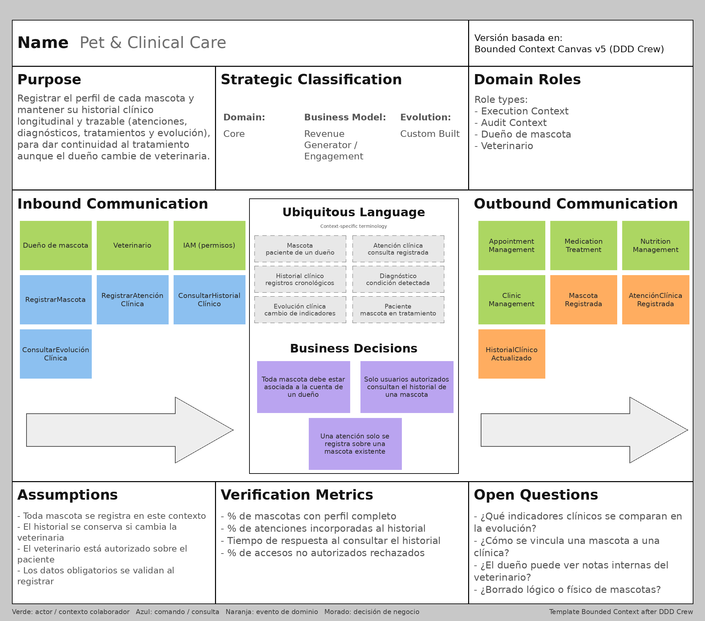

Este contexto tiene como propósito registrar el perfil de cada mascota y mantener su historial clínico longitudinal y trazable (atenciones, diagnósticos, tratamientos y evolución), de modo que el tratamiento tenga continuidad aunque el dueño cambie de veterinaria. Se clasifica como subdominio **core**, ya que la continuidad clínica es la base de la propuesta de valor de VetPax, y su rol es el de *Execution Context* y *Audit Context* por la trazabilidad que ofrece.

- **Comunicación de entrada:** los comandos `RegistrarMascota` y `RegistrarAtenciónClínica`, y las consultas `ConsultarHistorialClínico` y `ConsultarEvoluciónClínica`, iniciados por el dueño y el veterinario, con los permisos validados por IAM.
- **Comunicación de salida:** los eventos `MascotaRegistrada`, `AtenciónClínicaRegistrada` e `HistorialClínicoActualizado`, y el suministro del identificador de la mascota y de los pacientes a Appointment Management, Medication Treatment, Nutrition Management y Clinic Management.
- **Decisiones de negocio:** toda mascota debe estar asociada a la cuenta de un dueño; solo usuarios autorizados consultan el historial; una atención clínica solo se registra sobre una mascota existente.
- **Preguntas abiertas:** qué indicadores clínicos se comparan en la evolución, cómo se vincula una mascota con una clínica, si el dueño puede ver notas internas del veterinario y si el borrado de mascotas es lógico o físico.

#### Appointment Management

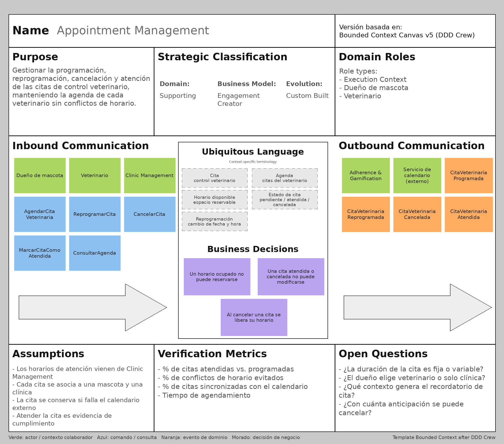

Su propósito es gestionar la programación, reprogramación, cancelación y atención de las citas de control veterinario, manteniendo la agenda de cada veterinario sin conflictos de horario. Es un subdominio de **soporte** con rol de *Execution Context*: no diferencia por sí mismo a VetPax, pero es necesario para sostener el seguimiento continuo y genera evidencia de cumplimiento para el sistema de gamificación.

- **Comunicación de entrada:** los comandos `AgendarCitaVeterinaria`, `ReprogramarCita`, `CancelarCita` y `MarcarCitaComoAtendida`, y la consulta `ConsultarAgenda`, iniciados por el dueño y el veterinario; además consume los horarios de atención publicados por Clinic Management.
- **Comunicación de salida:** los eventos `CitaVeterinariaProgramada`, `CitaVeterinariaReprogramada`, `CitaVeterinariaCancelada` y `CitaVeterinariaAtendida`; este último es consumido por Adherence & Gamification. También solicita la sincronización de citas confirmadas al servicio externo de calendario.
- **Decisiones de negocio:** un horario ocupado no puede reservarse; una cita atendida o cancelada no puede modificarse; al cancelar una cita se libera su horario.
- **Preguntas abiertas:** si la duración de la cita es fija o variable, si el dueño elige veterinario o solo clínica, qué contexto genera el recordatorio de cita y con cuánta anticipación puede cancelarse.

#### Medication Treatment

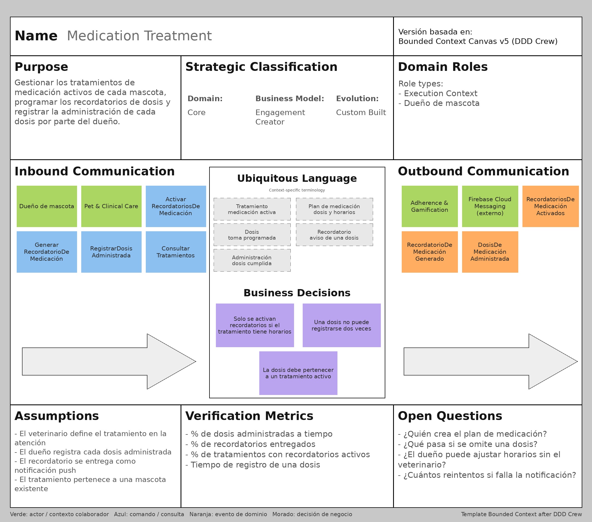

Este contexto gestiona los tratamientos de medicación activos de cada mascota, programa los recordatorios de dosis y registra la administración de cada dosis por parte del dueño. Es un subdominio **core** con rol de *Execution Context*, ya que la adherencia a la medicación es el núcleo del problema que VetPax busca resolver.

- **Comunicación de entrada:** los comandos `ActivarRecordatoriosDeMedicación`, `GenerarRecordatorioDeMedicación` (disparado por una policy al alcanzar el horario de una dosis pendiente) y `RegistrarDosisAdministrada`, y la consulta `ConsultarTratamientos`.
- **Comunicación de salida:** los eventos `RecordatoriosDeMedicaciónActivados`, `RecordatorioDeMedicaciónGenerado` y `DosisDeMedicaciónAdministrada`; este último es consumido por Adherence & Gamification. La entrega del recordatorio se realiza mediante Firebase Cloud Messaging.
- **Decisiones de negocio:** solo se activan recordatorios si el tratamiento tiene horarios definidos; una dosis no puede registrarse dos veces; la dosis debe pertenecer a un tratamiento activo.
- **Preguntas abiertas:** quién crea el plan de medicación, qué ocurre si se omite una dosis, si el dueño puede ajustar horarios sin el veterinario y cuántos reintentos se realizan si falla la notificación.

#### Nutrition Management

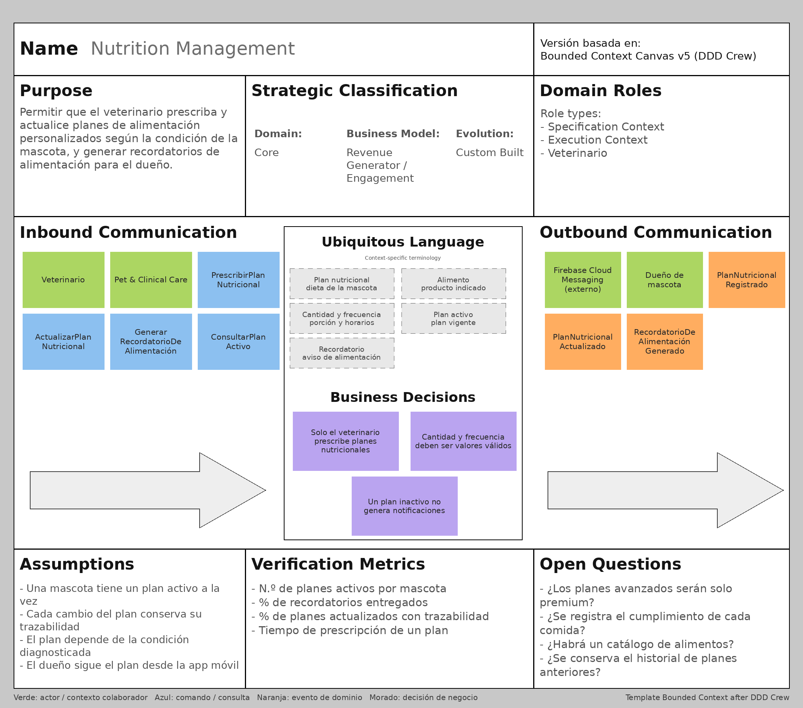

Permite que el veterinario prescriba y actualice planes de alimentación personalizados según la condición de la mascota, y genera recordatorios de alimentación para el dueño. Es un subdominio **core** con roles de *Specification Context* (define el plan) y *Execution Context* (genera los recordatorios), y sustenta las funcionalidades premium de dietas avanzadas del modelo freemium.

- **Comunicación de entrada:** los comandos `PrescribirPlanNutricional`, `ActualizarPlanNutricional` y `GenerarRecordatorioDeAlimentación`, y la consulta `ConsultarPlanActivo`, con la mascota como referencia proveniente de Pet & Clinical Care.
- **Comunicación de salida:** los eventos `PlanNutricionalRegistrado`, `PlanNutricionalActualizado` y `RecordatorioDeAlimentaciónGenerado`, con entrega de notificaciones mediante Firebase Cloud Messaging.
- **Decisiones de negocio:** solo el veterinario prescribe planes nutricionales; cantidad y frecuencia deben ser valores válidos; un plan inactivo no genera notificaciones.
- **Preguntas abiertas:** si los planes avanzados serán exclusivos de la suscripción premium, si se registrará el cumplimiento de cada comida, si habrá un catálogo de alimentos y si se conservará el historial de planes anteriores.

#### Clinic Management

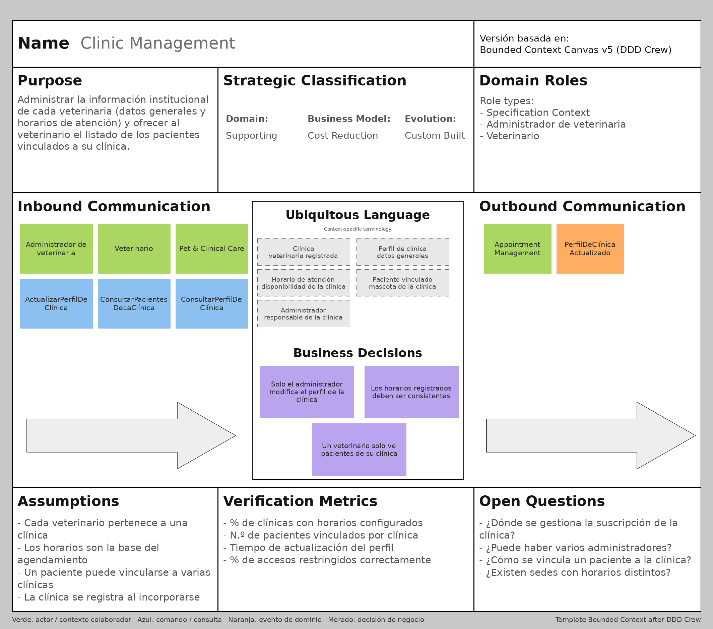

Administra la información institucional de cada veterinaria (datos generales y horarios de atención) y ofrece al veterinario el listado de los pacientes vinculados a su clínica. Es un subdominio de **soporte** con rol de *Specification Context*, porque define las condiciones (horarios) bajo las cuales otros contextos operan, y su modelo de negocio es la reducción de costos operativos de las veterinarias.

- **Comunicación de entrada:** los comandos `ActualizarPerfilDeClínica` y las consultas `ConsultarPacientesDeLaClínica` y `ConsultarPerfilDeClínica`, iniciados por el administrador de la veterinaria y el veterinario.
- **Comunicación de salida:** el evento `PerfilDeClínicaActualizado`, cuyos horarios de atención son utilizados por Appointment Management durante el agendamiento.
- **Decisiones de negocio:** solo el administrador modifica el perfil de la clínica; los horarios registrados deben ser consistentes; un veterinario solo ve los pacientes de su propia clínica.
- **Preguntas abiertas:** dónde se gestiona la suscripción de la clínica, si puede haber varios administradores, cómo se vincula un paciente a la clínica y si existen sedes con horarios distintos.

#### Adherence & Gamification

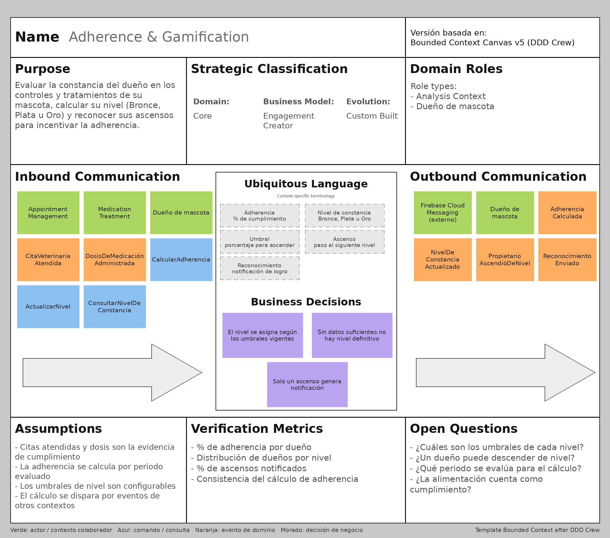

Evalúa la constancia del dueño en los controles y tratamientos de su mascota, calcula su nivel (Bronce, Plata u Oro) y reconoce sus ascensos para incentivar la adherencia. Es un subdominio **core** con rol de *Analysis Context*, pues no ejecuta operaciones clínicas sino que analiza el cumplimiento generado en otros contextos; constituye el principal diferenciador de VetPax frente a un simple registro de historiales.

- **Comunicación de entrada:** los eventos `CitaVeterinariaAtendida` (de Appointment Management) y `DosisDeMedicaciónAdministrada` (de Medication Treatment), los comandos internos `CalcularAdherencia` y `ActualizarNivel`, y la consulta `ConsultarNivelDeConstancia` del dueño.
- **Comunicación de salida:** los eventos `AdherenciaCalculada`, `NivelDeConstanciaActualizado`, `PropietarioAscendióDeNivel` y `ReconocimientoEnviado`, con entrega de la notificación de ascenso mediante Firebase Cloud Messaging.
- **Decisiones de negocio:** el nivel se asigna según los umbrales vigentes; sin datos suficientes no existe un nivel definitivo; solo un ascenso genera notificación.
- **Preguntas abiertas:** cuáles son los umbrales de cada nivel, si un dueño puede descender de nivel, qué periodo se evalúa y si el cumplimiento de la alimentación cuenta como evidencia.

#### IAM (Identity & Access Management)

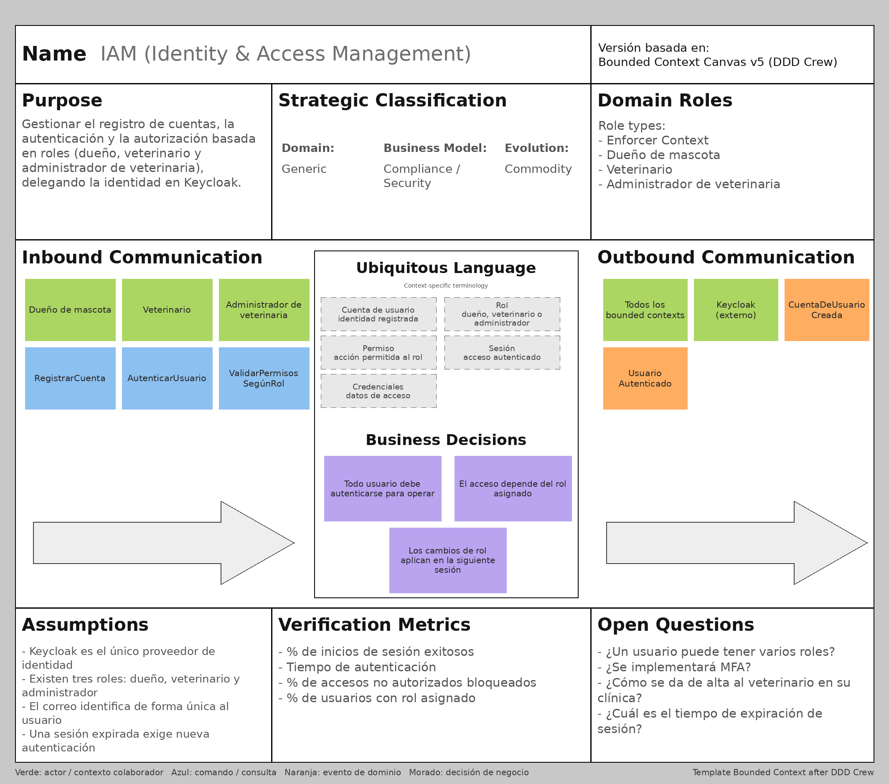

Gestiona el registro de cuentas, la autenticación y la autorización basada en roles (dueño de mascota, veterinario y administrador de veterinaria), delegando la gestión de identidad en Keycloak. Es un subdominio **genérico** de tipo *commodity* con rol de *Enforcer Context*: su funcionalidad es ajena a la operación clínica, por lo que se justifica separarlo para que las políticas de seguridad evolucionen de forma independiente.

- **Comunicación de entrada:** los comandos `RegistrarCuenta`, `AutenticarUsuario` y `ValidarPermisosSegúnRol`, iniciados por los tres tipos de usuario.
- **Comunicación de salida:** los eventos `CuentaDeUsuarioCreada` y `UsuarioAutenticado`, y la emisión de la identidad y los roles hacia todos los bounded contexts, apoyada en Keycloak.
- **Decisiones de negocio:** todo usuario debe autenticarse para operar; el acceso depende del rol asignado; los cambios de rol se aplican en la siguiente sesión.
- **Preguntas abiertas:** si un usuario puede tener varios roles, si se implementará autenticación multifactor, cómo se da de alta al veterinario en su clínica y cuál es el tiempo de expiración de la sesión.

---

### 4.2.5. Context Mapping

El proceso de Context Mapping permitió representar las relaciones estructurales y los contratos de integración entre los bounded contexts definidos en VetPax. Mientras que los Bounded Context Canvases detallan cada contexto de manera aislada, el Context Map ofrece una visión sistémica de cómo colaboran e intercambian información dentro de los límites de la solución, identificando qué contexto es *upstream* (proveedor) y cuál es *downstream* (consumidor) en cada relación.

Para su elaboración se aplicaron preguntas de exploración sugeridas en Domain-Driven Design, adaptadas al dominio de VetPax:

- ¿Qué contexto es dueño de la información de la mascota y cuáles dependen de ella para operar?
- ¿Qué eventos de un contexto constituyen evidencia para el cálculo de otro?
- ¿Qué integraciones con servicios de terceros deben aislarse para no contaminar el modelo de dominio?
- ¿Qué ocurre si un proveedor externo (identidad, notificaciones, calendario) debe ser reemplazado?

A partir de este análisis se identificaron y aplicaron los siguientes patrones de relación:

- **Customer/Supplier**, en la relación de **Pet & Clinical Care** con **Appointment Management, Medication Treatment, Nutrition Management y Clinic Management**, donde Pet & Clinical Care actúa como *supplier* al proveer el identificador y los datos de la mascota y de los pacientes vinculados. De igual forma, **Clinic Management** actúa como *supplier* de **Appointment Management** al proveer los horarios de atención de la clínica mediante el evento `PerfilDeClínicaActualizado`. Al pertenecer todos los contextos al mismo equipo, los contextos *customer* pueden negociar directamente los datos que necesitan.
- **Open Host Service (OHS) y Published Language**, en el contexto **IAM**, que expone un mecanismo estandarizado de autenticación y autorización basado en roles (dueño de mascota, veterinario y administrador de veterinaria), consumido por el resto de contextos para proteger sus operaciones. Los contextos consumidores adoptan el modelo de identidad y roles definido por IAM sin imponer el suyo (**Conformist**).
- **Event-Driven Consistency**, en la propagación de los eventos `CitaVeterinariaAtendida` (publicado por Appointment Management) y `DosisDeMedicaciónAdministrada` (publicado por Medication Treatment), ambos consumidos por **Adherence & Gamification** como evidencia de cumplimiento para recalcular la adherencia y el nivel de constancia del dueño. Adherence & Gamification se comporta como *conformist* frente al contrato de dichos eventos, lo que evita acoplar los contextos clínicos a la lógica de gamificación.
- **Anticorruption Layer (ACL)**, mediante adaptadores en la capa de infraestructura, en la integración de **IAM** con **Keycloak**, de **Medication Treatment, Nutrition Management y Adherence & Gamification** con **Firebase Cloud Messaging** para el envío de notificaciones push, y de **Appointment Management** con el **servicio externo de calendario**. Esto aísla el modelo de dominio de los contratos de cada proveedor y permite reemplazarlos sin afectar el núcleo del sistema, en línea con la decisión arquitectónica ADD08 (patrón Adapter).

La siguiente tabla detalla cada relación del Context Map:

| N.º | Upstream | Downstream | Patrón | Mensaje o contrato | Tipo |
| --- | --- | --- | --- | --- | --- |
| 1 | Keycloak (externo) | IAM | Anticorruption Layer | Identidad, credenciales y roles del usuario | Síncrona |
| 2 | IAM | Todos los contextos | Open Host Service, Published Language (downstream: Conformist) | Identidad autenticada y roles | Síncrona |
| 3 | Pet & Clinical Care | Appointment Management | Customer/Supplier | Identificador de la mascota | Síncrona |
| 4 | Pet & Clinical Care | Medication Treatment | Customer/Supplier | Identificador de la mascota | Síncrona |
| 5 | Pet & Clinical Care | Nutrition Management | Customer/Supplier | Identificador de la mascota | Síncrona |
| 6 | Pet & Clinical Care | Clinic Management | Customer/Supplier | Pacientes vinculados a la clínica | Síncrona |
| 7 | Clinic Management | Appointment Management | Customer/Supplier, Published Language | `PerfilDeClínicaActualizado` (horarios de atención) | Asíncrona |
| 8 | Appointment Management | Adherence & Gamification | Event-Driven Consistency (downstream: Conformist) | `CitaVeterinariaAtendida` | Asíncrona |
| 9 | Medication Treatment | Adherence & Gamification | Event-Driven Consistency (downstream: Conformist) | `DosisDeMedicaciónAdministrada` | Asíncrona |
| 10 | Medication Treatment, Nutrition Management, Adherence & Gamification | Firebase Cloud Messaging (externo) | Anticorruption Layer | Recordatorios de medicación y alimentación, notificación de ascenso | Síncrona |
| 11 | Appointment Management | Servicio de calendario (externo) | Anticorruption Layer | Sincronización de citas confirmadas | Síncrona |

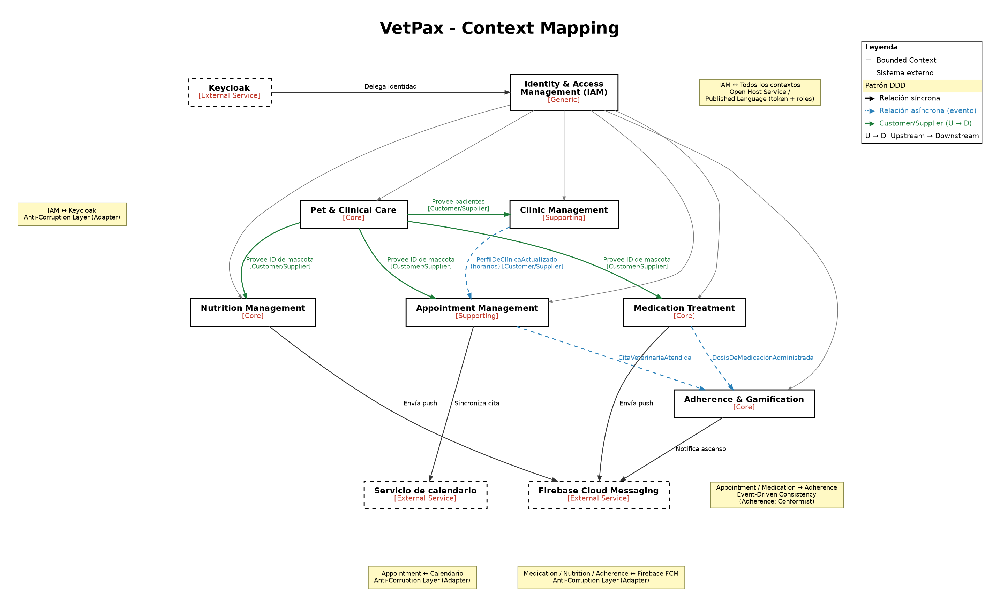

El Context Map resultante refleja a **Pet & Clinical Care** como el contexto central de VetPax, del cual dependen estructuralmente Appointment Management, Medication Treatment, Nutrition Management y Clinic Management para operar con datos fiables de la mascota. **Pet & Clinical Care, Medication Treatment, Nutrition Management y Adherence & Gamification** conforman los subdominios *core* que diferencian la propuesta de valor: el seguimiento clínico-nutricional continuo y la motivación de la constancia del dueño. **Appointment Management y Clinic Management** operan como subdominios de soporte que organizan la agenda y la información institucional de las veterinarias, mientras que **IAM** actúa como subdominio genérico transversal que provee seguridad a toda la solución.

Esta organización responde directamente a la decisión de aplicar Domain-Driven Design con bounded contexts (ADD07) y refuerza los atributos de calidad de mantenibilidad e interoperabilidad, ya que cada contexto puede evolucionar de forma independiente y las integraciones externas quedan encapsuladas. Por último, WebSockets, al ser un mecanismo técnico de comunicación en tiempo real y no una capacidad del dominio, no se representa como relación entre contextos.

---

## 4.3. Software Architecture

La arquitectura de software de VetPax se documenta siguiendo el modelo C4, que describe el sistema en niveles sucesivos de detalle: el ecosistema completo (System Landscape), el sistema y su entorno (Context), las aplicaciones y almacenes de datos que lo componen (Container) y su despliegue en infraestructura (Deployment). Los diagramas se construyeron con Structurizr DSL a partir de las decisiones arquitectónicas definidas en el Strategic-Level Attribute-Driven Design: arquitectura hexagonal (ADD01 y ADD02), APIs RESTful (ADD04), comunicación en tiempo real mediante WebSockets (ADD05), autenticación con Keycloak (ADD03), notificaciones con Firebase Cloud Messaging (ADD06) y adaptadores para servicios externos (ADD08).

### 4.3.1. Software Architecture System Landscape Diagram

*Expone el ecosistema completo donde nuestro sistema interactúa con múltiples sistemas externos, identificando dependencias y límites organizacionales.*

El System Landscape Diagram incluye todos los sistemas de la solución, las personas que interactúan con ellos y los sistemas externos de los que dependen. Además de la **plataforma VetPax** (aplicación móvil, panel web y API), el ecosistema contempla la **VetPax Landing Page**, un sitio informativo independiente donde el visitante conoce la propuesta de valor y registra su interés; la landing envía esos leads a la plataforma y dirige a cada segmento hacia la aplicación correspondiente.

**Personas**

| Persona | Descripción |
| --- | --- |
| Dueño de mascota | Dueño de una mascota geriátrica o con enfermedad crónica. Gestiona su historial, citas, medicación y dieta desde la aplicación móvil. |
| Veterinario | Registra atenciones clínicas, prescribe planes de dieta y gestiona su agenda de citas desde el panel web. |
| Administrador de veterinaria | Configura el perfil y los horarios de atención de la clínica desde el panel web. |
| Visitante | Persona interesada en conocer VetPax que registra su interés en la landing page. |

**Sistemas**

| Sistema | Tipo | Descripción |
| --- | --- | --- |
| VetPax | Sistema propio | Plataforma de seguimiento clínico-nutricional continuo para mascotas geriátricas o con enfermedades crónicas. |
| VetPax Landing Page | Sistema propio | Sitio informativo con propuesta de valor, testimonios y captura de leads. |
| Keycloak | Sistema externo | Proveedor de identidad: registro, autenticación y control de acceso basado en roles. |
| Firebase Cloud Messaging | Sistema externo | Servicio de notificaciones push para recordatorios de medicación, alimentación, citas y reconocimientos. |
| Servicio de calendario | Sistema externo | Servicio donde se sincronizan las citas confirmadas del veterinario. |

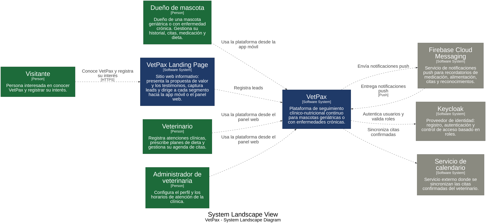

### 4.3.2. Software Architecture Context Level Diagrams

El System Context Diagram se enfoca únicamente en la **plataforma VetPax**, dejando fuera la landing page, y muestra cómo cada tipo de usuario se relaciona con ella y con qué sistemas externos se comunica. Este nivel permite comprender el alcance del sistema y sus dependencias sin entrar en detalles técnicos.

| Origen | Destino | Interacción |
| --- | --- | --- |
| Dueño de mascota | VetPax | Usa la plataforma desde la aplicación móvil. |
| Veterinario | VetPax | Usa la plataforma desde el panel web. |
| Administrador de veterinaria | VetPax | Usa la plataforma desde el panel web. |
| VetPax | Keycloak | Autentica usuarios y valida roles. |
| VetPax | Firebase Cloud Messaging | Envía notificaciones push de recordatorios y reconocimientos. |
| Firebase Cloud Messaging | VetPax | Entrega las notificaciones push al dispositivo del dueño. |
| VetPax | Servicio de calendario | Sincroniza las citas confirmadas. |

Las dependencias externas reflejan los atributos de calidad de seguridad (el control de acceso se delega en Keycloak, evitando gestionar credenciales dentro del dominio clínico) e interoperabilidad (las notificaciones y el calendario se consumen a través de interfaces desacopladas que pueden reemplazarse).

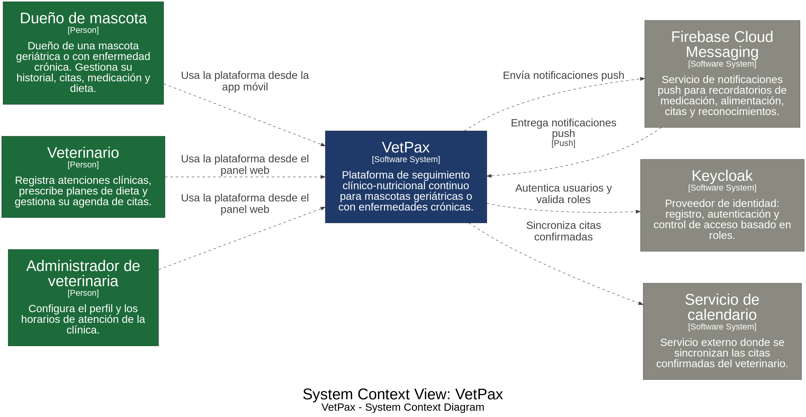

### 4.3.3. Software Architecture Container Level Diagrams

El Container Diagram descompone la plataforma VetPax en las aplicaciones y almacenes de datos que la componen. Todos los clientes consumen la misma API, lo que asegura coherencia de la información entre el dueño y la veterinaria. La Landing Page, como sistema independiente, se comunica con la API únicamente para registrar leads.

**Contenedores**

| Contenedor | Tecnología | Responsabilidad |
| --- | --- | --- |
| Mobile Application | Aplicación móvil | Permite al dueño gestionar el historial de su mascota, citas, recordatorios, dietas y su nivel de constancia. |
| Web Application | Aplicación web (SPA) | Panel de la veterinaria: pacientes, agenda, historial clínico, planes de dieta y perfil de la clínica. |
| Backend API | REST API + WebSocket, arquitectura hexagonal | Expone los casos de uso de los siete bounded contexts y las actualizaciones en tiempo real. |
| Database | Base de datos | Almacena mascotas, historiales clínicos, citas, tratamientos, planes nutricionales, clínicas y progreso de adherencia. |

**Comunicación entre contenedores**

| Origen | Destino | Descripción | Protocolo |
| --- | --- | --- | --- |
| Mobile Application, Web Application | Backend API | Consumen los servicios de la plataforma | HTTPS/REST, JSON |
| Mobile Application, Web Application | Backend API | Reciben actualizaciones clínicas en tiempo real | WebSocket |
| Mobile Application, Web Application | Keycloak | Autentican al usuario | OpenID Connect/HTTPS |
| Backend API | Keycloak | Valida tokens y roles | HTTPS |
| Backend API | Database | Lee y escribe datos | Acceso a datos |
| Backend API | Firebase Cloud Messaging | Envía notificaciones push | HTTPS |
| Firebase Cloud Messaging | Mobile Application | Entrega notificaciones push | Push |
| Backend API | Servicio de calendario | Sincroniza citas confirmadas | HTTPS |
| VetPax Landing Page | Backend API | Registra leads | HTTPS/REST, JSON |

**Organización interna del Backend API.** El backend aplica arquitectura hexagonal: cada bounded context se organiza en capas de dominio, aplicación e infraestructura, y las integraciones externas (Keycloak, Firebase Cloud Messaging, calendario) se implementan como adaptadores en la capa de infraestructura, de modo que el dominio no depende de ningún proveedor. La siguiente tabla relaciona cada bounded context con los recursos que expone la API y sus adaptadores:

| Bounded Context | Recursos expuestos | Adaptadores de infraestructura |
| --- | --- | --- |
| Pet & Clinical Care | `/api/v1/pets`, `/api/v1/pets/{petId}/clinical-records`, `/api/v1/pets/{petId}/evolution` | Persistencia |
| Appointment Management | `/api/v1/appointments` | Servicio de calendario (TS04), persistencia |
| Medication Treatment | `/api/v1/pets/{petId}/medication-plans`, `/api/v1/medication-doses/{doseId}/administrations` | Firebase Cloud Messaging (TS06), persistencia |
| Nutrition Management | `/api/v1/pets/{petId}/nutrition-plans` | Firebase Cloud Messaging (TS06), persistencia |
| Clinic Management | `/api/v1/clinics/{clinicId}`, `/api/v1/clinics/{clinicId}/patients` | Persistencia |
| Adherence & Gamification | Servicio de cálculo de adherencia (TS10) | Firebase Cloud Messaging (TS06), persistencia |
| IAM | Autenticación y autorización con roles (TS12) | Keycloak |
| Captación de leads | `/api/v1/leads` (TS11) | Persistencia |

La comunicación en tiempo real mediante WebSockets (TS13) sincroniza las actualizaciones clínicas, los cambios de tratamiento y otros eventos relevantes entre la aplicación móvil del dueño y el panel web de la veterinaria, evitando consultas constantes al servidor.

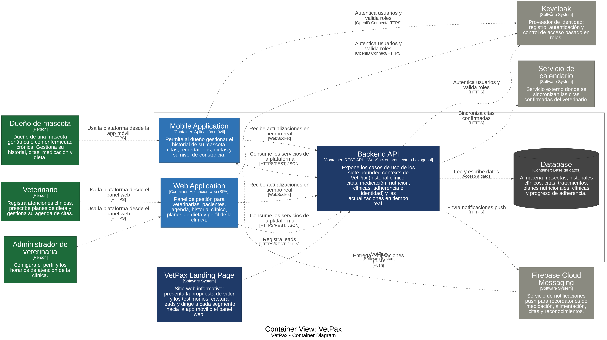

### 4.3.4. Software Architecture Deployment Diagrams

El Deployment Diagram muestra el entorno de producción y dónde se ejecuta cada contenedor. Separar el backend y la base de datos en nodos distintos permite escalar cada uno de forma independiente conforme crezca la cantidad de usuarios, mascotas y veterinarias afiliadas (ADD09), y mantener las integraciones externas fuera del núcleo desplegado.

| Nodo de despliegue | Elemento desplegado | Tecnología |
| --- | --- | --- |
| Dispositivo móvil del dueño | Mobile Application | Android / iOS |
| Navegador del veterinario | Web Application | Navegador web |
| Hosting de la landing page | VetPax Landing Page | Hosting web |
| Proveedor cloud → Servidor de aplicaciones | Backend API | Servicio de hosting del backend |
| Proveedor cloud → Servidor de base de datos | Database | Servicio de base de datos administrado |
| Proveedor cloud → Servidor de identidad | Keycloak | Keycloak Server |
| Google Cloud | Firebase Cloud Messaging | Firebase |
| Proveedor de calendario | Servicio de calendario | Servicio externo |

Las consideraciones principales del despliegue son las siguientes:

- **Seguridad:** toda la comunicación entre clientes, backend y servicios externos se realiza mediante HTTPS, y el acceso a los recursos protegidos se controla con la identidad y los roles gestionados por Keycloak.
- **Escalabilidad:** el backend se despliega de forma independiente de la base de datos, por lo que puede ampliarse su capacidad sin modificar la lógica del dominio.
- **Disponibilidad:** la información clínica se centraliza en una única base de datos gestionada, accesible desde la aplicación móvil y el panel web, lo que garantiza continuidad en el seguimiento.
- **Interoperabilidad:** Firebase Cloud Messaging y el servicio de calendario se consumen mediante adaptadores, por lo que pueden reemplazarse sin afectar los nodos propios de VetPax.

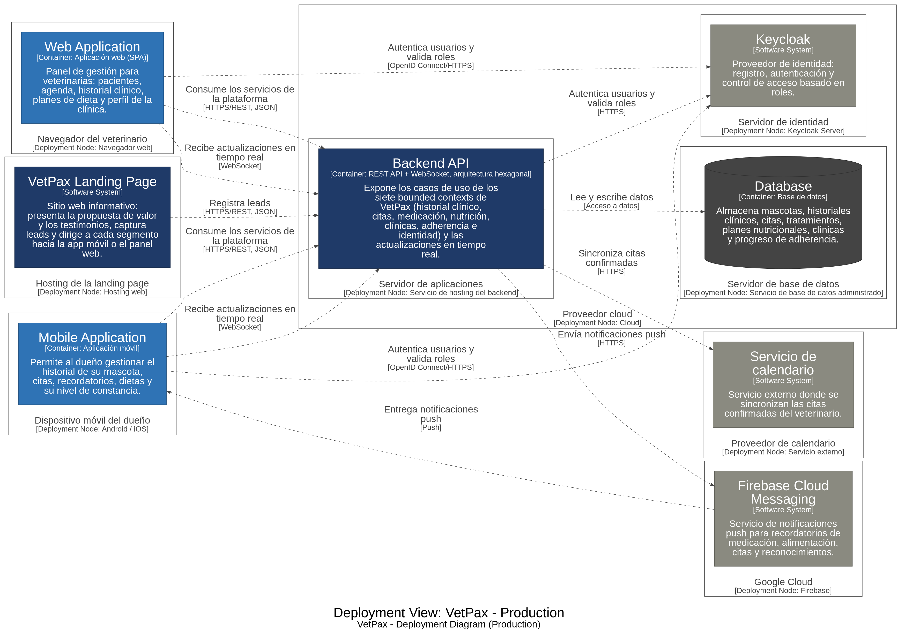
