

# Capítulo IV: Strategic-Level Software Design

## **4.1. Strategic-Level Attribute-Driven Design**

En esta sección se aplica el enfoque de **Attribute-Driven Design (ADD)** para orientar el diseño arquitectónico de VetPax a partir de los requisitos funcionales, atributos de calidad y restricciones identificados previamente.

El proceso permite reconocer aquellos elementos que poseen mayor influencia sobre la arquitectura de la solución y utilizarlos posteriormente como Architectural Drivers. A partir de estos drivers se evaluarán alternativas de diseño y se establecerán decisiones arquitectónicas que permitan responder a las necesidades de los segmentos objetivo y a los objetivos del negocio.

El análisis considera principalmente las funcionalidades relacionadas con el seguimiento clínico, tratamientos, citas veterinarias, planes de alimentación y gestión de pacientes, junto con atributos de calidad como seguridad, disponibilidad, rendimiento, escalabilidad, mantenibilidad e interoperabilidad.

De esta manera, el diseño arquitectónico se desarrolla progresivamente a partir de las necesidades previamente identificadas, evitando establecer decisiones tecnológicas antes de analizar los factores que condicionan la arquitectura.

### **4.1.1. Design Purpose**

El propósito del proceso de diseño arquitectónico de VetPax es definir una solución capaz de soportar el seguimiento continuo de mascotas geriátricas o con enfermedades crónicas, facilitando la interacción entre propietarios y profesionales veterinarios durante los periodos comprendidos entre consultas.

La solución debe permitir gestionar información clínica histórica, tratamientos de medicación, planes de alimentación, citas veterinarias y actividades de seguimiento, manteniendo disponible la información relevante para los usuarios autorizados.

Desde la perspectiva de los propietarios, el diseño debe permitir consultar información relacionada con la salud de sus mascotas, mantener organizadas las actividades asociadas con tratamientos y controles, y recibir apoyo para dar continuidad a las indicaciones establecidas por los profesionales veterinarios.

Desde la perspectiva del segmento veterinario, la solución debe facilitar el registro y consulta de información clínica, la gestión de pacientes y citas, el seguimiento de la evolución de las mascotas y la comunicación de indicaciones relacionadas con tratamientos y alimentación.

Asimismo, el diseño debe responder a los atributos de calidad identificados para VetPax, especialmente aquellos relacionados con seguridad, disponibilidad, rendimiento, escalabilidad, mantenibilidad e interoperabilidad.

El propósito del proceso ADD consiste, por tanto, en transformar estas necesidades funcionales y de calidad en drivers arquitectónicos que orienten posteriormente la evaluación de alternativas y la toma de decisiones de diseño.

### **4.1.2. Attribute-Driven Design Inputs**

El proceso de Attribute-Driven Design utiliza como entrada aquellos requisitos que poseen mayor influencia sobre la estructura y comportamiento de la arquitectura de VetPax.

Los inputs considerados se organizan en tres categorías principales:

- **Primary Functionality:** Epics o User Stories que representan funcionalidades críticas del sistema y cuya implementación genera un impacto relevante sobre la arquitectura.
- **Quality Attribute Scenarios:** escenarios asociados con atributos de calidad que establecen condiciones medibles relacionadas con seguridad, disponibilidad, rendimiento, escalabilidad, mantenibilidad e interoperabilidad.
- **Constraints:** restricciones no negociables que condicionan las alternativas tecnológicas o de diseño disponibles para la solución.

Estos elementos se derivan de los requisitos especificados previamente y constituyen la base para identificar y priorizar los Architectural Drivers utilizados durante las siguientes etapas del proceso de diseño.

#### **4.1.2.1. Primary Functionality (Primary User Stories)**

Las Primary User Stories corresponden a las funcionalidades de VetPax que presentan mayor relevancia arquitectónica. La selección no incluye todas las historias definidas en el capítulo de Requirements Specification, sino únicamente aquellas cuya implementación condiciona de manera significativa la estructura del sistema, la persistencia de información, la comunicación entre componentes o la integración entre los productos digitales.

Se consideran principalmente las funcionalidades relacionadas con la gestión clínica, tratamientos, citas, alimentación, gestión de pacientes e identidad de usuarios.

| **Epic / User Story ID** | **Título** | **Descripción** | **Criterios de Aceptación** | **Relacionado con (Epic ID)** |
|---|---|---|---|---|
| **US01** | Registrar mascota | Como propietario de mascota, quiero registrar a mi mascota, para mantener organizada su información básica y facilitar su seguimiento. | **E01: Registro válido.** Dado que el propietario se encuentra autenticado y proporciona los datos obligatorios, cuando registra la mascota, entonces el sistema crea el perfil y lo asocia con su cuenta.  **E02: Datos incompletos.** Dado que faltan datos obligatorios, cuando intenta registrar la mascota, entonces el sistema rechaza la operación e informa los campos pendientes. | EP01 |
| **US02** | Consultar historial clínico | Como propietario de mascota, quiero consultar el historial clínico de mi mascota, para conocer su evolución y los tratamientos registrados. | **E01: Historial disponible.** Dado que existen registros clínicos, cuando el propietario consulta el historial, entonces el sistema presenta las atenciones ordenadas cronológicamente.  **E02: Acceso no autorizado.** Dado que el usuario no posee autorización sobre la mascota, cuando intenta consultar su historial, entonces el sistema deniega el acceso. | EP01 |
| **US03** | Registrar atención clínica | Como profesional veterinario, quiero registrar una atención clínica de una mascota, para mantener actualizada su evolución y tratamiento. | **E01: Registro válido.** Dado que el profesional se encuentra autorizado y proporciona la información clínica requerida, cuando registra la atención, entonces el sistema la incorpora al historial clínico.  **E02: Información incompleta.** Dado que faltan datos obligatorios, cuando intenta registrar la atención, entonces el sistema rechaza la operación. | EP01 |
| **US04** | Agendar cita veterinaria | Como propietario de mascota, quiero agendar una cita veterinaria para mi mascota, para asegurar la continuidad de sus controles. | **E01: Horario disponible.** Dado que existe disponibilidad, cuando el propietario selecciona mascota, fecha, hora y motivo, entonces el sistema registra la cita.  **E02: Conflicto de horario.** Dado que el horario solicitado ya se encuentra ocupado, cuando intenta confirmar la cita, entonces el sistema rechaza la reserva. | EP02 |
| **US17** | Registrar tratamiento de medicación | Como profesional veterinario, quiero registrar un tratamiento de medicación, para que el propietario disponga de indicaciones claras sobre medicamentos, dosis y horarios. | **E01: Tratamiento válido.** Dado que el profesional se encuentra autorizado y proporciona medicamento, dosis, frecuencia y duración, cuando registra el tratamiento, entonces el sistema lo asocia con la mascota.  **E02: Datos incompletos.** Dado que faltan datos obligatorios, cuando intenta registrar el tratamiento, entonces el sistema rechaza la operación. | EP03 |
| **US07** | Configurar recordatorios de medicación | Como propietario de mascota, quiero activar recordatorios asociados al tratamiento prescrito, para recordar los horarios de medicación de mi mascota. | **E01: Activación válida.** Dado que existe un tratamiento activo con horarios definidos, cuando el propietario activa los recordatorios, entonces el sistema programa las notificaciones correspondientes.  **E02: Tratamiento sin horario.** Dado que no existen horarios definidos, cuando intenta activar recordatorios, entonces el sistema informa que no pueden ser programados. | EP03 |
| **US08** | Registrar plan de alimentación | Como profesional veterinario, quiero registrar un plan de alimentación para una mascota, para establecer indicaciones nutricionales acordes con su condición. | **E01: Registro válido.** Dado que el profesional establece alimento, cantidad y frecuencia, cuando registra el plan, entonces el sistema lo asocia con la mascota.  **E02: Actualización.** Dado que existe un plan vigente, cuando registra una modificación, entonces el sistema actualiza el plan conservando la trazabilidad necesaria. | EP03 |
| **US10** | Visualizar listado de pacientes | Como profesional veterinario, quiero consultar los pacientes vinculados con mi clínica, para identificar aquellos que requieren seguimiento. | **E01: Pacientes disponibles.** Dado que existen pacientes vinculados a la clínica, cuando el profesional consulta el listado, entonces el sistema presenta su información resumida.  **E02: Acceso restringido.** Dado que intenta consultar pacientes de otra clínica sin autorización, cuando realiza la solicitud, entonces el sistema deniega el acceso. | EP04 |
| **US11** | Consultar evolución clínica | Como profesional veterinario, quiero consultar la evolución clínica de un paciente, para evaluar cambios registrados durante su tratamiento. | **E01: Información disponible.** Dado que existen registros históricos comparables, cuando consulta la evolución, entonces el sistema presenta los datos de manera cronológica.  **E02: Información insuficiente.** Dado que no existen registros suficientes, cuando realiza la consulta, entonces el sistema informa que todavía no es posible establecer una evolución. | EP04 |
| **US20** | Registrarse en VetPax | Como usuario nuevo, quiero crear una cuenta en VetPax, para acceder a las funcionalidades correspondientes a mi perfil. | **E01: Registro válido.** Dado que el usuario proporciona los datos requeridos y un correo no registrado, cuando crea su cuenta, entonces el sistema registra al usuario.  **E02: Correo existente.** Dado que el correo ya pertenece a una cuenta, cuando intenta registrarse, entonces el sistema rechaza la operación. | EP07 |
| **US21** | Iniciar sesión | Como usuario registrado, quiero iniciar sesión de forma segura, para acceder a la información y funcionalidades correspondientes a mi perfil. | **E01: Credenciales válidas.** Dado que el usuario proporciona credenciales correctas, cuando inicia sesión, entonces el sistema autentica su identidad y permite el acceso.  **E02: Credenciales incorrectas.** Dado que proporciona credenciales inválidas, cuando intenta iniciar sesión, entonces el sistema rechaza el acceso sin revelar información sensible. | EP07 |

Las funcionalidades seleccionadas representan los principales flujos que condicionan el diseño de VetPax. La gestión del historial clínico requiere persistencia y trazabilidad de información longitudinal; la gestión de citas y tratamientos requiere coordinación entre diferentes procesos del dominio; los recordatorios requieren mecanismos de procesamiento de eventos; la gestión de pacientes exige control sobre las relaciones entre clínicas, profesionales y mascotas; y las funcionalidades de identidad requieren mecanismos de autenticación y autorización.

Estas necesidades funcionales serán consideradas posteriormente, junto con los escenarios de atributos de calidad y las restricciones del proyecto, para establecer los Architectural Drivers que orientarán las decisiones de diseño.

#### **4.1.2.2. Quality Attribute Scenarios**

Los Quality Attribute Scenarios representan las condiciones de calidad con mayor influencia sobre la arquitectura de VetPax. Estos escenarios se derivan de los requisitos no funcionales identificados previamente y permiten establecer respuestas y medidas verificables frente a estímulos relevantes para la operación de la solución.

Para esta primera versión se consideran principalmente escenarios relacionados con rendimiento, disponibilidad, seguridad, escalabilidad, mantenibilidad, interoperabilidad y confiabilidad de la información clínica.

| **ID** | **Atributo** | **Fuente** | **Estímulo** | **Artefacto** | **Entorno** | **Respuesta** | **Medida** |
|---|---|---|---|---|---|---|---|
| **QAS01** | Rendimiento | Propietario o profesional veterinario | Realiza una consulta o registro frecuente, como consultar el historial clínico, registrar una atención o revisar una cita. | Servicios backend y almacenamiento de datos | Operación normal | El sistema procesa la solicitud y retorna el resultado correspondiente. | Al menos el **95% de las solicitudes de consulta y registro** debe completarse en un tiempo menor o igual a **2 segundos**. |
| **QAS02** | Rendimiento | Profesional veterinario | Registra una actualización clínica que debe estar disponible para otros usuarios autorizados conectados. | Servicios backend y mecanismo de comunicación en tiempo real | Operación normal con clientes conectados | El sistema confirma la actualización y comunica el cambio a los clientes autorizados. | Al menos el **95% de las actualizaciones en tiempo real** debe reflejarse en los clientes conectados en un tiempo menor o igual a **3 segundos**. |
| **QAS03** | Disponibilidad | Propietario o profesional veterinario | Solicita acceder a funcionalidades principales como historial clínico, citas, tratamientos o pacientes. | Servicios backend y almacenamiento de información | Operación habitual del sistema | El sistema permanece disponible y procesa las solicitudes de los usuarios. | La solución debe mantener una disponibilidad mensual mínima de **99%**, excluyendo periodos de mantenimiento planificado. |
| **QAS04** | Seguridad | Usuario no autenticado | Intenta acceder a un recurso protegido de VetPax. | Mecanismo de autenticación y servicios backend | Operación normal | El sistema verifica la autenticación antes de permitir el acceso y rechaza la solicitud cuando el usuario no está autenticado. | El **100% de las solicitudes a recursos protegidos** debe validar autenticación. Las solicitudes no autenticadas deben ser rechazadas con una respuesta equivalente a **401 Unauthorized**. |
| **QAS05** | Seguridad | Usuario autenticado sin autorización | Intenta consultar o modificar información clínica de una mascota para la cual no posee permisos. | Servicios de autorización y módulo de gestión clínica | Operación normal | El sistema verifica los permisos del usuario y deniega el acceso al recurso solicitado. | El **100% de los intentos detectados como no autorizados** debe ser rechazado, sin exponer información clínica protegida. |
| **QAS06** | Escalabilidad | Incremento de usuarios y clínicas incorporadas a VetPax | Aumenta la cantidad de usuarios concurrentes y solicitudes realizadas al sistema. | Servicios backend, APIs y almacenamiento de datos | Periodo de alta carga | El sistema incrementa su capacidad manteniendo el funcionamiento de las funcionalidades principales. | En una prueba con al menos **500 usuarios concurrentes**, el **95% de las solicitudes** debe responder en un tiempo menor o igual a **3 segundos**. |
| **QAS07** | Mantenibilidad | Equipo de desarrollo | Se requiere sustituir una integración externa por otra que implemente el mismo contrato. | Componentes responsables de las integraciones externas y lógica de dominio | Evolución o mantenimiento del sistema | El equipo sustituye el componente de integración sin modificar las reglas de negocio del dominio. | La sustitución debe requerir **0 modificaciones en las reglas de negocio del dominio**, limitando los cambios al componente de integración y su configuración. |
| **QAS08** | Interoperabilidad | Aplicación móvil, aplicación web o servicio externo | Requiere intercambiar información con los servicios de VetPax. | APIs expuestas por el backend | Operación normal | El sistema recibe y entrega información utilizando interfaces y formatos estandarizados. | El **100% de los servicios HTTP expuestos a los clientes** debe utilizar interfaces RESTful y **JSON** como formato principal de intercambio de información. |
| **QAS09** | Confiabilidad | Servicio externo integrado | Presenta una indisponibilidad temporal o devuelve un error durante una operación. | Componente de integración con servicios externos | Falla de un proveedor externo | El sistema controla la falla, registra el incidente y evita que afecte funcionalidades que no dependan directamente del servicio externo. | Ante una falla controlada, deben producirse **0 pérdidas de datos previamente persistidos** y la falla no debe propagarse hacia módulos independientes de la integración afectada. |
| **QAS10** | Integridad / Trazabilidad | Profesional veterinario o propietario autorizado | Registra o modifica información clínica relacionada con una mascota. | Servicios de gestión clínica y almacenamiento de datos | Operación normal | El sistema persiste la modificación e identifica al usuario responsable y el momento de la operación. | El **100% de los registros y modificaciones clínicas** debe almacenar como mínimo el identificador del usuario responsable y la **fecha y hora** de la operación. |

#### **4.1.2.3. Constraints**

Los Constraints representan condiciones no negociables que limitan las alternativas disponibles durante el diseño e implementación de VetPax. Estas restricciones provienen principalmente de las disposiciones tecnológicas y de desarrollo establecidas para el proyecto y, por tanto, deben ser consideradas independientemente de las decisiones arquitectónicas que posteriormente adopte el equipo.

Para su especificación, los Constraints se representan mediante Technical Stories, permitiendo establecer de manera verificable las condiciones que deben cumplirse durante la implementación de los productos digitales de VetPax.

| **Technical Story ID** | **Título** | **Descripción** | **Criterios de Aceptación** | **Relacionado con (Epic ID)** |
|---|---|---|---|---|
| **TS-C01** | Servicios web bajo estilo RESTful | Como desarrollador, quiero implementar los servicios web de VetPax utilizando el estilo arquitectónico RESTful y uno de los frameworks permitidos por el proyecto, para cumplir con las restricciones tecnológicas establecidas para el backend. | **E01: Estilo RESTful.** Dado que se implementa un servicio web de VetPax, cuando se expone una operación a los productos cliente, entonces debe utilizar recursos y operaciones HTTP siguiendo el estilo RESTful.  **E02: Framework permitido.** Dado que se implementa el backend, cuando se selecciona el framework de desarrollo, entonces debe utilizarse Spring Boot, ASP.NET Core o Nest Framework.  **E03: Documentación.** Dado que existe un servicio web expuesto, cuando se documenta su contrato, entonces debe utilizar OpenAPI Specification mediante Swagger. | Transversal (EP01–EP07) |
| **TS-C02** | Tecnologías de Landing Page | Como desarrollador, quiero implementar la Landing Page utilizando las tecnologías establecidas para el proyecto, para cumplir con las restricciones definidas para la presencia digital de VetPax. | **E01: Tecnologías permitidas.** Dado que se desarrolla la Landing Page, cuando se implementa su estructura, presentación y comportamiento, entonces deben utilizarse HTML5, CSS3 y JavaScript.  **E02: Lenguaje de diseño.** Dado que se diseñan los componentes visuales de la Landing Page, cuando se define su presentación, entonces debe utilizarse Material Design como referencia de diseño. | EP06 |
| **TS-C03** | Tecnologías de aplicación web | Como desarrollador, quiero implementar la aplicación web utilizando uno de los frameworks permitidos por el proyecto, para mantener el cumplimiento de las restricciones tecnológicas establecidas. | **E01: Framework permitido.** Dado que se implementa la aplicación web, cuando se selecciona el framework frontend, entonces debe utilizarse Angular o Vue.  **E02: Tecnologías web.** Dado que se desarrollan las vistas y funcionalidades de la aplicación, cuando se implementan sus componentes, entonces deben utilizarse HTML5, CSS3 y JavaScript o TypeScript según corresponda.  **E03: Componentes de interfaz.** Dado que se utiliza una biblioteca de componentes, cuando el proyecto utiliza Angular debe emplearse Angular Material o PrimeNG, y cuando utiliza Vue debe emplearse PrimeVue o Vuetify. | EP01 / EP02 / EP03 / EP04 / EP07 |
| **TS-C04** | Estrategia tecnológica de aplicación móvil | Como desarrollador, quiero implementar la aplicación móvil utilizando una estrategia tecnológica permitida por el proyecto, para cumplir con las restricciones establecidas para productos móviles. | **E01: Desarrollo nativo.** Dado que la aplicación se desarrolla de forma nativa para Android, cuando se implementan sus funcionalidades, entonces debe utilizarse Kotlin.  **E02: Desarrollo cross-platform.** Dado que el equipo justifique una estrategia cross-platform, cuando se implemente la aplicación, entonces debe utilizarse una de las tecnologías permitidas para dicha estrategia.  **E03: Tecnologías híbridas.** Dado que se selecciona la tecnología móvil, cuando se evalúan las alternativas disponibles, entonces no deben utilizarse tecnologías híbridas. | EP01 / EP02 / EP03 / EP05 / EP07 |
| **TS-C05** | Internacionalización de productos digitales | Como desarrollador, quiero incorporar capacidades de internacionalización en los productos digitales de VetPax, para cumplir con el enfoque inclusivo establecido para el proyecto. | **E01: Locales soportados.** Dado que se implementa contenido susceptible de internacionalización, cuando se configuran los recursos de idioma, entonces deben contemplarse como mínimo **English (en_US)** y **Latin American Spanish (es_419)**.  **E02: Idioma por defecto.** Dado que un usuario accede por primera vez a un producto de VetPax sin una preferencia configurada, cuando se determina el idioma inicial, entonces debe utilizarse inglés como idioma por defecto.  **E03: Productos aplicables.** Dado que se desarrollan la Landing Page, aplicación web y servicios web, cuando se incorporan mensajes o contenidos, entonces deben estar preparados para internacionalización. | Transversal (EP01–EP07) |
| **TS-C06** | Accesibilidad de experiencias web | Como desarrollador, quiero aplicar criterios de accesibilidad en las experiencias web de VetPax, para permitir una interacción inclusiva y cumplir con las disposiciones establecidas para el proyecto. | **E01: Atributos ARIA.** Dado que se desarrolla un componente interactivo en la Landing Page o aplicación web, cuando sea necesario describir su propósito o estado, entonces deben configurarse los atributos ARIA correspondientes.  **E02: Accesibilidad.** Dado que se desarrolla una experiencia web, cuando se implementan sus elementos de interacción, entonces deben considerarse prácticas de accesibilidad a11y. | EP01 / EP02 / EP03 / EP04 / EP06 / EP07 |
| **TS-C07** | Control de versiones y flujo de trabajo | Como desarrollador, quiero gestionar el código fuente de VetPax mediante las herramientas y prácticas de control de versiones establecidas, para mantener la trazabilidad y colaboración durante el desarrollo. | **E01: Repositorio.** Dado que se desarrolla código fuente de VetPax, cuando se almacena y versiona el proyecto, entonces debe utilizarse Git gestionado mediante GitHub.  **E02: Flujo de trabajo.** Dado que se desarrollan nuevas funcionalidades o correcciones, cuando se gestionan las ramas del repositorio, entonces debe aplicarse GitFlow Workflow. | Transversal (EP01–EP07) |
| **TS-C08** | Términos y condiciones de servicio | Como desarrollador, quiero proporcionar acceso a los términos y condiciones de servicio desde los productos digitales de VetPax, para cumplir con las responsabilidades éticas y profesionales establecidas para el proyecto. | **E01: Landing Page.** Dado que un visitante accede a la Landing Page, cuando consulta su footer, entonces debe existir un enlace hacia los términos y condiciones de servicio.  **E02: Aplicaciones.** Dado que un usuario utiliza alguno de los productos digitales de VetPax, cuando accede a la sección correspondiente del producto, entonces debe poder consultar los términos y condiciones de servicio.  **E03: Contenido.** Dado que se redactan los términos y condiciones, cuando son publicados, entonces deben considerar los principios de responsabilidad ética y profesional definidos para el proyecto. | Transversal (EP01–EP07) |

### **4.1.3. Architectural Drivers Backlog**

El Architectural Drivers Backlog consolida los factores que presentan mayor influencia sobre el diseño arquitectónico de VetPax. Para su elaboración se consideran como entradas las Primary User Stories, los Quality Attribute Scenarios y los Constraints identificados previamente durante el proceso de Attribute-Driven Design.

Para esta versión del backlog, los drivers fueron valorados considerando dos dimensiones: la **Importancia para Stakeholders**, que representa el nivel de relevancia del driver para los segmentos objetivo y los objetivos del producto, y el **Impacto en Architecture Technical Complexity**, que representa el grado en que el driver condiciona la estructura, componentes, integraciones o decisiones técnicas de la solución.

El backlog incluye los Functional Drivers seleccionados, los Quality Attribute Drivers de mayor relevancia arquitectónica y la totalidad de los Constraints definidos para el proyecto. Los drivers con importancia **High** para los stakeholders y complejidad técnica **High** se presentan primero debido a su mayor influencia sobre las decisiones arquitectónicas posteriores.

| **Driver ID** | **Título de Driver** | **Descripción** | **Importancia para Stakeholders** | **Impacto en Architecture Technical Complexity** |
|---|---|---|:---:|:---:|
| **AD01** | Gestión de identidad y control de acceso | VetPax debe permitir el registro y autenticación de usuarios, así como restringir el acceso a información y funcionalidades según los permisos correspondientes. Este driver se relaciona con las funcionalidades de registro e inicio de sesión y con los escenarios de seguridad definidos para los recursos protegidos. | High | High |
| **AD02** | Gestión y trazabilidad del historial clínico | La solución debe permitir registrar, consultar y mantener información clínica histórica de las mascotas, conservando la relación entre el paciente, el profesional responsable y el momento en que se realizaron las modificaciones. | High | High |
| **AD03** | Gestión de tratamientos y seguimiento de medicación | Los profesionales veterinarios deben poder registrar tratamientos de medicación y los propietarios deben disponer de mecanismos para consultar y dar seguimiento a las indicaciones y horarios establecidos. | High | High |
| **AD04** | Sincronización oportuna de actualizaciones | Los cambios clínicos relevantes deben estar disponibles oportunamente para los usuarios autorizados que utilizan la aplicación móvil y la aplicación web, evitando inconsistencias entre los productos digitales. | High | High |
| **AD05** | Rendimiento de operaciones frecuentes | Las operaciones habituales de consulta y registro deben procesarse con tiempos de respuesta que permitan una interacción fluida. Al menos el 95% de estas solicitudes debe completarse en un tiempo menor o igual a 2 segundos bajo condiciones normales. | High | High |
| **AD06** | Escalabilidad de la solución | VetPax debe soportar el crecimiento progresivo de usuarios, mascotas y clínicas sin degradar significativamente el rendimiento. La arquitectura debe soportar al menos 500 usuarios concurrentes manteniendo el 95% de las solicitudes en un tiempo menor o igual a 3 segundos durante las pruebas establecidas. | High | High |
| **AD07** | Mantenibilidad y desacoplamiento | La solución debe permitir modificar o sustituir componentes de infraestructura e integraciones externas sin requerir cambios en las reglas principales del dominio, reduciendo el impacto de la evolución tecnológica sobre la lógica del negocio. | High | High |
| **AD08** | Servicios web RESTful y tecnologías backend permitidas | Los servicios web de VetPax deben seguir el estilo RESTful y utilizar uno de los frameworks backend permitidos por el proyecto. Los contratos de los servicios deben documentarse mediante OpenAPI Specification utilizando Swagger. | High | High |
| **AD09** | Gestión de citas veterinarias | Los propietarios deben poder programar, cancelar y reprogramar citas, mientras que los profesionales veterinarios deben disponer de información actualizada para gestionar su agenda y mantener la continuidad de los controles. | High | Medium |
| **AD10** | Gestión de pacientes y evolución clínica | Los profesionales veterinarios deben poder consultar los pacientes vinculados con su clínica y analizar su evolución utilizando los registros clínicos históricos disponibles. | High | Medium |
| **AD11** | Disponibilidad de funcionalidades principales | Las funcionalidades relacionadas con historial clínico, tratamientos, citas y pacientes deben mantenerse disponibles durante la operación habitual de VetPax. La solución debe alcanzar una disponibilidad mensual mínima de 99%, excluyendo mantenimientos planificados. | High | Medium |
| **AD12** | Programación y entrega de recordatorios | La solución debe permitir programar recordatorios relacionados con medicación, alimentación y citas, asegurando que los eventos correspondientes sean procesados según las fechas y horarios configurados. | High | Medium |
| **AD13** | Tecnologías de aplicación web | La aplicación web dirigida al segmento veterinario debe desarrollarse utilizando Angular o Vue, junto con las tecnologías y bibliotecas de componentes permitidas por las disposiciones del proyecto. | High | Medium |
| **AD14** | Estrategia tecnológica de aplicación móvil | La aplicación móvil dirigida a propietarios debe implementarse utilizando una estrategia de desarrollo permitida por el proyecto, considerando desarrollo nativo o una alternativa cross-platform autorizada y excluyendo tecnologías híbridas. | High | Medium |
| **AD15** | Internacionalización de productos digitales | Los productos digitales de VetPax deben contemplar internacionalización para English (en_US) y Latin American Spanish (es_419), utilizando inglés como idioma por defecto para los mensajes, interfaces y documentación correspondiente. | High | Medium |
| **AD16** | Accesibilidad de experiencias web | La Landing Page y la aplicación web deben incorporar criterios de accesibilidad a11y y atributos ARIA cuando corresponda, de acuerdo con las disposiciones establecidas para los productos web del proyecto. | High | Medium |
| **AD17** | Interoperabilidad entre productos y servicios | La aplicación móvil, aplicación web y servicios externos deben intercambiar información mediante interfaces y formatos estandarizados. Los servicios HTTP expuestos deben utilizar RESTful APIs y JSON como formato principal de intercambio. | Medium | High |
| **AD18** | Manejo de fallos de servicios externos | La indisponibilidad temporal de una integración externa debe ser controlada sin provocar pérdida de información previamente persistida ni afectar módulos que no dependan directamente del servicio que presenta la falla. | Medium | High |
| **AD19** | Tecnologías de Landing Page | La Landing Page debe desarrollarse utilizando HTML5, CSS3 y JavaScript, considerando Material Design como referencia para el diseño de la experiencia visual. | Medium | Low |
| **AD20** | Control de versiones y flujo de trabajo | El código fuente de los productos digitales de VetPax debe gestionarse mediante Git y GitHub, aplicando GitFlow Workflow para organizar el trabajo colaborativo y mantener la trazabilidad de los cambios. | Medium | Low |
| **AD21** | Términos y condiciones de servicio | Los productos digitales de VetPax deben proporcionar acceso a los términos y condiciones de servicio, incluyendo los enlaces correspondientes en la Landing Page y en las aplicaciones, de acuerdo con las responsabilidades éticas y profesionales definidas para el proyecto. | Medium | Low |

Los Architectural Drivers identificados representan las necesidades funcionales, atributos de calidad y restricciones que presentan mayor influencia sobre la arquitectura de VetPax. Estos drivers serán utilizados en las siguientes etapas del proceso ADD para evaluar tácticas, patrones y alternativas arquitectónicas antes de establecer las Architectural Design Decisions de la solución.

### **4.1.4. Architectural Design Decisions**

Las Architectural Design Decisions de VetPax se obtienen a partir de los Architectural Drivers identificados y priorizados previamente. Para establecer estas decisiones se sigue un proceso iterativo basado en el **Quality Attribute Workshop**, considerando en cada iteración los drivers relevantes, las tácticas arquitectónicas aplicables, los patrones o alternativas disponibles y los criterios utilizados para seleccionar la alternativa más adecuada.

Los Constraints definidos en la sección anterior se consideran condiciones obligatorias del proyecto y, por tanto, no son tratados como alternativas de diseño. Las iteraciones se concentran principalmente en aquellos drivers que presentan una importancia alta para los stakeholders y un impacto significativo sobre la complejidad técnica de la arquitectura.

#### **Iteración 1: Mantenibilidad y organización interna del backend**

**Drivers considerados:** AD02 - Gestión y trazabilidad del historial clínico, AD03 - Gestión de tratamientos y seguimiento de medicación y AD07 - Mantenibilidad y desacoplamiento.

Las funcionalidades relacionadas con información clínica y tratamientos requieren que las reglas principales del dominio puedan evolucionar sin depender directamente de frameworks, mecanismos de persistencia o integraciones externas.

Las principales tácticas consideradas fueron:

- **Separation of Concerns**, para distribuir responsabilidades entre componentes con funciones diferenciadas.
- **Dependency Inversion**, para evitar que las reglas del dominio dependan directamente de componentes de infraestructura.
- **Information Hiding**, para encapsular los detalles técnicos detrás de contratos definidos.

Se evaluaron como alternativas **Traditional Layered Architecture**, **Clean Architecture** y **Hexagonal Architecture**.

Traditional Layered Architecture presenta menor complejidad inicial y una estructura ampliamente conocida, pero puede generar dependencias entre la lógica de negocio, la persistencia y los frameworks utilizados. Clean Architecture proporciona una separación clara de responsabilidades mediante reglas de dependencia hacia el núcleo del sistema, aunque introduce una mayor cantidad de abstracciones.

Hexagonal Architecture permite representar explícitamente la interacción entre el dominio y los componentes externos mediante Ports and Adapters. Esta alternativa responde de manera directa al escenario de mantenibilidad definido para VetPax, en el cual la sustitución de una integración externa no debe requerir modificaciones en las reglas del dominio.

**Decisión resultante:** utilizar **Hexagonal Architecture** para organizar el backend de VetPax, manteniendo el dominio independiente de los componentes externos mediante Ports and Adapters.

#### **Iteración 2: Autenticación, autorización y gestión de identidad**

**Drivers considerados:** AD01 - Gestión de identidad y control de acceso.

Los escenarios de seguridad requieren validar la identidad de los usuarios y controlar el acceso a la información clínica de acuerdo con los permisos correspondientes.

Las principales tácticas consideradas fueron:

- **Authenticate Users**, para verificar la identidad antes de permitir el acceso al sistema.
- **Authorize Users**, para restringir recursos y operaciones de acuerdo con los permisos asignados.
- **Centralized Identity Management**, para centralizar la administración de identidades, roles y credenciales.

Se evaluaron como alternativas una **autenticación implementada directamente en el backend**, la **gestión directa de tokens JWT por la aplicación** y un **Centralized Identity Provider**.

La autenticación implementada directamente en el backend proporciona control sobre todo el proceso, pero incrementa la responsabilidad del sistema respecto con almacenamiento de credenciales, recuperación de acceso, emisión de tokens y gestión de roles. La gestión directa de JWT reduce la necesidad de sesiones en el servidor, aunque mantiene dentro de la aplicación responsabilidades relacionadas con identidades y renovación de credenciales.

Un Centralized Identity Provider permite delegar estas responsabilidades a un componente especializado y centralizar los mecanismos de autenticación y autorización.

**Decisión resultante:** utilizar un **Centralized Identity Provider**, implementado mediante **Keycloak**, para gestionar autenticación, autorización, roles y recuperación de acceso.

#### **Iteración 3: Sincronización de actualizaciones entre productos digitales**

**Drivers considerados:** AD04 - Sincronización oportuna de actualizaciones, AD05 - Rendimiento de operaciones frecuentes y AD17 - Interoperabilidad entre productos y servicios.

VetPax requiere que determinados cambios clínicos puedan reflejarse oportunamente entre la aplicación móvil utilizada por los propietarios y la aplicación web utilizada por los profesionales veterinarios.

Las principales tácticas consideradas fueron:

- **Asynchronous Communication**, para evitar que todos los intercambios de información dependan de solicitudes síncronas.
- **Reduce Communication Latency**, para disminuir el tiempo entre una actualización y su disponibilidad para otros clientes conectados.
- **Persistent Connection**, para mantener un canal disponible para la distribución de determinados eventos.

Se evaluaron **Polling**, **Server-Sent Events** y **WebSockets**.

Polling tiene una implementación sencilla sobre HTTP, pero requiere realizar solicitudes repetitivas incluso cuando no existen actualizaciones. Server-Sent Events permite mantener un canal persistente desde el servidor hacia el cliente, aunque se encuentra orientado principalmente a comunicación unidireccional.

WebSockets permite establecer un canal bidireccional persistente y distribuir actualizaciones a los clientes conectados sin realizar consultas periódicas.

**Decisión resultante:** utilizar **WebSockets** para las actualizaciones que requieran comunicación en tiempo real, mientras que las operaciones convencionales de consulta y registro continuarán utilizando las APIs RESTful establecidas como Constraint del proyecto.

#### **Iteración 4: Programación y entrega de recordatorios**

**Drivers considerados:** AD12 - Programación y entrega de recordatorios, AD18 - Manejo de fallos de servicios externos y AD11 - Disponibilidad de funcionalidades principales.

VetPax debe generar recordatorios relacionados con citas, medicación y alimentación sin acoplar las operaciones principales del negocio con la disponibilidad inmediata del mecanismo utilizado para entregar las notificaciones.

Las principales tácticas consideradas fueron:

- **Asynchronous Processing**, para separar la generación de un recordatorio de su entrega.
- **Fault Isolation**, para evitar que la indisponibilidad de un servicio externo afecte otras funcionalidades.
- **Retry**, para permitir nuevos intentos de procesamiento ante fallas temporales.
- **Scheduling**, para ejecutar recordatorios en las fechas y horarios correspondientes.

Se evaluaron el **envío síncrono desde el flujo principal**, los **Scheduled Jobs** y el **procesamiento desacoplado junto con un Push Notification Provider**.

El envío síncrono presenta menor complejidad inicial, pero establece una dependencia directa entre la operación principal y el proveedor externo. Los Scheduled Jobs permiten ejecutar actividades de acuerdo con una programación determinada, aunque requieren mecanismos adicionales para controlar estados, reintentos y fallas.

El procesamiento desacoplado permite mantener independientes la generación del evento y su posterior entrega al dispositivo del usuario.

**Decisión resultante:** utilizar un **servicio desacoplado para la programación y procesamiento de recordatorios** y emplear **Firebase Cloud Messaging** como proveedor para la entrega de notificaciones push.

#### **Iteración 5: Organización de las capacidades del dominio**

**Drivers considerados:** AD02 - Gestión y trazabilidad del historial clínico, AD03 - Gestión de tratamientos y seguimiento de medicación, AD09 - Gestión de citas veterinarias, AD10 - Gestión de pacientes y evolución clínica y AD07 - Mantenibilidad y desacoplamiento.

Las diferentes capacidades de VetPax representan conceptos del negocio que poseen responsabilidades y ciclos de evolución diferentes. Por ello, se requiere establecer una organización que reduzca el acoplamiento entre estas capacidades.

Las principales tácticas consideradas fueron:

- **Semantic Coherence**, para agrupar responsabilidades relacionadas con una misma capacidad del negocio.
- **Separation of Responsibilities**, para evitar que módulos diferentes compartan responsabilidades innecesariamente.
- **Reduce Coupling**, para limitar dependencias entre capacidades del dominio.

Se evaluaron una **organización por capas técnicas**, una **organización por features** y una **organización modular orientada al dominio**.

La organización por capas técnicas facilita inicialmente la ubicación de controllers, services y repositories, pero puede mezclar reglas pertenecientes a diferentes capacidades del negocio. La organización por features mejora la cohesión al agrupar componentes relacionados con una funcionalidad.

La organización modular orientada al dominio permite establecer límites explícitos entre las principales capacidades del negocio y proporciona una base para las actividades posteriores de Strategic-Level Domain-Driven Design.

**Decisión resultante:** organizar las capacidades principales de VetPax mediante **módulos orientados al dominio**, cuyos límites serán refinados posteriormente mediante EventStorming, Context Discovery y Bounded Context Mapping.

#### **Iteración 6: Escalabilidad y rendimiento del backend**

**Drivers considerados:** AD05 - Rendimiento de operaciones frecuentes, AD06 - Escalabilidad de la solución y AD11 - Disponibilidad de funcionalidades principales.

VetPax debe soportar el crecimiento progresivo de usuarios y solicitudes manteniendo los niveles de rendimiento definidos en los Quality Attribute Scenarios.

Las principales tácticas consideradas fueron:

- **Stateless Processing**, para reducir dependencias de sesión entre solicitudes.
- **Horizontal Scaling**, para permitir aumentar la capacidad incorporando nuevas instancias.
- **Resource Replication**, para distribuir el procesamiento cuando la demanda se incremente.

Se evaluaron **escalamiento vertical de una única instancia**, **servicios stateless con escalamiento horizontal** y una **arquitectura basada en microservicios**.

El escalamiento vertical presenta menor complejidad operacional, pero se encuentra limitado por la capacidad máxima de una única instancia. Una arquitectura de microservicios proporciona independencia de despliegue y escalabilidad por servicio, aunque introduce complejidad adicional en comunicación, observabilidad, despliegue y consistencia distribuida.

Un backend modular y stateless permite conservar una complejidad operativa menor y, al mismo tiempo, habilitar el escalamiento horizontal cuando la demanda aumente.

**Decisión resultante:** mantener un **backend modular con procesamiento stateless y capacidad de escalamiento horizontal**, evitando introducir inicialmente la complejidad operacional de una arquitectura distribuida basada en microservicios.

#### **Candidate Pattern Evaluation Matrix**

La siguiente matriz resume las principales alternativas consideradas durante las iteraciones del proceso. Para cada grupo de Architectural Drivers se presentan como máximo los tres patrones o alternativas con mayor relevancia para la decisión.

<table border="1" cellspacing="0" cellpadding="3"
       style="border-collapse: collapse; width: 100%; table-layout: fixed; font-size: 8px; line-height: 1.15;">
  <thead>
    <tr>
      <th style="width: 6%;">Driver ID</th>
      <th style="width: 10%;">Título de Driver</th>
      <th style="width: 9%;">Pattern / Alternative 1</th>
      <th style="width: 9%;">Pro</th>
      <th style="width: 9%;">Con</th>
      <th style="width: 9%;">Pattern / Alternative 2</th>
      <th style="width: 9%;">Pro</th>
      <th style="width: 9%;">Con</th>
      <th style="width: 9%;">Pattern / Alternative 3</th>
      <th style="width: 10%;">Pro</th>
      <th style="width: 11%;">Con</th>
    </tr>
  </thead>

  <tbody>
    <tr>
      <td><strong>AD02, AD03, AD07</strong></td>
      <td>Gestión clínica y mantenibilidad</td>
      <td>Traditional Layered Architecture</td>
      <td>Menor complejidad inicial y estructura ampliamente conocida.</td>
      <td>Puede generar acoplamiento entre dominio, persistencia y frameworks.</td>
      <td>Clean Architecture</td>
      <td>Mantiene las reglas de negocio independientes de infraestructura mediante inversión de dependencias.</td>
      <td>Incrementa la cantidad de abstracciones y contratos.</td>
      <td><strong>Hexagonal Architecture</strong></td>
      <td>Aísla el dominio mediante Ports and Adapters y facilita sustituir componentes externos.</td>
      <td>Requiere definir y mantener correctamente puertos, adaptadores y responsabilidades.</td>
    </tr>
    <tr>
      <td><strong>AD01</strong></td>
      <td>Gestión de identidad y control de acceso</td>
      <td>Autenticación implementada en el backend</td>
      <td>Control completo sobre el proceso de autenticación.</td>
      <td>Incrementa la responsabilidad sobre credenciales, recuperación, tokens y seguridad.</td>
      <td>JWT gestionado directamente por la aplicación</td>
      <td>Permite autenticación stateless y facilita la comunicación con APIs.</td>
      <td>La aplicación mantiene responsabilidad sobre emisión, renovación y revocación de tokens.</td>
      <td><strong>Centralized Identity Provider</strong></td>
      <td>Centraliza autenticación, autorización, roles y recuperación de acceso.</td>
      <td>Introduce dependencia de un componente adicional de identidad.</td>
    </tr>
    <tr>
      <td><strong>AD04, AD05, AD17</strong></td>
      <td>Sincronización de actualizaciones</td>
      <td>Polling</td>
      <td>Implementación sencilla utilizando HTTP convencional.</td>
      <td>Genera solicitudes periódicas y puede incrementar la latencia y consumo de recursos.</td>
      <td>Server-Sent Events</td>
      <td>Mantiene comunicación persistente eficiente desde el servidor hacia el cliente.</td>
      <td>Se encuentra orientado principalmente a comunicación unidireccional.</td>
      <td><strong>WebSockets</strong></td>
      <td>Permite comunicación bidireccional persistente y actualizaciones con baja latencia.</td>
      <td>Requiere gestionar conexiones persistentes, reconexión y escalabilidad.</td>
    </tr>
    <tr>
      <td><strong>AD12, AD18, AD11</strong></td>
      <td>Programación y entrega de recordatorios</td>
      <td>Procesamiento síncrono</td>
      <td>Menor complejidad inicial.</td>
      <td>Acopla la operación principal con la disponibilidad del proveedor externo.</td>
      <td>Scheduled Jobs</td>
      <td>Permite ejecutar recordatorios según fechas y horarios definidos.</td>
      <td>Requiere administrar estados, concurrencia, reintentos y recuperación de fallos.</td>
      <td><strong>Procesamiento desacoplado + Push Notification Provider</strong></td>
      <td>Separa generación y entrega de eventos y permite controlar fallas externas.</td>
      <td>Incrementa la cantidad de componentes y estados gestionados.</td>
    </tr>
    <tr>
      <td><strong>AD02, AD03, AD09, AD10, AD07</strong></td>
      <td>Organización del dominio</td>
      <td>Organización por capas técnicas</td>
      <td>Estructura simple y conocida.</td>
      <td>Puede mezclar reglas pertenecientes a diferentes capacidades del negocio.</td>
      <td>Organización por features</td>
      <td>Mejora la cohesión agrupando componentes relacionados con una funcionalidad.</td>
      <td>Los límites entre conceptos del dominio pueden permanecer ambiguos.</td>
      <td><strong>Organización modular orientada al dominio</strong></td>
      <td>Define límites entre capacidades de negocio y favorece su evolución independiente.</td>
      <td>Requiere mayor análisis del dominio para identificar correctamente responsabilidades y relaciones.</td>
    </tr>
    <tr>
      <td><strong>AD05, AD06, AD11</strong></td>
      <td>Escalabilidad y rendimiento</td>
      <td>Escalamiento vertical</td>
      <td>Fácil de implementar y operar inicialmente.</td>
      <td>Posee límites de capacidad y genera dependencia de una única instancia.</td>
      <td><strong>Backend stateless con escalamiento horizontal</strong></td>
      <td>Permite incorporar nuevas instancias según la demanda sin introducir distribución completa del dominio.</td>
      <td>Requiere infraestructura capaz de distribuir solicitudes y gestionar instancias.</td>
      <td>Microservices Architecture</td>
      <td>Permite escalar y desplegar servicios de manera independiente.</td>
      <td>Introduce mayor complejidad en comunicación, despliegue, observabilidad y consistencia distribuida.</td>
    </tr>
  </tbody>
</table>

Como resultado de las iteraciones realizadas, las principales decisiones arquitectónicas obtenidas corresponden al uso de Hexagonal Architecture para estructurar el backend, un proveedor centralizado de identidad para gestionar autenticación y autorización, WebSockets para los casos que requieren comunicación en tiempo real, procesamiento desacoplado para los recordatorios, una organización modular orientada al dominio y una estrategia de procesamiento stateless que permita escalamiento horizontal.

Estas decisiones responden a los Architectural Drivers priorizados y servirán como base para el refinamiento de los Quality Attribute Scenarios y para las actividades posteriores de Strategic-Level Domain-Driven Design.

### **4.1.5. Quality Attribute Scenario Refinements**

Luego de evaluar los Architectural Drivers, las tácticas y las alternativas de diseño durante el Quality Attribute Workshop, se refinan los Quality Attribute Scenarios definidos inicialmente para VetPax.

Las principales decisiones obtenidas durante el proceso incluyen el uso de un proveedor centralizado de identidad para autenticación y autorización, Hexagonal Architecture para desacoplar las reglas del dominio de los componentes externos, WebSockets para los escenarios que requieren sincronización en tiempo real, procesamiento desacoplado para recordatorios y notificaciones, y una estrategia stateless que permita el escalamiento horizontal del backend.

A partir de estas decisiones, los escenarios son refinados incorporando respuestas más concretas, medidas verificables y los principales aspectos pendientes que deben considerarse durante la implementación. Los escenarios se presentan en orden de prioridad, considerando su importancia para los stakeholders y su impacto sobre la arquitectura.

#### **Scenario Refinement for Scenario 1 — Seguridad y control de acceso**

| **Elemento** | **Descripción** |
|---|---|
| **Scenario(s)** | QAS04, QAS05 |
| **Business Goals** | Proteger la información clínica de las mascotas y mantener la confianza de propietarios y profesionales veterinarios mediante mecanismos de acceso seguro. |
| **Relevant Quality Attributes** | Seguridad, privacidad |
| **Stimulus** | Un usuario intenta acceder a un recurso protegido sin encontrarse autenticado o intenta consultar información clínica para la cual no posee autorización. |
| **Stimulus Source** | Usuario no autenticado o usuario autenticado sin los permisos correspondientes. |
| **Environment** | Operación normal de la aplicación móvil o aplicación web de VetPax. |
| **Artifact (if Known)** | Proveedor de identidad, servicios backend y recursos de información clínica. |
| **Response** | El sistema valida la identidad y los permisos del usuario antes de permitir el acceso. La autenticación y autorización se gestionan mediante un proveedor centralizado de identidad. Las solicitudes que no cumplen las condiciones de acceso son rechazadas sin exponer información clínica protegida. |
| **Response Measure** | El **100% de las solicitudes dirigidas a recursos protegidos** debe validar autenticación y autorización. Las solicitudes no autenticadas deben producir una respuesta equivalente a **401 Unauthorized**, mientras que las solicitudes autenticadas sin permisos suficientes deben producir una respuesta equivalente a **403 Forbidden**. |
| **Questions** | ¿Cómo se administrarán los roles y permisos de propietarios, profesionales veterinarios y administradores? ¿Cómo se gestionará la expiración y renovación de credenciales? ¿Qué información podrá consultar cada rol? |
| **Issues** | La indisponibilidad temporal del proveedor de identidad puede afectar los procesos de inicio de sesión y renovación de credenciales. Debe evitarse que los detalles internos de autorización sean expuestos en las respuestas de error. |

#### **Scenario Refinement for Scenario 2 — Rendimiento de operaciones frecuentes**

| **Elemento** | **Descripción** |
|---|---|
| **Scenario(s)** | QAS01 |
| **Business Goals** | Permitir que propietarios y profesionales veterinarios utilicen las funcionalidades principales de VetPax sin retrasos que dificulten el seguimiento clínico y las actividades de cuidado. |
| **Relevant Quality Attributes** | Rendimiento |
| **Stimulus** | Un usuario realiza una operación frecuente, como consultar el historial clínico, registrar una atención, revisar una cita o consultar información de un paciente. |
| **Stimulus Source** | Propietario o profesional veterinario. |
| **Environment** | Operación normal del sistema con una carga dentro de los valores previstos. |
| **Artifact (if Known)** | Aplicación móvil o web, APIs RESTful, servicios backend y almacenamiento de datos. |
| **Response** | El backend procesa la solicitud utilizando operaciones stateless y consulta únicamente los recursos necesarios para completar la operación solicitada. |
| **Response Measure** | Al menos el **95% de las solicitudes de consulta y registro** debe completarse en un tiempo menor o igual a **2 segundos** bajo condiciones normales de operación. |
| **Questions** | ¿Qué operaciones presentan mayor costo de procesamiento? ¿Qué consultas requieren índices específicos en la base de datos? ¿Será necesario aplicar mecanismos de caché en determinadas consultas? |
| **Issues** | Consultas que involucren grandes volúmenes de información histórica pueden incrementar el tiempo de respuesta si no se optimizan los mecanismos de persistencia y recuperación de datos. |

#### **Scenario Refinement for Scenario 3 — Sincronización en tiempo real**

| **Elemento** | **Descripción** |
|---|---|
| **Scenario(s)** | QAS02 |
| **Business Goals** | Mantener actualizada la información relevante entre propietarios y profesionales veterinarios, facilitando la continuidad del seguimiento entre consultas. |
| **Relevant Quality Attributes** | Rendimiento, interoperabilidad |
| **Stimulus** | Un profesional veterinario registra o actualiza información clínica que debe ser conocida por otros usuarios autorizados conectados. |
| **Stimulus Source** | Profesional veterinario o servicio interno que confirma una actualización relevante. |
| **Environment** | Operación normal con uno o más clientes autorizados conectados a VetPax. |
| **Artifact (if Known)** | Servicios backend, mecanismo de comunicación mediante WebSockets, aplicación móvil y aplicación web. |
| **Response** | Una vez confirmada y persistida la modificación, el sistema genera el evento correspondiente y lo comunica mediante WebSockets a los clientes autorizados que se encuentren conectados. |
| **Response Measure** | Al menos el **95% de las actualizaciones enviadas en tiempo real** debe reflejarse en los clientes conectados en un tiempo menor o igual a **3 segundos** después de confirmarse el cambio. |
| **Questions** | ¿Cómo se gestionará la reconexión de clientes después de una pérdida temporal de conexión? ¿Cómo se garantizará que únicamente usuarios autorizados reciban cada evento? |
| **Issues** | Las conexiones persistentes incrementan la cantidad de recursos administrados por el backend. Los clientes desconectados no pueden depender exclusivamente de WebSockets para recuperar información actualizada. |

#### **Scenario Refinement for Scenario 4 — Disponibilidad de las funcionalidades principales**

| **Elemento** | **Descripción** |
|---|---|
| **Scenario(s)** | QAS03 |
| **Business Goals** | Mantener disponibles las funciones necesarias para consultar información clínica, tratamientos, citas y pacientes durante las actividades de seguimiento de las mascotas. |
| **Relevant Quality Attributes** | Disponibilidad |
| **Stimulus** | Un propietario o profesional veterinario solicita utilizar una de las funcionalidades principales de VetPax. |
| **Stimulus Source** | Propietario o profesional veterinario. |
| **Environment** | Operación habitual del sistema durante el periodo de servicio. |
| **Artifact (if Known)** | Servicios backend, APIs y almacenamiento persistente. |
| **Response** | Los servicios procesan las solicitudes mientras los componentes principales se encuentren disponibles. La persistencia mantiene la información confirmada aun cuando ocurra una falla temporal de algún componente externo. |
| **Response Measure** | Los servicios principales deben mantener una disponibilidad mensual mínima de **99%**, excluyendo los periodos de mantenimiento planificado. |
| **Questions** | ¿Qué componentes representan puntos únicos de falla? ¿Cómo se supervisará la disponibilidad de los servicios? ¿Qué mecanismos se utilizarán para recuperación ante fallas? |
| **Issues** | La disponibilidad global puede verse condicionada por servicios externos utilizados para autenticación, notificaciones u otras integraciones. |

#### **Scenario Refinement for Scenario 5 — Escalabilidad**

| **Elemento** | **Descripción** |
|---|---|
| **Scenario(s)** | QAS06 |
| **Business Goals** | Permitir que VetPax incremente progresivamente la cantidad de propietarios, profesionales veterinarios, mascotas y clínicas sin requerir rediseñar las reglas principales del negocio. |
| **Relevant Quality Attributes** | Escalabilidad, rendimiento |
| **Stimulus** | Se incrementa la cantidad de usuarios que realizan operaciones simultáneas sobre los servicios de VetPax. |
| **Stimulus Source** | Crecimiento de usuarios y clínicas incorporadas a la plataforma. |
| **Environment** | Periodo de alta carga con múltiples usuarios concurrentes. |
| **Artifact (if Known)** | Servicios backend stateless, APIs, infraestructura de despliegue y almacenamiento de datos. |
| **Response** | Las instancias del backend pueden distribuir las solicitudes sin depender de estado de sesión almacenado localmente, permitiendo aumentar horizontalmente la capacidad disponible. |
| **Response Measure** | En una prueba de carga con al menos **500 usuarios concurrentes**, el **95% de las solicitudes** debe completarse en un tiempo menor o igual a **3 segundos**. |
| **Questions** | ¿Cuál será el mecanismo utilizado para distribuir las solicitudes entre instancias? ¿Qué componentes deberán escalar de manera independiente? ¿Cuál será el comportamiento de la persistencia ante el incremento de carga? |
| **Issues** | El escalamiento horizontal del backend no elimina posibles cuellos de botella en la base de datos, integraciones externas o conexiones persistentes utilizadas para comunicación en tiempo real. |

#### **Scenario Refinement for Scenario 6 — Mantenibilidad y sustitución de integraciones**

| **Elemento** | **Descripción** |
|---|---|
| **Scenario(s)** | QAS07 |
| **Business Goals** | Facilitar la evolución de VetPax y reducir el impacto técnico y económico de modificaciones futuras en tecnologías o proveedores externos. |
| **Relevant Quality Attributes** | Mantenibilidad, modificabilidad |
| **Stimulus** | El equipo de desarrollo requiere reemplazar un proveedor externo o modificar un mecanismo de infraestructura manteniendo las mismas capacidades funcionales. |
| **Stimulus Source** | Equipo de desarrollo. |
| **Environment** | Actividades de mantenimiento o evolución del sistema. |
| **Artifact (if Known)** | Dominio, Ports, Adapters y componentes de infraestructura del backend. |
| **Response** | Mediante Hexagonal Architecture, las reglas del dominio interactúan con elementos externos a través de contratos definidos. La sustitución del proveedor se realiza implementando o modificando el Adapter correspondiente. |
| **Response Measure** | La sustitución de un proveedor externo que implemente el mismo contrato debe requerir **0 modificaciones en las reglas de negocio del dominio**, limitando los cambios al Adapter y a la configuración correspondiente. |
| **Questions** | ¿Qué integraciones necesitan Ports independientes? ¿Qué contratos deben mantenerse estables? ¿Qué pruebas permitirán comprobar que un nuevo Adapter mantiene el comportamiento esperado? |
| **Issues** | Un contrato mal definido puede provocar dependencias indirectas entre el dominio y detalles específicos del proveedor, reduciendo el beneficio del desacoplamiento. |

#### **Scenario Refinement for Scenario 7 — Manejo de fallos en servicios externos**

| **Elemento** | **Descripción** |
|---|---|
| **Scenario(s)** | QAS09 |
| **Business Goals** | Evitar que fallas temporales de servicios externos provoquen pérdida de información clínica o interrumpan funcionalidades de VetPax que no dependan directamente del proveedor afectado. |
| **Relevant Quality Attributes** | Confiabilidad, disponibilidad |
| **Stimulus** | Un proveedor externo presenta un timeout, indisponibilidad temporal o respuesta de error durante una operación. |
| **Stimulus Source** | Servicio externo integrado, como proveedor de identidad o servicio de notificaciones. |
| **Environment** | Operación normal con una falla temporal de una dependencia externa. |
| **Artifact (if Known)** | Adapter de integración, servicio de aplicación y mecanismo de procesamiento de eventos. |
| **Response** | El Adapter detecta y controla la falla, registra el incidente y devuelve un resultado controlado al componente solicitante. Cuando corresponda, los eventos pendientes de procesamiento se conservan para permitir su posterior reintento. |
| **Response Measure** | Ante una falla controlada de un servicio externo deben producirse **0 pérdidas de información previamente persistida**, y la falla no debe interrumpir módulos que no dependan del proveedor afectado. |
| **Questions** | ¿Cuántos reintentos se permitirán? ¿Qué intervalo existirá entre reintentos? ¿Cuándo una operación debe considerarse definitivamente fallida? ¿Cómo se informará al usuario cuando una integración no esté disponible? |
| **Issues** | Una política de reintentos excesiva puede aumentar la carga del sistema o del proveedor externo. También debe evitarse el procesamiento duplicado de eventos después de una recuperación. |

#### **Scenario Refinement for Scenario 8 — Interoperabilidad**

| **Elemento** | **Descripción** |
|---|---|
| **Scenario(s)** | QAS08 |
| **Business Goals** | Permitir que los diferentes productos digitales de VetPax intercambien información mediante mecanismos estandarizados y facilitar futuras integraciones. |
| **Relevant Quality Attributes** | Interoperabilidad |
| **Stimulus** | La aplicación móvil, aplicación web o un componente autorizado requiere consultar, registrar o actualizar información administrada por VetPax. |
| **Stimulus Source** | Aplicación móvil, aplicación web o integración autorizada. |
| **Environment** | Operación normal de los productos digitales. |
| **Artifact (if Known)** | APIs RESTful expuestas por el backend. |
| **Response** | El backend procesa la solicitud utilizando recursos y operaciones HTTP definidos y responde mediante representaciones estructuradas de los recursos solicitados. |
| **Response Measure** | El **100% de los servicios HTTP expuestos a los clientes de VetPax** debe utilizar el estilo RESTful y **JSON** como formato principal para el intercambio de información. |
| **Questions** | ¿Cómo se versionarán las APIs? ¿Cómo se administrarán cambios incompatibles en los contratos? ¿Qué información debe incluir la documentación OpenAPI? |
| **Issues** | Cambios no controlados en los contratos de las APIs pueden generar incompatibilidades entre las versiones de la aplicación móvil, aplicación web y backend. |

#### **Scenario Refinement for Scenario 9 — Integridad y trazabilidad de información clínica**

| **Elemento** | **Descripción** |
|---|---|
| **Scenario(s)** | QAS10 |
| **Business Goals** | Mantener información clínica confiable que permita reconstruir la evolución de una mascota e identificar las acciones realizadas por los usuarios autorizados. |
| **Relevant Quality Attributes** | Integridad, trazabilidad |
| **Stimulus** | Un usuario autorizado registra o modifica información clínica relacionada con una mascota. |
| **Stimulus Source** | Profesional veterinario o propietario autorizado, según el tipo de información registrada. |
| **Environment** | Operación normal durante el registro o actualización de información. |
| **Artifact (if Known)** | Servicios del dominio clínico y almacenamiento persistente. |
| **Response** | El sistema valida la operación, persiste la información y registra los datos necesarios para identificar el usuario responsable y el momento en que se realizó el cambio. Si la operación no puede completarse correctamente, no se conserva un estado parcial. |
| **Response Measure** | El **100% de los registros y modificaciones clínicas** debe almacenar como mínimo el identificador del usuario responsable y la **fecha y hora** de la operación. Las operaciones transaccionales deben completarse íntegramente o revertirse ante una falla. |
| **Questions** | ¿Qué modificaciones clínicas deben conservar historial de versiones? ¿Durante cuánto tiempo deben mantenerse los registros de trazabilidad? ¿Qué roles pueden consultar esta información? |
| **Issues** | La modificación o eliminación de información clínica debe considerar reglas adicionales de auditoría para evitar la pérdida de trazabilidad histórica. |

Los escenarios refinados permiten establecer una relación explícita entre las necesidades de calidad identificadas inicialmente y las decisiones arquitectónicas obtenidas durante el Quality Attribute Workshop. Asimismo, proporcionan medidas verificables que posteriormente pueden utilizarse para evaluar si la arquitectura implementada responde a los niveles de calidad esperados para VetPax.

Las Questions e Issues registradas en cada escenario representan aspectos que deberán continuar evaluándose durante el diseño detallado, implementación y validación de la solución.

## 4.2. Strategic-Level Domain-Driven Design
### 4.2.1. EventStorming

Con el objetivo de obtener una primera representación integral del dominio de VetPax, se aplicó la técnica de EventStorming mediante un proceso incremental de descubrimiento y refinamiento. El modelado permitió representar los hechos relevantes del negocio, comprender su secuencia temporal, identificar situaciones problemáticas, reconocer eventos que producen cambios significativos en los procesos y posteriormente incorporar actores, comandos, políticas, modelos de lectura, sistemas externos y aggregates.

El proceso se desarrolló de manera progresiva, manteniendo como elemento central los Domain Events y agregando información conforme aumentaba la comprensión del dominio. Esta aproximación permitió evitar una descomposición prematura del sistema y conservar la relación entre los diferentes procesos relacionados con el seguimiento de mascotas geriátricas o con enfermedades crónicas.

Como resultado del EventStorming se identificaron agrupaciones preliminares asociadas a **IAM, Pet & Clinical Care, Medication, Appointments, Nutrition, Gamification y Clinic**. Estas agrupaciones permiten organizar visualmente el EventStorm final, pero no representan todavía Bounded Contexts definitivos. Su evaluación y delimitación se realiza posteriormente durante el proceso de Candidate Context Discovery.

### 1. Unstructured Exploration

La primera actividad consistió en una exploración no estructurada del dominio. En esta etapa se identificaron libremente los principales hechos que pueden ocurrir durante la operación de VetPax, expresándolos como **Domain Events** en tiempo pasado.

Entre los eventos identificados se encontraron el registro de usuarios y mascotas, el registro de atenciones clínicas, la actualización del historial clínico, el registro y actualización de tratamientos de medicación, la administración de dosis, la creación y modificación de planes de alimentación, la programación y modificación de citas veterinarias, la gestión de recordatorios y los cambios relacionados con el nivel de constancia del propietario.

El propósito de esta etapa fue capturar los hechos relevantes del negocio sin introducir todavía decisiones acerca de actores, componentes tecnológicos o límites entre áreas del dominio. De esta manera se obtuvo una visión inicial de los procesos que posteriormente serían organizados y refinados.

### 2. Timeline

Luego de identificar los Domain Events, estos fueron organizados de acuerdo con su secuencia lógica y temporal. Esta actividad permitió representar los principales recorridos del dominio y reconocer relaciones de precedencia, alternativas y consecuencias entre eventos.

Por ejemplo, el registro de una mascota precede al registro de información clínica; una cita veterinaria puede ser programada, reprogramada, cancelada o atendida; y un tratamiento de medicación puede ser registrado, actualizado y posteriormente generar el registro de dosis administradas.

También se diferenciaron las rutas alternativas. Una cita cancelada no continúa hacia una atención clínica, mientras que una cita atendida puede dar lugar al registro de una nueva atención y a la correspondiente actualización del historial clínico. De forma similar, las modificaciones en tratamientos, planes de alimentación o citas requieren mantener actualizada la información asociada a sus recordatorios.

La construcción del Timeline permitió pasar de una colección de eventos independientes a una representación coherente de los principales flujos del dominio.

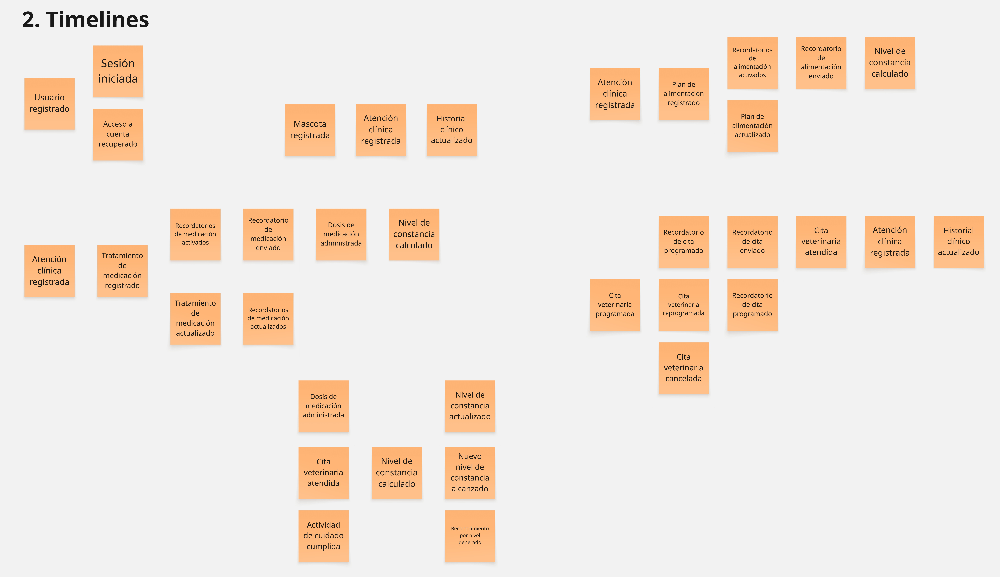

### 3. Pain Points / Hotspots

Sobre el Timeline se incorporaron los **Pain Points o Hotspots**, representando situaciones que generan dificultad, incertidumbre o riesgo durante los procesos identificados.

En el seguimiento clínico se reconocieron problemas relacionados con la dispersión o desactualización de la información entre consultas. En medication se identificaron dificultades para recordar las indicaciones del tratamiento, mantener actualizados los horarios cuando el tratamiento cambia y registrar consistentemente la administración de las dosis.

En appointments se señalaron situaciones como el olvido de citas y la necesidad de actualizar los recordatorios después de una reprogramación. De manera similar, en nutrition se consideró el riesgo de mantener recordatorios desactualizados cuando cambia el plan de alimentación.

En gamification también se identificó que el cálculo de constancia puede verse afectado si las actividades de cuidado o cumplimiento no son registradas correctamente.

Los Hotspots no fueron considerados eventos adicionales dentro del Timeline; se utilizaron como anotaciones sobre los puntos del flujo que requieren especial atención durante el posterior diseño del dominio.

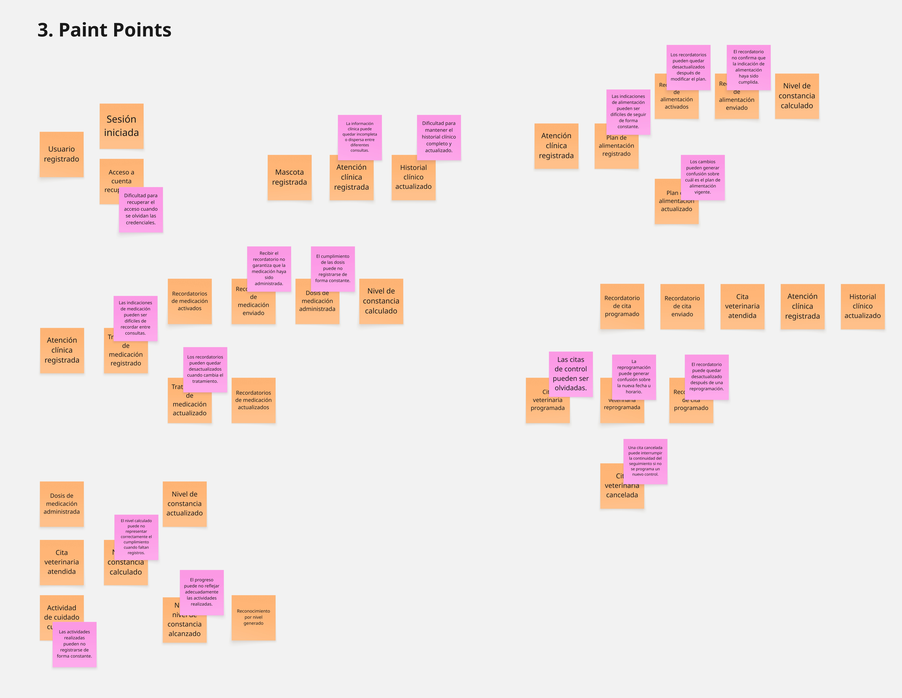

### 4. Pivotal Events

Posteriormente se identificaron los **Pivotal Events**, es decir, aquellos eventos que representan cambios importantes de estado o transiciones relevantes dentro de los procesos de negocio.

Entre los eventos considerados como puntos relevantes se encuentran el registro de una mascota, el registro de una atención clínica, el registro de un tratamiento de medicación, el registro de un plan de alimentación, la programación de una cita veterinaria, la atención de una cita y la administración de una dosis.

También se consideraron eventos asociados con gamification, como el cálculo y actualización del nivel de constancia, debido a que representan la transición desde actividades realizadas por el propietario hacia la evaluación de su nivel de adherencia.

La identificación de estos puntos permitió reconocer zonas naturales de transición dentro del EventStorm. Sin embargo, estos límites no fueron considerados todavía como Bounded Contexts, debido a que su análisis corresponde a la posterior actividad de Candidate Context Discovery.

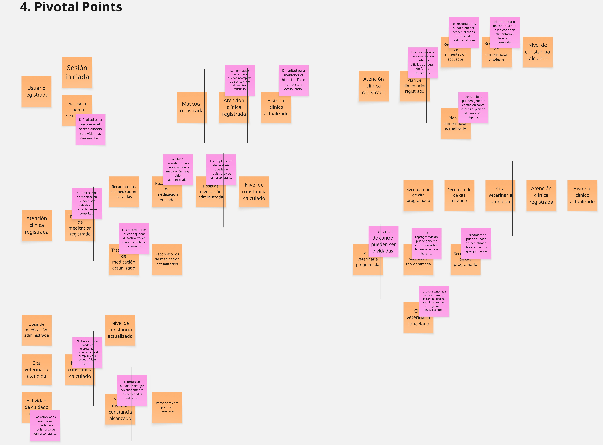

### 5. Commands & Actors

Una vez establecidos los eventos principales, se identificaron los **Commands** que provocan cambios en el dominio y los **Actors** responsables de iniciarlos.

El **Propietario** participa en acciones como registrar una mascota, programar o modificar una cita, registrar la administración de una dosis y gestionar determinadas acciones de seguimiento. El **Profesional veterinario** interviene principalmente en el registro de atenciones clínicas, tratamientos de medicación, planes de alimentación y la confirmación de citas atendidas. El **Administrador de clínica** participa en la gestión de información correspondiente a la clínica.

Asimismo, en IAM se identificaron acciones como registrar usuario, iniciar sesión y recuperar el acceso a una cuenta. Estas operaciones interactúan posteriormente con el sistema externo utilizado para la gestión de identidad.

Los Commands fueron redactados como acciones, mientras que sus resultados se mantuvieron representados mediante Domain Events en tiempo pasado. Las acciones que no son iniciadas directamente por una persona, sino que ocurren como consecuencia de otros eventos, fueron posteriormente asociadas a Policies.

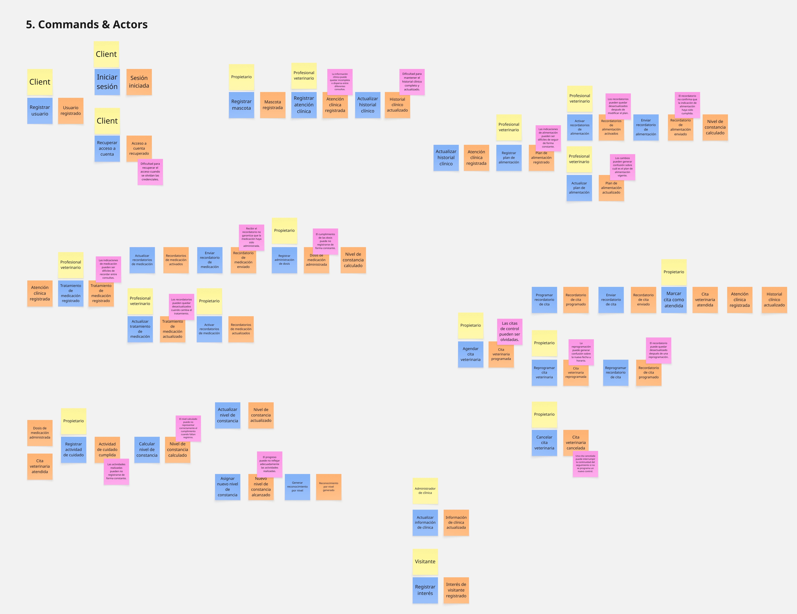

### 6. Policies

A continuación se incorporaron las **Policies**, utilizadas para representar reglas de negocio que reaccionan ante un Domain Event y provocan la ejecución de otro Command.

En Pet & Clinical Care se incorporó una política asociada a la actualización del historial clínico después del registro de una atención. De esta manera, una atención clínica registrada puede activar la regla correspondiente y producir el Command necesario para actualizar el historial.

En Appointments se identificaron políticas para programar o reprogramar los recordatorios cuando una cita es creada o modificada. De manera equivalente, Medication y Nutrition contienen reglas que permiten mantener sincronizados los recordatorios con los tratamientos o planes vigentes.

También se identificaron políticas relacionadas con la entrega de notificaciones, que producen Commands de envío cuando un recordatorio debe ser comunicado al propietario.

Finalmente, en Gamification se incorporaron reglas para recalcular la constancia después de actividades relevantes, actualizar el nivel correspondiente y generar reconocimientos cuando se cumplen las condiciones definidas.

Las Policies permitieron representar de forma explícita comportamientos automáticos del dominio sin asignarlos artificialmente a un actor humano.

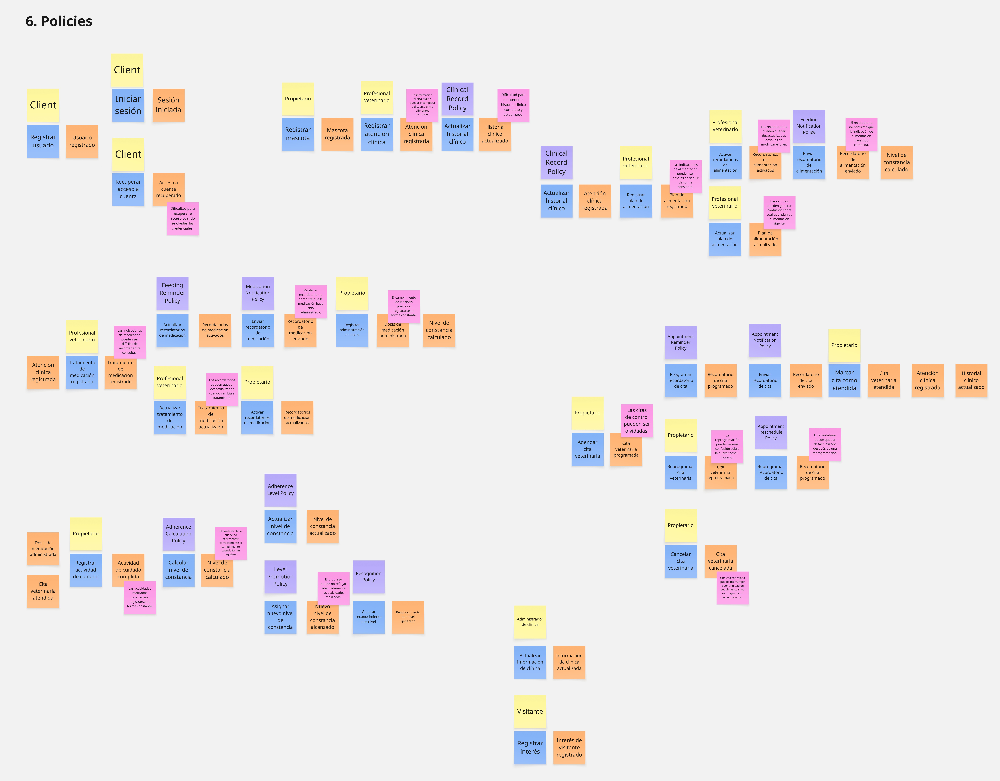

### 7. Read Models

Posteriormente se incorporaron los **Read Models**, que representan información preparada para ser consultada por los actores antes de tomar una decisión o ejecutar determinadas acciones.

Dentro de Pet & Clinical Care se consideraron vistas como **Patient List**, **Clinical Record View** y **Patient Evolution View**, utilizadas por el profesional veterinario para consultar la información disponible sobre una mascota y su evolución antes o durante el seguimiento clínico.

En Medication se incluyeron **Active Medication Treatment** y **Medication Schedule**, permitiendo al propietario conocer el tratamiento vigente y las dosis programadas. En Nutrition se incorporó **Current Feeding Plan**, que presenta las indicaciones vigentes del plan de alimentación.

Para Appointments se identificaron modelos como **Available Appointment Slots**, **Appointment Details** y **Veterinary Agenda**, que proporcionan información necesaria para programar, modificar o gestionar citas.

En Gamification se añadió **Constancy Progress**, mediante el cual el propietario puede consultar su nivel y progreso de constancia.

Los Read Models no representan modificaciones del estado del dominio y, por lo tanto, no generan por sí mismos nuevos Domain Events.

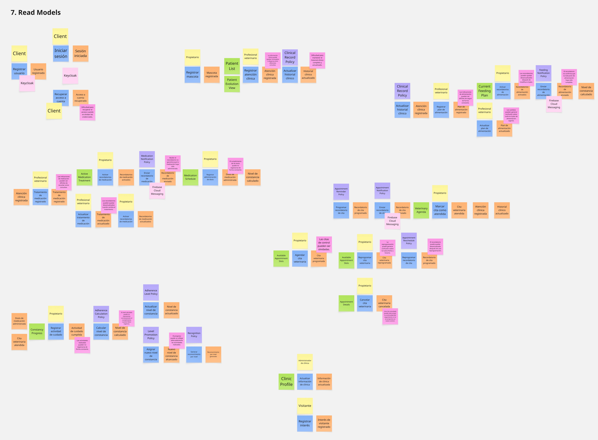

### 8. External Systems

Durante el refinamiento del EventStorm también se identificaron sistemas externos necesarios para completar determinados procesos.

Para IAM se identificó **Keycloak** como External System encargado de soportar los procesos relacionados con identidad y acceso, incluyendo registro de usuarios, autenticación y recuperación de acceso.

Asimismo, se identificó **Firebase Cloud Messaging (FCM)** como sistema externo encargado de realizar la entrega de notificaciones correspondientes a recordatorios de citas, medicación y alimentación.

La programación, activación o actualización de los recordatorios continúa siendo responsabilidad del dominio de VetPax, mientras que el acto de entregar la notificación al dispositivo se delega a Firebase Cloud Messaging.

Elementos como WebSockets no fueron representados como External Systems dentro del EventStorm, debido a que corresponden a mecanismos técnicos de comunicación y no a sistemas externos participantes del dominio.

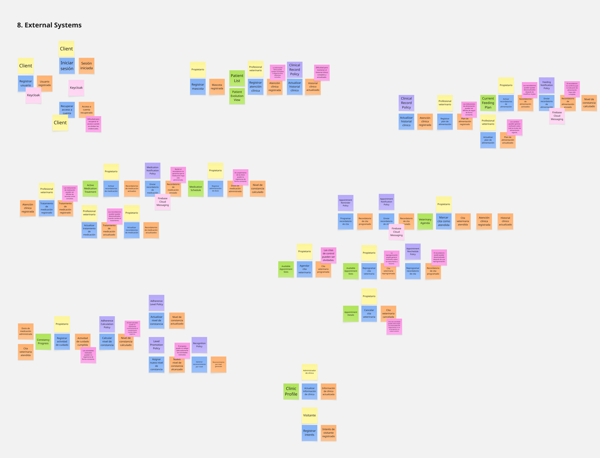

### 9. Aggregates

Luego de comprender los Commands, Events y reglas involucradas, se incorporaron los **Aggregates**, utilizados para representar las unidades del dominio responsables de mantener estado y asegurar las reglas de consistencia asociadas a cada operación.

El Aggregate **Pet** recibe las operaciones relacionadas con el registro de una mascota. **Clinical Record** concentra las operaciones asociadas con el registro de atenciones y actualización de información clínica.

**Medication Treatment** representa el estado del tratamiento de medicación y las operaciones relacionadas con su registro, actualización y administración de dosis. De manera equivalente, **Feeding Plan** representa las reglas y estado correspondientes al plan de alimentación.

El Aggregate **Appointment** concentra el ciclo de vida de una cita veterinaria, incluyendo su programación, reprogramación, cancelación y atención.

Para las operaciones de programación y mantenimiento de recordatorios se utilizó **Reminder**, permitiendo centralizar las acciones relacionadas con recordatorios originados desde appointments, medication y nutrition. La entrega efectiva de las notificaciones permanece delegada a Firebase Cloud Messaging.

En Gamification, **Adherence** representa el estado asociado con el progreso y nivel de constancia, incluyendo su cálculo, actualización y generación de reconocimientos. Finalmente, **Clinic** mantiene las operaciones relacionadas con los datos administrables de la clínica.

La identificación de estos Aggregates permitió precisar qué objeto del dominio recibe cada Command y qué Domain Event se produce como resultado, sin utilizar los Aggregates como límites definitivos de Bounded Contexts.

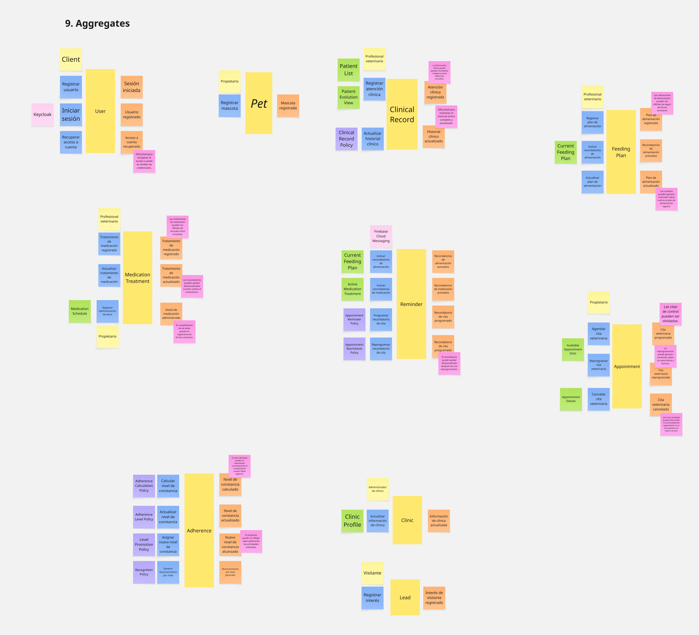

### 10. EventStorming

Finalmente, todos los elementos identificados durante las etapas anteriores fueron integrados en un único EventStorm. La representación final incluye Domain Events, Commands, Actors, Policies, Read Models, External Systems, Aggregates, Pain Points y Pivotal Events, conservando las relaciones causales identificadas durante el proceso.

Para facilitar su lectura, el EventStorm final quedó organizado visualmente en las siguientes áreas preliminares del dominio:

- **IAM**, relacionado con la identidad, autenticación y recuperación de acceso.
- **Pet & Clinical Care**, relacionado con la mascota, las atenciones veterinarias y el historial clínico.
- **Medication**, relacionado con tratamientos de medicación, administración de dosis y seguimiento asociado.
- **Appointments**, relacionado con la programación y ciclo de vida de citas veterinarias.
- **Nutrition**, relacionado con los planes de alimentación y su seguimiento.
- **Gamification**, relacionado con el cálculo de constancia, progreso y reconocimientos.
- **Clinic**, relacionado con la información y gestión básica de la clínica veterinaria.

Estas áreas mantienen relaciones entre sí. Por ejemplo, una cita veterinaria atendida puede continuar con el registro de una atención clínica y también aportar información para la evaluación de constancia. De la misma manera, la administración de una dosis puede producir una actualización en el seguimiento de adherencia.

Medication, Nutrition y Appointments también interactúan con la gestión de recordatorios. Los eventos producidos en estas áreas pueden activar Policies que generan Commands sobre Reminder y, cuando corresponde realizar la entrega de una notificación, se solicita el envío mediante Firebase Cloud Messaging.

IAM actúa como soporte para controlar la identidad y acceso de los usuarios que participan en los diferentes procesos del dominio, mientras que Pet & Clinical Care mantiene la información clínica central requerida para el seguimiento de las mascotas.

La integración de estos elementos permitió obtener una visión de nivel general suficientemente detallada del dominio de VetPax y evidenciar las dependencias existentes entre sus diferentes procesos. El EventStorm resultante constituye el punto de partida para la siguiente actividad de **Candidate Context Discovery**, en la que estas agrupaciones serán evaluadas para determinar los límites y responsabilidades de los posibles Bounded Contexts.

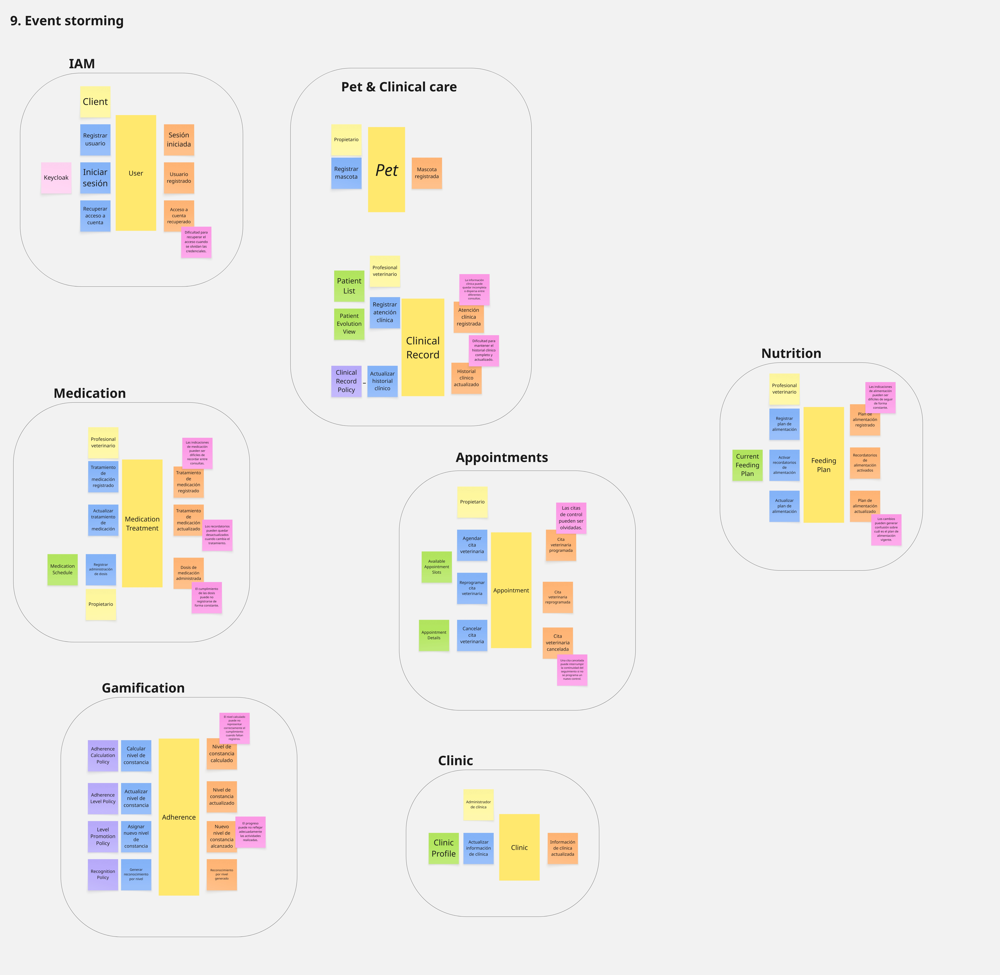

### 4.2.2. Candidate Context Discovery

A partir del EventStorm obtenido en la sección anterior, se realizó el proceso de **Candidate Context Discovery** con el propósito de identificar agrupaciones del dominio que presentaran responsabilidades, reglas y lenguaje suficientemente cohesionados como para ser considerados candidatos a Bounded Contexts.

Para este proceso se aplicó principalmente la técnica **look-for-pivotal-events**, utilizando los Pivotal Events previamente identificados para reconocer cambios significativos entre distintas responsabilidades del negocio. Esta técnica se complementó con **start-with-value**, evaluando qué partes del dominio aportan una capacidad diferenciada para el seguimiento continuo de mascotas geriátricas o con enfermedades crónicas.

Durante la sesión se revisaron progresivamente los Domain Events, Commands, Policies, Read Models, Aggregates y External Systems presentes en el EventStorm. En cada iteración se agruparon aquellos elementos que compartían un mismo propósito de negocio y un vocabulario relacionado, evitando utilizar únicamente criterios tecnológicos para establecer los límites.

Como resultado del proceso se identificaron siete candidate bounded contexts: **IAM, Pet & Clinical Care, Medication, Appointments, Nutrition, Gamification y Clinic**. Estos candidatos representan una primera propuesta de descomposición del dominio y serán posteriormente refinados mediante Domain Message Flows Modeling, Bounded Context Canvases y Context Mapping.

### 1. IAM

La primera agrupación identificada corresponde a **IAM (Identity and Access Management)**. Este candidate context concentra las operaciones relacionadas con el ciclo de identidad y acceso de los usuarios de VetPax.

Dentro de esta agrupación se encuentran los Commands asociados con el registro de usuarios, inicio de sesión y recuperación de acceso, junto con los Domain Events producidos como resultado de dichas acciones.

Durante el análisis se observó que estas responsabilidades poseen un propósito claramente diferenciado de las operaciones clínicas y de seguimiento de mascotas. Asimismo, las acciones de autenticación y recuperación se apoyan en **Keycloak** como External System.

Por estas razones, IAM fue separado de las capacidades funcionales relacionadas directamente con el cuidado veterinario. Su responsabilidad se limita a proporcionar identidad y control de acceso a los actores que posteriormente interactúan con los demás candidate contexts.

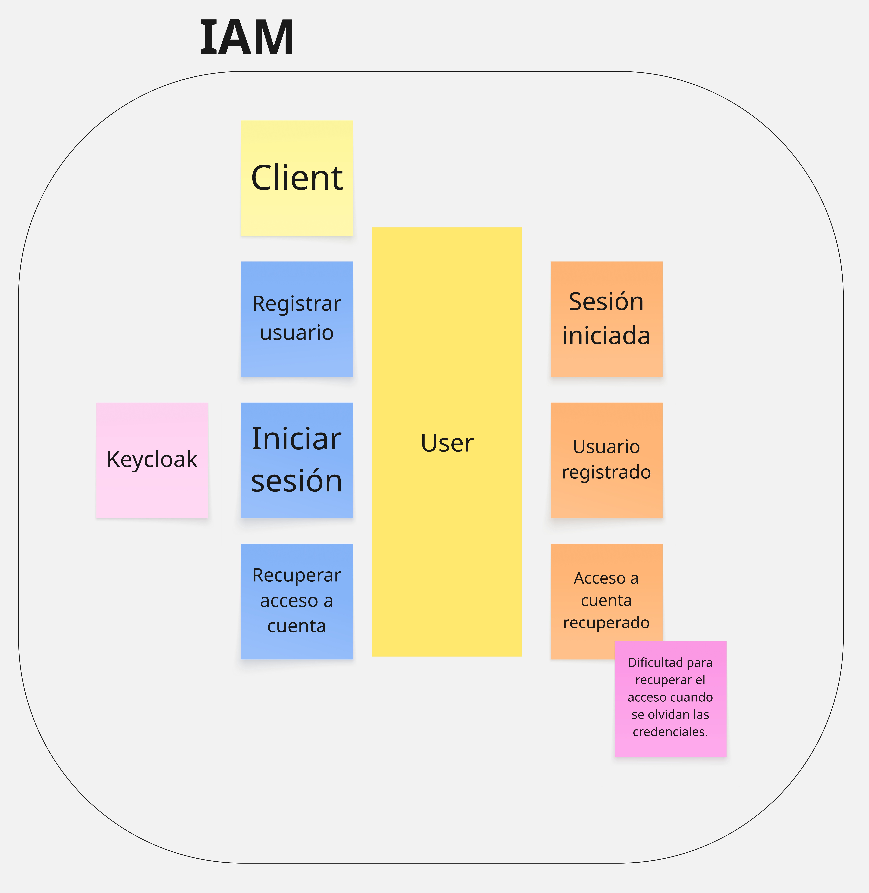

### 2. Pet & Clinical Care

La segunda agrupación corresponde a **Pet & Clinical Care**, donde se concentran las capacidades relacionadas con la mascota y su información clínica.

En esta área se identificaron elementos como el registro de una mascota, el registro de una atención clínica, la consulta de pacientes y evolución clínica, así como la actualización del historial clínico.

Los Aggregates **Pet** y **Clinical Record** se encuentran estrechamente relacionados debido a que la información clínica se encuentra asociada a una mascota determinada. Asimismo, Domain Events como `Mascota registrada`, `Atención clínica registrada` e `Historial clínico actualizado` presentan una continuidad natural dentro del proceso de seguimiento veterinario.

El análisis de Pivotal Events permitió reconocer que el registro de una atención clínica representa un cambio importante dentro del proceso, debido a que genera nueva información que debe incorporarse al historial clínico.

Por ello, estos elementos fueron agrupados inicialmente dentro del candidate context **Pet & Clinical Care**, encargado de mantener la información central utilizada durante el seguimiento clínico de la mascota.

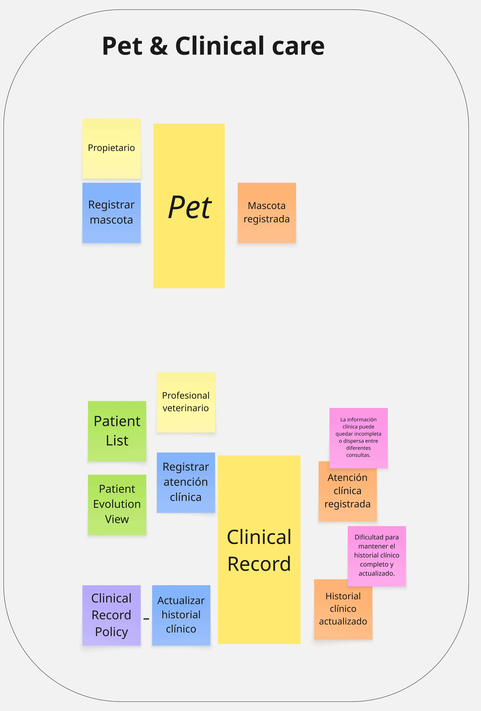

### 3. Medication

El candidate context **Medication** surgió al identificar un conjunto cohesionado de operaciones relacionadas con los tratamientos de medicación indicados para una mascota.

Esta agrupación comprende el registro y actualización de tratamientos, la información correspondiente a medicamentos, dosis y frecuencia, así como el registro de la administración de dosis por parte del propietario.

El Aggregate **Medication Treatment** concentra el estado principal de esta capacidad del dominio. Domain Events como `Tratamiento de medicación registrado`, `Tratamiento de medicación actualizado` y `Dosis de medicación administrada` evidencian un ciclo de vida propio que puede evolucionar independientemente de otras capacidades como citas o alimentación.

También se identifican interacciones con la gestión de recordatorios. Sin embargo, dichas interacciones no fueron consideradas suficientes para crear un candidate context independiente de recordatorios en esta etapa. Los recordatorios se mantienen asociados a la capacidad que los origina, mientras que su entrega mediante Firebase Cloud Messaging constituye una integración externa.

Por lo tanto, **Medication** fue identificado como candidate context debido a que concentra reglas específicas sobre tratamientos y seguimiento de la administración de medicación.

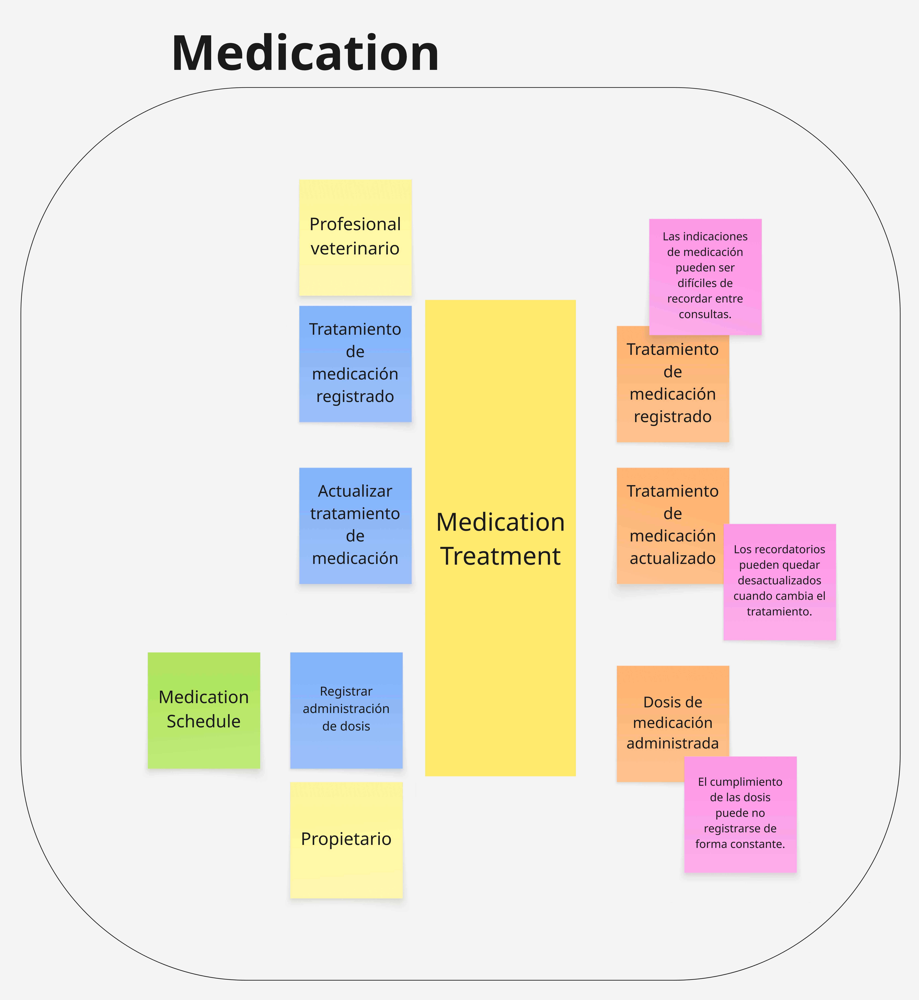

### 4. Appointments

La siguiente agrupación identificada corresponde a **Appointments**, responsable del ciclo de vida de las citas veterinarias.

Dentro de este candidate context se agruparon Commands como programar, reprogramar, cancelar y marcar una cita como atendida. Estos Commands producen Domain Events como `Cita veterinaria programada`, `Cita veterinaria reprogramada`, `Cita veterinaria cancelada` y `Cita veterinaria atendida`.

El Aggregate **Appointment** representa el estado principal de esta capacidad, debido a que una cita puede evolucionar entre diferentes estados y debe mantener reglas de consistencia asociadas con su fecha, horario y estado actual.

La programación o modificación de una cita también puede originar acciones asociadas con sus recordatorios. Estas acciones permanecen vinculadas al proceso de Appointments, mientras que la entrega de las notificaciones se realiza mediante Firebase Cloud Messaging.

Asimismo, `Cita veterinaria atendida` fue considerado un Pivotal Event relevante debido a que permite conectar Appointments con otros procesos del dominio. Una cita atendida puede conducir al registro de una atención clínica y también aportar información utilizada posteriormente por Gamification.

Estas características justificaron la identificación de **Appointments** como candidate bounded context independiente.

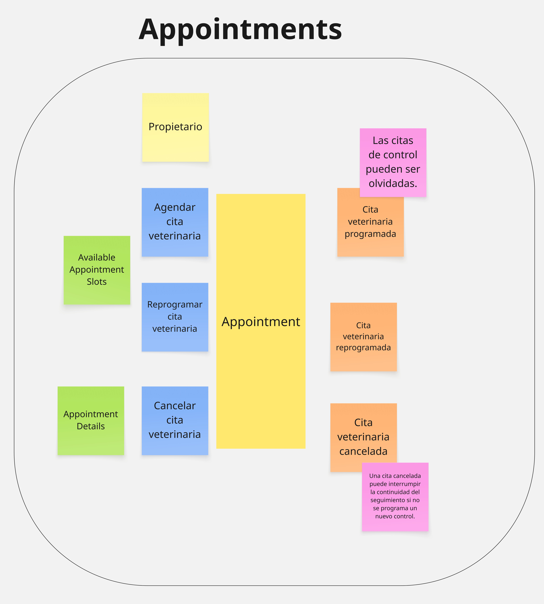

### 5. Nutrition

El candidate context **Nutrition** concentra las responsabilidades relacionadas con el plan de alimentación de la mascota.

Durante el EventStorming se identificaron Commands para registrar y actualizar un plan de alimentación, así como Domain Events como `Plan de alimentación registrado` y `Plan de alimentación actualizado`.

El Aggregate **Feeding Plan** mantiene la información vigente correspondiente a las indicaciones de alimentación. Además, el Read Model **Current Feeding Plan** permite al propietario consultar las indicaciones actualmente aplicables.

De manera similar a Medication, los cambios en el plan pueden requerir la actualización de recordatorios asociados. Sin embargo, estas acciones continúan considerándose parte del proceso de seguimiento del plan y no justifican por sí mismas la creación de un candidate context independiente.

La existencia de reglas y conceptos específicos vinculados con alimentación permitió separar esta capacidad de Medication, ya que ambos procesos pueden modificarse independientemente y utilizan información del negocio diferente.

Por ello se identificó **Nutrition** como candidate bounded context.

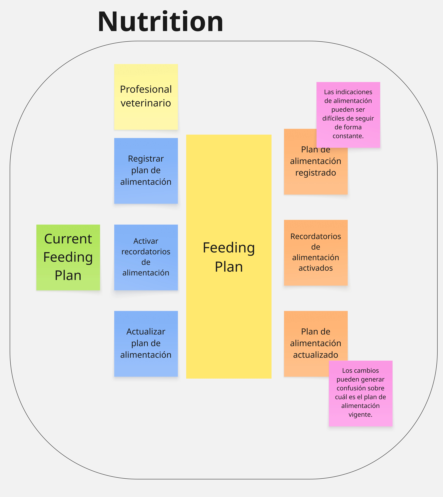

### 6. Gamification

La sexta agrupación corresponde a **Gamification**, responsable de las capacidades utilizadas para representar la constancia y participación del propietario en el seguimiento de los cuidados de su mascota.

Esta agrupación incluye eventos provenientes de otras partes del dominio, como la administración de una dosis, la asistencia a una cita veterinaria o el cumplimiento de una actividad de cuidado.

Estos eventos pueden activar Policies que provocan el cálculo y posterior actualización del nivel de constancia. El Aggregate **Adherence** mantiene el estado relacionado con el progreso del propietario y permite producir eventos como `Nivel de constancia calculado`, `Nivel de constancia actualizado`, `Nuevo nivel de constancia alcanzado` y `Reconocimiento por nivel generado`.

La necesidad de consumir información producida por Medication, Appointments y otras actividades de cuidado evidencia que Gamification depende de otros candidate contexts, pero no implica que deba formar parte de ellos. Su propósito de negocio es distinto: transformar determinadas actividades de seguimiento en indicadores de constancia y reconocimiento.

Por este motivo, **Gamification** se identificó como un candidate bounded context propio.

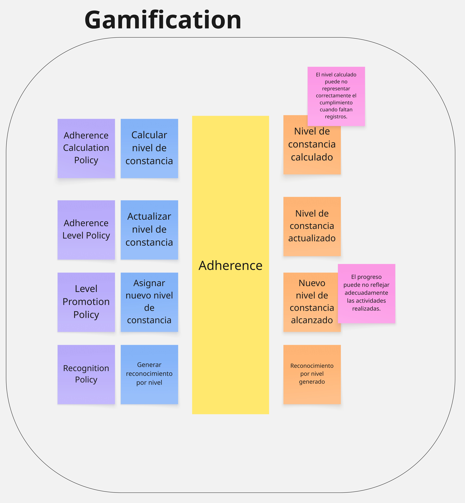

### 7. Clinic

Finalmente, se identificó el candidate context **Clinic**, relacionado con la información propia de la clínica veterinaria.

En esta agrupación se encuentran las operaciones para mantener y actualizar la información de la clínica, utilizando el Aggregate **Clinic** y produciendo Domain Events como `Información de clínica actualizada`.

Esta responsabilidad se distingue de Pet & Clinical Care debido a que el primero concentra información clínica asociada con la mascota y sus atenciones, mientras que Clinic representa información propia de la organización veterinaria.

Aunque Clinic mantiene relaciones con otras capacidades, especialmente Pet & Clinical Care y Appointments, su información presenta un ciclo de vida y responsabilidad propios.

Por estas razones se consideró **Clinic** como un candidate bounded context independiente.

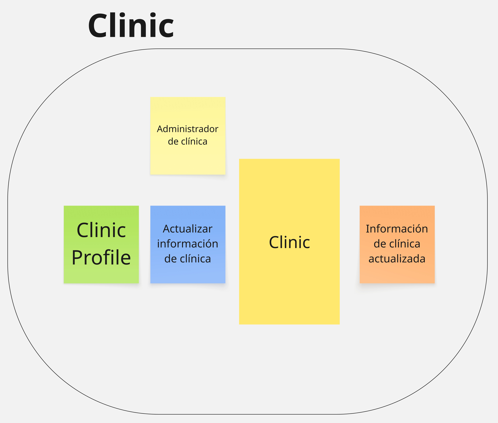

### Resultado del Candidate Context Discovery

Al finalizar la sesión se obtuvo la siguiente propuesta preliminar de candidate bounded contexts:

| Candidate Context | Responsabilidad principal |
|---|---|
| **IAM** | Identidad, autenticación y control de acceso de los usuarios. |
| **Pet & Clinical Care** | Gestión de la mascota, atenciones veterinarias, historial y evolución clínica. |
| **Medication** | Gestión y seguimiento de tratamientos de medicación y administración de dosis. |
| **Appointments** | Gestión del ciclo de vida de las citas veterinarias. |
| **Nutrition** | Gestión y seguimiento de los planes de alimentación. |
| **Gamification** | Cálculo de constancia, progreso, niveles y reconocimientos. |
| **Clinic** | Gestión de la información correspondiente a la clínica veterinaria. |

El proceso también permitió identificar relaciones preliminares entre los candidate contexts. **Appointments** se relaciona con **Pet & Clinical Care** cuando una cita atendida deriva en una nueva atención clínica. **Medication** y **Appointments** pueden producir eventos utilizados por **Gamification** para calcular la constancia del propietario. Por su parte, **IAM** proporciona soporte de identidad y acceso para los actores que participan en las distintas capacidades del dominio.

Asimismo, las funcionalidades relacionadas con recordatorios aparecen en Medication, Appointments y Nutrition. Durante esta etapa se decidió no promoverlas a un candidate bounded context independiente, debido a que su significado y ciclo de vida se encuentran asociados principalmente con la capacidad de negocio que origina cada recordatorio. La interacción con Firebase Cloud Messaging corresponde a la entrega externa de las notificaciones y será considerada posteriormente al analizar las relaciones entre contexts.

La propuesta obtenida no representa todavía la versión definitiva de los Bounded Contexts. Los límites y dependencias identificados serán revisados en las siguientes actividades de diseño estratégico, especialmente mediante **Domain Message Flows Modeling**, **Bounded Context Canvases** y **Context Mapping**.

### 4.2.3. Domain Message Flows Modeling

Para esta sección, el objetivo del equipo fue visualizar cómo colaboran los Bounded Contexts
identificados en el Candidate Context Discovery (Pet & Clinical Care, Appointments, Medication,
Nutrition, Clinic, Adherence & Gamification e IAM) mediante comandos, eventos de dominio y
solicitudes sincrónicas, para resolver los principales casos de uso de VetPax. Se aplicó la técnica
de **Domain Storytelling** para describir estas interacciones, tanto humanas (dueño, veterinario)
como de sistemas (contextos, sistemas externos).

#### Historia A — Cita Atendida: Actualización de Historial y Cálculo de Adherencia

1. El dueño marca la cita de su mascota como atendida desde la App Móvil.
2. La App Móvil envía el command `MarcarCitaComoAtendida` al contexto **Appointment**.
3. Appointment persiste el nuevo estado de la cita y publica el evento de dominio `CitaVeterinariaAtendida`.
4. El contexto **Pet & Clinical Record** consume el evento y actualiza el historial clínico, incorporando la atención registrada.
5. En paralelo, el contexto **Adherence & Gamification** también consume el evento `CitaVeterinariaAtendida`, calcula la adherencia del dueño y evalúa si corresponde actualizar su nivel de constancia (Bronce, Plata, Oro).
6. Adherence & Gamification publica el evento `NivelDeConstanciaActualizado`.
7. La App Móvil refresca la vista, mostrando al dueño el historial actualizado y su progreso de constancia.

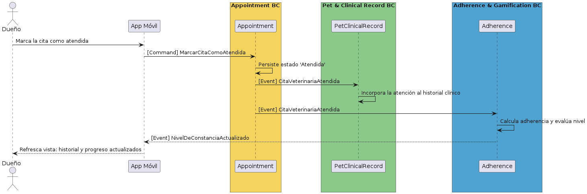

#### Historia B — Registro de Dosis de Medicación y Actualización de Adherencia

1. El dueño administra la dosis de medicación indicada a su mascota y lo registra desde la App Móvil.
2. La App Móvil envía el command `RegistrarDosisAdministrada` al contexto **Medication**.
3. Medication persiste la dosis administrada y publica el evento de dominio `DosisDeMedicacionAdministrada`.
4. El contexto **Adherence & Gamification** consume el evento, recalcula la adherencia del propietario y evalúa su nivel de constancia, publicando el evento `NivelDeConstanciaActualizado`.
5. Adherence & Gamification despacha una notificación de reconocimiento a través del sistema externo **Firebase Cloud Messaging**.
6. Firebase Cloud Messaging entrega la notificación push a la App Móvil.
7. La App Móvil muestra al dueño el nuevo nivel alcanzado.

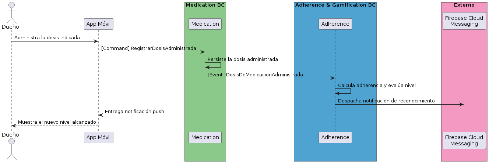

#### Historia C — Prescripción de Plan Nutricional con Recordatorio Automático

1. El veterinario revisa el diagnóstico de la mascota y prescribe un plan de alimentación personalizado desde el Panel Web.
2. El Panel Web envía el command `PrescribirPlanNutricional` al contexto **Nutrition**.
3. Nutrition crea el plan nutricional, lo persiste y publica el evento `PlanNutricionalRegistrado`.
4. Una policy interna del contexto evalúa continuamente los horarios de alimentación: al llegar el horario correspondiente, genera el evento `RecordatorioDeAlimentacionGenerado`.
5. Nutrition despacha la notificación correspondiente a través de **Firebase Cloud Messaging**.
6. Firebase Cloud Messaging entrega el recordatorio de alimentación a la App Móvil del dueño.

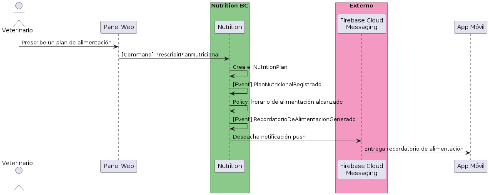

#### Historia D — Registro de Mascota y Agendamiento de la Primera Cita

1. El dueño registra a su mascota geriátrica o con enfermedad crónica desde la App Móvil.
2. La App Móvil envía el command `RegistrarMascota` al contexto **Pet & Clinical Record**.
3. Pet & Clinical Record persiste el perfil de la mascota y publica el evento `MascotaRegistrada`.
4. Con la mascota ya registrada, la App Móvil envía el command `AgendarCitaVeterinaria` al contexto **Appointment**.
5. Appointment crea la cita en estado "Programada" y se sincroniza con el **servicio externo de calendario** para reservar la fecha y hora seleccionadas.
6. Una vez confirmada la reserva, Appointment publica el evento `CitaVeterinariaProgramada`.
7. La App Móvil confirma al dueño el registro de la mascota y la programación de su primera cita.

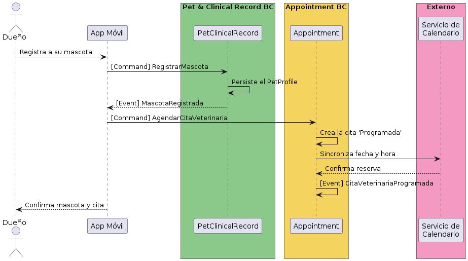

### 4.2.4. Bounded Context Canvases

La definición detallada de cada Bounded Context Canvas permitió consolidar el diseño de los contextos identificados a partir de los siete flujos del EventStorming de **VetPax**. En cada canvas se establecieron los criterios de diseño necesarios para garantizar que los bounded contexts generen valor, operen de forma independiente y contribuyan a reducir la complejidad general de la solución: su propósito, su clasificación estratégica, los roles que cumple dentro del dominio, los mensajes que recibe y emite, el lenguaje ubicuo que utiliza y las decisiones de negocio, supuestos, métricas y preguntas abiertas que lo rodean.

Se utilizó la plantilla *Bounded Context Canvas v5* de DDD Crew. En las secciones de comunicación de entrada y salida, los post-its **verdes** representan actores o contextos colaboradores, los **azules** comandos o consultas, los **naranjas** eventos de dominio y los **morados** decisiones de negocio.

La siguiente tabla resume la clasificación estratégica de los siete contextos:

| Bounded Context | Subdominio | Modelo de negocio | Evolución | Roles de dominio |
| --- | --- | --- | --- | --- |
| Pet & Clinical Care | Core | Revenue Generator / Engagement | Custom Built | Execution, Audit |
| Appointment Management | Supporting | Engagement Creator | Custom Built | Execution |
| Medication Treatment | Core | Engagement Creator | Custom Built | Execution |
| Nutrition Management | Core | Revenue Generator / Engagement | Custom Built | Specification, Execution |
| Clinic Management | Supporting | Cost Reduction | Custom Built | Specification |
| Adherence & Gamification | Core | Engagement Creator | Custom Built | Analysis |
| Identity & Access Management (IAM) | Generic | Compliance / Security | Commodity | Enforcer |

#### Pet & Clinical Care

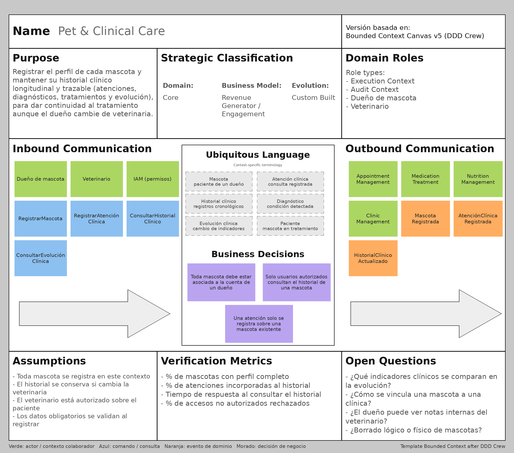

Este contexto tiene como propósito registrar el perfil de cada mascota y mantener su historial clínico longitudinal y trazable (atenciones, diagnósticos, tratamientos y evolución), de modo que el tratamiento tenga continuidad aunque el dueño cambie de veterinaria. Se clasifica como subdominio **core**, ya que la continuidad clínica es la base de la propuesta de valor de VetPax, y su rol es el de *Execution Context* y *Audit Context* por la trazabilidad que ofrece.

- **Comunicación de entrada:** los comandos `RegistrarMascota` y `RegistrarAtenciónClínica`, y las consultas `ConsultarHistorialClínico` y `ConsultarEvoluciónClínica`, iniciados por el dueño y el veterinario, con los permisos validados por IAM.
- **Comunicación de salida:** los eventos `MascotaRegistrada`, `AtenciónClínicaRegistrada` e `HistorialClínicoActualizado`, y el suministro del identificador de la mascota y de los pacientes a Appointment Management, Medication Treatment, Nutrition Management y Clinic Management.
- **Decisiones de negocio:** toda mascota debe estar asociada a la cuenta de un dueño; solo usuarios autorizados consultan el historial; una atención clínica solo se registra sobre una mascota existente.
- **Preguntas abiertas:** qué indicadores clínicos se comparan en la evolución, cómo se vincula una mascota con una clínica, si el dueño puede ver notas internas del veterinario y si el borrado de mascotas es lógico o físico.

#### Appointment Management

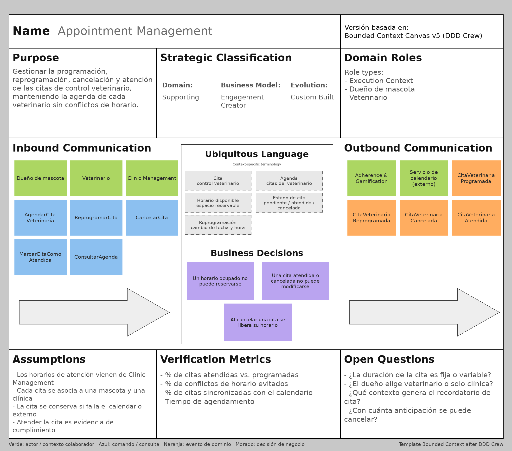

Su propósito es gestionar la programación, reprogramación, cancelación y atención de las citas de control veterinario, manteniendo la agenda de cada veterinario sin conflictos de horario. Es un subdominio de **soporte** con rol de *Execution Context*: no diferencia por sí mismo a VetPax, pero es necesario para sostener el seguimiento continuo y genera evidencia de cumplimiento para el sistema de gamificación.

- **Comunicación de entrada:** los comandos `AgendarCitaVeterinaria`, `ReprogramarCita`, `CancelarCita` y `MarcarCitaComoAtendida`, y la consulta `ConsultarAgenda`, iniciados por el dueño y el veterinario; además consume los horarios de atención publicados por Clinic Management.
- **Comunicación de salida:** los eventos `CitaVeterinariaProgramada`, `CitaVeterinariaReprogramada`, `CitaVeterinariaCancelada` y `CitaVeterinariaAtendida`; este último es consumido por Adherence & Gamification. También solicita la sincronización de citas confirmadas al servicio externo de calendario.
- **Decisiones de negocio:** un horario ocupado no puede reservarse; una cita atendida o cancelada no puede modificarse; al cancelar una cita se libera su horario.
- **Preguntas abiertas:** si la duración de la cita es fija o variable, si el dueño elige veterinario o solo clínica, qué contexto genera el recordatorio de cita y con cuánta anticipación puede cancelarse.

#### Medication Treatment

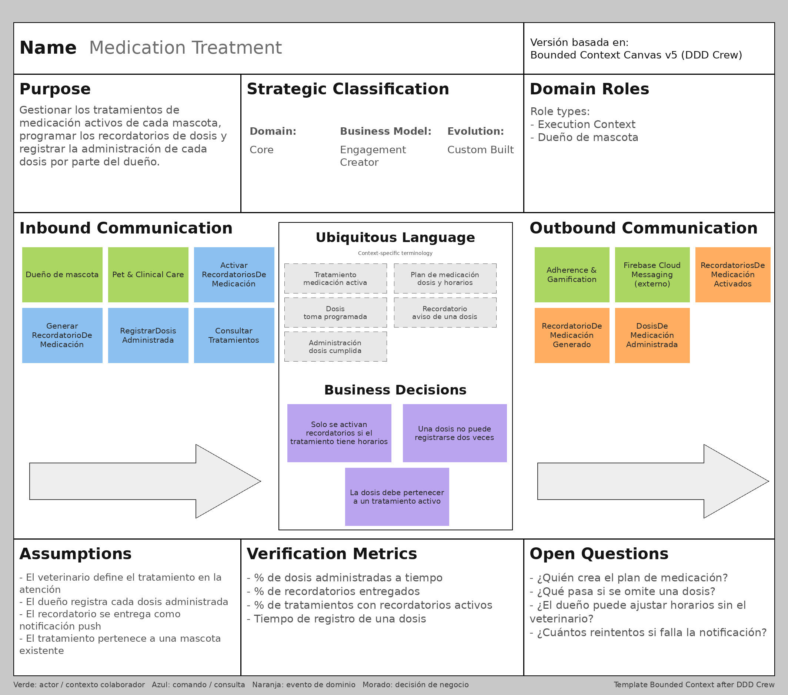

Este contexto gestiona los tratamientos de medicación activos de cada mascota, programa los recordatorios de dosis y registra la administración de cada dosis por parte del dueño. Es un subdominio **core** con rol de *Execution Context*, ya que la adherencia a la medicación es el núcleo del problema que VetPax busca resolver.

- **Comunicación de entrada:** los comandos `ActivarRecordatoriosDeMedicación`, `GenerarRecordatorioDeMedicación` (disparado por una policy al alcanzar el horario de una dosis pendiente) y `RegistrarDosisAdministrada`, y la consulta `ConsultarTratamientos`.
- **Comunicación de salida:** los eventos `RecordatoriosDeMedicaciónActivados`, `RecordatorioDeMedicaciónGenerado` y `DosisDeMedicaciónAdministrada`; este último es consumido por Adherence & Gamification. La entrega del recordatorio se realiza mediante Firebase Cloud Messaging.
- **Decisiones de negocio:** solo se activan recordatorios si el tratamiento tiene horarios definidos; una dosis no puede registrarse dos veces; la dosis debe pertenecer a un tratamiento activo.
- **Preguntas abiertas:** quién crea el plan de medicación, qué ocurre si se omite una dosis, si el dueño puede ajustar horarios sin el veterinario y cuántos reintentos se realizan si falla la notificación.

#### Nutrition Management

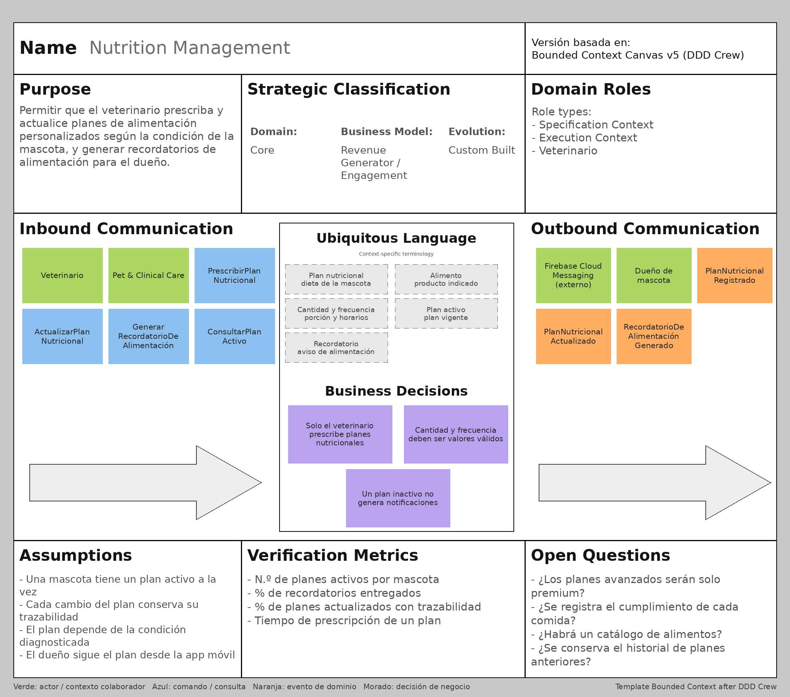

Permite que el veterinario prescriba y actualice planes de alimentación personalizados según la condición de la mascota, y genera recordatorios de alimentación para el dueño. Es un subdominio **core** con roles de *Specification Context* (define el plan) y *Execution Context* (genera los recordatorios), y sustenta las funcionalidades premium de dietas avanzadas del modelo freemium.

- **Comunicación de entrada:** los comandos `PrescribirPlanNutricional`, `ActualizarPlanNutricional` y `GenerarRecordatorioDeAlimentación`, y la consulta `ConsultarPlanActivo`, con la mascota como referencia proveniente de Pet & Clinical Care.
- **Comunicación de salida:** los eventos `PlanNutricionalRegistrado`, `PlanNutricionalActualizado` y `RecordatorioDeAlimentaciónGenerado`, con entrega de notificaciones mediante Firebase Cloud Messaging.
- **Decisiones de negocio:** solo el veterinario prescribe planes nutricionales; cantidad y frecuencia deben ser valores válidos; un plan inactivo no genera notificaciones.
- **Preguntas abiertas:** si los planes avanzados serán exclusivos de la suscripción premium, si se registrará el cumplimiento de cada comida, si habrá un catálogo de alimentos y si se conservará el historial de planes anteriores.

#### Clinic Management

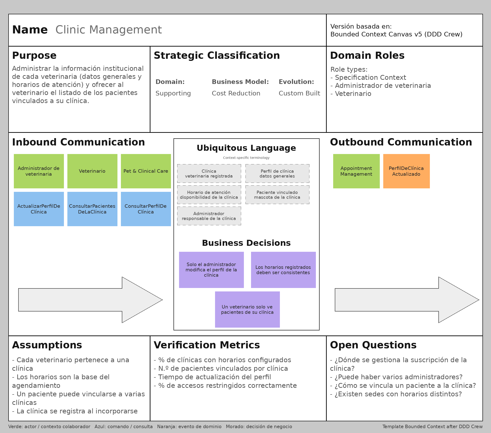

Administra la información institucional de cada veterinaria (datos generales y horarios de atención) y ofrece al veterinario el listado de los pacientes vinculados a su clínica. Es un subdominio de **soporte** con rol de *Specification Context*, porque define las condiciones (horarios) bajo las cuales otros contextos operan, y su modelo de negocio es la reducción de costos operativos de las veterinarias.

- **Comunicación de entrada:** los comandos `ActualizarPerfilDeClínica` y las consultas `ConsultarPacientesDeLaClínica` y `ConsultarPerfilDeClínica`, iniciados por el administrador de la veterinaria y el veterinario.
- **Comunicación de salida:** el evento `PerfilDeClínicaActualizado`, cuyos horarios de atención son utilizados por Appointment Management durante el agendamiento.
- **Decisiones de negocio:** solo el administrador modifica el perfil de la clínica; los horarios registrados deben ser consistentes; un veterinario solo ve los pacientes de su propia clínica.
- **Preguntas abiertas:** dónde se gestiona la suscripción de la clínica, si puede haber varios administradores, cómo se vincula un paciente a la clínica y si existen sedes con horarios distintos.

#### Adherence & Gamification

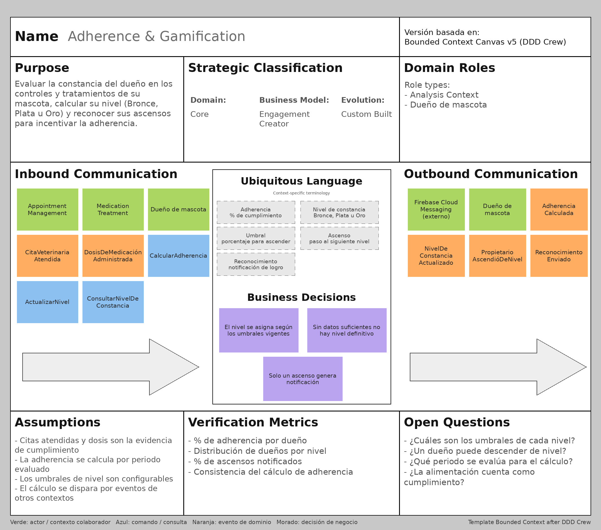

Evalúa la constancia del dueño en los controles y tratamientos de su mascota, calcula su nivel (Bronce, Plata u Oro) y reconoce sus ascensos para incentivar la adherencia. Es un subdominio **core** con rol de *Analysis Context*, pues no ejecuta operaciones clínicas sino que analiza el cumplimiento generado en otros contextos; constituye el principal diferenciador de VetPax frente a un simple registro de historiales.

- **Comunicación de entrada:** los eventos `CitaVeterinariaAtendida` (de Appointment Management) y `DosisDeMedicaciónAdministrada` (de Medication Treatment), los comandos internos `CalcularAdherencia` y `ActualizarNivel`, y la consulta `ConsultarNivelDeConstancia` del dueño.
- **Comunicación de salida:** los eventos `AdherenciaCalculada`, `NivelDeConstanciaActualizado`, `PropietarioAscendióDeNivel` y `ReconocimientoEnviado`, con entrega de la notificación de ascenso mediante Firebase Cloud Messaging.
- **Decisiones de negocio:** el nivel se asigna según los umbrales vigentes; sin datos suficientes no existe un nivel definitivo; solo un ascenso genera notificación.
- **Preguntas abiertas:** cuáles son los umbrales de cada nivel, si un dueño puede descender de nivel, qué periodo se evalúa y si el cumplimiento de la alimentación cuenta como evidencia.

#### IAM (Identity & Access Management)

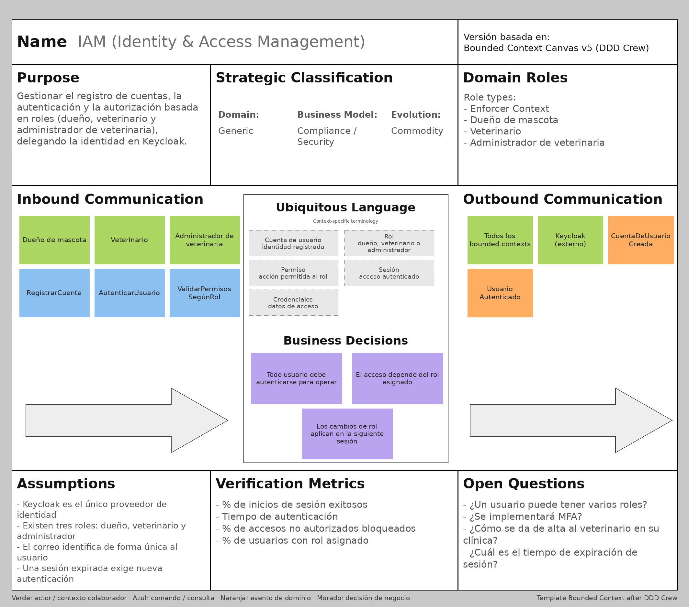

Gestiona el registro de cuentas, la autenticación y la autorización basada en roles (dueño de mascota, veterinario y administrador de veterinaria), delegando la gestión de identidad en Keycloak. Es un subdominio **genérico** de tipo *commodity* con rol de *Enforcer Context*: su funcionalidad es ajena a la operación clínica, por lo que se justifica separarlo para que las políticas de seguridad evolucionen de forma independiente.

- **Comunicación de entrada:** los comandos `RegistrarCuenta`, `AutenticarUsuario` y `ValidarPermisosSegúnRol`, iniciados por los tres tipos de usuario.
- **Comunicación de salida:** los eventos `CuentaDeUsuarioCreada` y `UsuarioAutenticado`, y la emisión de la identidad y los roles hacia todos los bounded contexts, apoyada en Keycloak.
- **Decisiones de negocio:** todo usuario debe autenticarse para operar; el acceso depende del rol asignado; los cambios de rol se aplican en la siguiente sesión.
- **Preguntas abiertas:** si un usuario puede tener varios roles, si se implementará autenticación multifactor, cómo se da de alta al veterinario en su clínica y cuál es el tiempo de expiración de la sesión.

---

### 4.2.5. Context Mapping

El proceso de Context Mapping permitió representar las relaciones estructurales y los contratos de integración entre los bounded contexts definidos en VetPax. Mientras que los Bounded Context Canvases detallan cada contexto de manera aislada, el Context Map ofrece una visión sistémica de cómo colaboran e intercambian información dentro de los límites de la solución, identificando qué contexto es *upstream* (proveedor) y cuál es *downstream* (consumidor) en cada relación.

Para su elaboración se aplicaron preguntas de exploración sugeridas en Domain-Driven Design, adaptadas al dominio de VetPax:

- ¿Qué contexto es dueño de la información de la mascota y cuáles dependen de ella para operar?
- ¿Qué eventos de un contexto constituyen evidencia para el cálculo de otro?
- ¿Qué integraciones con servicios de terceros deben aislarse para no contaminar el modelo de dominio?
- ¿Qué ocurre si un proveedor externo (identidad, notificaciones, calendario) debe ser reemplazado?

A partir de este análisis se identificaron y aplicaron los siguientes patrones de relación:

- **Customer/Supplier**, en la relación de **Pet & Clinical Care** con **Appointment Management, Medication Treatment, Nutrition Management y Clinic Management**, donde Pet & Clinical Care actúa como *supplier* al proveer el identificador y los datos de la mascota y de los pacientes vinculados. De igual forma, **Clinic Management** actúa como *supplier* de **Appointment Management** al proveer los horarios de atención de la clínica mediante el evento `PerfilDeClínicaActualizado`. Al pertenecer todos los contextos al mismo equipo, los contextos *customer* pueden negociar directamente los datos que necesitan.
- **Open Host Service (OHS) y Published Language**, en el contexto **IAM**, que expone un mecanismo estandarizado de autenticación y autorización basado en roles (dueño de mascota, veterinario y administrador de veterinaria), consumido por el resto de contextos para proteger sus operaciones. Los contextos consumidores adoptan el modelo de identidad y roles definido por IAM sin imponer el suyo (**Conformist**).
- **Event-Driven Consistency**, en la propagación de los eventos `CitaVeterinariaAtendida` (publicado por Appointment Management) y `DosisDeMedicaciónAdministrada` (publicado por Medication Treatment), ambos consumidos por **Adherence & Gamification** como evidencia de cumplimiento para recalcular la adherencia y el nivel de constancia del dueño. Adherence & Gamification se comporta como *conformist* frente al contrato de dichos eventos, lo que evita acoplar los contextos clínicos a la lógica de gamificación.
- **Anticorruption Layer (ACL)**, mediante adaptadores en la capa de infraestructura, en la integración de **IAM** con **Keycloak**, de **Medication Treatment, Nutrition Management y Adherence & Gamification** con **Firebase Cloud Messaging** para el envío de notificaciones push, y de **Appointment Management** con el **servicio externo de calendario**. Esto aísla el modelo de dominio de los contratos de cada proveedor y permite reemplazarlos sin afectar el núcleo del sistema, en línea con la decisión arquitectónica ADD08 (patrón Adapter).

La siguiente tabla detalla cada relación del Context Map:

| N.º | Upstream | Downstream | Patrón | Mensaje o contrato | Tipo |
| --- | --- | --- | --- | --- | --- |
| 1 | Keycloak (externo) | IAM | Anticorruption Layer | Identidad, credenciales y roles del usuario | Síncrona |
| 2 | IAM | Todos los contextos | Open Host Service, Published Language (downstream: Conformist) | Identidad autenticada y roles | Síncrona |
| 3 | Pet & Clinical Care | Appointment Management | Customer/Supplier | Identificador de la mascota | Síncrona |
| 4 | Pet & Clinical Care | Medication Treatment | Customer/Supplier | Identificador de la mascota | Síncrona |
| 5 | Pet & Clinical Care | Nutrition Management | Customer/Supplier | Identificador de la mascota | Síncrona |
| 6 | Pet & Clinical Care | Clinic Management | Customer/Supplier | Pacientes vinculados a la clínica | Síncrona |
| 7 | Clinic Management | Appointment Management | Customer/Supplier, Published Language | `PerfilDeClínicaActualizado` (horarios de atención) | Asíncrona |
| 8 | Appointment Management | Adherence & Gamification | Event-Driven Consistency (downstream: Conformist) | `CitaVeterinariaAtendida` | Asíncrona |
| 9 | Medication Treatment | Adherence & Gamification | Event-Driven Consistency (downstream: Conformist) | `DosisDeMedicaciónAdministrada` | Asíncrona |
| 10 | Medication Treatment, Nutrition Management, Adherence & Gamification | Firebase Cloud Messaging (externo) | Anticorruption Layer | Recordatorios de medicación y alimentación, notificación de ascenso | Síncrona |
| 11 | Appointment Management | Servicio de calendario (externo) | Anticorruption Layer | Sincronización de citas confirmadas | Síncrona |

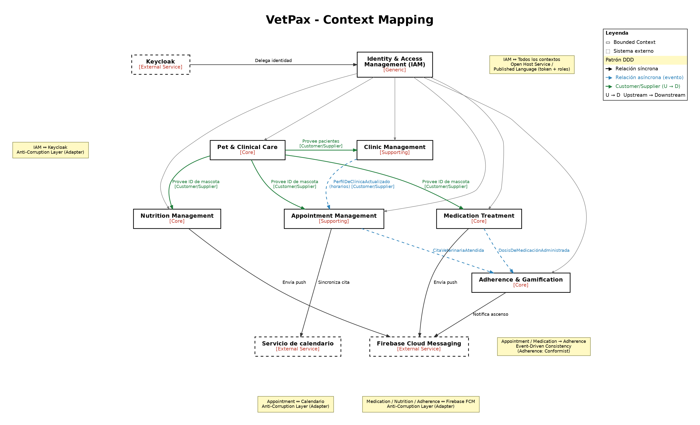

El Context Map resultante refleja a **Pet & Clinical Care** como el contexto central de VetPax, del cual dependen estructuralmente Appointment Management, Medication Treatment, Nutrition Management y Clinic Management para operar con datos fiables de la mascota. **Pet & Clinical Care, Medication Treatment, Nutrition Management y Adherence & Gamification** conforman los subdominios *core* que diferencian la propuesta de valor: el seguimiento clínico-nutricional continuo y la motivación de la constancia del dueño. **Appointment Management y Clinic Management** operan como subdominios de soporte que organizan la agenda y la información institucional de las veterinarias, mientras que **IAM** actúa como subdominio genérico transversal que provee seguridad a toda la solución.

Esta organización responde directamente a la decisión de aplicar Domain-Driven Design con bounded contexts (ADD07) y refuerza los atributos de calidad de mantenibilidad e interoperabilidad, ya que cada contexto puede evolucionar de forma independiente y las integraciones externas quedan encapsuladas. Por último, WebSockets, al ser un mecanismo técnico de comunicación en tiempo real y no una capacidad del dominio, no se representa como relación entre contextos.

---

## 4.3. Software Architecture

La arquitectura de software de VetPax se documenta siguiendo el modelo C4, que describe el sistema en niveles sucesivos de detalle: el ecosistema completo (System Landscape), el sistema y su entorno (Context), las aplicaciones y almacenes de datos que lo componen (Container) y su despliegue en infraestructura (Deployment). Los diagramas se construyeron con Structurizr DSL a partir de las decisiones arquitectónicas definidas en el Strategic-Level Attribute-Driven Design: arquitectura hexagonal (ADD01 y ADD02), APIs RESTful (ADD04), comunicación en tiempo real mediante WebSockets (ADD05), autenticación con Keycloak (ADD03), notificaciones con Firebase Cloud Messaging (ADD06) y adaptadores para servicios externos (ADD08).

### 4.3.1. Software Architecture System Landscape Diagram

*Expone el ecosistema completo donde nuestro sistema interactúa con múltiples sistemas externos, identificando dependencias y límites organizacionales.*

El System Landscape Diagram incluye todos los sistemas de la solución, las personas que interactúan con ellos y los sistemas externos de los que dependen. Además de la **plataforma VetPax** (aplicación móvil, panel web y API), el ecosistema contempla la **VetPax Landing Page**, un sitio informativo independiente donde el visitante conoce la propuesta de valor y registra su interés; la landing envía esos leads a la plataforma y dirige a cada segmento hacia la aplicación correspondiente.

**Personas**

| Persona | Descripción |
| --- | --- |
| Dueño de mascota | Dueño de una mascota geriátrica o con enfermedad crónica. Gestiona su historial, citas, medicación y dieta desde la aplicación móvil. |
| Veterinario | Registra atenciones clínicas, prescribe planes de dieta y gestiona su agenda de citas desde el panel web. |
| Administrador de veterinaria | Configura el perfil y los horarios de atención de la clínica desde el panel web. |
| Visitante | Persona interesada en conocer VetPax que registra su interés en la landing page. |

**Sistemas**

| Sistema | Tipo | Descripción |
| --- | --- | --- |
| VetPax | Sistema propio | Plataforma de seguimiento clínico-nutricional continuo para mascotas geriátricas o con enfermedades crónicas. |
| VetPax Landing Page | Sistema propio | Sitio informativo con propuesta de valor, testimonios y captura de leads. |
| Keycloak | Sistema externo | Proveedor de identidad: registro, autenticación y control de acceso basado en roles. |
| Firebase Cloud Messaging | Sistema externo | Servicio de notificaciones push para recordatorios de medicación, alimentación, citas y reconocimientos. |
| Servicio de calendario | Sistema externo | Servicio donde se sincronizan las citas confirmadas del veterinario. |

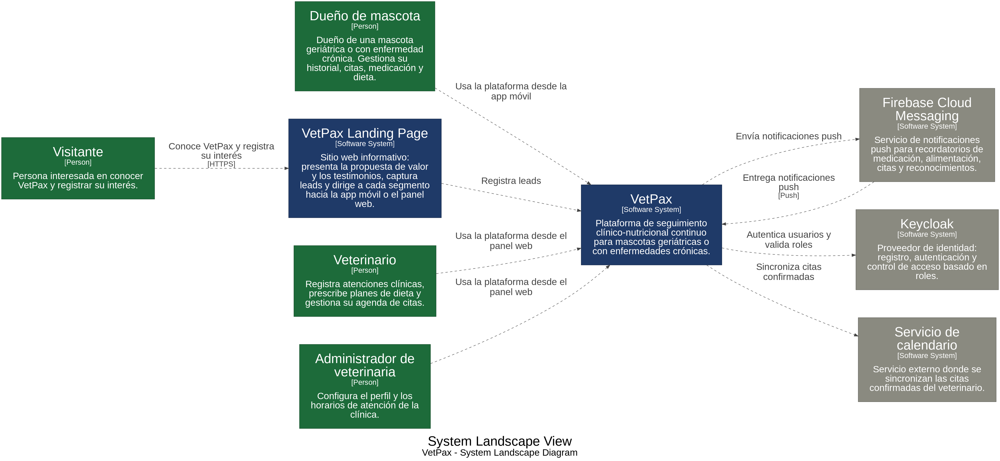

### 4.3.2. Software Architecture Context Level Diagrams

El System Context Diagram se enfoca únicamente en la **plataforma VetPax**, dejando fuera la landing page, y muestra cómo cada tipo de usuario se relaciona con ella y con qué sistemas externos se comunica. Este nivel permite comprender el alcance del sistema y sus dependencias sin entrar en detalles técnicos.

| Origen | Destino | Interacción |
| --- | --- | --- |
| Dueño de mascota | VetPax | Usa la plataforma desde la aplicación móvil. |
| Veterinario | VetPax | Usa la plataforma desde el panel web. |
| Administrador de veterinaria | VetPax | Usa la plataforma desde el panel web. |
| VetPax | Keycloak | Autentica usuarios y valida roles. |
| VetPax | Firebase Cloud Messaging | Envía notificaciones push de recordatorios y reconocimientos. |
| Firebase Cloud Messaging | VetPax | Entrega las notificaciones push al dispositivo del dueño. |
| VetPax | Servicio de calendario | Sincroniza las citas confirmadas. |

Las dependencias externas reflejan los atributos de calidad de seguridad (el control de acceso se delega en Keycloak, evitando gestionar credenciales dentro del dominio clínico) e interoperabilidad (las notificaciones y el calendario se consumen a través de interfaces desacopladas que pueden reemplazarse).

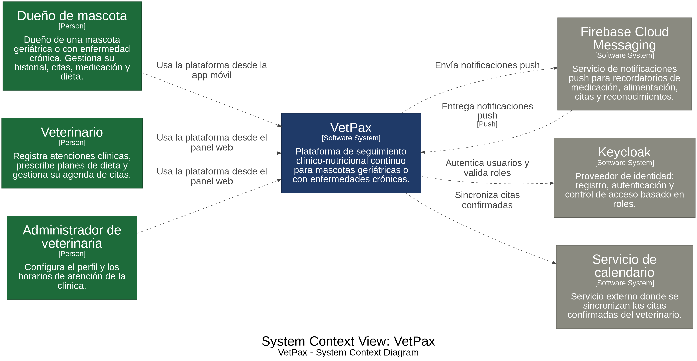

### 4.3.3. Software Architecture Container Level Diagrams

El Container Diagram descompone la plataforma VetPax en las aplicaciones y almacenes de datos que la componen. Todos los clientes consumen la misma API, lo que asegura coherencia de la información entre el dueño y la veterinaria. La Landing Page, como sistema independiente, se comunica con la API únicamente para registrar leads.

**Contenedores**

| Contenedor | Tecnología | Responsabilidad |
| --- | --- | --- |
| Mobile Application | Aplicación móvil | Permite al dueño gestionar el historial de su mascota, citas, recordatorios, dietas y su nivel de constancia. |
| Web Application | Aplicación web (SPA) | Panel de la veterinaria: pacientes, agenda, historial clínico, planes de dieta y perfil de la clínica. |
| Backend API | REST API + WebSocket, arquitectura hexagonal | Expone los casos de uso de los siete bounded contexts y las actualizaciones en tiempo real. |
| Database | Base de datos | Almacena mascotas, historiales clínicos, citas, tratamientos, planes nutricionales, clínicas y progreso de adherencia. |

**Comunicación entre contenedores**

| Origen | Destino | Descripción | Protocolo |
| --- | --- | --- | --- |
| Mobile Application, Web Application | Backend API | Consumen los servicios de la plataforma | HTTPS/REST, JSON |
| Mobile Application, Web Application | Backend API | Reciben actualizaciones clínicas en tiempo real | WebSocket |
| Mobile Application, Web Application | Keycloak | Autentican al usuario | OpenID Connect/HTTPS |
| Backend API | Keycloak | Valida tokens y roles | HTTPS |
| Backend API | Database | Lee y escribe datos | Acceso a datos |
| Backend API | Firebase Cloud Messaging | Envía notificaciones push | HTTPS |
| Firebase Cloud Messaging | Mobile Application | Entrega notificaciones push | Push |
| Backend API | Servicio de calendario | Sincroniza citas confirmadas | HTTPS |
| VetPax Landing Page | Backend API | Registra leads | HTTPS/REST, JSON |

**Organización interna del Backend API.** El backend aplica arquitectura hexagonal: cada bounded context se organiza en capas de dominio, aplicación e infraestructura, y las integraciones externas (Keycloak, Firebase Cloud Messaging, calendario) se implementan como adaptadores en la capa de infraestructura, de modo que el dominio no depende de ningún proveedor. La siguiente tabla relaciona cada bounded context con los recursos que expone la API y sus adaptadores:

| Bounded Context | Recursos expuestos | Adaptadores de infraestructura |
| --- | --- | --- |
| Pet & Clinical Care | `/api/v1/pets`, `/api/v1/pets/{petId}/clinical-records`, `/api/v1/pets/{petId}/evolution` | Persistencia |
| Appointment Management | `/api/v1/appointments` | Servicio de calendario (TS04), persistencia |
| Medication Treatment | `/api/v1/pets/{petId}/medication-plans`, `/api/v1/medication-doses/{doseId}/administrations` | Firebase Cloud Messaging (TS06), persistencia |
| Nutrition Management | `/api/v1/pets/{petId}/nutrition-plans` | Firebase Cloud Messaging (TS06), persistencia |
| Clinic Management | `/api/v1/clinics/{clinicId}`, `/api/v1/clinics/{clinicId}/patients` | Persistencia |
| Adherence & Gamification | Servicio de cálculo de adherencia (TS10) | Firebase Cloud Messaging (TS06), persistencia |
| IAM | Autenticación y autorización con roles (TS12) | Keycloak |
| Captación de leads | `/api/v1/leads` (TS11) | Persistencia |

La comunicación en tiempo real mediante WebSockets (TS13) sincroniza las actualizaciones clínicas, los cambios de tratamiento y otros eventos relevantes entre la aplicación móvil del dueño y el panel web de la veterinaria, evitando consultas constantes al servidor.

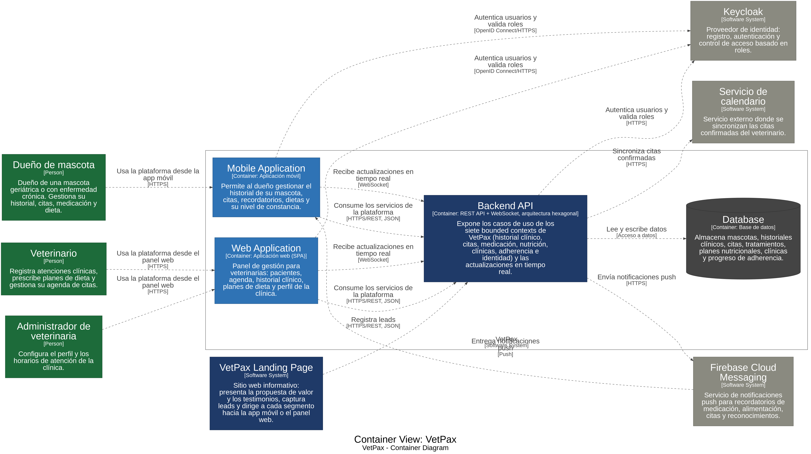

### 4.3.4. Software Architecture Deployment Diagrams

El Deployment Diagram muestra el entorno de producción y dónde se ejecuta cada contenedor. Separar el backend y la base de datos en nodos distintos permite escalar cada uno de forma independiente conforme crezca la cantidad de usuarios, mascotas y veterinarias afiliadas (ADD09), y mantener las integraciones externas fuera del núcleo desplegado.

| Nodo de despliegue | Elemento desplegado | Tecnología |
| --- | --- | --- |
| Dispositivo móvil del dueño | Mobile Application | Android / iOS |
| Navegador del veterinario | Web Application | Navegador web |
| Hosting de la landing page | VetPax Landing Page | Hosting web |
| Proveedor cloud → Servidor de aplicaciones | Backend API | Servicio de hosting del backend |
| Proveedor cloud → Servidor de base de datos | Database | Servicio de base de datos administrado |
| Proveedor cloud → Servidor de identidad | Keycloak | Keycloak Server |
| Google Cloud | Firebase Cloud Messaging | Firebase |
| Proveedor de calendario | Servicio de calendario | Servicio externo |

Las consideraciones principales del despliegue son las siguientes:

- **Seguridad:** toda la comunicación entre clientes, backend y servicios externos se realiza mediante HTTPS, y el acceso a los recursos protegidos se controla con la identidad y los roles gestionados por Keycloak.
- **Escalabilidad:** el backend se despliega de forma independiente de la base de datos, por lo que puede ampliarse su capacidad sin modificar la lógica del dominio.
- **Disponibilidad:** la información clínica se centraliza en una única base de datos gestionada, accesible desde la aplicación móvil y el panel web, lo que garantiza continuidad en el seguimiento.
- **Interoperabilidad:** Firebase Cloud Messaging y el servicio de calendario se consumen mediante adaptadores, por lo que pueden reemplazarse sin afectar los nodos propios de VetPax.

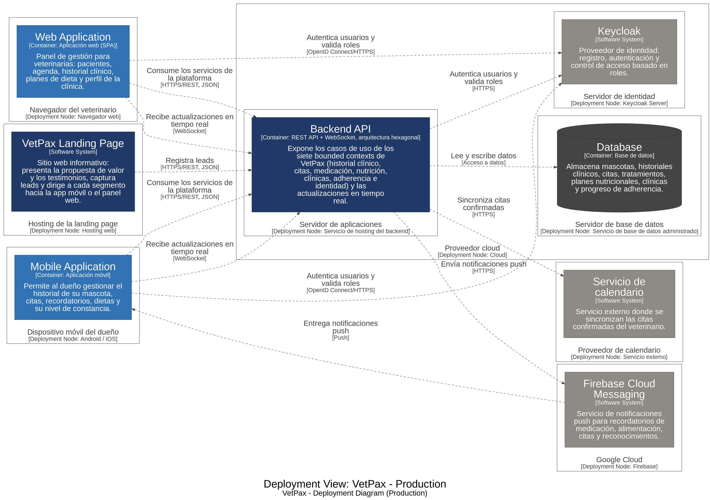
