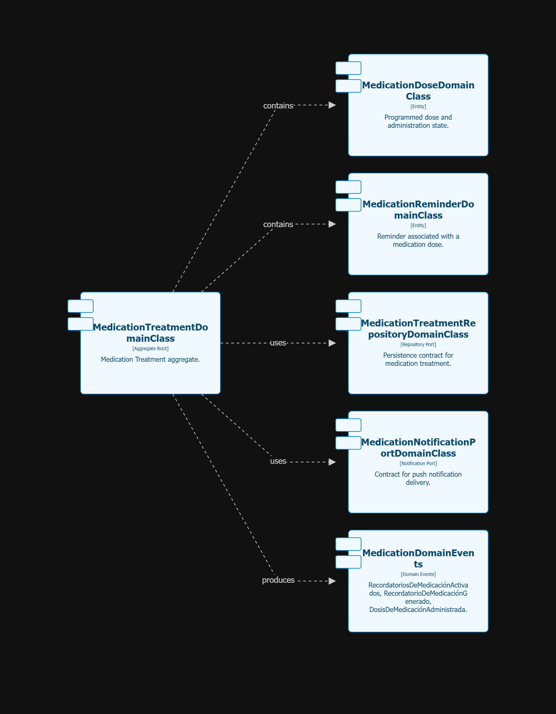
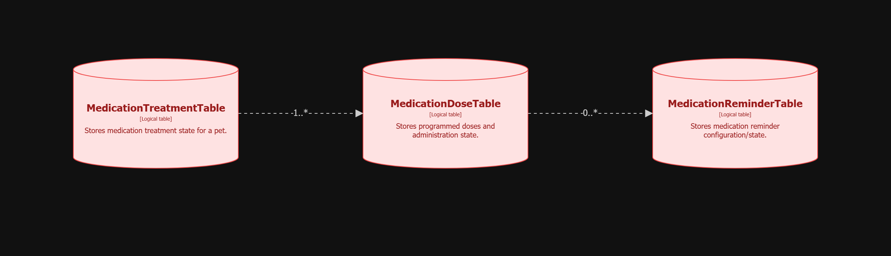
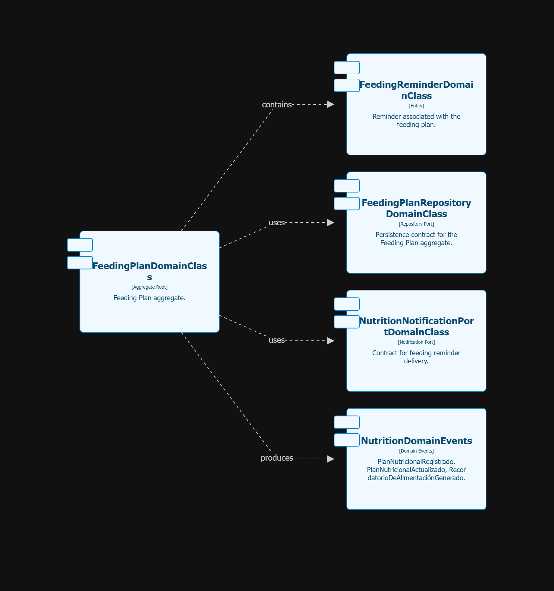
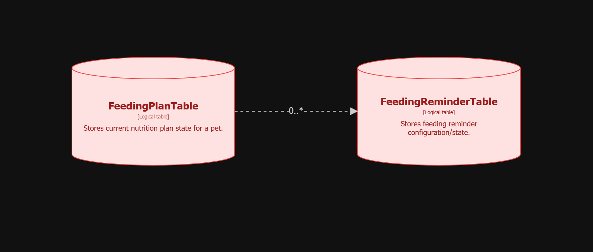
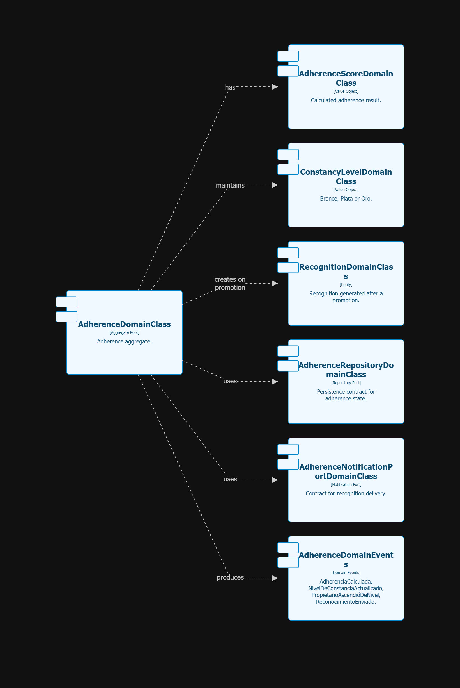
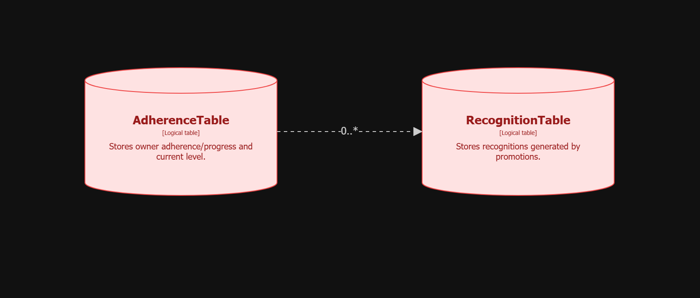

## **Capítulo V: Tactical-Level Software Design**
### 5.1 Pet & Clinical Care
### 5.2 Clinic Management
### 5.3. Appointment Management

Appointment Management administra la programación, reprogramación, cancelación y registro de atención de citas veterinarias. Su propósito es mantener la agenda sin conflictos de horario y contribuir a la continuidad del seguimiento de las mascotas. Se clasifica como un subdominio de soporte y cumple el rol de Execution Context.

El contexto utiliza la referencia de la mascota proporcionada por Pet & Clinical Care, los horarios de atención de Clinic Management y la identidad y permisos gestionados por IAM. Publica eventos sobre el ciclo de vida de las citas y se integra con el servicio externo de calendario. El registro de diagnósticos y atenciones clínicas pertenece a Pet & Clinical Care; el cálculo de adherencia pertenece a Adherence & Gamification.

| Referencia | Responsabilidad que sustenta |
| --- | --- |
| US04 — Agendar cita veterinaria | Registrar una cita con mascota, fecha, hora y motivo cuando existe disponibilidad. |
| US05 — Cancelar o reprogramar cita | Modificar una cita pendiente, liberar el horario al cancelarla y evitar duplicados al reprogramarla. |
| US06 — Gestionar agenda de citas | Consultar la agenda por periodo y permitir que el veterinario registre una cita como atendida. |
| TS03 — API para gestionar citas veterinarias | Exponer la creación y actualización de citas y comunicar los conflictos de horario. |
| TS04 — Integración de citas con servicio de calendario | Sincronizar las citas confirmadas y conservar la cita interna si el proveedor externo falla. |
| Secciones 4.2.1, 4.2.4 y 4.2.5 | Establecer el agregado Appointment, los mensajes del contexto y sus relaciones con otros contextos. |

#### 5.3.1. Domain Layer

La Domain Layer concentra las reglas que controlan el ciclo de vida de una cita. Mantiene el modelo de negocio separado de las solicitudes HTTP, la base de datos y el proveedor de calendario, de acuerdo con la arquitectura hexagonal definida en ADD01 y ADD02.

**Aggregate Root**

El agregado **Appointment**, identificado en el EventStorming, representa una cita veterinaria. Centraliza los cambios relacionados con su programación, reprogramación, cancelación y atención. La información requerida por US04 comprende la mascota, la fecha, la hora y el motivo; la cita queda vinculada con la agenda correspondiente.

Las operaciones sobre una cita dependen de su estado: las citas pendientes admiten cancelación o reprogramación, mientras que las atendidas o canceladas no pueden modificarse.

**Reglas de negocio**

| Operación | Regla de negocio | Resultado esperado |
| --- | --- | --- |
| Agendar | El horario debe estar disponible y los datos obligatorios deben estar completos. | Se registra la cita y se vincula con la agenda correspondiente. |
| Rechazar una reserva | Un horario ocupado no puede reservarse nuevamente. | La solicitud se rechaza y se informa el conflicto. |
| Reprogramar | La cita debe estar pendiente y el nuevo horario debe estar disponible. | Se actualizan la fecha y la hora sin duplicar la cita. |
| Cancelar | La cita debe encontrarse pendiente. | Se cambia a cancelada y se libera el horario reservado. |
| Restringir modificaciones | Una cita atendida o cancelada no puede modificarse. | Se rechaza la operación. |
| Marcar como atendida | Según US06, el veterinario registra la atención de una cita pendiente. | Se actualiza el estado de la cita. |

La disponibilidad requiere considerar tanto las reservas existentes como los horarios que proporciona Clinic Management.

**Domain Events**

| Evento | Hecho representado |
| --- | --- |
| `CitaVeterinariaProgramada` | Se ha registrado una cita válida. |
| `CitaVeterinariaReprogramada` | Se ha modificado el horario de una cita pendiente. |
| `CitaVeterinariaCancelada` | Se ha cancelado una cita y liberado su horario. |
| `CitaVeterinariaAtendida` | El veterinario ha registrado la cita como atendida. |

Adherence & Gamification consume `CitaVeterinariaAtendida` como evidencia para su cálculo. Appointment Management comunica el hecho ocurrido sin incorporar las reglas de niveles o porcentajes de constancia.

**Repository Interfaces y modelo de consulta**

La persistencia del agregado requiere un contrato para registrar, recuperar y actualizar citas, así como consultar las reservas necesarias para verificar disponibilidad. Su implementación corresponde a Infrastructure Layer.

El Read Model **Agenda veterinaria**, identificado en el EventStorming, permite consultar las citas ordenadas por fecha y hora, con la información necesaria del paciente. Esta consulta no modifica el estado del agregado.

| Elemento | Tipo | Responsabilidad |
| --- | --- | --- |
| Appointment | Aggregate Root | Representar la cita y controlar los cambios de su ciclo de vida. |
| Eventos del ciclo de la cita | Domain Events | Comunicar programación, reprogramación, cancelación y atención. |
| Contrato de persistencia de citas | Abstracción de repositorio | Separar las operaciones de almacenamiento de la tecnología utilizada. |
| Agenda veterinaria | Read Model | Presentar las citas para la consulta del veterinario. |

#### 5.3.2. Interface Layer

La Interface Layer recibe las solicitudes de la aplicación móvil y del panel web, valida su estructura y las transforma en comandos o consultas para la capa de aplicación. Devuelve los resultados de las operaciones sin ejecutar directamente las reglas de disponibilidad o transición de estado.

**Endpoints**

| Método y recurso | Operación | Respuestas definidas en TS03 |
| --- | --- | --- |
| `POST /api/v1/appointments` | Crear una cita con datos válidos y horario disponible. | `201 Created` al crear la cita; `409 Conflict` si el horario está ocupado. |
| `PATCH /api/v1/appointments/{appointmentId}` | Actualizar una cita modificable, de acuerdo con la operación solicitada. | `200 OK` cuando se actualiza; `409 Conflict` si la reprogramación encuentra el horario ocupado. |

La interfaz también contempla la consulta de la agenda y el registro de una cita como atendida por el veterinario, conforme a US06.

**Resources y transformación de datos**

Los recursos de entrada deberán representar los datos ya establecidos para el agendamiento y la modificación de citas. Los de salida comunicarán la cita registrada o actualizada y, para la agenda, las citas ordenadas por fecha y hora. La transformación entre estos recursos y los comandos del contexto permitirá mantener el modelo Appointment separado del formato de intercambio HTTP.

Los controles de acceso utilizarán la identidad y los permisos de IAM. El dueño ejecuta las acciones de reserva, cancelación y reprogramación previstas en US04 y US05; el veterinario consulta su agenda y registra la atención según US06.

#### 5.3.3. Application Layer

La Application Layer coordina los casos de uso de citas. Relaciona las solicitudes recibidas con el agregado Appointment, la consulta de disponibilidad, los contratos de persistencia y el adaptador del servicio de calendario. Las reglas de cambio de estado permanecen en el dominio.

**Commands y Queries**

| Mensaje | Tipo | Coordinación del caso de uso |
| --- | --- | --- |
| `AgendarCitaVeterinaria` | Command | Comprobar los datos y la disponibilidad, registrar la cita y comunicar su programación. |
| `ReprogramarCita` | Command | Recuperar la cita pendiente, verificar el nuevo horario y guardar la actualización sin crear otra cita. |
| `CancelarCita` | Command | Recuperar la cita pendiente y aplicar la cancelación que libera el horario. |
| `MarcarCitaComoAtendida` | Command | Coordinar la actualización solicitada por el veterinario y la comunicación del evento de atención. |
| `ConsultarAgenda` | Query | Recuperar las citas del veterinario para el periodo consultado y presentarlas en orden temporal. |

Los manejadores de estos mensajes coordinarán las operaciones de cada caso de uso.

**Coordinación con otros contextos y sistemas**

- **Pet & Clinical Care:** proporciona la referencia de la mascota utilizada en el agendamiento.
- **Clinic Management:** proporciona los horarios de atención mediante la relación y el evento `PerfilDeClínicaActualizado` descritos en el Context Map.
- **IAM:** aporta la identidad autenticada y los roles para controlar el acceso a las operaciones.
- **Adherence & Gamification:** recibe `CitaVeterinariaAtendida` y ejecuta su propio cálculo de constancia.
- **Servicio de calendario:** recibe la solicitud de sincronización de las citas confirmadas; cuando una cita sincronizada se reprograma, se actualiza el evento externo asociado.

Según TS04, un fallo del calendario externo no debe provocar la pérdida de la cita interna. La aplicación conservará la cita y registrará el fallo de integración.

#### 5.3.4. Infrastructure Layer

La Infrastructure Layer implementa la persistencia de las citas y la comunicación con sistemas externos. Mantiene los detalles tecnológicos separados del agregado y de la coordinación de los casos de uso.

**Persistencia**

La implementación del contrato de repositorio almacenará las citas y sus cambios de estado, y proporcionará la información necesaria para consultar la agenda y comprobar reservas. Deberá evitar la duplicación de una cita al reprogramarla y rechazar reservas que entren en conflicto.

**Adaptador del servicio de calendario**

La integración se encapsulará mediante un adaptador, de acuerdo con ADD08 y la relación Anticorruption Layer definida en el Context Map. Este componente traducirá la información de la cita al contrato del proveedor y permitirá registrar el identificador del evento externo cuando la sincronización sea exitosa. También permitirá actualizar dicho evento al reprogramar la cita y registrar fallos sin eliminar la información interna, conforme a TS04.

**Integración de mensajes**

La infraestructura deberá dar soporte a la recepción de los horarios publicados por Clinic Management y a la comunicación de los eventos del ciclo de vida de la cita. Las relaciones con Clinic Management y Adherence & Gamification se realizarán mediante los mensajes asíncronos definidos en el Context Map.

#### 5.3.5. Bounded Context Software Architecture Component Level Diagrams

El diagrama deberá representar la interfaz de citas, la coordinación de comandos y consultas, el agregado Appointment, la persistencia y el adaptador del calendario. También deberá reflejar las dependencias con IAM, Pet & Clinical Care y Clinic Management, y la salida de eventos hacia Adherence & Gamification, manteniendo la separación de capas descrita.

*Pendiente añadir diagrama de componentes*

#### 5.3.6. Bounded Context Software Architecture Code Level Diagrams

##### 5.3.6.1. Bounded Context Domain Layer Class Diagrams

El diagrama de clases tendrá como alcance el agregado Appointment y las reglas de su ciclo de vida.

*Pendiente añadir diagrama de clases*

##### 5.3.6.2. Bounded Context Database Design Diagram

El diseño de datos cubrirá la información de las citas y la asociación con el identificador del evento externo requerida por TS04.

*Pendiente añadir diagrama de base de datos*

# 5.5. Bounded Context: Medication Treatment

**Medication Treatment** es un Bounded Context **core** con el rol de **Execution Context**. Su propósito es gestionar los tratamientos con medicación activos de cada mascota, activar los recordatorios de dosis y registrar la administración de cada dosis por parte del propietario. El Bounded Context Canvas identifica al propietario y a **Pet & Clinical Care** como colaboradores de entrada, y a **Adherence & Gamification** y **Firebase Cloud Messaging** como colaboradores de salida.

### 5.5.1. Domain Layer

La capa de dominio representa el tratamiento con medicación y las reglas establecidas. La descomposición táctica mantiene `Medication Treatment` como **Aggregate Root** y representa las dosis y los recordatorios como elementos contenidos dentro de dicho agregado.

| Elemento | Responsabilidad |
|---|---|
| **Agregado Medication Treatment** | Mantiene el tratamiento activo con medicación y sus invariantes de negocio. |
| **Entidad Medication Dose** | Representa una dosis programada y su estado de administración. |
| **Entidad Medication Reminder** | Representa la configuración/estado del recordatorio asociado a una dosis. |
| **Repositorio Medication Treatment** | Puerto de persistencia para el agregado de tratamiento con medicación. |
| **Puerto de Notificaciones** | Puerto mediante el cual la aplicación solicita el envío de notificaciones push sin acoplar el dominio a Firebase. |
| **Eventos de Dominio** | `RecordatoriosDeMedicaciónActivados`, `RecordatorioDeMedicaciónGenerado`, `DosisDeMedicaciónAdministrada`. |

**Reglas de negocio**

1. Los recordatorios se activan únicamente cuando el tratamiento tiene horarios definidos.
2. Una dosis no puede registrarse dos veces.
3. La dosis debe pertenecer a un tratamiento activo.

### 5.5.2. Interface Layer

Se define los siguientes recursos REST para Medication Treatment:

| Elemento de interfaz | Responsabilidad |
|---|---|
| **Controlador Medication Treatment** | Recibe solicitudes relacionadas con planes de medicación, recordatorios y administración de dosis. |
| **Modelos de Solicitud/Respuesta de Medication Treatment** | Representan los datos de entrada y salida de la API. |
| `/api/v1/pets/{petId}/medication-plans` | Recurso para los planes de medicación asociados a una mascota. |
| `/api/v1/medication-doses/{doseId}/administrations` | Recurso para registrar la administración de una dosis. |

La interfaz delega la ejecución de la lógica de negocio a la Capa de Aplicación. La autenticación y autorización permanecen dentro de los mecanismos de IAM.

### 5.5.3. Application Layer

La Capa de Aplicación coordina los comandos y consultas identificados en el Bounded Context Canvas:

| Componente de aplicación | Responsabilidad |
|---|---|
| **Caso de uso Activar Recordatorios de Medicación** | Coordina `ActivarRecordatoriosDeMedicación`. |
| **Caso de uso Generar Recordatorio de Medicación** | Coordina `GenerarRecordatorioDeMedicación` cuando la política detecta el horario de una dosis pendiente. |
| **Caso de uso Registrar Dosis Administrada** | Coordina `RegistrarDosisAdministrada` y el evento de dominio resultante. |
| **Caso de uso Consultar Tratamientos** | Coordina `ConsultarTratamientos`. |
| **Servicio de Programación de Recordatorios** | Coordina el procesamiento técnico necesario para evaluar los recordatorios programados. |
| **Publicador de Eventos de Dominio de Medication Treatment** | Publica los eventos de dominio generados por el contexto. |

La Capa de Aplicación no define las reglas de negocio de la medicación; se encarga de orquestar el dominio y los puertos.

### 5.5.4. Infrastructure Layer

| Componente de infraestructura | Responsabilidad |
|---|---|
| **Adaptador del Repositorio Medication Treatment** | Implementa el puerto de persistencia para los tratamientos con medicación. |
| **Adaptador del Repositorio Medication Reminder** | Implementa la persistencia del estado de los recordatorios. |
| **Adaptador de Firebase Cloud Messaging** | Implementa el envío de notificaciones push para los recordatorios de medicación. |
| **Adaptador de Programación de Recordatorios** | Proporciona el mecanismo técnico reemplazable utilizado para procesar los recordatorios programados. |
| **Adaptador del Publicador de Eventos de Dominio** | Conecta la publicación de eventos de dominio con el mecanismo de infraestructura seleccionado. |

### 5.5.5. Bounded Context Software Architecture Component Level Diagram

**Propietario / API → Controlador Medication Treatment → Caso de Uso de Aplicación → Agregado Medication Treatment → Adaptador de Repositorio**

Para los recordatorios, la capacidad de programación invoca el caso de uso de recordatorios, que genera el evento de dominio correspondiente y solicita la notificación mediante el Puerto de Notificaciones. El adaptador de FCM entrega la notificación push. `DosisDeMedicaciónAdministrada` se publica hacia **Adherence & Gamification**.

### 5.5.6. Bounded Context Software Architecture Code Level Diagrams

#### 5.5.6.1. Bounded Context Domain Layer Class Diagram

La vista a nivel de clases se centra en `MedicationTreatment` como **Aggregate Root**. `MedicationDose` y `MedicationReminder` están contenidos por el agregado. Las interfaces de repositorio y notificaciones se representan como puertos, mientras que los eventos de dominio representan los resultados publicados por el contexto.

#### 5.5.6.2. Bounded Context Database Design Diagram

| Tabla lógica | Propósito | Relación principal |
|---|---|---|
| **MedicationTreatment** | Almacena el estado del tratamiento con medicación de una mascota. | Padre de las dosis de medicación. |
| **MedicationDose** | Almacena las dosis programadas y su estado de administración. | Pertenece a MedicationTreatment. |
| **MedicationReminder** | Almacena la configuración/estado de los recordatorios. | Asociado a MedicationDose. |

---

# 5.6. Bounded Context: Nutrition Management

**Nutrition Management** es un Bounded Context **core** con los roles de **Specification Context** y **Execution Context**. Su propósito es permitir que el veterinario prescriba y actualice planes de alimentación personalizados de acuerdo con la condición de la mascota y genere recordatorios de alimentación para el propietario.

### 5.6.1. Domain Layer

| Elemento | Responsabilidad |
|---|---|
| **Agregado Feeding Plan** | Mantiene el plan nutricional actual y sus reglas de negocio. |
| **Entidad Feeding Reminder** | Representa el estado del recordatorio asociado a un plan nutricional. |
| **Repositorio Feeding Plan** | Puerto de persistencia para el agregado Feeding Plan. |
| **Puerto de Notificaciones** | Puerto mediante el cual se solicita el envío de los recordatorios de alimentación. |
| **Eventos de Dominio** | `PlanNutricionalRegistrado`, `PlanNutricionalActualizado`, `RecordatorioDeAlimentaciónGenerado`. |

**Reglas de negocio**

1. Solo el veterinario prescribe los planes nutricionales.
2. La cantidad y la frecuencia deben tener valores válidos.
3. Un plan inactivo no genera notificaciones.

### 5.6.2. Interface Layer

| Elemento de interfaz | Responsabilidad |
|---|---|
| **Controlador Nutrition Management** | Recibe solicitudes para prescribir, actualizar y consultar planes nutricionales. |
| **Modelos de Solicitud/Respuesta de Nutrition Management** | Representan los datos de entrada y salida de la API. |
| `/api/v1/pets/{petId}/nutrition-plans` | Recurso para los planes nutricionales asociados a una mascota. |

### 5.6.3. Application Layer

| Componente de aplicación | Responsabilidad |
|---|---|
| **Caso de uso Prescribir Plan Nutricional** | Coordina `PrescribirPlanNutricional`. |
| **Caso de uso Actualizar Plan Nutricional** | Coordina `ActualizarPlanNutricional`. |
| **Caso de uso Generar Recordatorio de Alimentación** | Coordina `GenerarRecordatorioDeAlimentación`. |
| **Caso de uso Consultar Plan Activo** | Coordina `ConsultarPlanActivo`. |
| **Servicio de Programación de Recordatorios** | Coordina el procesamiento de los recordatorios de alimentación. |
| **Publicador de Eventos de Dominio de Nutrition Management** | Publica los eventos de dominio de nutrición. |

### 5.6.4. Infrastructure Layer

| Componente de infraestructura | Responsabilidad |
|---|---|
| **Adaptador del Repositorio Feeding Plan** | Implementa el puerto de persistencia de los planes nutricionales. |
| **Adaptador de Programación de Recordatorios** | Proporciona el mecanismo técnico reemplazable para los recordatorios de alimentación programados. |
| **Adaptador de Firebase Cloud Messaging** | Entrega las notificaciones de recordatorios de alimentación. |
| **Adaptador del Publicador de Eventos de Dominio** | Conecta la publicación de eventos de nutrición con el mecanismo de infraestructura seleccionado. |

### 5.6.5. Bounded Context Software Architecture Component Level Diagram

La interacción principal es:

**Veterinario → Controlador Nutrition Management → Caso de Uso Prescribir/Actualizar → Agregado Feeding Plan → Adaptador de Repositorio**

Para los recordatorios, la capacidad de programación invoca el caso de uso de recordatorios y el Puerto de Notificaciones es implementado por el adaptador de FCM.

### 5.6.6. Bounded Context Software Architecture Code Level Diagrams

#### 5.6.6.1. Bounded Context Domain Layer Class Diagram

La vista a nivel de clases se centra en `FeedingPlan` como **Aggregate Root**. `FeedingReminder` se representa como una entidad contenida por el plan. Los contratos de repositorio y notificaciones son puertos y los tres eventos de dominio representan las salidas identificadas.

#### 5.6.6.2. Bounded Context Database Design Diagram

| Tabla lógica | Propósito | Relación principal |
|---|---|---|
| **FeedingPlan** | Almacena el plan nutricional actual y su estado activo para una mascota. | Padre de los recordatorios de alimentación. |
| **FeedingReminder** | Almacena la configuración/estado de los recordatorios de alimentación. | Asociado a FeedingPlan. |

---

# 5.7. Bounded Context: Adherence & Gamification

**Adherence & Gamification** es un Bounded Context **core** con el rol de **Analysis Context**. Su propósito es evaluar la constancia del propietario en los controles y tratamientos de la mascota, calcular el nivel de adherencia (**Bronce, Plata u Oro**) y reconocer los ascensos de nivel.

A diferencia de los contextos de medicación y nutrición, este contexto no ejecuta directamente la actividad clínica. Consume evidencias generadas por otros contextos, particularmente `CitaVeterinariaAtendida` proveniente de **Appointment Management** y `DosisDeMedicaciónAdministrada` proveniente de **Medication Treatment**.

### 5.7.1. Domain Layer

| Elemento | Responsabilidad |
|---|---|
| **Agregado Adherence** | Mantiene el estado/progreso de adherencia del propietario y el nivel actual. |
| **Value Object Adherence Score** | Representa el resultado calculado de adherencia sin fijar una fórmula no confirmada. |
| **Value Object Constancy Level** | Representa los niveles Bronce, Plata u Oro. |
| **Entidad Recognition** | Representa el reconocimiento generado cuando el propietario asciende de nivel. |
| **Repositorio Adherence** | Puerto de persistencia para el estado de adherencia. |
| **Puerto de Notificaciones** | Puerto para el envío de notificaciones de reconocimiento. |
| **Eventos de Dominio** | `AdherenciaCalculada`, `NivelDeConstanciaActualizado`, `PropietarioAscendióDeNivel`, `ReconocimientoEnviado`. |

**Reglas de negocio**

1. El nivel se asigna de acuerdo con los umbrales válidos.
2. Sin datos suficientes, no existe un nivel definitivo.
3. Solo el ascenso a un nivel superior genera una notificación.
4. `CitaVeterinariaAtendida` y `DosisDeMedicaciónAdministrada` proporcionan evidencias de adherencia.

Los umbrales exactos, si el propietario puede descender de nivel, el período de evaluación y si el cumplimiento nutricional cuenta como evidencia permanecen como preguntas abiertas.

### 5.7.2. Interface Layer

Se identifica  `ConsultarNivelDeConstancia` y el servicio de cálculo de adherencia (TS10).

| Elemento de interfaz | Responsabilidad |
|---|---|
| **Interfaz de Consulta de Adherencia** | Proporciona el nivel actual de constancia y el progreso del propietario. |
| **Interfaz de Cálculo de Adherencia** | Expone la capacidad de cálculo de adherencia cuando sea requerida por el contrato de la API. |
| **Modelos de Solicitud/Respuesta de Adherence** | Representan las consultas de adherencia y los resultados calculados. |

### 5.7.3. Application Layer

| Componente de aplicación | Responsabilidad |
|---|---|
| **Caso de uso Calcular Adherencia** | Coordina `CalcularAdherencia` utilizando las evidencias disponibles. |
| **Caso de uso Actualizar Nivel de Constancia** | Coordina `ActualizarNivel` de acuerdo con los umbrales de negocio configurados. |
| **Caso de uso Consultar Progreso de Constancia** | Recupera el progreso y el nivel actual de adherencia del propietario. |
| **Manejador del Evento Cita Atendida** | Recibe `CitaVeterinariaAtendida` como evidencia de adherencia. |
| **Manejador del Evento Dosis Administrada** | Recibe `DosisDeMedicaciónAdministrada` como evidencia de adherencia. |
| **Publicador de Eventos de Dominio de Adherence** | Publica los eventos de adherencia y reconocimiento. |

La Capa de Aplicación coordina el procesamiento de evidencias y las operaciones de dominio sin hacer responsable a Adherence & Gamification de las operaciones clínicas.

### 5.7.4. Infrastructure Layer

| Componente de infraestructura | Responsabilidad |
|---|---|
| **Adaptador del Repositorio Adherence** | Implementa la persistencia de la adherencia. |
| **Adaptador Consumidor de Eventos de Dominio** | Conecta los eventos provenientes de otros contextos con los manejadores de aplicación correspondientes. |
| **Adaptador de Firebase Cloud Messaging** | Entrega las notificaciones de reconocimiento después de un ascenso. |
| **Adaptador del Publicador de Eventos de Dominio** | Conecta la publicación de eventos de adherencia con el mecanismo de infraestructura seleccionado. |

### 5.7.5. Bounded Context Software Architecture Component Level Diagram

Los principales flujos de entrada son:

**Appointment Management → `CitaVeterinariaAtendida` → Consumidor de Eventos → Manejador de Cita Atendida → Calcular Adherencia**

**Medication Treatment → `DosisDeMedicaciónAdministrada` → Consumidor de Eventos → Manejador de Dosis Administrada → Calcular Adherencia**

El propietario consulta el progreso resultante mediante la interfaz de adherencia. Cuando las reglas de negocio identifican un ascenso, el contexto emite `PropietarioAscendióDeNivel` y solicita el envío del reconocimiento mediante FCM.

### 5.7.6. Bounded Context Software Architecture Code Level Diagrams

#### 5.7.6.1. Bounded Context Domain Layer Class Diagram

La vista a nivel de clases se centra en `Adherence` como **Aggregate Root**. `AdherenceScore` y `ConstancyLevel` son Value Objects, mientras que `Recognition` representa el resultado de un ascenso de nivel. Las interfaces de repositorio y notificaciones son puertos, y los cuatro eventos de dominio identificados se representan explícitamente.

#### 5.7.6.2. Bounded Context Database Design Diagram

| Tabla lógica | Propósito | Relación principal |
|---|---|---|
| **Adherence** | Almacena el estado/progreso de adherencia del propietario y el nivel actual. | Padre de los reconocimientos. |
| **Recognition** | Almacena los reconocimientos generados por ascensos de nivel. | Pertenece a Adherence. |

- 5.X. Bounded Context: <Bounded Context Name>
    - 5.X.1. Domain Layer
    - 5.X.2. Interface Layer
    - 5.X.3. Application Layer
    - 5.X.4. Infrastructure Layer
    - 5.X.6. Bounded Context Software Architecture Component Level Diagrams
    - 5.X.7. Bounded Context Software Architecture Code Level Diagrams
        - 5.X.7.1. Bounded Context Domain Layer Class Diagrams
        - 5.X.7.2. Bounded Context Database Design Diagram
