## **Capítulo V: Tactical-Level Software Design**
### 5.1. Bounded Context: Pet & Clinical Care

Pet & Clinical Care registra el perfil de cada mascota y mantiene su historial clínico longitudinal y trazable (atenciones, diagnósticos, tratamientos y evolución), de modo que el tratamiento tenga continuidad aunque el dueño cambie de veterinaria. Se clasifica como un subdominio **core**, con modelo de negocio Revenue Generator / Engagement, y cumple los roles de **Execution Context** y **Audit Context**.

Es el contexto central de VetPax: Appointment Management, Medication Treatment, Nutrition Management y Clinic Management dependen del identificador de la mascota y de los pacientes que este contexto provee (relaciones Customer/Supplier del Context Map). La identidad y los roles los gestiona IAM. La programación de citas, los tratamientos con medicación, los planes de alimentación, el cálculo de adherencia y la información institucional de la clínica pertenecen a otros contextos.

| Referencia | Responsabilidad que sustenta |
|---|---|
| US01 — Registrar mascota | Crear el perfil de la mascota asociado a la cuenta del dueño; rechazar el registro si faltan datos obligatorios. |
| US02 — Consultar historial clínico | Mostrar las atenciones en orden cronológico, informar si el historial está vacío y denegar el acceso a usuarios sin autorización. |
| US03 — Registrar atención clínica | Incorporar la atención al historial; rechazar la operación si la información está incompleta. |
| US11 — Consultar evolución clínica | Mostrar la evolución cronológica del paciente o informar que aún no hay datos suficientes. |
| TS01 — API para gestión de mascotas | Exponer el registro y la consulta de mascotas (201, 200, 404). |
| TS02 — API para historial clínico | Exponer el registro y la consulta de atenciones (201, 200, 403). |
| TS08 — API para pacientes y evolución clínica | Abastecer al panel veterinario con pacientes y evolución (200, 403). |
| TS13 — Comunicación en tiempo real mediante WebSockets | Comunicar las actualizaciones clínicas a los clientes autorizados y recuperar el estado tras una reconexión. |
| Secciones 4.2.1, 4.2.4 y 4.2.5 | Establecer los agregados Pet y Clinical Record, los mensajes del contexto y sus relaciones con otros contextos. |

#### 5.1.1. Domain Layer

La Domain Layer concentra las reglas de la mascota y de su historial clínico. Mantiene el modelo separado de HTTP, de la base de datos y de los proveedores externos, conforme a la arquitectura hexagonal (ADD01 y ADD02). Los tipos se expresan de forma agnóstica al lenguaje, porque el framework del backend aún no está definido.

##### Reglas de negocio

| N.º | Regla | Fuente |
|---|---|---|
| 1 | Toda mascota debe estar asociada a la cuenta de un dueño. | Canvas, US01 |
| 2 | No se registra una mascota si faltan los datos obligatorios. | US01 E02 |
| 3 | Una atención clínica solo se registra sobre una mascota existente. | Canvas |
| 4 | No se registra una atención con información incompleta. | US03 E02 |
| 5 | Solo usuarios autorizados consultan el historial; el dueño solo accede a sus mascotas. | Canvas, US02 E03 |
| 6 | El historial se presenta ordenado cronológicamente. | US02 E01, TS02 E02 |
| 7 | La evolución solo se calcula si existen registros comparables suficientes. | US11 E02 |
| 8 | Las atenciones registradas se conservan para mantener la trazabilidad (Audit Context). | Canvas |

##### Diccionario de clases

**Aggregate Roots**

| Clase | Propósito | Atributos | Métodos |
|---|---|---|---|
| **Pet** | Representa a la mascota y es la referencia de identidad usada por los demás contextos. | `petId: PetId` `ownerId: OwnerId` `name: String` `species: Species` `breed: String` (opcional) `sex: Sex` (opcional) `birthDate: Date` `registeredAt: DateTime` | `isOwnedBy(ownerId): Boolean` `calculateAge(referenceDate): Integer` `pullDomainEvents(): List<DomainEvent>` |
| **ClinicalRecord** | Historial clínico de una mascota. Controla el registro de atenciones y garantiza el orden cronológico. | `clinicalRecordId: ClinicalRecordId` `petId: PetId` `attentions: List<ClinicalAttention>` `lastUpdatedAt: DateTime` | `registerAttention(attention): void` `getAttentionsChronologically(): List<ClinicalAttention>` `hasAttentions(): Boolean` `pullDomainEvents(): List<DomainEvent>` |

**Entities**

| Clase | Propósito | Atributos | Métodos |
|---|---|---|---|
| **ClinicalAttention** | Atención veterinaria registrada dentro del historial. | `attentionId: AttentionId` `clinicId: ClinicId` `veterinarianId: VeterinarianId` `attentionDate: DateTime` `reason: String` `diagnosis: String` `treatmentSummary: String` `observations: String` (opcional) `indicators: List<ClinicalIndicator>` | `validateMandatoryData(): void` `hasIndicators(): Boolean` `findIndicator(name): ClinicalIndicator` |

**Value Objects**

| Clase | Propósito | Atributos | Métodos |
|---|---|---|---|
| **PetId, OwnerId, ClinicalRecordId, AttentionId, VeterinarianId, ClinicId** | Identificadores inmutables. `OwnerId`, `VeterinarianId` y `ClinicId` son referencias a otros contextos, no entidades propias. | `value: UUID` | `equals(other): Boolean` `toString(): String` |
| **Species** | Especie de la mascota. | `DOG`, `CAT` | — |
| **Sex** | Sexo de la mascota. | `MALE`, `FEMALE` | — |
| **ClinicalIndicator** | Valor clínico medido durante una atención, usado para comparar la evolución. | `name: String` `value: Decimal` `unit: String` | `isComparableWith(other): Boolean` |
| **ClinicalEvolution** | Resultado de comparar los indicadores a lo largo del tiempo. | `petId: PetId` `entries: List<EvolutionEntry>` | `hasSufficientData(): Boolean` |
| **EvolutionEntry** | Punto de la evolución: fecha, indicador y valor. | `attentionDate: DateTime` `indicatorName: String` `value: Decimal` `unit: String` | — |
| **AccessRequester** | Quién solicita el acceso, según la identidad que entrega IAM. | `userId: UUID` `role: Role` (dueño, veterinario) `clinicId: ClinicId` (opcional) | `isOwner(): Boolean` `isVeterinarian(): Boolean` |

**Factories**

| Clase | Propósito | Métodos |
|---|---|---|
| **PetFactory** | Crea una mascota válida asociada a un dueño y emite `MascotaRegistrada`. | `register(ownerId, name, species, birthDate, breed, sex): Pet` |
| **ClinicalRecordFactory** | Crea el historial vacío de una mascota recién registrada. | `openFor(petId): ClinicalRecord` |

**Domain Services**

| Clase | Propósito | Métodos |
|---|---|---|
| **ClinicalAccessPolicy** | Determina si un solicitante puede acceder al historial de una mascota (reglas 5 y 6). | `canAccess(requester: AccessRequester, pet: Pet): Boolean` |
| **ClinicalEvolutionService** | Construye la evolución clínica a partir de las atenciones registradas (regla 7). | `buildEvolution(record: ClinicalRecord): ClinicalEvolution` |

**Repository Interfaces y Read Models**

| Clase | Tipo | Propósito | Métodos |
|---|---|---|---|
| **PetRepository** | Repository (puerto) | Persistencia del agregado Pet. | `save(pet): void` `findById(petId): Pet` `findByOwnerId(ownerId): List<Pet>` `existsById(petId): Boolean` |
| **ClinicalRecordRepository** | Repository (puerto) | Persistencia del agregado ClinicalRecord. | `save(record): void` `findByPetId(petId): ClinicalRecord` |
| **PatientListReadModel** | Read Model | Pacientes vinculados a una clínica, que se entregan a Clinic Management. | `findPatientsByClinic(clinicId): List<PatientSummary>` |
| **ClinicalRecordViewReadModel** | Read Model | Vista del historial para el dueño y el veterinario. | `findByPetId(petId): ClinicalRecordView` |
| **PatientEvolutionViewReadModel** | Read Model | Vista de la evolución para el veterinario. | `findByPetId(petId): ClinicalEvolution` |

**Domain Events**

| Evento | Hecho que representa | Atributos |
|---|---|---|
| **MascotaRegistrada** | Se registró una mascota asociada a un dueño. | `petId`, `ownerId`, `occurredAt` |
| **AtenciónClínicaRegistrada** | Se registró una atención sobre una mascota existente. | `clinicalRecordId`, `petId`, `attentionId`, `clinicId`, `veterinarianId`, `occurredAt` |
| **HistorialClínicoActualizado** | El historial incorporó una nueva atención. | `clinicalRecordId`, `petId`, `occurredAt` |

##### Relaciones entre clases

| Origen | Relación | Destino |
|---|---|---|
| ClinicalRecord | contiene (1 a 0..*) | ClinicalAttention |
| ClinicalAttention | contiene (1 a 0..*) | ClinicalIndicator |
| ClinicalRecord | referencia por identificador (1 a 1) | Pet (mediante `petId`) |
| PetFactory | crea | Pet |
| ClinicalRecordFactory | crea | ClinicalRecord |
| ClinicalAccessPolicy | evalúa | Pet, AccessRequester |
| ClinicalEvolutionService | lee | ClinicalRecord |
| ClinicalEvolutionService | produce | ClinicalEvolution |
| PetRepository, ClinicalRecordRepository | persisten | Pet, ClinicalRecord |
| Pet, ClinicalRecord | producen | Domain Events |

#### 5.1.2. Interface Layer

La Interface Layer recibe las solicitudes de la aplicación móvil y del panel web, valida su estructura y las transforma en comandos o consultas para la capa de aplicación. No ejecuta reglas de negocio.

##### Endpoints

| Método y recurso | Operación | Respuestas | Rol |
|---|---|---|---|
| `POST /api/v1/pets` | Registrar una mascota (US01). | 201 Created; rechazo informando los campos pendientes si faltan datos. | Dueño |
| `GET /api/v1/pets/{petId}` | Consultar una mascota. | 200 OK; 404 Not Found si no existe; 403 Forbidden sin autorización. | Dueño, veterinario |
| `POST /api/v1/pets/{petId}/clinical-records` | Registrar una atención clínica (US03). | 201 Created; 403 Forbidden sin permisos; rechazo informando los datos pendientes. | Veterinario |
| `GET /api/v1/pets/{petId}/clinical-records` | Consultar el historial en orden cronológico (US02). | 200 OK; mensaje de historial vacío; 403 Forbidden sin autorización. | Dueño, veterinario |
| `GET /api/v1/pets/{petId}/evolution` | Consultar la evolución clínica (US11, TS08). | 200 OK; mensaje de información insuficiente; 403 Forbidden sin autorización. | Veterinario |

Los códigos 201, 200, 404 y 403 provienen de TS01, TS02 y TS08. Los rechazos por datos incompletos se definen en US01 y US03 sin fijar un código HTTP; se propone 400 Bad Request.

El listado de pacientes de una clínica se expone en `/api/v1/clinics/{clinicId}/patients`, que pertenece a Clinic Management. Pet & Clinical Care solo provee los pacientes vinculados.

##### Controllers, resources y canal en tiempo real

| Elemento | Responsabilidad |
|---|---|
| **PetController** | Recibe las solicitudes de registro y consulta de mascotas. |
| **ClinicalRecordController** | Recibe el registro de atenciones y la consulta del historial. |
| **ClinicalEvolutionController** | Recibe la consulta de evolución clínica. |
| **Resources de entrada** | `RegisterPetRequest`, `RegisterClinicalAttentionRequest`. |
| **Resources de salida** | `PetResponse`, `ClinicalAttentionResponse`, `ClinicalHistoryResponse`, `ClinicalEvolutionResponse`. |
| **Assemblers** | Transforman los resources en comandos o consultas y los resultados en respuestas, para que el modelo no dependa del formato HTTP. |
| **Canal WebSocket de actualizaciones clínicas** | Según TS13, comunica a los clientes autorizados conectados que la información clínica cambió y devuelve el estado actualizado al reconectarse. |

Los controles de acceso usan la identidad y los roles de IAM. El dueño ejecuta US01 y US02; el veterinario ejecuta US03 y US11.

#### 5.1.3. Application Layer

La Application Layer coordina los casos de uso: recibe los mensajes de la interfaz, invoca al dominio y a los puertos, y publica los eventos. No contiene reglas de negocio.

##### Commands y Queries

| Mensaje | Tipo | Coordinación del caso de uso |
|---|---|---|
| **RegistrarMascota** | Command | Crear la mascota con `PetFactory`, abrir su historial con `ClinicalRecordFactory`, guardar ambos y publicar `MascotaRegistrada`. |
| **RegistrarAtenciónClínica** | Command | Verificar que la mascota exista y que el solicitante tenga permiso; registrar la atención en el historial; publicar `AtenciónClínicaRegistrada` e `HistorialClínicoActualizado`; solicitar la notificación por WebSocket. |
| **ConsultarMascota** | Query | Recuperar la mascota y comprobar el acceso con `ClinicalAccessPolicy`. |
| **ConsultarHistorialClínico** | Query | Comprobar el acceso y devolver las atenciones en orden cronológico, o indicar que el historial está vacío. |
| **ConsultarEvoluciónClínica** | Query | Comprobar el acceso y construir la evolución con `ClinicalEvolutionService`, o indicar que los datos son insuficientes. |
| **ObtenerPacientesVinculadosAClínica** | Query | Entregar a Clinic Management los pacientes de una clínica mediante `PatientListReadModel`. |
| **VerificarExistenciaDeMascota** | Query | Entregar a Appointment Management, Medication Treatment y Nutrition Management el identificador y la confirmación de existencia de la mascota. |

##### Otros componentes y coordinación con otros contextos

| Componente | Responsabilidad |
|---|---|
| **Domain Event Publisher** | Publica los tres eventos de dominio del contexto. |
| **Puerto ClinicalUpdateNotifier** | Contrato mediante el cual la aplicación solicita comunicar una actualización clínica a los clientes conectados, sin depender del mecanismo técnico (TS13). |

- **IAM:** aporta la identidad autenticada y los roles para controlar el acceso.
- **Appointment Management, Medication Treatment y Nutrition Management:** consumen el identificador de la mascota (Customer/Supplier, síncrona).
- **Clinic Management:** consume los pacientes vinculados a la clínica (Customer/Supplier, síncrona).

#### 5.1.4. Infrastructure Layer

La Infrastructure Layer implementa la persistencia, la publicación de eventos y el canal en tiempo real, manteniendo los detalles tecnológicos fuera del dominio.

| Componente | Responsabilidad |
|---|---|
| **Adaptador del Repositorio Pet** | Implementa `PetRepository` sobre la base de datos. |
| **Adaptador del Repositorio ClinicalRecord** | Implementa `ClinicalRecordRepository`, almacena las atenciones y sus indicadores y conserva su trazabilidad. |
| **Adaptador de Read Models** | Resuelve `PatientListReadModel`, `ClinicalRecordViewReadModel` y `PatientEvolutionViewReadModel` mediante consultas que no modifican el estado. |
| **Adaptador del Publicador de Eventos de Dominio** | Conecta la publicación de eventos con el mecanismo de infraestructura seleccionado. |
| **Adaptador WebSocket** | Implementa `ClinicalUpdateNotifier`: distribuye las actualizaciones a los clientes autorizados y permite recuperar el estado al reconectarse (TS13). |
| **Validación de tokens y roles** | Respalda la identidad entregada por IAM en cada solicitud. |

#### 5.1.5. Bounded Context Software Architecture Component Level Diagrams

El diagrama muestra de forma resumida el controlador, los casos de uso, los agregados `Pet` y `ClinicalRecord`, los servicios de dominio, los puertos, los adaptadores de infraestructura y la base de datos. Por legibilidad, agrupa los tres controladores en uno, los casos de uso en dos conjuntos (mascotas y historial clínico) y los puertos y adaptadores de persistencia en uno solo. Aparecen como colaboradores IAM, Clinic Management y, agrupados, Appointment Management, Medication Treatment y Nutrition Management. El detalle de cada elemento está en las secciones 5.1.1 a 5.1.4.

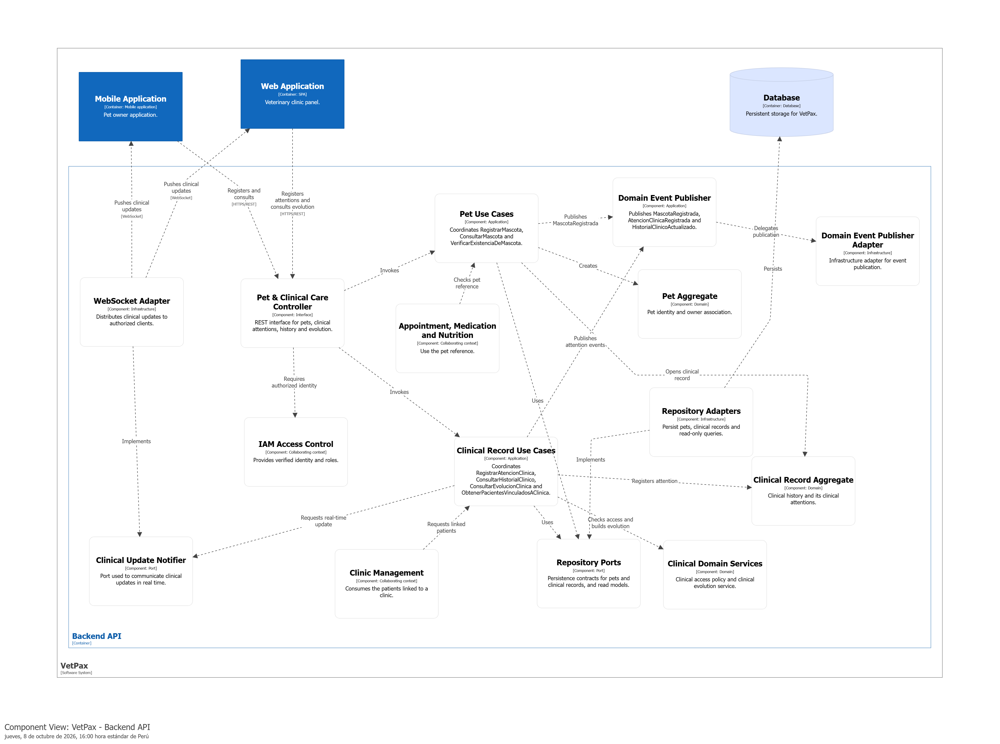

El flujo principal es: **Dueño / Veterinario → Controller → Caso de Uso de Aplicación → Agregado → Adaptador de Repositorio**. Tras registrar una atención, el publicador emite los eventos y el adaptador WebSocket comunica la actualización a los clientes autorizados.

#### 5.1.6. Bounded Context Software Architecture Code Level Diagrams

##### 5.1.6.1. Bounded Context Domain Layer Class Diagrams

El diagrama tiene como alcance los agregados `Pet` y `ClinicalRecord`, la entidad `ClinicalAttention`, los repositorios, los read models y los eventos de dominio. Por legibilidad, los value objects, las factories y los servicios de dominio aparecen agrupados; su detalle de atributos y métodos está en el diccionario de clases de la sección 5.1.1.

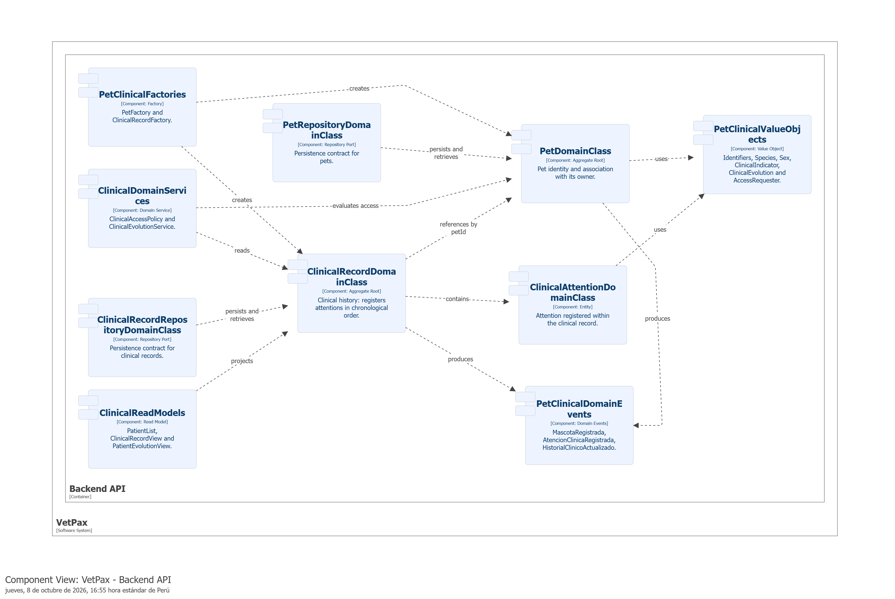

##### 5.1.6.2. Bounded Context Database Design Diagram

El diseño de datos cubre las mascotas, el historial clínico, las atenciones y sus indicadores. Los identificadores de dueño, clínica y veterinario son referencias lógicas a otros contextos, no claves foráneas físicas.

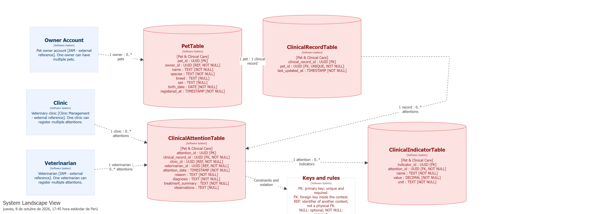

| Tabla lógica | Propósito | Relación principal |
|---|---|---|
| **PetTable** | Almacena el perfil de la mascota y su dueño. | Una mascota tiene un historial clínico. |
| **ClinicalRecordTable** | Almacena el historial clínico de cada mascota. | Pertenece a una mascota; padre de las atenciones. |
| **ClinicalAttentionTable** | Almacena cada atención registrada. | Pertenece a un historial clínico; padre de los indicadores. |
| **ClinicalIndicatorTable** | Almacena los indicadores medidos en cada atención. | Pertenece a una atención. |

| Tabla | Columna | Tipo | Restricción |
| :--- | :--- | :--- | :--- |
| **PetTable** | `pet_id` `owner_id` `name` `species` `breed` `sex` `birth_date` `registered_at` | `UUID` `UUID` `TEXT` `TEXT` `TEXT` `TEXT` `DATE` `TIMESTAMP` | **PK** REF, NOT NULL NOT NULL NOT NULL NULL NULL NOT NULL NOT NULL |
| **ClinicalRecordTable** | `clinical_record_id` `pet_id` `last_updated_at` | `UUID` `UUID` `TIMESTAMP` | **PK** FK, UNIQUE, NOT NULL NOT NULL |
| **ClinicalAttentionTable** | `attention_id` `clinical_record_id` `clinic_id` `veterinarian_id` `attention_date` `reason` `diagnosis` `treatment_summary` `observations` | `UUID` `UUID` `UUID` `UUID` `TIMESTAMP` `TEXT` `TEXT` `TEXT` `TEXT` | **PK** FK, NOT NULL REF, NOT NULL REF, NOT NULL NOT NULL NOT NULL NOT NULL NOT NULL NULL |
| **ClinicalIndicatorTable** | `indicator_id` `attention_id` `name` `value` `unit` | `UUID` `UUID` `TEXT` `DECIMAL` `TEXT` | **PK** FK, NOT NULL NOT NULL NOT NULL NOT NULL |

PK: clave primaria. FK: clave foránea dentro del contexto. REF: identificador de otro contexto, sin clave foránea física.

### 5.2. Bounded Context: Clinic Management

Clinic Management administra la información institucional de cada veterinaria (datos generales y horarios de atención) y ofrece al veterinario el listado de los pacientes vinculados a su clínica. Se clasifica como un subdominio de **soporte**, con modelo de negocio de reducción de costos operativos, y cumple el rol de **Specification Context**, porque define las condiciones (horarios) bajo las cuales otros contextos operan.

El contexto obtiene los pacientes vinculados desde Pet & Clinical Care (relación Customer/Supplier síncrona) y publica el evento `PerfilDeClínicaActualizado`, que Appointment Management consume de forma asíncrona para conocer los horarios de atención al agendar. La identidad y los roles los gestiona IAM. El historial clínico, la agenda de citas y la suscripción de la clínica no pertenecen a este contexto.

| Referencia | Responsabilidad que sustenta |
|---|---|
| US10 — Visualizar listado de pacientes | Mostrar la información resumida de los pacientes vinculados a la clínica, informar si no hay pacientes y denegar el acceso a pacientes de otra clínica. |
| US12 — Gestionar perfil de la clínica | Actualizar los datos generales y los horarios de atención; rechazar horarios inconsistentes y modificaciones sin rol administrativo. |
| TS08 — API para pacientes y evolución clínica | Exponer la consulta de pacientes de la clínica (200, 403). La evolución clínica pertenece a Pet & Clinical Care. |
| TS09 — API para información de clínica | Exponer la consulta y la actualización del perfil de la clínica (200, 403). |
| Secciones 4.2.1, 4.2.4 y 4.2.5 | Establecer el agregado Clinic, los mensajes del contexto y sus relaciones con otros contextos. |

#### 5.2.1. Domain Layer

La Domain Layer concentra las reglas del perfil de la clínica y de sus horarios de atención. Mantiene el modelo separado de HTTP, de la base de datos y de los demás contextos, conforme a la arquitectura hexagonal (ADD01 y ADD02). Los tipos se expresan de forma agnóstica al lenguaje.

##### Reglas de negocio

| N.º | Regla | Fuente |
|---|---|---|
| 1 | Solo el administrador de la clínica modifica su perfil. | Canvas, US12 E03, TS09 E03 |
| 2 | Los datos generales y los horarios deben ser válidos para guardar los cambios. | US12 E01 |
| 3 | Los horarios deben ser consistentes: el cierre es posterior a la apertura y no hay traslapes en un mismo día. | Canvas, US12 E02 |
| 4 | Un veterinario solo ve los pacientes de su propia clínica. | Canvas, US10 E03, TS08 E03 |
| 5 | Si la clínica no tiene pacientes vinculados, se informa que no hay pacientes disponibles. | US10 E02 |
| 6 | Cada actualización válida del perfil comunica los horarios mediante `PerfilDeClínicaActualizado`. | Canvas, Context Map |

##### Diccionario de clases

**Aggregate Root**

| Clase | Propósito | Atributos | Métodos |
|---|---|---|---|
| **Clinic** | Representa la información institucional de una veterinaria y controla los cambios de su perfil y horarios. | `clinicId: ClinicId` `generalData: ClinicGeneralData` `openingSchedule: OpeningSchedule` `administrators: List<AdministratorId>` `updatedAt: DateTime` | `updateProfile(generalData, openingSchedule): void` `isManagedBy(userId): Boolean` `getOpeningSchedule(): OpeningSchedule` `pullDomainEvents(): List<DomainEvent>` |

**Value Objects**

| Clase | Propósito | Atributos | Métodos |
|---|---|---|---|
| **ClinicId, AdministratorId** | Identificadores inmutables. `AdministratorId` es una referencia a una cuenta de IAM. | `value: UUID` | `equals(other): Boolean` `toString(): String` |
| **ClinicGeneralData** | Datos generales de la clínica. | `name: String` `address: String` `phone: String` (opcional) `contactEmail: String` (opcional) | `validateMandatoryData(): void` |
| **OpeningSchedule** | Conjunto de horarios de atención de la clínica. | `days: List<DailyOpeningHours>` | `validateConsistency(): void` `isOpenAt(dayOfWeek, time): Boolean` |
| **DailyOpeningHours** | Horario de atención de un día de la semana. | `dayOfWeek: DayOfWeek` `openTime: Time` `closeTime: Time` | `isValid(): Boolean` `overlapsWith(other): Boolean` |
| **PatientSummary** | Información resumida de un paciente vinculado a la clínica. | `petId: UUID` `name: String` `species: String` `lastAttentionDate: DateTime` (opcional) | — |
| **AccessRequester** | Quién solicita el acceso, según la identidad que entrega IAM. | `userId: UUID` `role: Role` (veterinario, administrador) `clinicId: ClinicId` | `isAdministrator(): Boolean` `isVeterinarian(): Boolean` |

**Domain Service**

| Clase | Propósito | Métodos |
|---|---|---|
| **ClinicAccessPolicy** | Determina quién puede modificar el perfil y quién puede ver los pacientes de una clínica (reglas 1 y 4). | `canManageProfile(requester, clinic): Boolean` `canViewPatients(requester, clinicId): Boolean` |

**Repository Interface y Read Model**

| Clase | Tipo | Propósito | Métodos |
|---|---|---|---|
| **ClinicRepository** | Repository (puerto) | Persistencia del agregado Clinic. | `save(clinic): void` `findById(clinicId): Clinic` `existsById(clinicId): Boolean` |
| **PatientListView** | Read Model | Listado de pacientes vinculados a la clínica (read model "Listado de pacientes" del EventStorming), construido con los datos que provee Pet & Clinical Care. | `findByClinic(clinicId): List<PatientSummary>` |

**Domain Event**

| Evento | Hecho que representa | Atributos |
|---|---|---|
| **PerfilDeClínicaActualizado** | Se actualizaron los datos generales o los horarios de atención de la clínica. | `clinicId`, `generalData`, `openingSchedule`, `occurredAt` |

##### Relaciones entre clases

| Origen | Relación | Destino |
|---|---|---|
| Clinic | contiene | ClinicGeneralData, OpeningSchedule, AdministratorId |
| OpeningSchedule | contiene (1 a 0..7) | DailyOpeningHours |
| PatientListView | contiene (1 a 0..*) | PatientSummary |
| ClinicAccessPolicy | evalúa | Clinic, AccessRequester |
| ClinicRepository | persiste | Clinic |
| Clinic | produce | PerfilDeClínicaActualizado |

#### 5.2.2. Interface Layer

La Interface Layer recibe las solicitudes del panel web de la veterinaria, valida su estructura y las transforma en comandos o consultas para la capa de aplicación. No ejecuta reglas de negocio.

##### Endpoints

| Método y recurso | Operación | Respuestas | Rol |
|---|---|---|---|
| `GET /api/v1/clinics/{clinicId}` | Consultar el perfil de la clínica (TS09). | 200 OK; 404 Not Found si no existe; 403 Forbidden sin autorización. | Administrador, veterinario |
| `PUT /api/v1/clinics/{clinicId}` | Actualizar datos generales y horarios (US12, TS09). | 200 OK al actualizar; rechazo por horarios inconsistentes; 403 Forbidden sin rol administrativo. | Administrador |
| `GET /api/v1/clinics/{clinicId}/patients` | Consultar los pacientes vinculados (US10, TS08). | 200 OK; mensaje de que no hay pacientes; 403 Forbidden si es de otra clínica. | Veterinario |

Los códigos 200 y 403 provienen de TS08 y TS09. Los demás se proponen: 404 para una clínica inexistente, 400 Bad Request para los horarios inconsistentes (US12 E02 no fija un código) y el método `PUT` (TS09 no lo especifica).

##### Controllers y resources

| Elemento | Responsabilidad |
|---|---|
| **ClinicController** | Recibe la consulta y la actualización del perfil de la clínica. |
| **ClinicPatientsController** | Recibe la consulta del listado de pacientes. |
| **Resources de entrada** | `UpdateClinicProfileRequest`. |
| **Resources de salida** | `ClinicProfileResponse`, `PatientListResponse`. |
| **Assemblers** | Transforman los resources en comandos o consultas y los resultados en respuestas, para que el modelo no dependa del formato HTTP. |

Los controles de acceso usan la identidad y los roles de IAM. El administrador consulta y actualiza el perfil; el veterinario consulta el perfil y los pacientes de su clínica. Este contexto no define un canal propio de tiempo real: el panel veterinario recibe las actualizaciones clínicas mediante el canal de Pet & Clinical Care (TS13).

#### 5.2.3. Application Layer

La Application Layer coordina los casos de uso: recibe los mensajes de la interfaz, invoca al dominio y a los puertos, y publica los eventos. No contiene reglas de negocio.

##### Commands y Queries

| Mensaje | Tipo | Coordinación del caso de uso |
|---|---|---|
| **ActualizarPerfilDeClínica** | Command | Recuperar la clínica, comprobar que el solicitante la administra, aplicar los nuevos datos y horarios, guardarla y publicar `PerfilDeClínicaActualizado`. |
| **ConsultarPerfilDeClínica** | Query | Recuperar la clínica y devolver su perfil, comprobando que el solicitante pertenezca a ella. |
| **ConsultarPacientesDeLaClínica** | Query | Comprobar que el veterinario pertenezca a la clínica, solicitar los pacientes vinculados mediante el puerto de pacientes y devolver el listado, o indicar que no hay pacientes. |

##### Otros componentes y coordinación con otros contextos

| Componente | Responsabilidad |
|---|---|
| **Domain Event Publisher** | Publica `PerfilDeClínicaActualizado`. |
| **Puerto ClinicPatientsProvider** | Contrato mediante el cual la aplicación obtiene los pacientes vinculados sin depender de la implementación de Pet & Clinical Care. |

- **IAM:** aporta la identidad autenticada y los roles para controlar el acceso.
- **Pet & Clinical Care:** provee los pacientes vinculados a la clínica (Customer/Supplier, síncrona).
- **Appointment Management:** consume `PerfilDeClínicaActualizado` para conocer los horarios de atención (Customer/Supplier con Published Language, asíncrona).

#### 5.2.4. Infrastructure Layer

La Infrastructure Layer implementa la persistencia, la obtención de pacientes y la publicación de eventos, manteniendo los detalles tecnológicos fuera del dominio.

| Componente | Responsabilidad |
|---|---|
| **Adaptador del Repositorio Clinic** | Implementa `ClinicRepository`, almacenando el perfil, los administradores y los horarios. |
| **Adaptador de Pacientes** | Implementa `ClinicPatientsProvider` consultando a Pet & Clinical Care los pacientes vinculados y traduciéndolos a `PatientSummary`. |
| **Adaptador del Publicador de Eventos de Dominio** | Conecta la publicación de `PerfilDeClínicaActualizado` con el mecanismo de infraestructura seleccionado. |
| **Validación de tokens y roles** | Respalda la identidad entregada por IAM en cada solicitud. |

#### 5.2.5. Bounded Context Software Architecture Component Level Diagrams

El diagrama muestra de forma resumida el controlador, los casos de uso, el agregado `Clinic`, el servicio de dominio, los puertos, los adaptadores de infraestructura y la base de datos. Por legibilidad, agrupa los dos controladores en uno y los tres casos de uso en un solo conjunto. Aparecen como colaboradores IAM, Pet & Clinical Care y Appointment Management. El detalle de cada elemento está en las secciones 5.2.1 a 5.2.4.

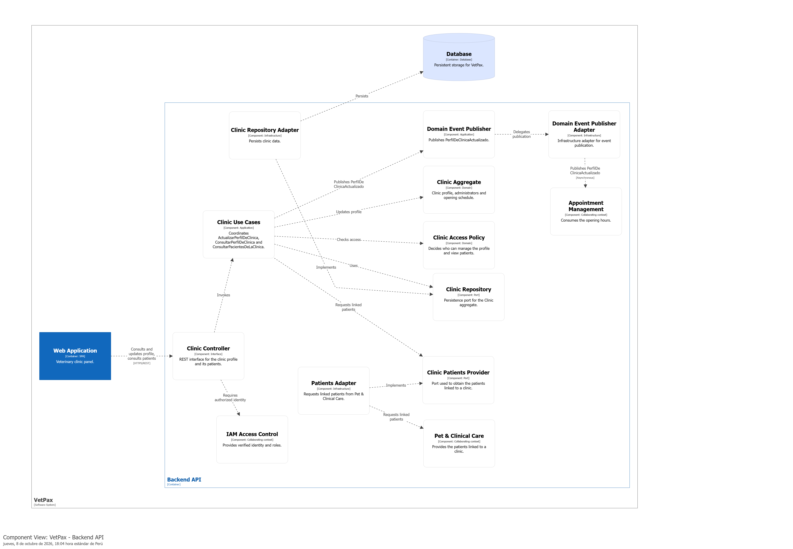

El flujo principal es: **Administrador / Veterinario → Controller → Caso de Uso de Aplicación → Agregado Clinic → Adaptador de Repositorio**. Tras actualizar el perfil, el publicador emite `PerfilDeClínicaActualizado` hacia Appointment Management.

#### 5.2.6. Bounded Context Software Architecture Code Level Diagrams

##### 5.2.6.1. Bounded Context Domain Layer Class Diagrams

El diagrama tiene como alcance el agregado `Clinic`, el servicio de dominio, el repositorio, el read model y el evento de dominio. Por legibilidad, los value objects aparecen agrupados; su detalle de atributos y métodos está en el diccionario de clases de la sección 5.2.1.

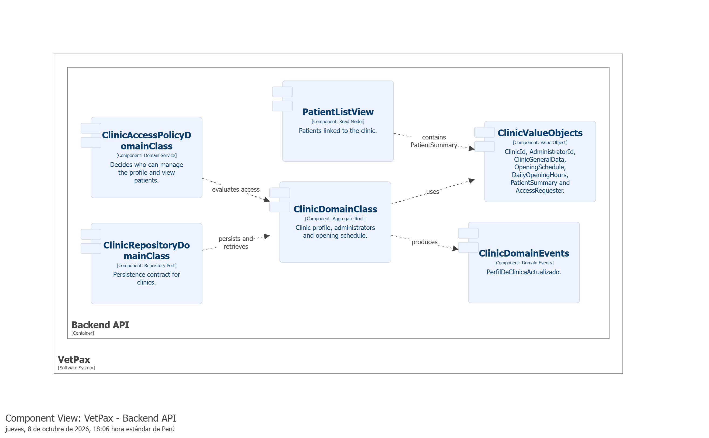

##### 5.2.6.2. Bounded Context Database Design Diagram

El diseño de datos cubre el perfil de la clínica, sus administradores y sus horarios de atención. Los pacientes no se almacenan en este contexto: se obtienen de Pet & Clinical Care. El identificador de cada administrador es una referencia lógica a IAM, no una clave foránea física.

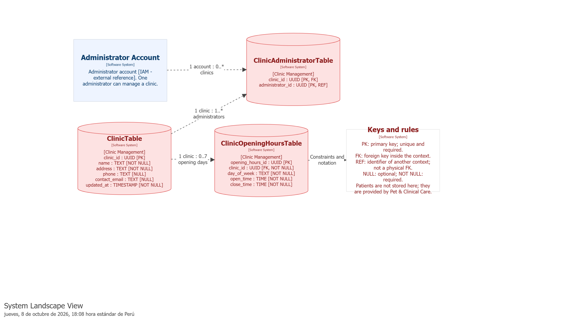

| Tabla lógica | Propósito | Relación principal |
|---|---|---|
| **ClinicTable** | Almacena los datos generales de la clínica. | Padre de los administradores y de los horarios. |
| **ClinicAdministratorTable** | Almacena los administradores de cada clínica. | Pertenece a una clínica. |
| **ClinicOpeningHoursTable** | Almacena los horarios de atención por día. | Pertenece a una clínica. |

| Tabla | Columna | Tipo | Restricción |
| :--- | :--- | :--- | :--- |
| **ClinicTable** | `clinic_id` `name` `address` `phone` `contact_email` `updated_at` | `UUID` `TEXT` `TEXT` `TEXT` `TEXT` `TIMESTAMP` | **PK** NOT NULL NOT NULL NULL NULL NOT NULL |
| **ClinicAdministratorTable** | `clinic_id` `administrator_id` | `UUID` `UUID` | PK, FK PK, REF |
| **ClinicOpeningHoursTable** | `opening_hours_id` `clinic_id` `day_of_week` `open_time` `close_time` | `UUID` `UUID` `TEXT` `TIME` `TIME` | **PK** FK, NOT NULL NOT NULL NOT NULL NOT NULL |

PK: clave primaria. FK: clave foránea dentro del contexto. REF: identificador de otro contexto, sin clave foránea física.

### 5.3. Bounded Context: Appointment Management

Appointment Management administra la programación, reprogramación, cancelación y registro de atención de citas veterinarias. Su propósito es mantener la agenda sin conflictos de horario y contribuir a la continuidad del seguimiento de las mascotas. Se clasifica como un subdominio de soporte y cumple el rol de Execution Context.

El contexto utiliza la referencia de la mascota proporcionada por Pet & Clinical Care, los horarios de atención de Clinic Management y la identidad y permisos gestionados por IAM. Publica eventos sobre el ciclo de vida de las citas y se integra con el servicio externo de calendario. El registro de diagnósticos y atenciones clínicas pertenece a Pet & Clinical Care; el cálculo de adherencia pertenece a Adherence & Gamification.

| Referencia | Responsabilidad que sustenta |
| --- | --- |
| US04 — Agendar cita veterinaria | Registrar una cita con mascota, fecha, hora y motivo cuando existe disponibilidad. |
| US05 — Cancelar o reprogramar cita | Modificar una cita pendiente, liberar el horario al cancelarla y evitar duplicados al reprogramarla. |
| US06 — Gestionar agenda de citas | Consultar la agenda por periodo y permitir que el veterinario registre una cita como atendida. |
| TS03 — API para gestionar citas veterinarias | Exponer la creación y actualización de citas y comunicar los conflictos de horario. |
| TS04 — Integración de citas con servicio de calendario | Sincronizar las citas confirmadas y conservar la cita interna si el proveedor externo falla. |
| Secciones 4.2.1, 4.2.4 y 4.2.5 | Establecer el agregado Appointment, los mensajes del contexto y sus relaciones con otros contextos. |

#### 5.3.1. Domain Layer

La Domain Layer concentra las reglas que controlan el ciclo de vida de una cita. Mantiene el modelo de negocio separado de las solicitudes HTTP, la base de datos y el proveedor de calendario, de acuerdo con la arquitectura hexagonal definida en ADD01 y ADD02.

**Aggregate Root**

El agregado **Appointment**, identificado en el EventStorming, representa una cita veterinaria. Centraliza los cambios relacionados con su programación, reprogramación, cancelación y atención. La información requerida por US04 comprende la mascota, la fecha, la hora y el motivo; la cita queda vinculada con la agenda correspondiente.

Las operaciones sobre una cita dependen de su estado: las citas pendientes admiten cancelación o reprogramación, mientras que las atendidas o canceladas no pueden modificarse.

**Reglas de negocio**

| Operación | Regla de negocio | Resultado esperado |
| --- | --- | --- |
| Agendar | El horario debe estar disponible y los datos obligatorios deben estar completos. | Se registra la cita y se vincula con la agenda correspondiente. |
| Rechazar una reserva | Un horario ocupado no puede reservarse nuevamente. | La solicitud se rechaza y se informa el conflicto. |
| Reprogramar | La cita debe estar pendiente y el nuevo horario debe estar disponible. | Se actualizan la fecha y la hora sin duplicar la cita. |
| Cancelar | La cita debe encontrarse pendiente. | Se cambia a cancelada y se libera el horario reservado. |
| Restringir modificaciones | Una cita atendida o cancelada no puede modificarse. | Se rechaza la operación. |
| Marcar como atendida | Según US06, el veterinario registra la atención de una cita pendiente. | Se actualiza el estado de la cita. |

La disponibilidad requiere considerar tanto las reservas existentes como los horarios que proporciona Clinic Management.

**Domain Events**

| Evento | Hecho representado |
| --- | --- |
| `CitaVeterinariaProgramada` | Se ha registrado una cita válida. |
| `CitaVeterinariaReprogramada` | Se ha modificado el horario de una cita pendiente. |
| `CitaVeterinariaCancelada` | Se ha cancelado una cita y liberado su horario. |
| `CitaVeterinariaAtendida` | El veterinario ha registrado la cita como atendida. |

Adherence & Gamification consume `CitaVeterinariaAtendida` como evidencia para su cálculo. Appointment Management comunica el hecho ocurrido sin incorporar las reglas de niveles o porcentajes de constancia.

**Repository Interfaces y modelo de consulta**

La persistencia del agregado requiere un contrato para registrar, recuperar y actualizar citas, así como consultar las reservas necesarias para verificar disponibilidad. Su implementación corresponde a Infrastructure Layer.

El Read Model **Agenda veterinaria**, identificado en el EventStorming, permite consultar las citas ordenadas por fecha y hora, con la información necesaria del paciente. Esta consulta no modifica el estado del agregado.

| Elemento | Tipo | Responsabilidad |
| --- | --- | --- |
| Appointment | Aggregate Root | Representar la cita y controlar los cambios de su ciclo de vida. |
| Eventos del ciclo de la cita | Domain Events | Comunicar programación, reprogramación, cancelación y atención. |
| Contrato de persistencia de citas | Abstracción de repositorio | Separar las operaciones de almacenamiento de la tecnología utilizada. |
| Agenda veterinaria | Read Model | Presentar las citas para la consulta del veterinario. |

#### 5.3.2. Interface Layer

La Interface Layer recibe las solicitudes de la aplicación móvil y del panel web, valida su estructura y las transforma en comandos o consultas para la capa de aplicación. Devuelve los resultados de las operaciones sin ejecutar directamente las reglas de disponibilidad o transición de estado.

**Endpoints**

| Método y recurso | Operación | Respuestas definidas en TS03 |
| --- | --- | --- |
| `POST /api/v1/appointments` | Crear una cita con datos válidos y horario disponible. | `201 Created` al crear la cita; `409 Conflict` si el horario está ocupado. |
| `PATCH /api/v1/appointments/{appointmentId}` | Actualizar una cita modificable, de acuerdo con la operación solicitada. | `200 OK` cuando se actualiza; `409 Conflict` si la reprogramación encuentra el horario ocupado. |

La interfaz también contempla la consulta de la agenda y el registro de una cita como atendida por el veterinario, conforme a US06.

**Resources y transformación de datos**

Los recursos de entrada deberán representar los datos ya establecidos para el agendamiento y la modificación de citas. Los de salida comunicarán la cita registrada o actualizada y, para la agenda, las citas ordenadas por fecha y hora. La transformación entre estos recursos y los comandos del contexto permitirá mantener el modelo Appointment separado del formato de intercambio HTTP.

Los controles de acceso utilizarán la identidad y los permisos de IAM. El dueño ejecuta las acciones de reserva, cancelación y reprogramación previstas en US04 y US05; el veterinario consulta su agenda y registra la atención según US06.

#### 5.3.3. Application Layer

La Application Layer coordina los casos de uso de citas. Relaciona las solicitudes recibidas con el agregado Appointment, la consulta de disponibilidad, los contratos de persistencia y el adaptador del servicio de calendario. Las reglas de cambio de estado permanecen en el dominio.

**Commands y Queries**

| Mensaje | Tipo | Coordinación del caso de uso |
| --- | --- | --- |
| `AgendarCitaVeterinaria` | Command | Comprobar los datos y la disponibilidad, registrar la cita y comunicar su programación. |
| `ReprogramarCita` | Command | Recuperar la cita pendiente, verificar el nuevo horario y guardar la actualización sin crear otra cita. |
| `CancelarCita` | Command | Recuperar la cita pendiente y aplicar la cancelación que libera el horario. |
| `MarcarCitaComoAtendida` | Command | Coordinar la actualización solicitada por el veterinario y la comunicación del evento de atención. |
| `ConsultarAgenda` | Query | Recuperar las citas del veterinario para el periodo consultado y presentarlas en orden temporal. |

Los manejadores de estos mensajes coordinarán las operaciones de cada caso de uso.

**Coordinación con otros contextos y sistemas**

- **Pet & Clinical Care:** proporciona la referencia de la mascota utilizada en el agendamiento.
- **Clinic Management:** proporciona los horarios de atención mediante la relación y el evento `PerfilDeClínicaActualizado` descritos en el Context Map.
- **IAM:** aporta la identidad autenticada y los roles para controlar el acceso a las operaciones.
- **Adherence & Gamification:** recibe `CitaVeterinariaAtendida` y ejecuta su propio cálculo de constancia.
- **Servicio de calendario:** recibe la solicitud de sincronización de las citas confirmadas; cuando una cita sincronizada se reprograma, se actualiza el evento externo asociado.

Según TS04, un fallo del calendario externo no debe provocar la pérdida de la cita interna. La aplicación conservará la cita y registrará el fallo de integración.

#### 5.3.4. Infrastructure Layer

La Infrastructure Layer implementa la persistencia de las citas y la comunicación con sistemas externos. Mantiene los detalles tecnológicos separados del agregado y de la coordinación de los casos de uso.

**Persistencia**

La implementación del contrato de repositorio almacenará las citas y sus cambios de estado, y proporcionará la información necesaria para consultar la agenda y comprobar reservas. Deberá evitar la duplicación de una cita al reprogramarla y rechazar reservas que entren en conflicto.

**Adaptador del servicio de calendario**

La integración se encapsulará mediante un adaptador, de acuerdo con ADD08 y la relación Anticorruption Layer definida en el Context Map. Este componente traducirá la información de la cita al contrato del proveedor y permitirá registrar el identificador del evento externo cuando la sincronización sea exitosa. También permitirá actualizar dicho evento al reprogramar la cita y registrar fallos sin eliminar la información interna, conforme a TS04.

**Integración de mensajes**

La infraestructura deberá dar soporte a la recepción de los horarios publicados por Clinic Management y a la comunicación de los eventos del ciclo de vida de la cita. Las relaciones con Clinic Management y Adherence & Gamification se realizarán mediante los mensajes asíncronos definidos en el Context Map.

#### 5.3.5. Bounded Context Software Architecture Component Level Diagrams

El diagrama deberá representar la interfaz de citas, la coordinación de comandos y consultas, el agregado Appointment, la persistencia y el adaptador del calendario. También deberá reflejar las dependencias con IAM, Pet & Clinical Care y Clinic Management, y la salida de eventos hacia Adherence & Gamification, manteniendo la separación de capas descrita.

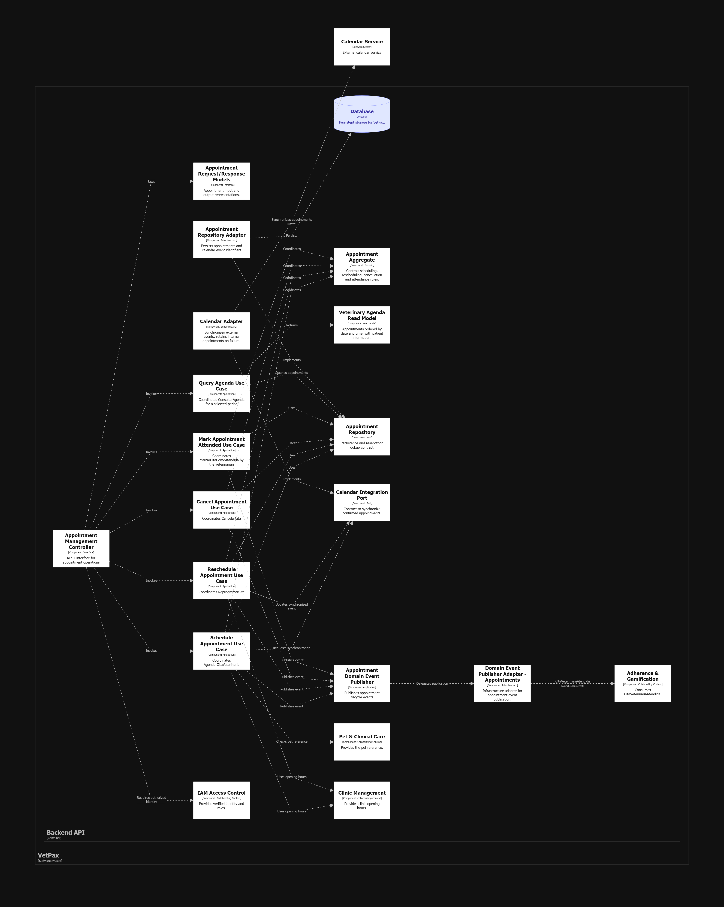

### 5.3.6. Bounded Context Software Architecture Code Level Diagrams

##### 5.3.6.1. Bounded Context Domain Layer Class Diagrams

El diagrama de clases tendrá como alcance el agregado Appointment y las reglas de su ciclo de vida.

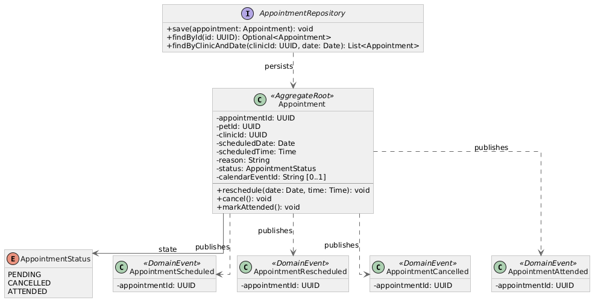

##### 5.3.6.2. Bounded Context Database Design Diagram

El diseño de datos cubrirá la información de las citas y la asociación con el identificador del evento externo requerida por TS04.

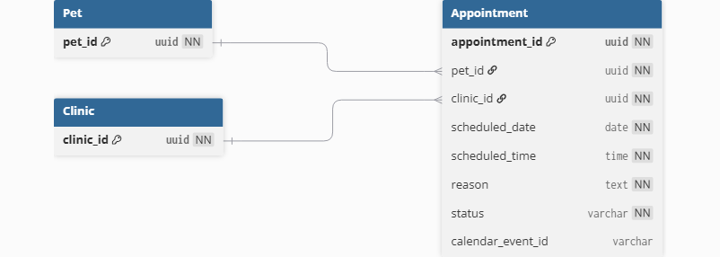

### 5.4. Bounded Context: Identity & Access Management (IAM)

IAM administra el registro de cuentas, la autenticación y la validación de permisos según el rol. Se clasifica como un subdominio genérico de tipo commodity, con rol de Enforcer Context. Su función es proporcionar identidad y control de acceso a las operaciones de VetPax.

IAM utiliza Keycloak como proveedor de identidad, conforme a TS12 y ADD03, y encapsula su integración mediante adaptadores, según ADD08. Los roles definidos son dueño de mascota, veterinario y administrador de veterinaria.

| Referencia | Responsabilidad que sustenta |
| --- | --- |
| US20 — Registrarse en VetPax mediante autenticación segura | Crear la identidad mediante Keycloak, validar los datos y rechazar un correo ya registrado. |
| US21 — Iniciar sesión mediante autenticación segura | Validar credenciales y solicitar nueva autenticación cuando la sesión haya expirado. |
| US22 — Gestionar acceso según rol de usuario | Permitir o denegar funcionalidades según permisos y aplicar cambios de permisos en una nueva sesión. |
| TS12 — Implementación de autenticación y autorización mediante Keycloak | Integrar el proveedor de identidad y proteger los recursos de la plataforma. |
| ADD03, ADD08 y secciones 4.2.4, 4.2.5 y 4.3.3 | Delimitar IAM, aislar al proveedor y establecer la comunicación de identidad con los clientes y el backend. |

#### 5.4.1. Domain Layer

La Domain Layer representa los conceptos de cuenta y permisos necesarios para el acceso a VetPax. El modelo permanece separado de los detalles de Keycloak y de los protocolos utilizados para integrarlo.

**Aggregate Root**

El agregado **User Account** representa la cuenta que permite relacionar una identidad con el acceso a la plataforma. La gestión de identidad y credenciales se delega en Keycloak.

**Roles y reglas de acceso**

| Rol | Ámbito funcional |
| --- | --- |
| Dueño de mascota | Gestionar sus mascotas, consultar sus historiales, agendar citas y realizar el seguimiento de las indicaciones de cuidado. |
| Veterinario | Consultar los pacientes autorizados, registrar atenciones, gestionar su agenda y prescribir planes nutricionales. |
| Administrador de veterinaria | Configurar los datos generales y los horarios de atención de la clínica. |

Las operaciones protegidas requieren una identidad autenticada y permisos suficientes. Un usuario no debe acceder a funcionalidades ajenas a su rol. US22 establece que las modificaciones de permisos se aplican cuando el usuario inicia una nueva sesión.

La autorización también debe respetar las restricciones de cada contexto: US02 limita el historial a las mascotas asociadas al dueño y US10 restringe la consulta de pacientes de otras clínicas sin autorización. IAM proporciona la identidad y los roles; los contextos que administran esos recursos deben aplicar las condiciones de asociación correspondientes.

**Mensajes del dominio y contratos de integración**

| Elemento | Tipo | Propósito |
| --- | --- | --- |
| User Account | Aggregate | Representar la cuenta de usuario en el modelo conceptual de IAM. |
| `CuentaDeUsuarioCreada` | Domain Event | Comunicar la creación exitosa de una cuenta. |
| `UsuarioAutenticado` | Domain Event | Comunicar la autenticación exitosa del usuario. |
| Validación de permisos según rol | Regla de acceso | Determinar si la identidad puede utilizar una funcionalidad protegida. |

La relación con el proveedor se realizará mediante un contrato que permita obtener los resultados de las operaciones de identidad sin introducir dependencias del proveedor en el modelo.

#### 5.4.2. Interface Layer

La Interface Layer articula las interacciones de registro, autenticación y acceso protegido utilizadas por las aplicaciones. Presenta los resultados de esos procesos y permite que el backend reciba solicitudes asociadas a una identidad verificada.

La aplicación móvil y la aplicación web se autenticarán con Keycloak mediante OpenID Connect sobre HTTPS, y el backend validará tokens y roles, conforme al Container Diagram.

**Interacciones previstas**

| Interacción | Entrada o condición | Resultado funcional |
| --- | --- | --- |
| Registro de cuenta | Datos obligatorios válidos y correo no registrado. | Creación de identidad mediante Keycloak y asignación del perfil correspondiente, según US20. |
| Inicio de sesión | Credenciales del usuario registrado. | Acceso cuando las credenciales son válidas o rechazo sin exponer información sensible, según US21. |
| Acceso a funcionalidad protegida | Identidad autenticada y permisos para la operación. | Autorización o denegación de la solicitud, según US22 y TS12. |
| Acceso con sesión expirada | Sesión que ha superado su validez. | Solicitud de nueva autenticación, según US21. |

Los recursos de intercambio deberán limitarse a la información necesaria para estos procesos y mantener separados el modelo de IAM y el formato del proveedor.

#### 5.4.3. Application Layer

La Application Layer coordina los casos de uso de identidad y acceso con los resultados proporcionados por Keycloak. Mantiene separados el proceso de registro, la autenticación y la comprobación de permisos, de acuerdo con las historias US20, US21 y US22.

**Commands y coordinación de casos de uso**

| Mensaje | Responsabilidad de coordinación |
| --- | --- |
| `RegistrarCuenta` | Coordinar la creación de identidad mediante el proveedor y la asignación del perfil correspondiente; comunicar el resultado o los errores previstos en US20. |
| `AutenticarUsuario` | Coordinar el resultado del proceso de autenticación y el acceso permitido cuando Keycloak valida la identidad. |
| `ValidarPermisosSegúnRol` | Comprobar si la identidad autenticada tiene permisos para la operación y permitir o denegar el acceso. |

La validación de permisos se realiza sobre la identidad autenticada para determinar si el usuario puede ejecutar la operación solicitada.

**Resultados y relación con otros contextos**

La creación exitosa de la cuenta se corresponde con `CuentaDeUsuarioCreada`, y una autenticación exitosa con `UsuarioAutenticado`. Los demás contextos reciben la identidad y los roles necesarios para proteger sus operaciones, según la relación transversal descrita en el Context Map.

La aplicación deberá distinguir los siguientes resultados: correo existente, datos de registro inválidos, credenciales incorrectas, sesión expirada y permisos insuficientes.

#### 5.4.4. Infrastructure Layer

La Infrastructure Layer concentra la integración de IAM con Keycloak y los mecanismos técnicos que permiten validar la identidad y los permisos en las solicitudes de la plataforma.

**Adaptador del proveedor de identidad**

El adaptador de Keycloak implementará la integración con el proveedor y traducirá sus resultados al modelo utilizado por VetPax. Responde al patrón Adapter de ADD08 y a la Anticorruption Layer definida en el Context Map. Su objetivo es encapsular los contratos externos para que el dominio clínico y los demás contextos no dependan de detalles del proveedor.

**Protección de solicitudes**

De acuerdo con la sección 4.3.3, los clientes utilizarán OpenID Connect sobre HTTPS para autenticarse y el backend validará tokens y roles. La infraestructura dará soporte a esta validación y suministrará a los casos de uso la identidad necesaria para aplicar los permisos.

**Persistencia e identidad**

La gestión de identidad y credenciales permanece delegada en Keycloak. IAM integra la identidad autenticada y los roles con las operaciones protegidas de VetPax mediante el adaptador del proveedor.

#### 5.4.5. Bounded Context Software Architecture Component Level Diagrams

El diagrama deberá mostrar las interacciones de registro y autenticación, la coordinación de identidad y permisos, el modelo conceptual User Account y el adaptador de Keycloak. Deberá representar al proveedor de identidad y su relación con los clientes y el backend, conforme al Container Diagram existente.

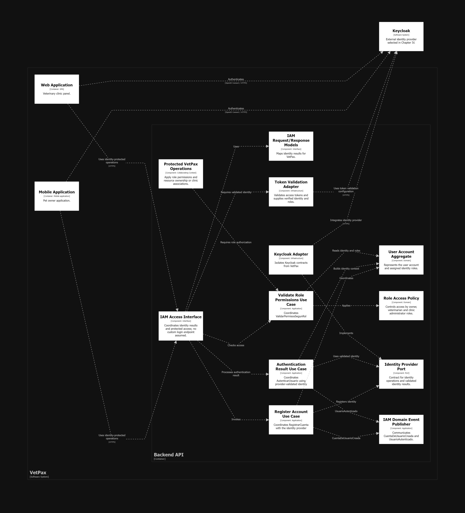

#### 5.4.6. Bounded Context Software Architecture Code Level Diagrams

##### 5.4.6.1. Bounded Context Domain Layer Class Diagrams

El diagrama de clases tendrá como alcance los conceptos de cuenta y roles, y los contratos de integración de IAM.

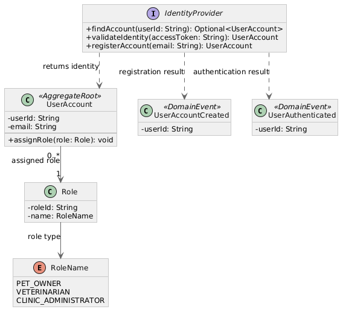

##### 5.4.6.2. Bounded Context Database Design Diagram

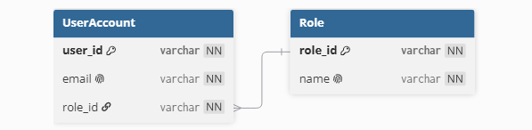

# 5.5. Bounded Context: Medication Treatment

**Medication Treatment** es un Bounded Context **core** con el rol de **Execution Context**. Su propósito es gestionar los tratamientos con medicación activos de cada mascota, activar los recordatorios de dosis y registrar la administración de cada dosis por parte del propietario. El Bounded Context Canvas identifica al propietario y a **Pet & Clinical Care** como colaboradores de entrada, y a **Adherence & Gamification** y **Firebase Cloud Messaging** como colaboradores de salida.

### 5.5.1. Domain Layer

La capa de dominio representa el tratamiento con medicación y las reglas establecidas. La descomposición táctica mantiene `Medication Treatment` como **Aggregate Root** y representa las dosis y los recordatorios como elementos contenidos dentro de dicho agregado.

| Elemento | Responsabilidad |
|---|---|
| **Agregado Medication Treatment** | Mantiene el tratamiento activo con medicación y sus invariantes de negocio. |
| **Entidad Medication Dose** | Representa una dosis programada y su estado de administración. |
| **Entidad Medication Reminder** | Representa la configuración/estado del recordatorio asociado a una dosis. |
| **Repositorio Medication Treatment** | Puerto de persistencia para el agregado de tratamiento con medicación. |
| **Puerto de Notificaciones** | Puerto mediante el cual la aplicación solicita el envío de notificaciones push sin acoplar el dominio a Firebase. |
| **Eventos de Dominio** | `RecordatoriosDeMedicaciónActivados`, `RecordatorioDeMedicaciónGenerado`, `DosisDeMedicaciónAdministrada`. |

**Reglas de negocio**

1. Los recordatorios se activan únicamente cuando el tratamiento tiene horarios definidos.
2. Una dosis no puede registrarse dos veces.
3. La dosis debe pertenecer a un tratamiento activo.

### 5.5.2. Interface Layer

Se define los siguientes recursos REST para Medication Treatment:

| Elemento de interfaz | Responsabilidad |
|---|---|
| **Controlador Medication Treatment** | Recibe solicitudes relacionadas con planes de medicación, recordatorios y administración de dosis. |
| **Modelos de Solicitud/Respuesta de Medication Treatment** | Representan los datos de entrada y salida de la API. |
| `/api/v1/pets/{petId}/medication-plans` | Recurso para los planes de medicación asociados a una mascota. |
| `/api/v1/medication-doses/{doseId}/administrations` | Recurso para registrar la administración de una dosis. |

La interfaz delega la ejecución de la lógica de negocio a la Capa de Aplicación. La autenticación y autorización permanecen dentro de los mecanismos de IAM.

### 5.5.3. Application Layer

La Capa de Aplicación coordina los comandos y consultas identificados en el Bounded Context Canvas:

| Componente de aplicación | Responsabilidad |
|---|---|
| **Caso de uso Activar Recordatorios de Medicación** | Coordina `ActivarRecordatoriosDeMedicación`. |
| **Caso de uso Generar Recordatorio de Medicación** | Coordina `GenerarRecordatorioDeMedicación` cuando la política detecta el horario de una dosis pendiente. |
| **Caso de uso Registrar Dosis Administrada** | Coordina `RegistrarDosisAdministrada` y el evento de dominio resultante. |
| **Caso de uso Consultar Tratamientos** | Coordina `ConsultarTratamientos`. |
| **Servicio de Programación de Recordatorios** | Coordina el procesamiento técnico necesario para evaluar los recordatorios programados. |
| **Publicador de Eventos de Dominio de Medication Treatment** | Publica los eventos de dominio generados por el contexto. |

La Capa de Aplicación no define las reglas de negocio de la medicación; se encarga de orquestar el dominio y los puertos.

### 5.5.4. Infrastructure Layer

| Componente de infraestructura | Responsabilidad |
|---|---|
| **Adaptador del Repositorio Medication Treatment** | Implementa el puerto de persistencia para los tratamientos con medicación. |
| **Adaptador del Repositorio Medication Reminder** | Implementa la persistencia del estado de los recordatorios. |
| **Adaptador de Firebase Cloud Messaging** | Implementa el envío de notificaciones push para los recordatorios de medicación. |
| **Adaptador de Programación de Recordatorios** | Proporciona el mecanismo técnico reemplazable utilizado para procesar los recordatorios programados. |
| **Adaptador del Publicador de Eventos de Dominio** | Conecta la publicación de eventos de dominio con el mecanismo de infraestructura seleccionado. |

### 5.5.5. Bounded Context Software Architecture Component Level Diagram

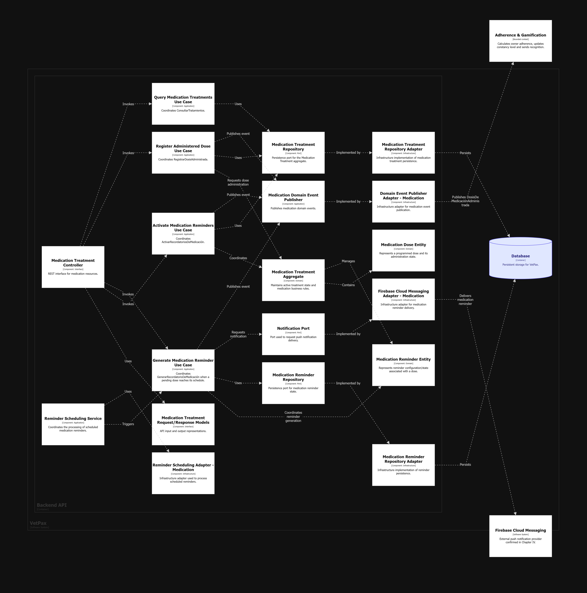

**Propietario / API → Controlador Medication Treatment → Caso de Uso de Aplicación → Agregado Medication Treatment → Adaptador de Repositorio**

Para los recordatorios, la capacidad de programación invoca el caso de uso de recordatorios, que genera el evento de dominio correspondiente y solicita la notificación mediante el Puerto de Notificaciones. El adaptador de FCM entrega la notificación push. `DosisDeMedicaciónAdministrada` se publica hacia **Adherence & Gamification**.

### 5.5.6. Bounded Context Software Architecture Code Level Diagrams

#### 5.5.6.1. Bounded Context Domain Layer Class Diagram

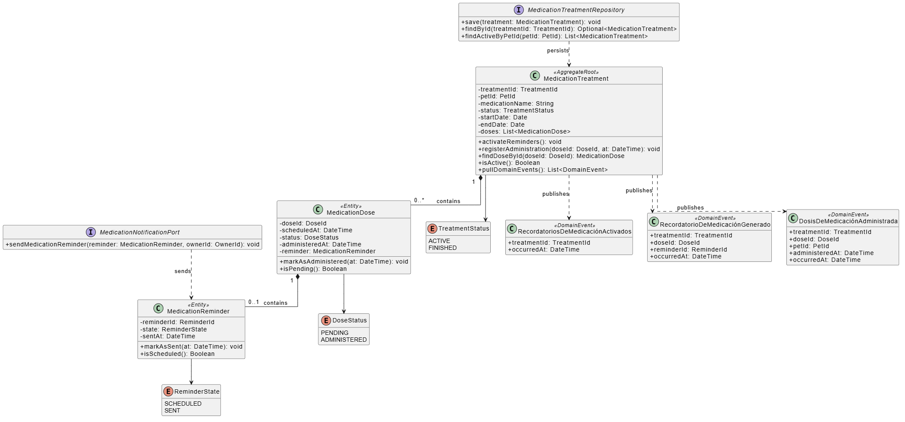

La vista a nivel de clases se centra en `MedicationTreatment` como **Aggregate Root**. `MedicationDose` y `MedicationReminder` están contenidos por el agregado. Las interfaces de repositorio y notificaciones se representan como puertos, mientras que los eventos de dominio representan los resultados publicados por el contexto.

#### 5.5.6.2. Bounded Context Database Design Diagram

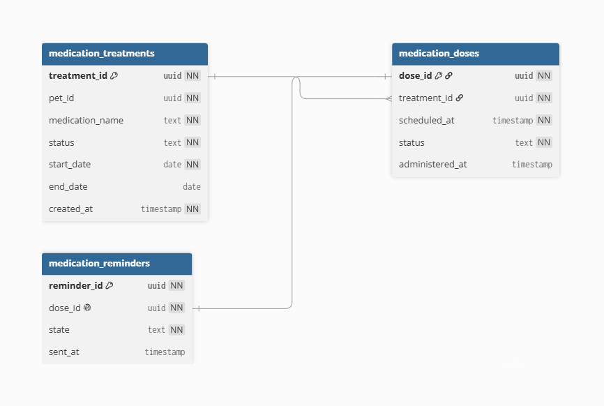

| Tabla lógica | Propósito | Relación principal |
|---|---|---|
| **MedicationTreatment** | Almacena el estado del tratamiento con medicación de una mascota. | Padre de las dosis de medicación. |
| **MedicationDose** | Almacena las dosis programadas y su estado de administración. | Pertenece a MedicationTreatment. |
| **MedicationReminder** | Almacena la configuración/estado de los recordatorios. | Asociado a MedicationDose. |

---

# 5.6. Bounded Context: Nutrition Management

**Nutrition Management** es un Bounded Context **core** con los roles de **Specification Context** y **Execution Context**. Su propósito es permitir que el veterinario prescriba y actualice planes de alimentación personalizados de acuerdo con la condición de la mascota y genere recordatorios de alimentación para el propietario.

### 5.6.1. Domain Layer

| Elemento | Responsabilidad |
|---|---|
| **Agregado Feeding Plan** | Mantiene el plan nutricional actual y sus reglas de negocio. |
| **Entidad Feeding Reminder** | Representa el estado del recordatorio asociado a un plan nutricional. |
| **Repositorio Feeding Plan** | Puerto de persistencia para el agregado Feeding Plan. |
| **Puerto de Notificaciones** | Puerto mediante el cual se solicita el envío de los recordatorios de alimentación. |
| **Eventos de Dominio** | `PlanNutricionalRegistrado`, `PlanNutricionalActualizado`, `RecordatorioDeAlimentaciónGenerado`. |

**Reglas de negocio**

1. Solo el veterinario prescribe los planes nutricionales.
2. La cantidad y la frecuencia deben tener valores válidos.
3. Un plan inactivo no genera notificaciones.

### 5.6.2. Interface Layer

| Elemento de interfaz | Responsabilidad |
|---|---|
| **Controlador Nutrition Management** | Recibe solicitudes para prescribir, actualizar y consultar planes nutricionales. |
| **Modelos de Solicitud/Respuesta de Nutrition Management** | Representan los datos de entrada y salida de la API. |
| `/api/v1/pets/{petId}/nutrition-plans` | Recurso para los planes nutricionales asociados a una mascota. |

### 5.6.3. Application Layer

| Componente de aplicación | Responsabilidad |
|---|---|
| **Caso de uso Prescribir Plan Nutricional** | Coordina `PrescribirPlanNutricional`. |
| **Caso de uso Actualizar Plan Nutricional** | Coordina `ActualizarPlanNutricional`. |
| **Caso de uso Generar Recordatorio de Alimentación** | Coordina `GenerarRecordatorioDeAlimentación`. |
| **Caso de uso Consultar Plan Activo** | Coordina `ConsultarPlanActivo`. |
| **Servicio de Programación de Recordatorios** | Coordina el procesamiento de los recordatorios de alimentación. |
| **Publicador de Eventos de Dominio de Nutrition Management** | Publica los eventos de dominio de nutrición. |

### 5.6.4. Infrastructure Layer

| Componente de infraestructura | Responsabilidad |
|---|---|
| **Adaptador del Repositorio Feeding Plan** | Implementa el puerto de persistencia de los planes nutricionales. |
| **Adaptador de Programación de Recordatorios** | Proporciona el mecanismo técnico reemplazable para los recordatorios de alimentación programados. |
| **Adaptador de Firebase Cloud Messaging** | Entrega las notificaciones de recordatorios de alimentación. |
| **Adaptador del Publicador de Eventos de Dominio** | Conecta la publicación de eventos de nutrición con el mecanismo de infraestructura seleccionado. |

### 5.6.5. Bounded Context Software Architecture Component Level Diagram

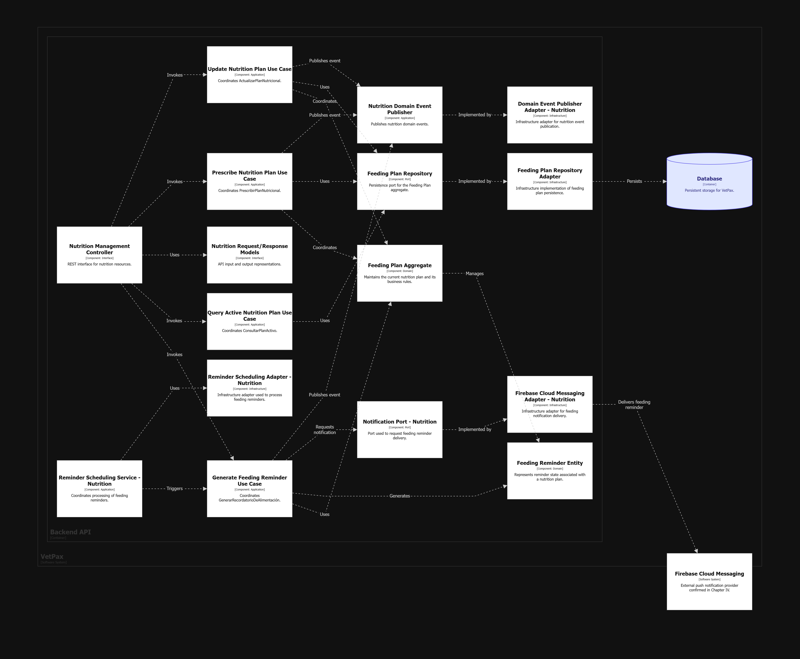

La interacción principal es:

**Veterinario → Controlador Nutrition Management → Caso de Uso Prescribir/Actualizar → Agregado Feeding Plan → Adaptador de Repositorio**

Para los recordatorios, la capacidad de programación invoca el caso de uso de recordatorios y el Puerto de Notificaciones es implementado por el adaptador de FCM.

### 5.6.6. Bounded Context Software Architecture Code Level Diagrams

#### 5.6.6.1. Bounded Context Domain Layer Class Diagram

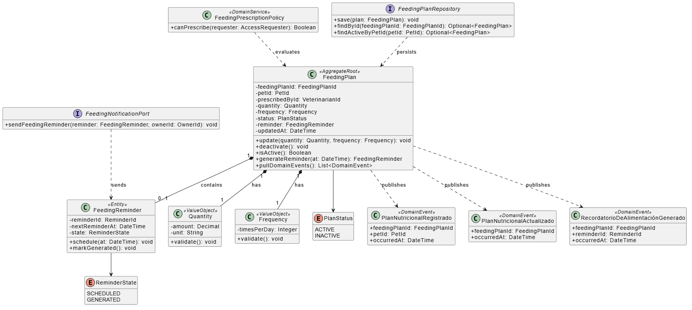

La vista a nivel de clases se centra en `FeedingPlan` como **Aggregate Root**. `FeedingReminder` se representa como una entidad contenida por el plan. Los contratos de repositorio y notificaciones son puertos y los tres eventos de dominio representan las salidas identificadas.

#### 5.6.6.2. Bounded Context Database Design Diagram

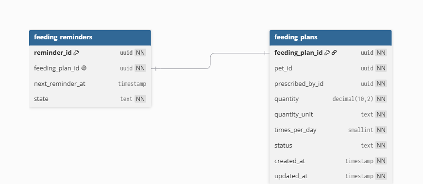

| Tabla lógica | Propósito | Relación principal |
|---|---|---|
| **FeedingPlan** | Almacena el plan nutricional actual y su estado activo para una mascota. | Padre de los recordatorios de alimentación. |
| **FeedingReminder** | Almacena la configuración/estado de los recordatorios de alimentación. | Asociado a FeedingPlan. |

---

# 5.7. Bounded Context: Adherence & Gamification

**Adherence & Gamification** es un Bounded Context **core** con el rol de **Analysis Context**. Su propósito es evaluar la constancia del propietario en los controles y tratamientos de la mascota, calcular el nivel de adherencia (**Bronce, Plata u Oro**) y reconocer los ascensos de nivel.

A diferencia de los contextos de medicación y nutrición, este contexto no ejecuta directamente la actividad clínica. Consume evidencias generadas por otros contextos, particularmente `CitaVeterinariaAtendida` proveniente de **Appointment Management** y `DosisDeMedicaciónAdministrada` proveniente de **Medication Treatment**.

### 5.7.1. Domain Layer

| Elemento | Responsabilidad |
|---|---|
| **Agregado Adherence** | Mantiene el estado/progreso de adherencia del propietario y el nivel actual. |
| **Value Object Adherence Score** | Representa el resultado calculado de adherencia sin fijar una fórmula no confirmada. |
| **Value Object Constancy Level** | Representa los niveles Bronce, Plata u Oro. |
| **Entidad Recognition** | Representa el reconocimiento generado cuando el propietario asciende de nivel. |
| **Repositorio Adherence** | Puerto de persistencia para el estado de adherencia. |
| **Puerto de Notificaciones** | Puerto para el envío de notificaciones de reconocimiento. |
| **Eventos de Dominio** | `AdherenciaCalculada`, `NivelDeConstanciaActualizado`, `PropietarioAscendióDeNivel`, `ReconocimientoEnviado`. |

**Reglas de negocio**

1. El nivel se asigna de acuerdo con los umbrales válidos.
2. Sin datos suficientes, no existe un nivel definitivo.
3. Solo el ascenso a un nivel superior genera una notificación.
4. `CitaVeterinariaAtendida` y `DosisDeMedicaciónAdministrada` proporcionan evidencias de adherencia.

Los umbrales exactos, si el propietario puede descender de nivel, el período de evaluación y si el cumplimiento nutricional cuenta como evidencia permanecen como preguntas abiertas.

### 5.7.2. Interface Layer

Se identifica  `ConsultarNivelDeConstancia` y el servicio de cálculo de adherencia (TS10).

| Elemento de interfaz | Responsabilidad |
|---|---|
| **Interfaz de Consulta de Adherencia** | Proporciona el nivel actual de constancia y el progreso del propietario. |
| **Interfaz de Cálculo de Adherencia** | Expone la capacidad de cálculo de adherencia cuando sea requerida por el contrato de la API. |
| **Modelos de Solicitud/Respuesta de Adherence** | Representan las consultas de adherencia y los resultados calculados. |

### 5.7.3. Application Layer

| Componente de aplicación | Responsabilidad |
|---|---|
| **Caso de uso Calcular Adherencia** | Coordina `CalcularAdherencia` utilizando las evidencias disponibles. |
| **Caso de uso Actualizar Nivel de Constancia** | Coordina `ActualizarNivel` de acuerdo con los umbrales de negocio configurados. |
| **Caso de uso Consultar Progreso de Constancia** | Recupera el progreso y el nivel actual de adherencia del propietario. |
| **Manejador del Evento Cita Atendida** | Recibe `CitaVeterinariaAtendida` como evidencia de adherencia. |
| **Manejador del Evento Dosis Administrada** | Recibe `DosisDeMedicaciónAdministrada` como evidencia de adherencia. |
| **Publicador de Eventos de Dominio de Adherence** | Publica los eventos de adherencia y reconocimiento. |

La Capa de Aplicación coordina el procesamiento de evidencias y las operaciones de dominio sin hacer responsable a Adherence & Gamification de las operaciones clínicas.

### 5.7.4. Infrastructure Layer

| Componente de infraestructura | Responsabilidad |
|---|---|
| **Adaptador del Repositorio Adherence** | Implementa la persistencia de la adherencia. |
| **Adaptador Consumidor de Eventos de Dominio** | Conecta los eventos provenientes de otros contextos con los manejadores de aplicación correspondientes. |
| **Adaptador de Firebase Cloud Messaging** | Entrega las notificaciones de reconocimiento después de un ascenso. |
| **Adaptador del Publicador de Eventos de Dominio** | Conecta la publicación de eventos de adherencia con el mecanismo de infraestructura seleccionado. |

### 5.7.5. Bounded Context Software Architecture Component Level Diagram

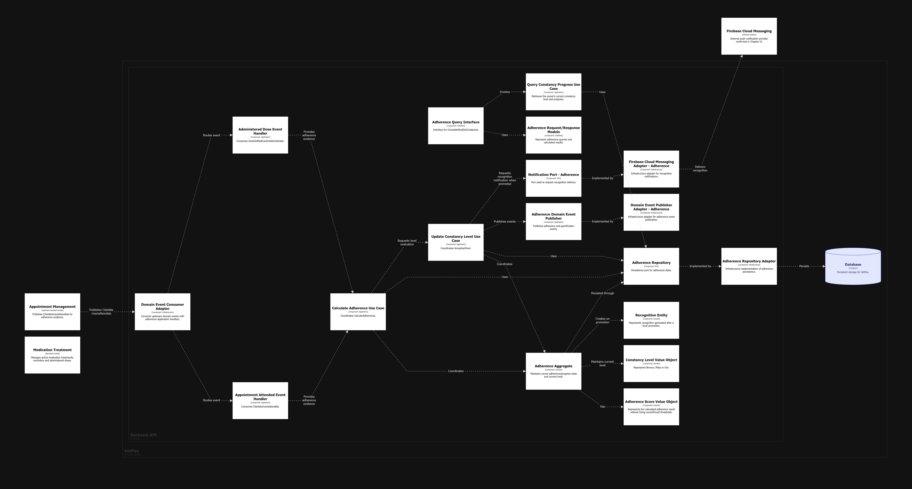

Los principales flujos de entrada son:

**Appointment Management → `CitaVeterinariaAtendida` → Consumidor de Eventos → Manejador de Cita Atendida → Calcular Adherencia**

**Medication Treatment → `DosisDeMedicaciónAdministrada` → Consumidor de Eventos → Manejador de Dosis Administrada → Calcular Adherencia**

El propietario consulta el progreso resultante mediante la interfaz de adherencia. Cuando las reglas de negocio identifican un ascenso, el contexto emite `PropietarioAscendióDeNivel` y solicita el envío del reconocimiento mediante FCM.

### 5.7.6. Bounded Context Software Architecture Code Level Diagrams

#### 5.7.6.1. Bounded Context Domain Layer Class Diagram

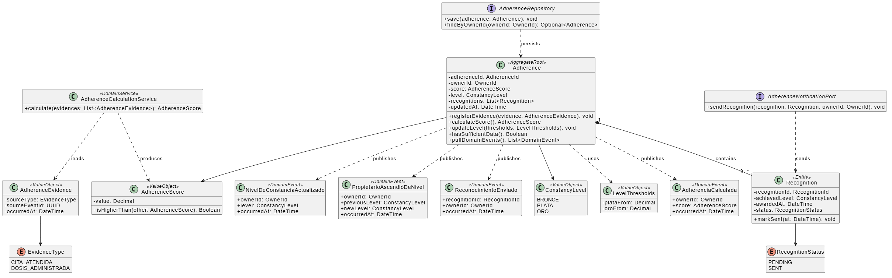

La vista a nivel de clases se centra en `Adherence` como **Aggregate Root**. `AdherenceScore` y `ConstancyLevel` son Value Objects, mientras que `Recognition` representa el resultado de un ascenso de nivel. Las interfaces de repositorio y notificaciones son puertos, y los cuatro eventos de dominio identificados se representan explícitamente.

#### 5.7.6.2. Bounded Context Database Design Diagram

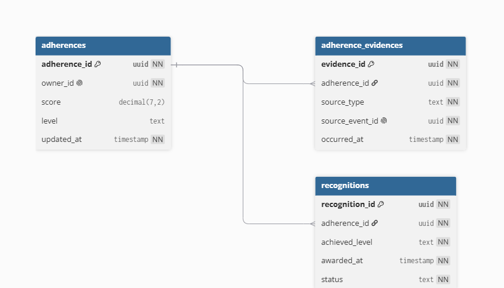

| Tabla lógica | Propósito | Relación principal |
|---|---|---|
| **Adherence** | Almacena el estado/progreso de adherencia del propietario y el nivel actual. | Padre de los reconocimientos. |
| **Recognition** | Almacena los reconocimientos generados por ascensos de nivel. | Pertenece a Adherence. |

